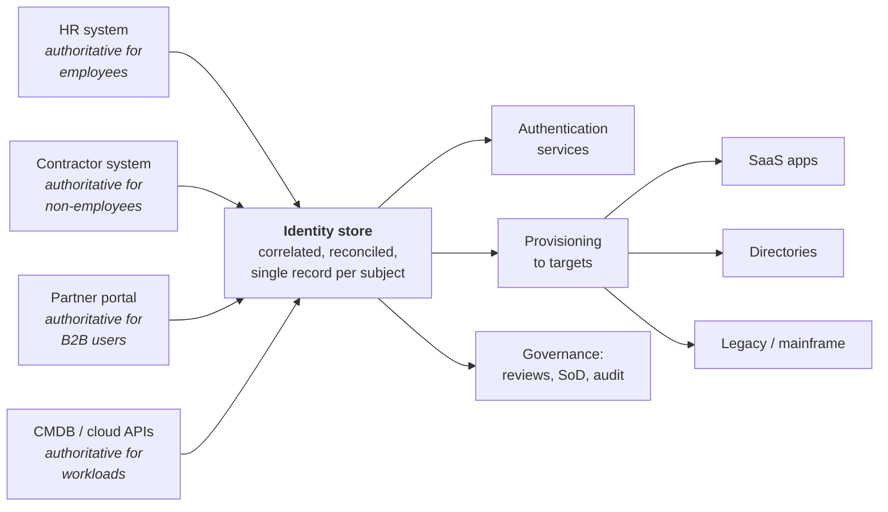

# What IAM Actually Is

## The five questions

Every identity and access management system that has ever existed — from `/etc/passwd` to a global Zero Trust estate — exists to answer five questions, in order:

| # | Question | Discipline | Fails like this |
|:--|:--|:--|:--|
| 1 | **Who or what is this?** | Identification & identity data | Duplicate records, orphaned accounts, "which John Smith?" |
| 2 | **Can they prove it?** | Authentication | Credential stuffing, phishing, MFA fatigue, session hijack |
| 3 | **What are they allowed to do?** | Authorisation | Over-privilege, privilege creep, broken object-level access |
| 4 | **How did they get that permission, and does it still apply?** | Governance | Audit findings, toxic combinations, leavers with access |
| 5 | **What did they actually do with it?** | Audit, monitoring, ITDR | Undetected breach, no forensic trail, no accountability |

{: .concept }
> Most engineers can describe 2 and 3. Architects are the people who take questions **1, 4 and 5** seriously — because those are the ones that determine whether the system still works in year three.

Notice the ordering is not arbitrary. You cannot authenticate an identity you have not established. You cannot authorise reliably if your identity data is wrong. You cannot govern access whose origin you cannot trace. And you cannot investigate an incident if nothing was recorded. **Each layer inherits the weaknesses of the one below it.**

---

## Identity is a data problem first

The single most common misconception: that IAM is fundamentally about security controls. It isn't. It is fundamentally about **maintaining an accurate, timely, reconciled model of your organisation** — and then enforcing decisions based on that model.

Consider what has to be true before you can decide whether Maria may approve a €50,000 payment:

- Maria exists as exactly **one** identity, not three (HR record, AD account, contractor record from before she was hired permanently).
- The system knows her **current** job, department, cost centre, manager and location — not the one from before her transfer six weeks ago.
- It knows she is **active**, not on unpaid leave, not in a notice period, not terminated-but-not-yet-processed.
- It knows what "may approve €50,000" **means** as a permission in the finance system, and which entitlement grants it.
- It knows **who decided** she should have it, when, on what basis, and when that decision expires.

Four of those five are data problems. Only one is an enforcement problem. This is why senior IAM work spends far more time on **authoritative sources, correlation, reconciliation and data quality** than on protocols.

Everything downstream of that identity store — every SSO decision, every provisioned account, every access review — is only as correct as the store is. Get the data model wrong and no amount of protocol sophistication saves you.

---

## The three pillars, precisely

The terms get used loosely. As an architect you must use them precisely, because they have **different owners, different lifecycles, different failure modes and usually different products**.

### Access Management (AM)

**Runtime.** Milliseconds. User-facing.

Authentication and session establishment: SSO, MFA, federation, adaptive/risk-based policy, session lifetime, step-up, logout. This is the layer that is *in the request path* — if it is down, nobody works.

Characteristics: high availability is non-negotiable; latency matters; changes are risky; blast radius of misconfiguration is immediate and total.

*Product examples: Ping Identity (PingFederate/PingOne/PingAM), Okta, Microsoft Entra ID, Keycloak, ForgeRock AM.*

### Identity Governance & Administration (IGA)

**Lifecycle.** Hours to days. Process-facing.

Who should have what, why, approved by whom, reviewed how often, provisioned where, and revoked when. Joiner-mover-leaver, access requests, approvals, role models, segregation of duties, certification campaigns, provisioning and reconciliation.

Characteristics: not in the request path; correctness beats latency; heavily audited; deeply coupled to HR and business process; the hardest to implement because it encodes organisational politics.

*Product examples: SailPoint (IdentityIQ / Identity Security Cloud), One Identity Manager, Saviynt, Omada, Microsoft Entra ID Governance.*

### Privileged Access Management (PAM)

**Elevated risk.** Session-scoped. Admin-facing.

Vaulting, rotation, brokered sessions, session recording, just-in-time elevation, secrets for applications, break-glass. The accounts that can destroy the estate.

Characteristics: small population, catastrophic blast radius, hard operational requirements (what happens when the vault is down at 3am?), and the most political to roll out because it takes power away from administrators.

*Product examples: CyberArk, Delinea, BeyondTrust, One Identity Safeguard, HashiCorp Vault (secrets).*

{: .architect }
> **These three are not layers of one product; they are three systems that must agree.** The classic architecture failure is letting them diverge — AM authenticating identities that IGA thinks are terminated, or PAM vaulting accounts that IGA never knew existed. Reconciliation between the three is a first-class design concern, not an afterthought.

---

## Where the fourth pillar came from

Increasingly a fourth is named separately, because the first three assumed a **human** subject:

### Non-Human Identity (NHI) / Machine Identity Management

Service accounts, API keys, OAuth clients, certificates, SSH keys, cloud IAM roles, Kubernetes service accounts, CI/CD tokens, bots, RPA robots and now AI agents.

In most enterprises non-human identities now outnumber human ones by somewhere between 10:1 and 100:1, they are provisioned by developers rather than HR, they have no natural leaver event, and they frequently hold *more* privilege than the humans. See [Non-Human Identities](../03-identity-domains/04-non-human-identities.md).

---

## Vocabulary you must never blur

| Term | Precise meaning | Common sloppy usage |
|:--|:--|:--|
| **Identification** | Claiming an identity ("I am maria@corp") | Confused with authentication |
| **Authentication** | Proving the claim | "Auth" used for both AuthN and AuthZ |
| **Authorisation** | Deciding what the proven identity may do | Confused with entitlement assignment |
| **Entitlement** | A grantable permission *in a target system* (an AD group, an SAP role, a Salesforce profile) | Used interchangeably with "role" |
| **Role** | A business-meaningful bundle of entitlements | Used for both business roles and technical groups |
| **Account** | A subject's representation *in one system* | Confused with identity |
| **Identity** | The correlated record representing the person/thing across systems | Confused with account |
| **Persona** | One identity acting in multiple capacities (employee *and* contractor *and* customer) | Ignored entirely, then discovered painfully |
| **Credential** | The secret or key proving an identity | Confused with account |
| **Provisioning** | Creating/updating the account & entitlements in a target | Confused with granting access |
| **Certification / attestation** | Periodic review confirming access is still appropriate | Confused with approval |
| **Reconciliation** | Comparing what the target *actually* has against what IAM *believes* | Skipped entirely, then discovered painfully |

The distinction between **identity** and **account** is the one that most often reveals whether someone thinks like an architect. One person, one identity; that identity has many accounts; each account has entitlements; entitlements may be bundled into roles; roles are assigned to the identity. If you can hold that chain in your head cleanly, most IGA design becomes obvious.

---

## Why organisations actually buy IAM

You will not get funding by explaining SAML. The reasons budget appears:

1. **Audit findings.** Someone failed a SOX/ISO/PCI control on access review or leaver revocation. This is the single most common trigger for IGA programmes.
2. **A breach or near-miss.** Usually credential-based; identity is now the dominant attack vector.
3. **Regulatory pressure.** NIS2, DORA, GDPR, HIPAA, sector regulators.
4. **Cost.** Password resets at €15–30 a call; licences paid for leavers; manual joiner processing at 4 hours a head.
5. **Speed.** New hires productive on day one instead of day ten; M&A integration in weeks not years.
6. **Cloud/SaaS sprawl.** Nobody can answer "who has access to what" across 300 SaaS apps.
7. **Enabling something else.** Zero Trust programme, cloud migration, a customer-facing digital product that needs CIAM.

{: .architect }
> Learn to state your design's value in *these* terms. "This reduces our leaver revocation SLA from 14 days to 4 hours, which closes audit finding IA-2023-07" gets funded. "This implements SCIM 2.0" does not.

---

## Architect's checklist

Before you claim to understand a client's IAM landscape, you should be able to answer:

- [ ] What are the **authoritative sources** for each population (employees, contractors, partners, customers, machines)?
- [ ] How many **identity stores** exist, and which one is the master? If more than one, what reconciles them?
- [ ] How is an identity **correlated** across systems — what is the join key, and what happens when it's missing or duplicated?
- [ ] What triggers a **joiner**, a **mover** and a **leaver** — and how long does each take today?
- [ ] Which systems are in the **runtime path** (AM) versus the **lifecycle path** (IGA)? What is the availability requirement of each?
- [ ] Where does **privileged** access live, and who governs it?
- [ ] Can the organisation produce, for any user, **the full list of their access and where each grant came from**? How long does that take?
- [ ] What is the **non-human identity population**, and who owns it?

If the answer to any of these is "nobody knows", you have found the actual project.

---

**Next:** [The IAM Architect Role](02-the-iam-architect-role.md) →
