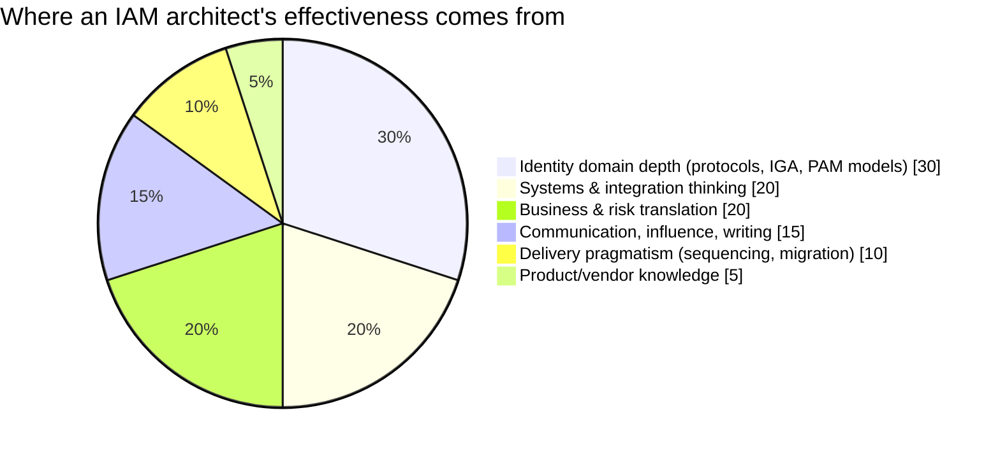

# The IAM Architect Role

## What the job actually is

An IAM architect **decides how identity works in an organisation, and is accountable for that decision surviving contact with reality.**

Concretely, on any given week you are doing some mix of:

- Deciding whether a new application federates, gets provisioned accounts, or both — and defending that choice.
- Designing the identity data model: what is authoritative for what, how records correlate, what happens on conflict.
- Drawing the target-state architecture and the sequence of increments that reaches it without a big-bang cutover.
- Writing the standards other teams build against: token lifetimes, naming conventions, approval patterns, what "privileged" means here.
- Reviewing designs from engineers and vendors and saying no with a reason.
- Translating an audit finding into an architectural change, and a budget request.
- Being the person who knows *why* a five-year-old decision was made, so it isn't accidentally undone.

Notice how little of that is product configuration. Architects who keep configuring do so because they enjoy it, not because the role requires it — and they tend to become bottlenecks.

---

## What it is not

**It is not the most senior engineer.** Engineering seniority is depth in *how*; architecture is judgement about *which* and *why*. Plenty of brilliant engineers make poor architects because they optimise the component they love rather than the system.

**It is not a product expert.** Product depth is a tool. An architect who only knows one product will bend every problem toward that product — the "when you own a hammer" failure, which in IAM looks like implementing a CIAM use case on a workforce IGA suite because that's what they know.

**It is not a diagram producer.** Diagrams are the output; decisions are the work. An architecture that lives only in Visio and never constrains what gets built is theatre.

**It is not a decision dictatorship.** In practice you have influence, not authority. Your designs get implemented because engineers believe them, not because you outrank anyone. See [Stakeholder Management](../06-business-and-risk/07-stakeholders.md).

---

## The role next to its neighbours

| Role | Optimises for | Time horizon | Typical output |
|:--|:--|:--|:--|
| **IAM Analyst** | Correct operations & process | Days | Access reviews run, requests handled, exceptions tracked |
| **IAM Engineer** | Working systems | Weeks | Connectors, workflows, policies, integrations, code |
| **IAM Architect** | Coherent, durable system design | Quarters–years | Target architecture, standards, patterns, decisions (ADRs) |
| **Security Architect** | Overall control posture | Quarters–years | Control frameworks; IAM is one domain of many |
| **Enterprise Architect** | Business/IT alignment across all domains | Years | Capability maps, roadmaps, principles |
| **IAM Consultant** | Client outcomes within an engagement | Weeks–months | Assessments, designs, implementations, handover |
| **Product Owner (IAM)** | Value delivered by the platform | Sprints–quarters | Backlog, priorities, outcomes |

The border you'll be tested on most is **engineer vs architect**. The interview version of that test: given a problem, does the candidate reach for a mechanism ("we'd use SCIM") or for the decision space ("what's authoritative here, what's the revocation requirement, and who owns the target system")?

---

## The competencies, honestly weighted

Based on what actually determines success in the role rather than what job adverts list:

That 5% for product knowledge is deliberately provocative but defensible: product knowledge is **necessary, quickly acquired, and rapidly obsolete**. The other 95% takes years and transfers everywhere.

### 1. Identity domain depth
The protocols ([SAML](../02-identity-fundamentals/03-saml.md), [OAuth](../02-identity-fundamentals/04-oauth2.md), [OIDC](../02-identity-fundamentals/05-oidc.md), [SCIM](../02-identity-fundamentals/07-scim.md), Kerberos, LDAP, FIDO2) *and* the models ([JML](../02-identity-fundamentals/14-joiner-mover-leaver.md), [RBAC/ABAC](../02-identity-fundamentals/12-authorization-models.md), [SoD](../02-identity-fundamentals/17-sod-and-certification.md), [PAM](../02-identity-fundamentals/18-privileged-access-management.md)). Non-negotiable.

### 2. Systems & integration thinking
Identity touches everything, so you must reason about eventual consistency, retries, idempotency, rate limits, failure modes, ordering, and what happens when a downstream system is offline for six hours. Most IGA outages are integration outages.

### 3. Business & risk translation
Reading a control framework, sizing a risk, building a business case, understanding that "the CFO's team will not accept a 3-day access request SLA during month-end close" is an architectural input.

### 4. Communication & writing
You will write more than you configure. Design docs, ADRs, standards, board slides, RFP responses. The ability to explain federation to a lawyer and to a Kubernetes engineer *in the same week, differently* is a core skill, not a soft one.

### 5. Delivery pragmatism
The best architecture that cannot be sequenced into 3-month increments is worse than a decent one that can. Coexistence, migration, and rollback plans are architecture. See [Migration & Coexistence](../04-architecture-practice/04-migration-and-coexistence.md).

### 6. Product knowledge
Enough to know what is native, what is customisation, what is a licence line item, and what the vendor's roadmap will make obsolete. See [Platform Landscape](../05-platform-landscape/).

---

## Specialisation tracks

"IAM architect" is not one job. By the time you're senior you'll lean toward one of these — and knowing which shapes what you study.

| Track | Focus | You'll live in | Typical employer |
|:--|:--|:--|:--|
| **Workforce / IGA architect** | Lifecycle, roles, governance, certification, provisioning | SailPoint, One Identity, Saviynt, Omada | Large regulated enterprise |
| **Access Management architect** | SSO, federation, MFA, adaptive auth, session | Ping, Okta, Entra, Keycloak, ForgeRock | Anywhere with many apps |
| **CIAM architect** | Customer scale, registration, consent, privacy, UX, fraud | Ping/Okta CIC/Entra External ID/custom | Retail, banking, telco, media |
| **PAM architect** | Vaulting, JIT, session brokering, secrets | CyberArk, Delinea, BeyondTrust, Vault | Regulated, critical infrastructure |
| **Cloud/workload identity architect** | IAM in AWS/Azure/GCP, workload federation, secretless | Cloud-native IAM, SPIFFE, OIDC federation | Cloud-first, product companies |
| **Identity security / ITDR architect** | Detection, response, identity attack paths | Identity threat tooling + SIEM | Mature security orgs |

The strongest architects have **one deep track and working literacy in the others** — because real designs cross tracks constantly (a CIAM programme still needs PAM for its admins, and workload identity for its services).

---

## The seniority ladder

What actually changes as you progress:

| Level | Scope | You are trusted to | Signature question |
|:--|:--|:--|:--|
| **Engineer** | A component | Build it correctly | "How do I make this work?" |
| **Senior engineer** | A system | Build it correctly *and* operable | "How does this fail?" |
| **Solution architect** | One programme / domain | Design it end to end | "What are the trade-offs?" |
| **Domain / IAM architect** | The identity estate | Set standards everyone builds to | "What should be true in three years?" |
| **Enterprise / principal architect** | Multiple domains | Arbitrate between competing architectures | "What should we *not* do?" |

The jump people find hardest is **senior engineer → architect**, and it is almost never technical. It is the shift from *"I can build this"* to *"I can decide what should be built, defend it to people who disagree, and live with the consequences for years."*

---

## How you know you're becoming one

Signals, in rough order of appearance:

1. You start asking "who is authoritative for this?" before "which product does this?"
2. You can sketch a target architecture on a whiteboard without notes and answer three levels of "why".
3. Engineers bring you designs *before* building, not after.
4. You've said no to something you personally found interesting, for a good reason.
5. You've had a decision of yours proven wrong, documented why, and changed it without drama.
6. You can size a design in licences, effort and risk, not just components.
7. Someone in the business asks for you by name in a meeting that isn't about IAM.

{: .architect }
> The uncomfortable truth: most of the growth from senior engineer to architect happens by being *responsible for a bad decision you made two years earlier*. Seek out long-lived ownership. Consultancy gives you breadth fast, but only staying somewhere long enough to inherit your own architecture teaches you what durability means.

---

## A realistic route in

There is no single path, but the common ones:

- **Infrastructure / AD admin → IAM engineer → architect.** Strongest fundamentals; usually needs to build up cloud, protocols and business framing.
- **Developer → IAM/API security → AM architect.** Strong on OAuth/OIDC and integration; usually needs to build up governance, HR-driven lifecycle and enterprise process.
- **Security analyst / GRC → IGA analyst → architect.** Strong on controls, audit and risk language; usually needs deep technical grounding.
- **Helpdesk / access administration → IAM analyst → engineer → architect.** Longest route, but unmatched instinct for how access requests really behave.
- **Consultant.** Fastest breadth, most estates seen, weakest exposure to living with your decisions.

All four routes converge on the same requirement: **fundamentals plus judgement**. Start with the [self-assessment](04-self-assessment.md) to find which half you're missing.

---

## Architect's checklist

- [ ] Can I state, in two sentences, the difference between what I do and what a senior engineer does?
- [ ] Which specialisation track am I building toward, and does my study plan match it?
- [ ] Of the six competencies above, which is my weakest — and what am I doing about it this quarter?
- [ ] Have I written a design document in the last three months that someone else implemented?
- [ ] Can I explain a federation flow to a non-technical stakeholder in under two minutes without a diagram?
- [ ] Do I have an example of a decision I made that turned out wrong, and what I learned?

---

**Next:** [How to Use This Repo](03-how-to-use-this-repo.md) →
