# The 12-Month Learning Plan

A concrete, month-by-month path from "I know what IAM stands for" to "I can hold my own in an architecture review." Assumes **6–8 hours a week**. If you have more, don't compress the months — go deeper in the same order, because the order encodes dependencies.

{: .warning }
> The most common failure mode is jumping to month 5 (products) in week 2. Product knowledge acquired without the conceptual model underneath is unusable outside that product, and it *feels* like progress, which makes it worse.

---

## Quarter 1 — Foundations (months 1–3)

### Month 1: Directories, DNS, crypto

**Read:** [Directory services & LDAP](../01-it-fundamentals/01-directory-services.md), [Active Directory](../01-it-fundamentals/02-active-directory.md), [Networking & DNS](../01-it-fundamentals/03-networking-and-dns.md)

**Build:** Stand up an OpenLDAP or a Samba AD DC in a container. Create an OU tree, users, groups. Query it with `ldapsearch` until filters are second nature. Break replication deliberately and observe.

**Able to:** Explain DN vs RDN vs UPN vs sAMAccountName; write an LDAP filter for "all enabled users in Finance who haven't logged in for 90 days"; explain why AD needs DNS SRV records.

### Month 2: Cryptography, PKI, TLS

**Read:** [Cryptography for IAM](../01-it-fundamentals/04-cryptography.md), [PKI, certificates & TLS](../01-it-fundamentals/05-pki-and-tls.md)

**Build:** Create your own CA with `openssl` or `step-ca`. Issue a server cert, a client cert. Break the chain and read the error. Inspect a real TLS handshake in Wireshark. Hash passwords with bcrypt/Argon2 and time the work factor.

**Able to:** Explain signing vs encryption; explain what a certificate actually asserts; describe cert rotation as an operational problem (because half of all federation outages are expired certs).

### Month 3: OS, cloud, data, APIs

**Read:** [Windows & Linux admin](../01-it-fundamentals/06-os-administration.md), [Cloud fundamentals](../01-it-fundamentals/07-cloud-fundamentals.md), [Data modelling](../01-it-fundamentals/08-data-modeling.md), [HTTP & APIs](../01-it-fundamentals/09-http-and-apis.md)

**Build:** A free-tier AWS or Azure account. Create users, groups, roles, policies. Deliberately create an over-privileged policy and then least-privilege it. Write a small script that calls a REST API with an OAuth client-credentials token.

**Able to:** Read an AWS IAM policy JSON out loud; explain the difference between a role and a policy in cloud IAM; explain idempotency and why it matters for provisioning.

---

## Quarter 2 — Identity core (months 4–6)

### Month 4: Authentication & federation protocols

**Read:** [Authentication concepts](../02-identity-fundamentals/01-authentication-concepts.md) → [Kerberos](../02-identity-fundamentals/02-kerberos-and-legacy.md) → [SAML](../02-identity-fundamentals/03-saml.md) → [OAuth 2.x](../02-identity-fundamentals/04-oauth2.md) → [OIDC](../02-identity-fundamentals/05-oidc.md) → [Tokens & JWT](../02-identity-fundamentals/06-tokens-and-jwt.md)

**Build:** Keycloak in Docker. Register an app. Do SAML SSO. Do OIDC authorization code + PKCE. Capture every redirect in browser dev tools and decode every token at every step. Then deliberately break signature validation and see what happens.

**Able to:** Draw all three flows from memory. This month matters more than any other; do not rush it.

### Month 5: Credentials, sessions, provisioning

**Read:** [MFA & passwordless](../02-identity-fundamentals/08-mfa-and-passwordless.md), [FIDO2 & passkeys](../02-identity-fundamentals/09-fido2-and-passkeys.md), [Sessions & logout](../02-identity-fundamentals/10-sessions-and-logout.md), [Federation patterns](../02-identity-fundamentals/11-federation-patterns.md), [SCIM](../02-identity-fundamentals/07-scim.md)

**Build:** Register a passkey against Keycloak (or webauthn.io). Implement a tiny SCIM 2.0 server that accepts user create/update/delete — even a stub teaches you more than reading the RFC.

**Able to:** Explain why SLO is hard; explain phishing resistance mechanically; explain SCIM's real-world limits.

### Month 6: Authorisation models

**Read:** [Authorisation models](../02-identity-fundamentals/12-authorization-models.md), [Policy as code](../02-identity-fundamentals/13-policy-as-code.md)

**Build:** Model the same three access rules in RBAC, in ABAC (OPA/Rego or Cedar), and in ReBAC (a Zanzibar-style tuple model). Compare how each handles a rule change.

**Able to:** Argue both sides of "should this be a role or an attribute policy?"

---

## Quarter 3 — Governance & domains (months 7–9)

### Month 7: Lifecycle & governance

**Read:** [JML](../02-identity-fundamentals/14-joiner-mover-leaver.md), [IGA](../02-identity-fundamentals/15-identity-governance.md), [Identity data quality](../02-identity-fundamentals/19-identity-data-quality.md), [Directory sync](../02-identity-fundamentals/21-directory-sync.md)

**Build:** On paper, design the full JML for a 5,000-person company with employees, contractors, and a subsidiary on separate HR. Include every edge case in the page. This is the most valuable paper exercise in the whole plan.

**Able to:** Explain reconciliation and why it's the real control.

### Month 8: Roles, SoD, certification, PAM

**Read:** [Role modelling & mining](../02-identity-fundamentals/16-role-modelling.md), [SoD & certification](../02-identity-fundamentals/17-sod-and-certification.md), [PAM](../02-identity-fundamentals/18-privileged-access-management.md), [Identity proofing](../02-identity-fundamentals/20-identity-proofing.md)

**Build:** Take a spreadsheet of ~50 users × ~30 entitlements (generate it), and do a manual role-mining pass. Feel the ambiguity. That feeling is why role projects fail.

### Month 9: Domains

**Read:** All of [Stage 3](../03-identity-domains/) — workforce, CIAM, B2B, NHI, workload, OT/IoT.

**Build:** Inventory every non-human identity in your own lab/work environment. Nobody ever finishes this exercise, which is the lesson.

---

## Quarter 4 — Architecture, business, frontier (months 10–12)

### Month 10: Architecture practice

**Read:** All of [Stage 4](../04-architecture-practice/).

**Build:** Write a full target-state architecture for a fictional 10,000-person company: current state, target, gap, sequenced roadmap, three ADRs, risks. 15–20 pages. Get someone to review it harshly.

### Month 11: Business, risk, delivery

**Read:** [Stage 6](../06-business-and-risk/) and [Stage 7](../07-delivery/).

**Build:** Write the business case for the programme you just designed — cost, benefit, risk reduction, phasing, what happens if you do nothing. One page for an exec, ten pages for the steering committee.

### Month 12: Platforms & frontier

**Read:** [Vendor-neutral map](../05-platform-landscape/00-vendor-neutral-map.md), then the vendor pages, then all of [Stage 8](../08-frontier/).

**Build:** Pick **one** platform aligned to your [track](02-the-iam-architect-role.md#specialisation-tracks) and go deep — trial, sandbox, or developer edition. Now that you have the model, product learning takes weeks instead of months.

**Then:** [Whiteboard scenarios](../09-practice/03-whiteboard-scenarios.md) and [interview prep](../09-practice/04-interview-prep.md).

---

## The plan on one page

```mermaid
gantt
    title 12-month IAM architect plan
    dateFormat X
    axisFormat %s
    section Q1 Foundations
    Directories, DNS          :a1, 0, 1
    Crypto, PKI, TLS          :a2, 1, 1
    OS, cloud, data, APIs     :a3, 2, 1
    section Q2 Identity core
    AuthN & federation        :b1, 3, 1
    Credentials & provisioning:b2, 4, 1
    Authorisation models      :b3, 5, 1
    section Q3 Governance
    Lifecycle & IGA           :c1, 6, 1
    Roles, SoD, PAM           :c2, 7, 1
    Identity domains          :c3, 8, 1
    section Q4 Architecture
    Architecture practice     :d1, 9, 1
    Business & delivery       :d2, 10, 1
    Platforms & frontier      :d3, 11, 1
```

---

## Compressed variants

**6-month intensive (15+ hrs/week):** Same order, two months of material per month. Do not drop the build exercises — they're where the learning is.

**Already an engineer (3 months):** Month 1 = Stage 4. Month 2 = Stage 6 + 7. Month 3 = Stage 2 gaps from your [self-assessment](04-self-assessment.md) + Stage 8. Skip Stage 1 only if you scored 15+ on competency 1.

**Interview in 4 weeks:** Week 1 = Stage 2 protocols. Week 2 = JML/IGA/SoD. Week 3 = [whiteboard scenarios](../09-practice/03-whiteboard-scenarios.md). Week 4 = [interview prep](../09-practice/04-interview-prep.md) + the vendor page for whoever you're interviewing with.

---

## What to do *alongside* the plan

- **Write.** One post, internal wiki page or LinkedIn explainer per month on what you just learned. Nothing exposes shallow understanding faster than writing for others.
- **Watch real incidents.** Read public breach write-ups where identity was the vector (Okta support-system compromises, Snowflake-era credential attacks, Midnight Blizzard-style OAuth consent abuse). Ask: *which control would have stopped this, and would I have designed it in?*
- **Join the conversation.** IDPro's Body of Knowledge, the OAuth/OIDC working group mailing lists, vendor community forums. See [reading list](../10-reference/06-reading-list.md).
- **Get one certification, late.** Certifications are a hiring filter, not a learning tool. Do one in month 10–12 when it costs you two weeks instead of two months. See [certifications](../10-reference/04-certifications.md).

---

**Next:** [Stage 1 — IT Fundamentals](../01-it-fundamentals/) →
