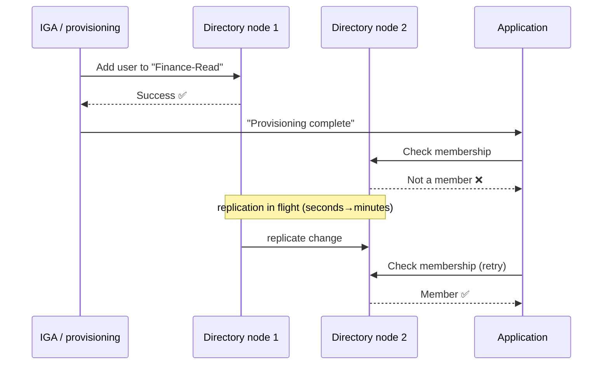

# Directory Services & LDAP

## The problem that created directories

In the 1980s, organisations had many systems and each kept its own list of users. Every new system meant a new list, a new password, a new place to forget to remove someone. The obvious fix — one shared place to look up people, machines and services — turned out to have an unusual set of requirements:

- **Read-dominant.** Lookups outnumber writes by orders of magnitude (roughly 1000:1 in practice).
- **Globally distributed but locally fast.** A user in Manila shouldn't wait for a server in Frankfurt.
- **Hierarchical.** Organisations are trees: company → country → division → department.
- **Schema-flexible.** Every organisation wants different attributes.
- **Loosely consistent is fine.** If a phone number takes 30 seconds to replicate, nobody dies.

A relational database is a poor fit for *all* of those (row-oriented, write-consistent, flat, rigid schema, ACID). So a different animal evolved: the **directory**.

{: .concept }
> A directory is a **read-optimised, hierarchical, loosely-consistent, schema-defined store of objects about the real world.** Every design oddity of LDAP follows from those five words. It is not a database, and treating it like one is the single most common architectural mistake made with directories.

X.500 (1988) defined the model — and DAP, its access protocol, which required a full OSI stack and was consequently unusable. **LDAP** ("Lightweight" DAP, 1993, now [RFC 4510–4519](https://datatracker.ietf.org/doc/html/rfc4511)) kept the model and ran it over TCP/IP. That pragmatism is why LDAP is still everywhere thirty years later.

---

## The information model

### Entries, DNs and the tree

Everything in a directory is an **entry**. Every entry has a unique name derived from its position in the tree — its **Distinguished Name (DN)** — built from **Relative Distinguished Names (RDNs)**:

```
cn=Maria Santos,ou=Finance,ou=Users,dc=corp,dc=example,dc=com
└─ RDN ────────┘ └── path up the tree to the root ──────────┘
```

Read it **right to left**: the root is `dc=com`, then `dc=example`, then `dc=corp`, and so on down to the leaf. The tree is called the **DIT** (Directory Information Tree); the top of your slice of it is the **naming context** or **suffix**.

| Attribute abbreviation | Means | Typical use |
|:--|:--|:--|
| `dc` | domainComponent | Root naming, mirrors DNS: `dc=corp,dc=example,dc=com` |
| `o` | organization | Company (older X.500 style) |
| `ou` | organizationalUnit | Departments, containers |
| `cn` | commonName | Person or group name |
| `uid` | userId | Login name (POSIX/OpenLDAP style) |
| `sn` / `givenName` | surname / first name | Person name parts |

{: .warning }
> **The DN is a location, not an identifier.** When Maria moves from Finance to Operations, her DN changes. Any system that stored her DN as a foreign key is now broken. Always correlate on a stable, immutable identifier — `entryUUID` in LDAP, `objectGUID` in AD, `employeeID` from HR. This mistake causes real production incidents, at scale, years after someone made it. See [Identity Data Quality](../02-identity-fundamentals/19-identity-data-quality.md).

### Object classes and schema

Each entry declares one or more **objectClass** values, which determine what attributes it *must* and *may* have.

```ldif
dn: cn=Maria Santos,ou=Finance,dc=corp,dc=example,dc=com
objectClass: top
objectClass: person                # requires: sn, cn
objectClass: organizationalPerson  # allows: title, telephoneNumber, ou...
objectClass: inetOrgPerson         # allows: mail, uid, employeeNumber, photo...
cn: Maria Santos
sn: Santos
givenName: Maria
uid: msantos
mail: maria.santos@example.com
employeeNumber: 40218
telephoneNumber: +49 30 1234567
memberOf: cn=Finance-Read,ou=Groups,dc=corp,dc=example,dc=com
```

Object classes come in three kinds:

- **Structural** — what the entry *is*. Exactly one structural chain per entry (`inetOrgPerson` inherits `organizationalPerson` inherits `person` inherits `top`).
- **Auxiliary** — bolt-on attribute sets (`posixAccount`, `shadowAccount`, custom extensions).
- **Abstract** — inheritance-only (`top`).

Each attribute type has a **syntax** (DirectoryString, Integer, GeneralizedTime, DN, OctetString…) and **matching rules** that decide how equality, substring and ordering comparisons behave. This matters more than it sounds: `caseIgnoreMatch` on `cn` is why `CN=maria santos` and `cn=Maria Santos` are the same entry, and why two people whose names differ only by case will collide.

Attributes are **multi-valued by default** and **unordered**. `mail` can hold five addresses with no defined "first" one. Systems that assume single-valued attributes break on the person with two email addresses — usually the CEO, usually during a demo.

{: .architect }
> **Schema extension is a one-way door.** Adding a custom attribute to a directory schema is easy; removing it after 40 systems read it is close to impossible. Before extending: (1) is there a standard attribute that means this? (2) does this belong in the directory at all, or in the system that owns the data? Directories accumulate attributes like attics accumulate boxes. Every extension is a permanent commitment.

---

## The protocol

LDAP defines ten operations. In practice you use six.

| Operation | What it does | Architect's note |
|:--|:--|:--|
| **Bind** | Authenticate (or re-authenticate) the connection | Simple bind sends the password — **only over TLS**. SASL supports Kerberos (GSSAPI), DIGEST-MD5, EXTERNAL (client cert) |
| **Unbind** | Close (misnamed — it doesn't undo a bind) | — |
| **Search** | Read entries matching a filter | The operation that matters; 95%+ of traffic |
| **Compare** | Test whether an attribute has a value | Used to verify a password/attribute without reading it |
| **Add / Modify / Delete** | Write operations | No transactions across entries in base LDAP |
| **ModifyDN** | Rename or move an entry | This is what changes DNs, and breaks DN-based references |
| **Abandon** | Cancel an in-flight operation | Rarely used directly |
| **Extended** | Protocol escape hatch | StartTLS and Password Modify are extended operations |

### Search: the operation to actually master

A search takes a **base DN**, a **scope**, a **filter**, and a list of attributes to return.

| Scope | Returns |
|:--|:--|
| `base` | Just the base entry |
| `one` | Immediate children only |
| `sub` | The base and its entire subtree |

Filters use prefix (Polish) notation with `&` (AND), `|` (OR), `!` (NOT):

```bash
# All enabled users in Finance with an email address
(&(objectClass=user)(ou=Finance)(mail=*)(!(userAccountControl:1.2.840.113556.1.4.803:=2)))

# Anyone whose surname starts with "San"
(sn=San*)

# Members of a group, including nested groups (AD only — LDAP_MATCHING_RULE_IN_CHAIN)
(memberOf:1.2.840.113556.1.4.1941:=cn=Finance-Read,ou=Groups,dc=corp,dc=example,dc=com)
```

Those long OIDs are **extensible matching rules**. The two AD ones above are worth memorising because they appear constantly:

- `1.2.840.113556.1.4.803` — bitwise AND (used to test `userAccountControl` flags, e.g. `2` = account disabled)
- `1.2.840.113556.1.4.804` — bitwise OR
- `1.2.840.113556.1.4.1941` — "in chain", i.e. recursive/transitive group membership

Command line:

```bash
ldapsearch -H ldaps://dc1.corp.example.com:636 \
  -D "cn=svc-iam,ou=Service,dc=corp,dc=example,dc=com" -W \
  -b "dc=corp,dc=example,dc=com" -s sub \
  "(&(objectClass=user)(department=Finance))" \
  sAMAccountName mail memberOf
```

{: .warning }
> **Filters are injectable.** If you build a filter by concatenating user input, `*)(uid=*))(|(uid=*` turns your authentication check into "match everything". LDAP injection is a real, still-common vulnerability. Escape per [RFC 4515](https://datatracker.ietf.org/doc/html/rfc4515) (`*` → `\2a`, `(` → `\28`, `)` → `\29`, `\` → `\5c`, NUL → `\00`) or use a parameterised library.

### Controls: the extension mechanism

Controls modify how an operation behaves. The ones an architect must know:

| Control | Why it matters |
|:--|:--|
| **Paged results** ([RFC 2696](https://datatracker.ietf.org/doc/html/rfc2696)) | Servers cap results (AD's default `MaxPageSize` is 1000). Without paging, your sync silently reads only the first 1000 users. **This is the classic connector bug.** |
| **Sorted results** | Server-side ordering; expensive, often disabled |
| **Persistent search / content sync** ([RFC 4533](https://datatracker.ietf.org/doc/html/rfc4533)) | Change notification instead of polling |
| **DirSync** (AD) | Incremental change retrieval — the basis of most AD sync connectors |
| **Password policy** | Returns *why* a bind failed (expired, locked, must-change) rather than a bare failure |
| **ManageDsaIT** | Operate on referral objects themselves rather than following them |

---

## Groups: the thing that actually carries access

Groups are how directories express authorisation. There are two opposite models and the difference has real consequences.

| Model | Where membership lives | Cost of "who's in this group?" | Cost of "what groups is this user in?" |
|:--|:--|:--|:--|
| `groupOfNames` / `member` (AD, most LDAP) | On the **group** | Cheap | Expensive — requires a reverse search, unless the server maintains `memberOf` |
| `memberUid` (POSIX) | On the group, as bare uids | Cheap | Expensive, and no referential integrity |
| Virtual/computed (`memberOf`, dynamic groups) | Derived | — | Cheap, but eventually consistent |

`memberOf` in AD is an **operational back-link** maintained by the server. It's read-only, not replicated as a normal attribute, and — critically — **it does not include primary group membership** (usually Domain Users). Every engineer eventually loses an afternoon to that.

**Large groups are a real design constraint.** AD replicates multi-valued attributes with Linked Value Replication, but a group with 100,000 members is still operationally painful, and Kerberos tickets carrying too many group SIDs blow past token size limits (the classic "MaxTokenSize" error where users can authenticate but can't access anything). Practical guidance: keep direct membership under a few thousand, prefer nesting, and never model per-record permissions as groups.

{: .architect }
> **Nesting is a trap that looks like elegance.** `App-Finance-Read` contains `Dept-Finance` contains `Region-EMEA-Finance` contains… Four levels deep, nobody can answer "why does this person have access?" without a graph tool, and different consumers evaluate nesting differently (some apps don't resolve nested groups at all). Design rule: **maximum two levels of nesting, and every group has a documented owner and purpose.** See [Role Modelling](../02-identity-fundamentals/16-role-modelling.md).

---

## Replication and consistency

Directories are **multi-master or master-replica, eventually consistent**. This produces a specific class of bug that IAM architects must design around:



Design implications:

- **Never report success to a user based on a write to one node.** Either verify on the read path they'll use, or set expectations ("changes take up to 15 minutes").
- **Bind to the same node for read-after-write** where the directory supports affinity.
- **Conflict resolution is usually last-writer-wins** by timestamp. If two systems write the same attribute, one silently loses. This is why [authoritative source](../02-identity-fundamentals/19-identity-data-quality.md) design matters.
- **Deletion tombstones** exist so deletes replicate. They also mean "deleted" objects linger, which affects reconciliation logic.

---

## The directory family tree

| Product | Position today |
|:--|:--|
| **Microsoft Active Directory (AD DS)** | Still the centre of gravity in enterprise workforce identity. See [next page](02-active-directory.md) |
| **Microsoft Entra ID** | *Not* an LDAP directory — a cloud identity service with Graph API. Common and consequential misunderstanding |
| **OpenLDAP** | The open-source workhorse; `slapd`, highly tunable, no built-in identity management |
| **389 Directory Server / Red Hat DS** | Enterprise Linux directory, strong multi-master replication |
| **Oracle Unified Directory / OUD** | Descendant of Sun DSEE, common in telco/finance |
| **Ping Directory** (was UnboundID) | High-performance, CIAM-scale, strong data governance features |
| **NetIQ / One Identity eDirectory** | Legacy Novell lineage, still present in some estates |
| **ApacheDS, Samba AD, FreeIPA** | Open-source options; FreeIPA is the Linux answer to AD (Kerberos + LDAP + PKI + DNS) |

{: .vendor }
> **In the products.** Nearly every IAM platform ships an LDAP connector, and they mostly differ in the same three places: how they page large result sets, how they detect changes (poll vs DirSync vs changelog), and how they correlate entries to identities. **SailPoint** aggregates the directory into Identity Cubes and correlates via a configurable rule. **One Identity Manager** synchronises via its Synchronization Editor into `ADSAccount` tables and maps to `Person` objects through mapping rules and a defined "join" property. **Ping Directory** is itself a directory, so in Ping estates it is often the store rather than a connected system. In all three, the questions you must answer are identical: *what's the join key, what's the change-detection mechanism, and what happens to unmatched accounts?*

---

## Performance and sizing intuition

Rough numbers to sanity-check a design (verify against your own product):

- A well-indexed directory answers a simple equality search in **single-digit milliseconds**.
- An **unindexed** attribute search causes a full subtree scan — this is how one badly-written filter takes down authentication for an entire estate. Always confirm your connector's filters hit indexed attributes.
- Bind operations are far more expensive than searches (password hashing is deliberately slow). Applications that bind-per-request rather than pooling connections generate load out of all proportion to their traffic.
- Directories scale reads horizontally (add replicas) and writes barely at all. A design that writes to the directory on every user request is wrong.

---

## Architect's checklist

- [ ] What is the **stable identifier** for entries in this directory, and does every consuming system correlate on it rather than on DN?
- [ ] Is the **schema** standard, or extended? Who owns the extensions, and what reads them?
- [ ] Are the search filters used by connectors and applications hitting **indexed** attributes?
- [ ] Is **paging** correctly implemented everywhere the directory is read? (Test with >1000 results.)
- [ ] What is the **replication topology and convergence time**, and which processes assume read-after-write consistency?
- [ ] How deep is **group nesting**, and can every group's purpose and owner be named?
- [ ] Is all LDAP traffic on **LDAPS or StartTLS**? Are there any simple binds in the clear? (Check for legacy applications on port 389.)
- [ ] Are user inputs that reach LDAP filters **escaped**?
- [ ] What happens to a consuming application when the directory is **unavailable** — fail open, fail closed, or cached?

---

**Next:** [Active Directory Deep Dive](02-active-directory.md) →
