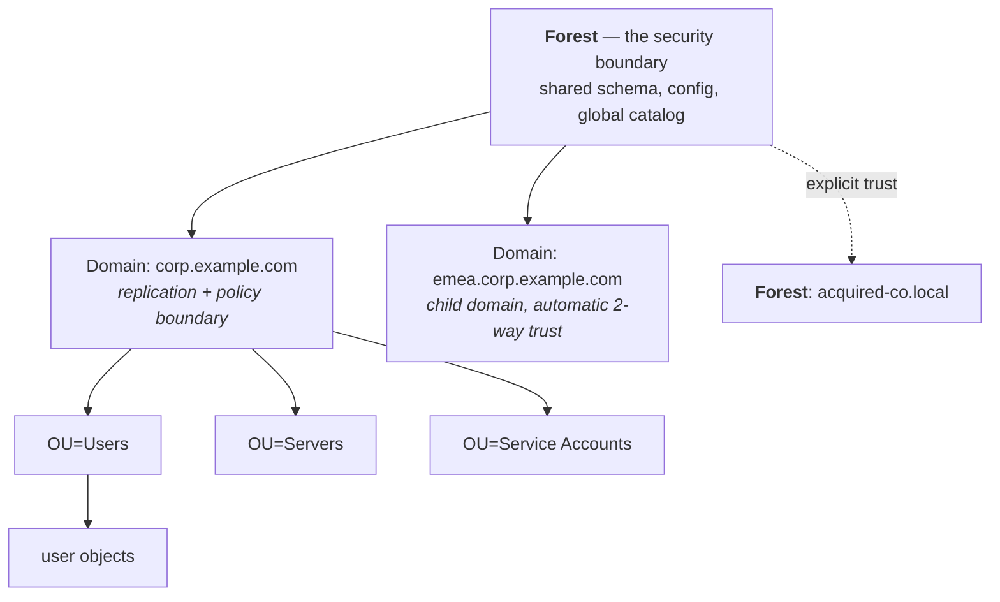

# Active Directory Deep Dive

## Why you must know AD even in 2026

Active Directory is thirty years old, and it still authenticates a large share of the world's employees. More importantly for an architect: **it is almost always the system you are integrating with, migrating from, or coexisting alongside.** Greenfield cloud-only estates exist; enterprises with 5,000+ staff and any history almost never are one.

AD is also the **single most attacked component** in enterprise identity, because compromising it usually means compromising everything. Understanding its structure is a prerequisite for understanding [identity attack paths](../08-frontier/02-itdr.md).

{: .concept }
> AD bundles four things that are conceptually separate: an **LDAP directory** (the data), a **Kerberos KDC** (authentication), **DNS integration** (service location), and a **policy engine** (Group Policy). Most confusion about AD comes from not knowing which of the four you're currently dealing with.

---

## The structural model



| Construct | What it actually is | Common misconception |
|:--|:--|:--|
| **Forest** | The **security boundary**. Shared schema, configuration and Global Catalog | "The domain is the security boundary" — it isn't. A Domain Admin in any domain can escalate to Enterprise Admin paths |
| **Domain** | A replication and policy boundary; a naming context | Treated as a security boundary in old designs |
| **OU** | A container for delegation and Group Policy application | Confused with a group. **OUs don't grant access; groups do** |
| **Site** | A representation of network topology (subnets) used for DC location and replication scheduling | Ignored — until authentication traffic crosses an ocean |
| **Trust** | A path allowing authentication between domains/forests | Assumed to grant access; a trust enables *authentication*, not *authorisation* |
| **Global Catalog** | A partial, forest-wide replica of every object | Confused with a full DC replica; it holds a subset of attributes |

### FSMO roles

Five operations AD cannot do multi-master. Worth knowing because their failure modes are distinctive:

| Role | Scope | If it's down |
|:--|:--|:--|
| Schema Master | Forest | Cannot extend schema |
| Domain Naming Master | Forest | Cannot add/remove domains |
| RID Master | Domain | DCs eventually cannot create new security principals |
| PDC Emulator | Domain | Time sync authority, password-change urgency, lockout processing — **the one that hurts fastest** |
| Infrastructure Master | Domain | Cross-domain reference updates stale |

---

## Security principals and SIDs

Every user, computer and group has a **SID** (Security Identifier):

```
S-1-5-21-3623811015-3361044348-30300820-1013
│ │ │  └── domain identifier ─────────────┘ └RID┘
│ │ └─ authority
└─┴─ revision / identifier authority
```

- The **RID** (Relative Identifier) is unique within the domain. RID 500 is always the built-in Administrator; 512 is Domain Admins.
- **SID history** (`sIDHistory`) lets a migrated object retain its old SIDs so old ACLs still work — and is a well-known escalation vector if not cleaned up after migration.
- Access control is evaluated on SIDs, not names. Renaming a group does not break access; deleting and recreating it does, because the new object has a new SID. **This surprises people constantly**, and it's why "just recreate the group" is never a safe remediation.

### Key user attributes

| Attribute | Notes |
|:--|:--|
| `objectGUID` | **Immutable.** The correct correlation key. Survives rename and move |
| `objectSid` | Immutable within domain; changes on cross-domain migration |
| `sAMAccountName` | Legacy logon name, ≤20 chars, unique per domain |
| `userPrincipalName` (UPN) | `user@domain` form, unique per forest — usually the SSO identifier |
| `distinguishedName` | **Mutable.** Changes on move/rename. Never use as a key |
| `userAccountControl` | Bit flags: disabled (2), password never expires (65536), don't require preauth (4194304 — the Kerberoasting-adjacent one), trusted for delegation (524288) |
| `pwdLastSet`, `lastLogonTimestamp` | `lastLogonTimestamp` replicates but is only accurate to ~14 days by default. `lastLogon` is precise but **not replicated** — you must query every DC. This trips up every "find stale accounts" project |
| `memberOf` | Back-link, read-only, **excludes primary group** |
| `servicePrincipalName` | Kerberos service names. An SPN on a *user* account is the precondition for [Kerberoasting](03-networking-and-dns.md) |

---

## Group scopes

AD groups have both a **type** (Security vs Distribution) and a **scope**, and the scope rules govern what can go where:

| Scope | Can contain | Can be used for permissions in |
|:--|:--|:--|
| **Domain Local** | Users/groups from any trusted domain | Its own domain only |
| **Global** | Users/groups from its own domain only | Any domain in the forest |
| **Universal** | Users/groups from any domain in the forest | Any domain in the forest (replicated to GC) |

The classic Microsoft pattern is **AGDLP**: **A**ccounts → **G**lobal groups → **D**omain **L**ocal groups → **P**ermissions. Users go into global groups by *who they are* (`GG-Finance-Staff`); domain local groups represent *what a resource allows* (`DL-FinanceShare-Modify`); the global goes into the domain local; the domain local gets the ACL.

{: .architect }
> AGDLP is the ancestor of every role model you will ever design: **a layer of "who you are" mapped to a layer of "what this resource permits", joined by an explicit assignment.** RBAC's business-role-to-technical-entitlement split is the same idea with better vocabulary. If you understand AGDLP, [role modelling](../02-identity-fundamentals/16-role-modelling.md) is not a new concept — it's the same one at organisational scale.

---

## Kerberos in AD, briefly

Full treatment in [Kerberos & legacy SSO](../02-identity-fundamentals/02-kerberos-and-legacy.md). What matters structurally:

- Every DC is a **KDC**. Authentication = get a **TGT**, then exchange it for **service tickets**.
- Tickets carry a **PAC** containing the user's group SIDs — which is why group changes don't take effect until the ticket is refreshed (log off / log on, or ticket lifetime expiry, default 10 hours).
- The **`krbtgt` account's** key signs all TGTs. Steal it and you can forge a TGT for anyone, for as long as you like: the **Golden Ticket**. This is why `krbtgt` rotation (twice, with replication in between) is part of every AD compromise recovery.
- **Clock skew > 5 minutes breaks Kerberos.** Time is a security dependency.

---

## Group Policy

GPOs are AD's configuration/policy engine: settings linked to sites, domains or OUs, applied in **L-S-D-OU order** (Local → Site → Domain → OU, closest wins, with Enforced and Block Inheritance modifiers).

Relevant to identity architecture because GPOs configure: password and lockout policy (pre-Fine-Grained), Kerberos parameters, smart card requirements, credential caching, LAPS, restricted groups (a legitimate — and abusable — way to force local admin membership), and audit policy (which determines whether you get the logs your [ITDR](../08-frontier/02-itdr.md) design assumes exist).

---

## The AD attack surface, from an architect's seat

You don't need to run these; you need to design against them.

| Technique | What it exploits | Architectural mitigation |
|:--|:--|:--|
| **Kerberoasting** | Any authenticated user can request a service ticket for any SPN, then crack it offline | Use gMSAs (auto-rotated 240-bit passwords) instead of user service accounts; long random passwords; monitor for bulk TGS requests |
| **AS-REP roasting** | Accounts with "do not require preauth" leak crackable material | Never set that flag; alert on it |
| **Pass-the-hash / pass-the-ticket** | NTLM hashes and Kerberos tickets are credentials in themselves | Tiered admin model; Credential Guard; disable NTLM where possible |
| **Golden / Silver ticket** | Stolen `krbtgt` or service account key forges tickets | Protect DCs as tier 0; rotate `krbtgt` on compromise; short ticket lifetimes |
| **DCSync** | Replication rights let an attacker pull all password hashes | Tightly control `Replicating Directory Changes` rights; alert on non-DC replication requests |
| **Unconstrained delegation** | A server holding TGTs can impersonate anyone who touched it | Eliminate it; use constrained or resource-based constrained delegation |
| **ACL abuse / shadow admins** | Nested, forgotten rights (GenericAll, WriteDACL) create hidden paths to Domain Admin | Regular AD attack-path analysis; treat ACLs as governed entitlements |
| **AD CS abuse (ESC1–ESC8)** | Misconfigured certificate templates let users request certs for other identities | Audit templates; restrict enrolment; see [PKI](05-pki-and-tls.md) |

{: .architect }
> **The tiered administration model** (Tier 0 = identity infrastructure, Tier 1 = servers/apps, Tier 2 = workstations) is the single most important AD architecture pattern. The rule: **credentials from a higher tier must never be exposed on a lower-tier machine.** A Domain Admin logging into a helpdesk laptop to fix a printer has just handed the domain to whoever owns that laptop. Most real-world AD compromises are a tier violation, not an exotic exploit.

---

## AD and the cloud

The distinction that causes the most confusion in real projects:

| | **Active Directory (AD DS)** | **Microsoft Entra ID** |
|:--|:--|:--|
| Protocols | Kerberos, NTLM, LDAP | OIDC, OAuth 2.0, SAML, WS-Fed, SCIM, Graph |
| Structure | Hierarchical (OUs, forests) | **Flat** — no OUs, groups + administrative units |
| Group Policy | Yes | No (Intune does device policy) |
| Trusts | Forest/domain trusts | Cross-tenant access settings, B2B/B2C |
| Query interface | LDAP | Microsoft Graph REST API |
| Designed for | Domain-joined machines on a LAN | Internet-facing apps and devices |

They are **different products with a synchronisation relationship**, not two versions of the same thing. Synchronisation options:

- **Entra Connect Sync** — on-prem agent, syncs identities upward. Attribute flows configurable; `sourceAnchor`/`immutableID` (derived from `objectGUID`) is the correlation key.
- **Entra Cloud Sync** — lighter, agent-based, supports multiple disconnected forests, no on-prem SQL.
- **Authentication options:** Password Hash Sync (hash-of-a-hash to the cloud), Pass-Through Authentication (agent validates against on-prem AD), or Federation (AD FS or third-party IdP such as PingFederate).

{: .warning }
> **Hybrid identity doubles your failure modes, permanently.** Directory sync introduces attribute-flow conflicts, soft/hard match collisions during onboarding, and objects that exist in one place and not the other. Budget for the operational reality: someone must own sync errors as a daily task, forever. "We'll decommission AD after the migration" is said in year one and rarely true in year six.

{: .vendor }
> **In the products.** AD is the most connected system in IAM. **SailPoint** treats it as an application with account/group aggregation and a set of provisioning operations, correlating to the Identity Cube. **One Identity Manager** has deep native AD support (`ADSAccount`, `ADSGroup`, `ADSContainer` tables) plus Active Roles for delegated AD administration and policy-enforced changes. **Ping** typically federates *from* AD via PingFederate's Kerberos/LDAP adapters rather than owning the directory. Whatever the product: your integration decisions are the same — correlation key (`objectGUID`), change detection (DirSync), write scope (which OUs, which attributes), and what happens to accounts the tool didn't create.

---

## Architect's checklist

- [ ] How many **forests and domains** exist, and why? (M&A history is usually the answer.)
- [ ] Is there a **tiered administration model**, and is it actually enforced?
- [ ] What is the correlation key between AD and the identity platform — is it `objectGUID`?
- [ ] Which OUs are **in scope for provisioning**, and what governs accounts outside them?
- [ ] Are there **user-based service accounts with SPNs**? What's the plan to move to gMSAs?
- [ ] How is **stale account detection** done, and does it account for `lastLogonTimestamp` imprecision?
- [ ] What is the **group nesting depth**, and are Kerberos token sizes a risk?
- [ ] For hybrid: what is the **authentication method** (PHS / PTA / federation), and what happens if the sync agent is offline for a week?
- [ ] Has **AD CS** been reviewed for template misconfiguration?
- [ ] Are **AD attack paths** analysed periodically, or only after an incident?

---

**Next:** [Networking & DNS for IAM](03-networking-and-dns.md) →
