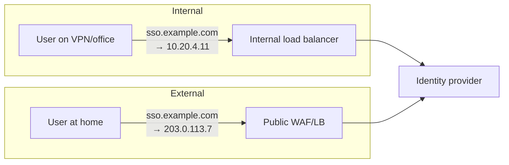

# Networking & DNS for IAM

## Why an identity architect cares about the network

Identity flows are **multi-party redirect dances across network boundaries**. In a single SSO login the browser may talk to four different hosts, in three DNS zones, across two firewalls, terminating TLS at two load balancers. Any of those can break the flow in ways that produce an error message about identity.

The rule of thumb after enough incidents: **when SSO breaks and nothing changed in the IdP, look at DNS, TLS termination, or time.**

---

## DNS: the dependency nobody lists

### Service location

Kerberos and AD clients don't have hardcoded server addresses. They **discover** them through DNS SRV records:

```
_ldap._tcp.dc._msdcs.corp.example.com.      SRV 0 100 389  dc1.corp.example.com.
_kerberos._tcp.dc._msdcs.corp.example.com.  SRV 0 100 88   dc1.corp.example.com.
_ldap._tcp.Frankfurt._sites.dc._msdcs.corp.example.com. SRV ...
```

Consequences an architect must internalise:

- **If DNS is wrong, authentication doesn't fail cleanly — it fails slowly.** Clients try, time out, retry the next record. Users report "logging in is slow", not "DNS is broken".
- **Site-aware records** mean clients prefer a local DC. Misconfigured subnets-to-sites mapping sends Manila's authentication to Frankfurt, and everyone blames the identity team.
- Kerberos derives the realm from DNS domain names. **DNS suffix mismatches break Kerberos** in ways that look like credential problems.

### Split-horizon DNS

The most common single cause of "works in the office, not from home":



The same hostname resolves differently by network location. This is a legitimate and common design — but it means:

- Certificates must be valid on **both** paths.
- SAML/OIDC endpoint URLs must be identical from both, or your metadata is wrong for half your users.
- Testing from one network proves nothing about the other.
- A device that changes network mid-session (docking, VPN drop, Wi-Fi handoff) may get a different endpoint mid-flow.

{: .warning }
> **Never let an identity endpoint's hostname differ between internal and external.** If `sso.example.com` externally is `sso.corp.local` internally, every issuer, audience, redirect URI and metadata document is now environment-specific, and federation partners cannot be onboarded once. Use one public hostname everywhere, resolved differently.

### DNS as an availability dependency

Your identity service inherits the availability of its DNS. TTLs govern how fast failover propagates: a 3600-second TTL means an hour of clients pointing at a dead endpoint. For identity endpoints, TTLs of 60–300 seconds are normal, at the cost of more query volume.

**CNAME chains** matter too — vendors typically give you `yourorg.idp-vendor.com` and you CNAME `sso.example.com` to it. That's fine, but it means your login availability depends on the vendor's DNS as well as yours. Ask about it during vendor selection.

---

## TLS termination and what it does to identity

Where TLS terminates determines what the identity service can see.


| Problem | Cause | Fix |
|:--|:--|:--|
| IdP generates `http://` redirect URIs | Backend sees plain HTTP after termination | `X-Forwarded-Proto` honoured by the app/container |
| Every user appears to come from one IP | Load balancer source NAT | `X-Forwarded-For`, and make sure risk/adaptive policy reads it |
| **Certificate-based auth fails** | Client cert doesn't survive termination | TLS passthrough, or forward the cert in a header (and validate the header can't be spoofed) |
| **Mutual TLS / mTLS-bound tokens fail** | Same cause | Terminate mTLS where the token binding is validated |
| Session affinity breaks logins | Multi-step flows land on different nodes with local session state | Shared session store, or sticky sessions — and know which you have |
| Long federation redirects rejected | Header/URL size limits at the proxy (SAML `HTTP-Redirect` with a large assertion) | Raise limits, or use HTTP-POST binding |

{: .architect }
> **State is the hidden question in every AM architecture.** Ask early: *is the authentication session held in memory on the node, in a shared store (Redis, database), or in a cookie?* The answer determines whether you can do rolling upgrades without logging everyone out, whether you can lose a node gracefully, and whether you can run active-active across regions. See [HA, DR & Scale](../04-architecture-practice/05-ha-dr-and-scale.md).

---

## Ports and protocols worth memorising

| Port | Protocol | Notes |
|:--|:--|:--|
| 88 | Kerberos | TCP **and** UDP; large PACs force TCP |
| 389 | LDAP | Plaintext — should be StartTLS or nothing |
| 636 | LDAPS | Implicit TLS |
| 3268 / 3269 | Global Catalog / GC over SSL | Forest-wide searches, subset of attributes |
| 445 | SMB | Used by AD for GPO (SYSVOL), and by lateral movement |
| 464 | kpasswd | Kerberos password change |
| 123 | NTP | **Security-relevant**: Kerberos breaks past 5 min skew |
| 53 | DNS | TCP for large responses — blocking TCP/53 breaks things subtly |
| 443 | HTTPS | Everything modern: SAML, OIDC, SCIM, Graph |
| 1812/1813 | RADIUS | Network access, VPN, MFA integrations |
| 49 | TACACS+ | Network device administration |

---

## Firewalls, proxies and the flows they break

**SAML and OIDC are browser-mediated.** The IdP and SP frequently have **no direct network path to each other** — the browser carries the assertion. This is a feature (it works across organisational boundaries), and it means:

- You cannot debug by checking connectivity between IdP and SP; you must trace the browser.
- **Back-channel** exceptions exist and *do* need connectivity: OIDC token endpoint and JWKS retrieval, SAML artifact resolution, back-channel logout, SCIM provisioning. These are the flows that break when the IdP sits in a DMZ with egress restrictions.

{: .warning }
> **JWKS retrieval is a hard dependency people forget.** A resource server validating OIDC tokens must fetch the IdP's public keys over the network, and cache them. If egress to the IdP is blocked, or the cache isn't refreshed on key rotation, token validation fails for every request — an outage that looks like an authentication problem but is a network/caching problem. Always ask: *who fetches JWKS, from where, how often, and what happens when it fails?*

Other network-shaped traps:

- **Deep packet inspection / TLS interception** re-signs traffic with a corporate CA. This breaks certificate pinning and mTLS, and it means the proxy sees your tokens.
- **Captive portals** intercept the first HTTP request and can hijack an in-flight redirect chain.
- **Corporate proxies with authentication** create a chicken-and-egg problem when the thing you're authenticating to *is* the identity provider.
- **NAT and IP-based policy**: if your conditional access rules trust "corporate IP ranges", VPN split-tunnelling and cloud egress changes silently move users out of trusted ranges.

---

## Time

Time is a security control, not a utility.

- **Kerberos**: default maximum tolerance 5 minutes. Beyond that, authentication fails.
- **SAML assertions**: `NotBefore` / `NotOnOrAfter` conditions, typically minutes wide. Skewed clocks reject valid assertions.
- **JWTs**: `exp`, `nbf`, `iat` — validators usually allow small leeway, which itself is a security parameter.
- **TOTP**: 30-second windows; a phone with drifted time fails MFA.
- **Certificates**: validity windows; a server whose clock is a year fast rejects valid certs.
- **Logs**: correlation across systems during incident response is only possible with synchronised clocks. NTP hygiene is a forensics prerequisite.

In AD, the **PDC Emulator** is the authoritative time source for the domain, and should sync to a reliable external source. A misconfigured time hierarchy is a slow-burning fault that surfaces as random authentication failures.

---

## Load balancing identity services

| Decision | Options | Consideration |
|:--|:--|:--|
| **Health check** | TCP connect vs HTTP endpoint vs deep check | A TCP check passes while the IdP can't reach its database. Use a deep health endpoint |
| **Affinity** | Sticky vs stateless | Multi-step auth flows (MFA, consent) need state continuity |
| **TLS** | Terminate vs passthrough | Passthrough for mTLS/cert auth; terminate for WAF inspection |
| **Timeouts** | Idle and request timeouts | Long-running flows (device code, redirect chains) can exceed defaults |
| **Geo-routing** | Latency vs data residency | Routing an EU user to a US node may be a compliance event, not just latency |

---

## Architect's checklist

- [ ] Does every identity endpoint resolve to the **same hostname** internally and externally?
- [ ] What are the **DNS TTLs** on identity endpoints, and does failover depend on them?
- [ ] Where does **TLS terminate**, and does the identity service correctly see protocol, host and client IP?
- [ ] Which flows require **back-channel connectivity** (token endpoint, JWKS, SCIM, back-channel logout), and are those paths open and monitored?
- [ ] Where is **session state** held, and can you lose a node — or a region — without logging everyone out?
- [ ] Is **NTP** healthy across DCs, IdPs, application servers and MFA devices?
- [ ] Do adaptive/conditional access policies rely on **IP ranges** that split tunnelling or cloud egress could invalidate?
- [ ] Is there **TLS interception** in the path, and what does it see?
- [ ] Have you tested the login journey from **every network the user population actually uses** — office, VPN, home, mobile, partner site?

---

**Next:** [Cryptography for IAM](04-cryptography.md) →
