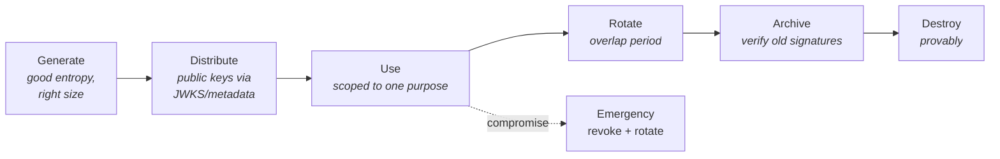

# Cryptography for IAM

## The depth you need

You are not going to design a cipher. You **are** going to decide whether an assertion should be signed or encrypted, what algorithm a token uses, how passwords are stored, how long a key lives and who can use it. Those are architecture decisions with cryptographic consequences.

{: .concept }
> **The four guarantees.** Every crypto decision in IAM is about obtaining one or more of: **confidentiality** (only the intended party can read it), **integrity** (it wasn't altered), **authenticity** (it came from who it claims), and **non-repudiation** (the sender can't credibly deny it). Know which you need. Most IAM failures come from assuming you have one when you only bought another — most commonly assuming encryption gives you authenticity.

---

## The primitives

### Hashing

A one-way function: arbitrary input → fixed-length digest. Properties that matter: pre-image resistance (can't reverse), second pre-image resistance, and collision resistance.

| Algorithm | Status | Use in IAM |
|:--|:--|:--|
| MD5, SHA-1 | **Broken** for collision resistance | Legacy only; still found in old federation configs and NTLM. Flag it |
| SHA-256 / SHA-384 / SHA-512 | Standard | Signatures, integrity, certificate fingerprints |
| SHA-3 family | Standard, less deployed | Fine |
| **bcrypt, scrypt, Argon2id, PBKDF2** | Purpose-built for passwords | **Only** these for password storage |

{: .warning }
> **Never store passwords with a fast hash.** SHA-256 is designed to be fast, which is exactly wrong for passwords — a GPU rig does billions per second. Password hashing must be *deliberately slow and memory-hard*: **Argon2id** (preferred), **scrypt**, **bcrypt**, or **PBKDF2** with a high iteration count where FIPS compliance requires it. Each password gets a unique **salt** (stops rainbow tables and reveals nothing when two users share a password); a system-wide **pepper** held in an HSM/KMS adds defence if the database alone leaks. Tune the work factor to your hardware — target ~100–250ms per hash — and **re-tune it every couple of years**, upgrading hashes on next successful login.

### Symmetric encryption

One key, both directions. Fast. Used for bulk data, session content, at-rest encryption.

- **AES-256-GCM** or **ChaCha20-Poly1305** — both are **AEAD** (Authenticated Encryption with Associated Data), meaning they provide confidentiality *and* integrity in one operation.
- **AES-CBC without a MAC is not enough.** Encryption alone does not prevent tampering; padding-oracle attacks on unauthenticated CBC are a real, exploited class of bug — including historically in XML encryption used by SAML.
- **Never reuse a nonce/IV with the same key** in GCM. It's catastrophic, not merely weak.

### Asymmetric (public key) cryptography

A key pair: what one key does, only the other undoes.

- **Sign with the private key, verify with the public key** → authenticity, integrity, non-repudiation.
- **Encrypt with the public key, decrypt with the private key** → confidentiality *for the key holder*.

This asymmetry is the foundation of federation: an IdP signs assertions with a private key nobody else has, and every relying party verifies with a public key that can be distributed freely. **You can publish the verification key to the entire internet and lose nothing** — which is what makes federation across organisational boundaries possible at all.

| Family | Key sizes | Notes |
|:--|:--|:--|
| **RSA** | 2048 (minimum), 3072, 4096 | Ubiquitous; large keys/signatures; slower. Use RSA-PSS padding for new signatures where supported |
| **ECDSA** (P-256, P-384) | 256/384-bit | Much smaller, faster; equivalent strength to RSA 3072/7680 |
| **EdDSA** (Ed25519) | 256-bit | Modern, fast, misuse-resistant. Preferred where supported |
| **DH / ECDH** | — | Key agreement, not signing. Basis of TLS forward secrecy |

**Key size intuition:** ECC P-256 ≈ RSA 3072 in strength at a fraction of the size. This matters when signatures travel in URLs or headers (JWT in an `Authorization` header, SAML in a redirect binding).

---

## Signing vs encrypting: the decision you'll actually make

For a SAML assertion or a JWT:

| Concern | Signing | Encrypting |
|:--|:--|:--|
| Prevents tampering | ✅ | ❌ (alone) |
| Proves origin | ✅ | ❌ |
| Hides contents from the browser/user | ❌ | ✅ |
| Hides contents from the transport | ❌ (TLS does this) | ✅ (end-to-end) |
| Required for federation trust | **Always** | Situational |

**Sign always. Encrypt when the payload contains data the intermediary must not see** — because in SAML the assertion travels *through the user's browser*, so the user can read every attribute in it. If the assertion carries a national ID number, a salary band, or a health flag, the user can read it. That's the argument for assertion encryption.

{: .architect }
> **A signed-but-not-encrypted assertion passing through the browser is a data disclosure decision, not a security bug** — as long as you made it deliberately. The architecture failure is discovering during a privacy review that you've been passing sensitive attributes visibly for three years. Review what's in your assertions.

---

## Message-level crypto in IAM: JOSE and XML-DSig

### JOSE (JSON Object Signing and Encryption)

The modern stack, used by OIDC/OAuth:

| Spec | What | Notes |
|:--|:--|:--|
| **JWS** | Signed JSON | `header.payload.signature`, base64url |
| **JWE** | Encrypted JSON | 5 parts; usually a key-wrapped AES-GCM content key |
| **JWK / JWKS** | Key representation / key set | The `jwks_uri` endpoint that relying parties fetch |
| **JWA** | Algorithm registry | `RS256`, `PS256`, `ES256`, `EdDSA`, `HS256` |

Algorithm choices:

- **`RS256`** — RSA + SHA-256. The interoperability default.
- **`PS256`** — RSA-PSS. Better padding; use where both ends support it.
- **`ES256`** — ECDSA P-256. Compact and fast; preferred for new designs.
- **`HS256`** — HMAC with a **shared secret**. Fine for a single service signing its own tokens; **wrong for federation** — every verifier can also forge.
- **`none`** — the algorithm that must never be accepted. See below.

{: .warning }
> **The three classic JWT vulnerabilities**, all still found in production:
> 1. **`alg: none`** — a library that honours the token's own claim that it isn't signed. Never let the token choose.
> 2. **Algorithm confusion (RS256 → HS256)** — attacker changes `alg` to HMAC and signs with the *public* key as the secret; a naive verifier that picks the algorithm from the header validates it. **Pin the expected algorithm server-side.**
> 3. **Unvalidated `kid` / `jku`** — a `kid` that path-traverses or a `jku` pointing at an attacker-hosted key set. Only ever resolve keys from a pre-configured trusted source.
>
> The meta-lesson: **the token must never determine how it is validated.**

### XML-DSig and XML-Enc (SAML)

Older, and genuinely harder to implement safely. XML signatures cover a *reference* to part of the document rather than the bytes on the wire, and XML canonicalisation is complex — which enables **XML Signature Wrapping (XSW)**: an attacker adds a second, forged assertion while keeping the original signed one, and a naive parser validates one element but reads another.

Architect's mitigations: use a mature, maintained library (never hand-rolled XML validation), validate that the *element you consume* is the element that was signed, disable DTD/external entity processing (XXE), and pin the expected signing certificate rather than trusting whatever the document embeds.

---

## Key management

Cryptography fails at key management far more often than at mathematics.

### Key lifecycle

**Rotation with overlap is the pattern that matters.** For signing keys:

1. Publish the new public key alongside the old in JWKS/metadata.
2. Wait for relying parties' caches to refresh (this is why cache TTLs matter).
3. Switch to signing with the new key.
4. Keep the old public key published until all tokens signed with it have expired.
5. Remove it.

Skip step 1–2 and you get a total outage the moment you switch, because verifiers still have the old key set cached. **This is the mechanism behind a large share of federation outages** — and the reason "certificate expiry" incidents are so common is that many SAML deployments rotate by *replacing* rather than *overlapping*.

### Where keys live

| Storage | Assurance | Use |
|:--|:--|:--|
| File on disk | Low | Dev only |
| OS keystore / Windows DPAPI | Medium | Local services |
| **KMS** (AWS KMS, Azure Key Vault, GCP KMS) | High | Cloud-native default |
| **HSM** (FIPS 140-2/3 Level 3) | Highest | Root CAs, regulated signing, high-value keys |
| Secrets manager (Vault, cloud secrets) | Medium-high | Application secrets, not long-lived root keys |

The property you're buying with an HSM/KMS is that the private key **cannot be exported** — signing happens inside the boundary. That converts "an attacker stole the key" into "an attacker could sign while they had access", which is a meaningfully smaller and more detectable problem.

### Key hygiene rules

- **One key, one purpose.** Never use the same key pair for signing tokens and terminating TLS.
- **Separate environments completely.** A dev signing key that works in production is a production compromise waiting to happen.
- **Know every key's expiry, in one place, with alerting well ahead.** Expired signing certificates are one of the most common causes of federation outages, and they're entirely preventable.
- **Have a rehearsed emergency rotation procedure.** "How fast can we rotate the IdP signing key if it leaks?" is a question you want answered before the incident.

---

## Randomness

Every token, session ID, state parameter, nonce, PKCE verifier, recovery code and salt depends on unpredictable random values.

- Use the **cryptographically secure** generator: `/dev/urandom`, `SecureRandom`, `crypto.randomBytes`, `secrets` (Python). Never `Math.random()`, `rand()`, or anything seeded from the clock.
- **128 bits of entropy minimum** for anything that identifies a session or authorises an action.
- Predictable session identifiers and guessable password-reset tokens are still, in 2026, a live vulnerability class.

---

## Crypto agility

Algorithms age. Your architecture must be able to change them without a rewrite. In practice:

- Every algorithm and key size is **configuration, not code**.
- Tokens and messages carry an **algorithm identifier** and a **key identifier** (`alg`, `kid`) — but the *verifier* decides what it will accept.
- You can run **two algorithms simultaneously** during a migration.
- You know, per system, **what would need to change** to move from RSA to ECDSA, or to a post-quantum scheme.

See [Post-Quantum & Crypto Agility](../08-frontier/05-post-quantum.md).

---

## Architect's checklist

- [ ] How are **passwords stored** in every system you own — algorithm, work factor, salt, last tuned when?
- [ ] For each token/assertion type: is it **signed**, **encrypted**, or both — and was that a decision or a default?
- [ ] Is the **accepted algorithm pinned server-side**, so the token can't choose its own validation?
- [ ] Where does every **signing key** live, can it be exported, and who can use it?
- [ ] Do you have a **single inventory of certificate and key expiry dates** with alerting at 90/30/7 days?
- [ ] Is your **rotation procedure overlap-based**, and has it been rehearsed?
- [ ] Are any **sensitive attributes** travelling in assertions the user can read?
- [ ] Are dev/test keys **provably distinct** from production?
- [ ] Could you change signature algorithms in under a quarter if you had to?

---

**Next:** [PKI, Certificates & TLS](05-pki-and-tls.md) →
