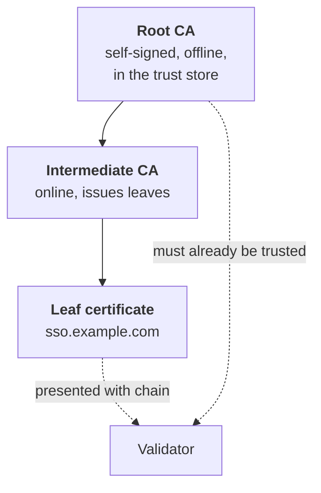

# PKI, Certificates & TLS

## What a certificate actually is

A certificate is **a signed statement binding a public key to an identity, made by an issuer, valid for a period.** That's it. Everything else — chains, revocation, trust stores — exists to answer one question: *should I believe this statement?*

```
Subject:      CN=sso.example.com
Public key:   <the key being vouched for>
Issuer:       CN=Example Internal Issuing CA
Validity:     2026-01-15 → 2027-01-15
Extensions:   SAN: sso.example.com, login.example.com
              Key Usage: digitalSignature, keyEncipherment
              EKU: serverAuth
              CRL Distribution Point / OCSP URL
Signature:    <issuer's signature over all of the above>
```

{: .concept }
> **Trust in PKI is transitive and pre-seeded.** You trust the certificate because you trust its issuer, because you trust *that* issuer, until you reach a root you decided to trust in advance by putting it in a trust store. The entire system rests on the contents of trust stores — and on nobody being able to add to them.

### Fields that matter in practice

| Field | Why it matters |
|:--|:--|
| **SAN (Subject Alternative Name)** | The *actual* hostname check. CN has been ignored by browsers for years. A cert without the right SAN fails, regardless of CN |
| **EKU (Extended Key Usage)** | `serverAuth`, `clientAuth`, `emailProtection`, `codeSigning`. **A server cert used for client authentication will be rejected** if the EKU doesn't allow it — a very common self-inflicted failure |
| **Key Usage** | `digitalSignature`, `keyEncipherment`, `keyCertSign` (CAs only) |
| **Basic Constraints** | `CA:TRUE/FALSE`, path length. A leaf cert with `CA:TRUE` is a catastrophe |
| **AIA / CDP** | Where to fetch issuer certs and revocation info |
| **Validity period** | Public TLS certs are on a shrinking leash — the industry is moving toward very short lifetimes, which makes automation mandatory rather than optional |

---

## Chains and validation



A validator checks, in roughly this order:

1. **Signature chain** to a trusted root.
2. **Validity dates** at every level (hence clock dependency).
3. **Hostname** matches a SAN.
4. **EKU/Key Usage** permits this use.
5. **Revocation** status (CRL or OCSP).
6. **Basic constraints and path length**.

{: .warning }
> **The missing-intermediate problem.** A server must send its leaf **and** any intermediates. Browsers often paper over a missing intermediate via AIA fetching; **most server-to-server libraries do not.** So the site works in Chrome and fails from your provisioning connector — one of the most confusing certificate failures there is, because "it works in the browser" is offered as proof it's fine. Always test the machine-to-machine path.

### Revocation, honestly

- **CRL** — a list of revoked serials, downloaded periodically. Grows large; cached; often stale.
- **OCSP** — ask the issuer about one certificate. Adds latency and a privacy leak (the CA learns who visits what); soft-fail behaviour means an attacker who blocks OCSP simply gets accepted.
- **OCSP stapling** — the server presents a recent, signed OCSP response itself. Better, but depends on the server refreshing it.

The practical conclusion the industry has reached: **revocation is weak, so shorten validity instead.** Design accordingly — assume that if a key leaks, you cannot reliably un-trust the certificate in time, and plan rotation as the primary control.

---

## Where certificates appear in IAM

| Use | Notes |
|:--|:--|
| **TLS for identity endpoints** | Table stakes; usually public CA |
| **SAML signing** | Often **self-signed and long-lived**, which is fine: trust comes from metadata exchange, not from a CA. Expiry is still an outage |
| **SAML encryption** | The SP's public key, used by the IdP to encrypt assertions |
| **Token signing (JWKS)** | Usually raw keys rather than certs, but same lifecycle problem |
| **Client certificate / mTLS authentication** | Strong, phishing-resistant machine and user auth; painful to distribute and rotate at scale |
| **Smart cards / PIV / CAC** | Certificate-based user auth, common in government and defence |
| **Device identity** | Certificates issued to managed devices, used in conditional access |
| **Code signing, S/MIME, document signing** | Adjacent, governed by the same CA hierarchy |
| **Service mesh identity (SPIFFE/SVID)** | Short-lived certs as workload identity — see [workload identity](../03-identity-domains/05-workload-identity.md) |

{: .architect }
> **A SAML signing certificate has nothing to do with TLS trust.** It does not need to come from a public CA, does not need to be "valid" in the browser sense, and its expiry does not make it insecure. What it needs is to be **the certificate the relying party has in its metadata**. Teams that "renew" a SAML signing cert through their normal TLS process — replacing it without coordinating metadata updates — take down every federated application at once. This happens somewhere every week.

---

## Rotating a federation signing certificate without an outage

The correct sequence, which many organisations learn the hard way:

1. Generate the new key pair well in advance.
2. **Publish both certificates** in your IdP metadata / JWKS (the standards allow multiple keys; `use="signing"` with several `KeyDescriptor` entries in SAML metadata, several keys in JWKS).
3. **Give relying parties time to refresh** — days or weeks, depending on whether they auto-refresh metadata or update manually.
4. **Switch signing to the new key.** Verifiers who refreshed have both; validation succeeds.
5. After all old tokens/assertions have expired, remove the old certificate.

For relying parties that don't support multiple keys or automatic metadata refresh — and there are always some — you need a coordinated change window. **Knowing which applications those are is an architecture artefact you should maintain**, not something to discover during the rotation.

---

## Internal PKI as an architecture concern

If your organisation runs its own CA (very common — AD Certificate Services, EJBCA, Vault PKI, step-ca), it is **identity infrastructure and must be governed as Tier 0**.

Key design questions:

- **Is the root offline?** It should be. An online root that issues leaves directly is a single catastrophic key.
- **Who can request what?** Certificate templates / profiles define this. Over-permissive templates are a privilege escalation path — the AD CS "ESC" class of attacks lets a low-privileged user request a certificate that authenticates *as someone else*, typically because a template allows the requester to specify the subject and has the `clientAuth` EKU.
- **How are certs issued and renewed?** Manual issuance does not scale and produces expiry incidents. **ACME** (the Let's Encrypt protocol, also supported by internal CAs) is the answer for automation.
- **What is in the trust store, and who can change it?** Adding a CA to an endpoint trust store grants that CA the power to impersonate anything. TLS-intercepting proxies do exactly this by design.
- **Do you have an inventory?** You cannot manage expiry for certificates you don't know exist. Certificate discovery/lifecycle tooling exists for this reason.

---

## TLS itself

What an architect should hold:

- **TLS 1.2 minimum, TLS 1.3 preferred.** SSLv3, TLS 1.0/1.1 are dead and fail compliance scans.
- **TLS 1.3** removed static RSA key exchange, so **forward secrecy is mandatory** — a compromise of the server's private key doesn't retroactively decrypt captured sessions. It also cut the handshake to one round trip.
- **Cipher suite selection** should be a short modern list (AEAD only). Long legacy lists exist to support one ancient client — find it and fix it.
- **Certificate pinning** increases assurance and increases outage risk; it is generally the wrong choice for enterprise web apps and sometimes the right one for mobile apps talking to their own backend.
- **mTLS** authenticates *both* ends. It's the strongest common machine-to-machine authentication, and its cost is entirely operational: distribution, rotation, and revocation at scale.

---

## Architect's checklist

- [ ] Is there a **single inventory** of every certificate in the identity estate, with owner, expiry and renewal method?
- [ ] Are renewals **automated** (ACME or equivalent) wherever possible?
- [ ] Do you have **alerting at 90/30/7 days** before expiry, going to a team that acts on it?
- [ ] Is the **federation signing certificate rotation** procedure overlap-based, documented and rehearsed?
- [ ] Which relying parties **cannot auto-refresh metadata**, and how are they handled during rotation?
- [ ] Is the **internal CA root offline**, and are certificate templates reviewed for escalation paths?
- [ ] Are **intermediates served** by every endpoint, verified from a non-browser client?
- [ ] What is the **minimum TLS version** accepted, and is anything still on 1.0/1.1?
- [ ] If a private key leaked today, **how fast could you rotate it**, and what breaks?

---

**Next:** [Windows & Linux Administration](06-os-administration.md) →
