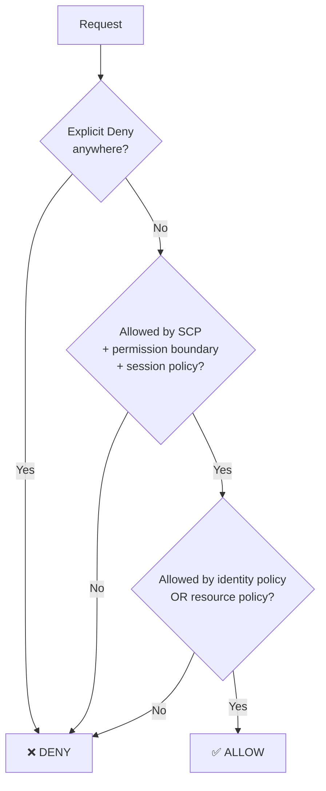

# Cloud Fundamentals

## The shift the cloud caused

On-premises, identity was **perimeter-adjacent**: you were on the network, therefore mostly trusted, and the directory decided the rest. In cloud, there is no perimeter, every service has a public API endpoint, and **the only thing standing between an attacker and your data is an identity decision.** That's why "identity is the new perimeter" became a cliché — it's a cliché because it's true.

It also changed the shape of the problem:

| On-premises | Cloud |
|:--|:--|
| Few, long-lived identities | Enormous numbers of short-lived, machine identities |
| Access granted by group membership | Access granted by **policy documents** |
| Provisioned by an admin | Provisioned by **infrastructure-as-code**, in a pull request |
| Directory is authoritative | Each cloud has **its own IAM system**, federated from your IdP |
| Change is slow | Change is continuous, automated and unattended |

{: .concept }
> **Cloud IAM systems are policy engines, not directories.** They do not primarily store people; they evaluate rules about principals, actions, resources and conditions. Your workforce identity provider federates *into* them. Confusing the two — treating AWS IAM as a place to create users — is the beginner mistake that produces long-lived access keys and audit findings.

---

## AWS IAM

The model, precisely:

| Concept | Meaning |
|:--|:--|
| **Principal** | Who is making the request: IAM user, IAM role session, service, federated identity |
| **IAM user** | A long-lived identity with credentials. **Should be near-zero in a mature account** |
| **IAM role** | A set of permissions that can be *assumed*, producing **temporary** credentials via STS. The correct primitive |
| **Policy** | A JSON document of `Effect / Action / Resource / Condition` statements |
| **Identity-based policy** | Attached to a user/group/role — "what this principal may do" |
| **Resource-based policy** | Attached to the resource (S3 bucket, KMS key) — "who may do what to me". Enables cross-account access without role assumption |
| **Permission boundary** | A ceiling on what an identity-based policy can grant. Lets you delegate policy creation safely |
| **SCP** (Service Control Policy) | Organisation-level guardrail; can only *restrict*, never grant |
| **Session policy** | Further restriction applied at assume-role time |

The effective permission is the **intersection of everything that can restrict, and the union of what can grant** — with an explicit `Deny` anywhere winning outright:

**Federation into AWS** is the pattern to design: your IdP (Entra, Okta, Ping) federates via SAML or OIDC into AWS IAM Identity Center (formerly SSO), which maps groups to **permission sets** across accounts. Users never hold AWS credentials; they get a role session that expires.

{: .warning }
> **Long-lived access keys (`AKIA…`) are the single most common serious cloud IAM finding.** They don't expire, they get committed to repositories, and they're the credential behind a large share of cloud breaches. Every one of them should have a ticket to remove it. Replace with: IAM Identity Center for humans, IAM roles for EC2/Lambda, and **OIDC federation for CI/CD** (GitHub Actions and GitLab can assume a role by presenting a signed OIDC token — no stored secret at all). See [workload identity](../03-identity-domains/05-workload-identity.md).

---

## Microsoft Entra ID / Azure

Two layers people conflate, and the conflation causes real design errors:

| Layer | Governs | Constructs |
|:--|:--|:--|
| **Entra ID** | Identity and app access | Users, groups, service principals, app registrations, **directory roles** (Global Admin, User Admin…), Conditional Access |
| **Azure RBAC** | Access to Azure *resources* | Role assignments (Owner, Contributor, Reader, custom) scoped to management group / subscription / resource group / resource |

A Global Administrator is not automatically able to manage Azure resources (though they can elevate to gain it) — and an Azure Owner is not a directory admin. Know which plane a permission lives in.

Key constructs:

- **App registration** = the application's identity definition (client ID, redirect URIs, exposed scopes, app roles). **Service principal** = the instance of that app in a specific tenant, which holds the permissions.
- **Delegated permissions** (app acts *as the user*, limited by both) vs **application permissions** (app acts *as itself*, limited only by its grant). Application permissions like `Mail.ReadWrite.All` or `Directory.ReadWrite.All` are extremely powerful and are a favourite persistence mechanism after a tenant compromise.
- **Admin consent vs user consent.** Illicit consent grants — where a user is phished into approving a malicious app — are a live attack technique. **Restrict user consent to verified publishers and low-impact scopes**; that's an architecture decision, not a setting someone should stumble on.
- **Managed identities** — Azure-managed service principals with no secret, for workloads. The right default.
- **Conditional Access** — the policy engine: signals (user, device, location, risk, app) → controls (MFA, compliant device, block, session limits). This is where Zero Trust actually gets implemented in Microsoft estates. Also where you can lock yourself out — always keep **break-glass accounts excluded** from CA policies and monitored.
- **PIM (Privileged Identity Management)** — just-in-time, time-bound, approval-gated activation of privileged roles. Effectively native PAM for directory and Azure roles.

---

## Google Cloud IAM

Simpler model, different vocabulary:

- **Members/principals**: Google accounts, service accounts, groups, domains, workload identity pools.
- **Roles**: bundles of permissions — *basic* (Owner/Editor/Viewer, too broad, avoid), *predefined*, *custom*.
- **Policy binding**: attaches a role to a principal at a resource node.
- **Hierarchy**: Organisation → Folder → Project → Resource, with **policies inheriting downward** (and, notably, **no deny by default** in the classic model — Deny policies exist but are a later addition, so intuitions from AWS don't transfer cleanly).
- **Workload Identity Federation** lets external identities (including GitHub Actions, AWS, or any OIDC provider) impersonate service accounts without keys.

Service account **keys** in GCP are the equivalent of AWS long-lived access keys: avoid, and prefer attached service accounts or federation.

---

## Patterns that repeat across all three clouds

| Pattern | Why it matters |
|:--|:--|
| **Federate humans, don't create cloud-native users** | One lifecycle, one MFA policy, one leaver process |
| **Roles/short-lived credentials over static keys** | Removes the credential-theft blast radius |
| **Guardrails at the organisation level** (SCP / Azure Policy / Org Policy) | Prevents drift no matter what an account owner does |
| **Least privilege via analysis, not guesswork** | All three clouds provide "unused permissions" analysers (Access Analyzer, Entra permission usage, Policy Intelligence). Use actual usage to right-size |
| **Break-glass accounts** | Cloud-native, MFA'd differently, excluded from CA/federation, credentials split and sealed, use alerts loudly |
| **IaC as the provisioning channel** | Permissions change through pull requests, reviewed and versioned. This makes access change *auditable by default* — but it also means **your repository permissions are now identity permissions** |
| **CSPM/CIEM tooling** | Cloud Infrastructure Entitlement Management — the cloud's answer to entitlement review, because policy documents aren't reviewable by humans at scale |

{: .architect }
> **The IGA blind spot.** Traditional IGA tools were built for "user has group in application". Cloud permissions are *computed* from layered policy documents with conditions — there is no simple entitlement list to certify. A reviewer approving "Contributor on subscription X" has no idea what that permits. This is a genuine, unsolved-ish architecture problem: the practical answers are (a) certify *role assignments* while using CIEM to right-size the roles, and (b) make privileged cloud access **time-bound and requested** rather than standing. Don't pretend a quarterly certification of an IAM policy JSON is a meaningful control.

---

## Multi-cloud reality

Most enterprises end up in more than one. The architecture question is where the **common control plane** sits:

- **Identity** — one workforce IdP federating into all clouds. Non-negotiable.
- **Authorisation** — cloud-native, because policy engines aren't portable. Accept it; don't build an abstraction layer over IAM policies.
- **Governance** — a CIEM/IGA layer that can read all three and normalise for review.
- **Secrets/workload identity** — either cloud-native per cloud, or a portable layer (Vault, SPIFFE) if you genuinely need workload portability. Choosing portability has a real cost; make it deliberately.

---

## Architect's checklist

- [ ] Are human users **federated** into every cloud, or do cloud-native accounts exist? Where, and why?
- [ ] How many **long-lived static credentials** (AWS access keys, GCP SA keys, Entra client secrets) exist, and what's the plan to eliminate them?
- [ ] Is CI/CD authenticating via **OIDC federation** rather than stored secrets?
- [ ] Are **organisation-level guardrails** (SCP / Azure Policy / Org Policy) in place, and can a project owner bypass them?
- [ ] Do you have **break-glass** accounts, tested, excluded from federation and Conditional Access, and alerted on use?
- [ ] Which **application permissions** (Entra) or **wildcard actions** (AWS) exist, and who consented to them?
- [ ] How are cloud entitlements **reviewed**, and does the reviewer actually understand what they're approving?
- [ ] Is **privileged cloud access standing or just-in-time**?
- [ ] Do you know who can modify the **IaC repositories** that define permissions — and is that governed as privileged access?

---

**Next:** [Data Modelling & Integration](08-data-modeling.md) →
