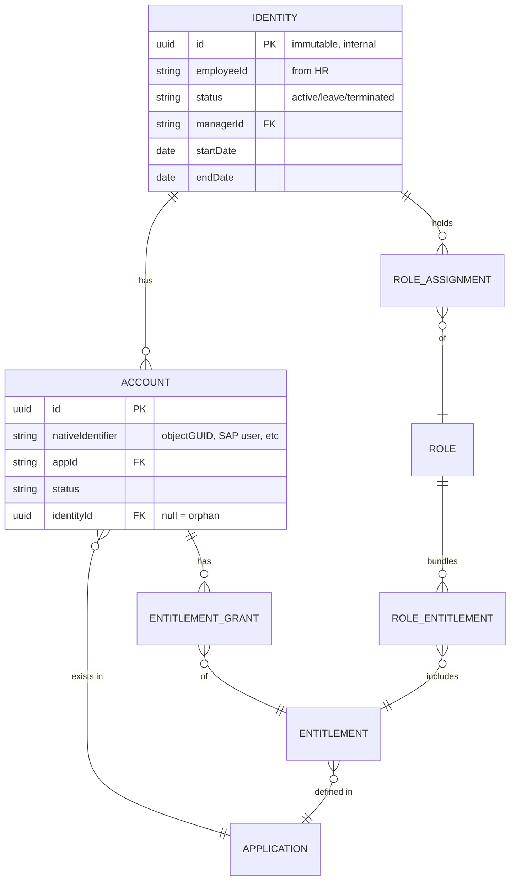
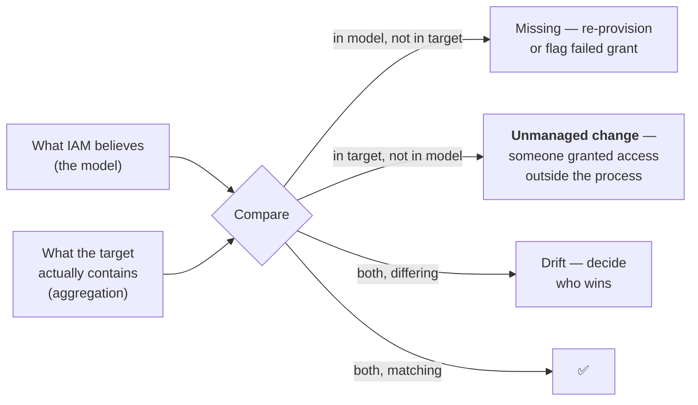

# Data Modelling & Integration

## The claim this page defends

**IAM is a data integration discipline with a security purpose.** The protocols are the easy part. What consumes an IAM programme's time and budget is: getting accurate identity data out of systems that were never designed to give it, correlating records that don't share a key, keeping them synchronised as reality changes, and proving it's all still correct.

If you take one thing from Stage 1, take this page.

---

## The core identity data model

Almost every IGA product implements some version of this, whatever it calls the objects:

The relationships that carry all the meaning:

- **One identity → many accounts.** The account is the representation *in one system*; the identity is the person.
- **Accounts with no identity are orphans** — the single most important reconciliation output.
- **Identities with no accounts** may be pre-hires, leavers, or a correlation failure.
- **Entitlements belong to applications**, not to identities. An identity's access is always mediated by an account.
- **Roles are a convenience layer** over entitlements. They never *are* the access.

{: .architect }
> **Model personas explicitly, from day one.** The same human can be an employee, a contractor for a different subsidiary, an administrator with a separate privileged account, and a customer. Products that assume one-person-one-identity force you into ugly workarounds. Decide early: are these separate identities linked by a "person" record, or one identity with multiple contexts? Both are defensible. Discovering the requirement in year two is not.

---

## Authoritative sources

{: .concept }
> An **authoritative source** is the system that, when it disagrees with everyone else about an attribute, wins. Authority is **per attribute**, not per system.

A realistic authority map:

| Attribute | Authoritative source | Notes |
|:--|:--|:--|
| Legal name, employee ID, hire/termination date, manager, department, cost centre | **HR system** | For employees only |
| Contractor identity, sponsor, contract end date | **Vendor management / contractor system** | Often a spreadsheet. This is where programmes stall |
| Work email address | **Email/directory system** (usually generated) | Generated *from* HR data, then authoritative itself |
| Phone, desk location | Facilities, or self-service | Low stakes |
| Job role / job code | HR | Drives birthright access — so its quality is a security matter |
| Application entitlements | **The application itself** | Discovered by aggregation, never assumed |
| Privileged account ownership | PAM system | |
| Device ownership | MDM/endpoint | |
| Machine/workload identity | Cloud APIs, CMDB, orchestration platform | Frequently nothing is authoritative — the gap |

**Conflict resolution must be designed, not discovered.** When HR says the department is Finance and the directory says Operations, what happens? Options: source precedence, last-writer-wins, flag for human review, or "IAM overwrites the target". Each is right in some contexts. What's always wrong is *not knowing*.

---

## Correlation: matching accounts to identities

This is where IGA implementations spend far more effort than anyone budgets for.

**Correlation** is deciding that `jsmith` in SAP, `john.smith@corp.com` in AD, and employee `40218` in Workday are all the same person.

### The strategy ladder

| Rank | Rule | Confidence |
|:--|:--|:--|
| 1 | Match on a **stable shared identifier** (employee ID present in both systems) | High — design for this |
| 2 | Match on a **unique business attribute** (corporate email, UPN) | Good, but emails change on marriage/rebranding |
| 3 | Match on a **normalised composite** (surname + first initial + hire date) | Fuzzy; produces false positives at scale |
| 4 | **Manual mapping table** | Necessary evil for legacy systems |
| 5 | **No match** → orphan queue | The output that matters |

{: .warning }
> **A false positive in correlation is a security incident.** If a fuzzy rule links John Smith the warehouse worker's SAP account to John Smith the CFO's identity, you've just given someone else's access to a person — and every downstream control will believe it's correct. Correlation rules should be **conservative**: prefer an orphan requiring human review over a wrong match. Log every automated match with the rule that produced it, so you can audit and reverse.

### Orphan and rogue accounts

Aggregation always produces accounts that don't correlate. Categories, each with a different disposition:

- **Service accounts** — legitimate, but must be claimed by an owner and moved into NHI governance.
- **Shared/team accounts** — should be eliminated or vaulted; they break accountability entirely.
- **Test accounts** — should have an expiry.
- **Leaver remnants** — the finding auditors care about. Disable, then delete after a retention period.
- **Genuinely unknown** — the scary category. Investigate; some are attacker persistence.

A mature programme reports orphan counts as a **KPI trending to zero**, not as a one-off cleanup.

---

## Reconciliation

Provisioning tells you what IAM *asked for*. Reconciliation tells you what the target system *actually has*.

{: .concept }
> **Reconciliation is the actual control; provisioning is just automation.** A system that only provisions can be silently bypassed by an administrator making a change directly in the target. A system that reconciles *detects* that, and can revert it. When an auditor asks "how do you know access is what you say it is?", reconciliation is the answer. Design it in from the start — it is much harder to retrofit, because retrofitting means confronting years of accumulated unmanaged access.

Design decisions: full vs delta reconciliation, frequency (privileged systems hourly, low-risk quarterly), and — the political one — **do you auto-remediate or report?** Auto-revert is powerful and terrifying; most programmes start with report-only for a period, then auto-remediate on high-risk entitlements only.

---

## Integration patterns

| Pattern | Direction | Use when | Watch for |
|:--|:--|:--|:--|
| **Pull / scheduled aggregation** | IAM ← target | Reading current state; most aggregation | Latency; full reads are expensive at scale |
| **Push / provisioning API** | IAM → target | SCIM, REST, vendor SDK | Rate limits, partial failure, error semantics |
| **Event-driven** | Either | Near-real-time (webhooks, Kafka, event grid) | Ordering, duplicates, replay after outage |
| **File-based (CSV/SFTP)** | Either | Legacy HR feeds, mainframes | Silent truncation, encoding, "the file didn't arrive" |
| **Database direct** | Either | No API exists | Bypasses application logic — often unsupported by the vendor |
| **Screen scraping / RPA** | → target | Nothing else exists | Fragile; a last resort you must plan to remove |
| **Ticket-based (manual fulfilment)** | → target | Target cannot be automated | **Still governed**: the request, approval and evidence flow through IAM, only the execution is human |

The last one matters more than it looks: **an unautomatable system is not an ungovernable system.** Routing the request through the IAM platform and closing the loop with reconciliation gives you 80% of the control value with none of the connector engineering.

### Integration properties you must specify

- **Idempotency.** Retrying "create user" must not create a second user. If the target has no idempotency key, you need a check-then-act with a lock, and you must handle the race.
- **Ordering.** "Create account" then "add to group" must not arrive reversed. Most queues don't guarantee ordering unless you partition by identity.
- **Partial failure.** A joiner needing five systems: three succeed, one fails, one times out. What is the user's state, what does the system report, and what retries? *"It went red in a dashboard nobody watches"* is the default outcome and it is not acceptable.
- **Rate limits and backpressure.** A reorganisation moving 3,000 people generates a provisioning storm. If your connector doesn't throttle, you'll be blocked by the SaaS vendor, or take down your own directory.
- **Poison messages.** One malformed record must not block the queue for everyone else.
- **Replay.** After a six-hour outage, you must be able to catch up without duplicating or skipping.

---

## Data quality: the unglamorous determinant of success

Every IGA programme discovers the same things in discovery:

- Managers who left the company two years ago, still listed as approvers.
- Employees with no cost centre, or a cost centre that no longer exists.
- Job codes with 400 distinct values for what are really 30 jobs.
- Contractors with no end date.
- Duplicate identities for the same human (rehire, name change, M&A).
- Department strings free-typed: "Finance", "finance", "FIN", "Fin.", "Financce".

{: .architect }
> **You cannot fix data quality inside the IAM platform, and you must not try.** Cleansing on the way in creates a second version of the truth that immediately diverges from the source and becomes unmaintainable. The right move is to **make the data quality visible and attributable to the source's owner**: a dashboard saying "HR has 340 records with no valid manager, blocking 340 access reviews" moves the problem to the person who can fix it. That conversation is architecture work, and it's usually the highest-leverage thing you do in the first six months.

Build **data quality gates**: define the minimum attribute set required for an identity to be processed, reject or quarantine records that fail, and report the exceptions daily to the source owner.

---

## Architect's checklist

- [ ] Is there an **attribute-level authority map**, agreed with the owning systems?
- [ ] What is the **correlation key** for each connected system, and what's the fallback?
- [ ] Are correlation rules **conservative**, logged, and reversible?
- [ ] Is **reconciliation** in place for every connected system, and does it run often enough for that system's risk?
- [ ] What happens to **unmanaged changes** — report, or revert? Who decided?
- [ ] Are all provisioning operations **idempotent**, and is ordering guaranteed per identity?
- [ ] What happens to in-flight lifecycle events when a target is **down for eight hours**?
- [ ] Are there **rate limits** on any target that a bulk event would exceed?
- [ ] Is there a **data quality dashboard** attributing failures to the source system owner?
- [ ] Are **manual-fulfilment systems** still inside the governed request/approval/evidence flow?

---

**Next:** [HTTP, APIs & Webhooks](09-http-and-apis.md) →
