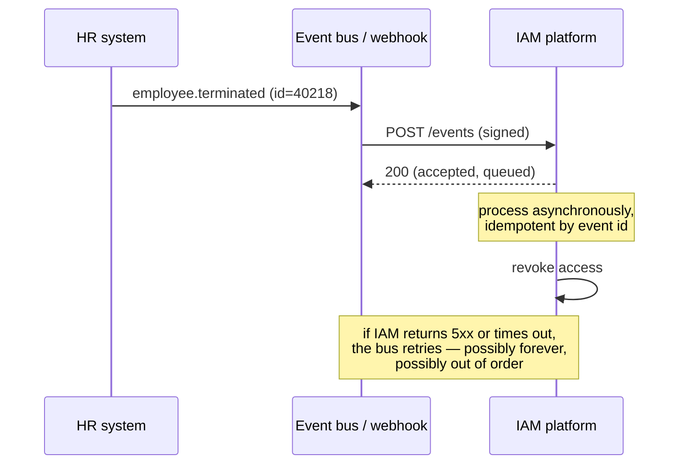

# HTTP, APIs & Webhooks

## Why this matters

Every modern identity flow is HTTP. SAML rides on redirects and form posts, OIDC on redirects and JSON, SCIM on REST, Graph and every vendor API on REST. **If you cannot read a browser network trace, you cannot debug identity** — and an architect who can't debug their own design loses credibility fast.

---

## The HTTP mechanics that matter for identity

### Redirects

| Status | Behaviour | Identity relevance |
|:--|:--|:--|
| **302 / 303** | Temporary; method usually becomes GET | The workhorse of SAML and OIDC redirect flows |
| **307 / 308** | Preserves method **and body** | Occasionally required; a 302 where a 307 was needed silently drops POST data |

Practical limits: browsers cap redirect chains (typically ~20) and URLs (~2,000 characters is the safe planning number, IE-era limit; modern browsers allow more but proxies and servers often don't). **A large SAML request in an HTTP-Redirect binding can exceed URL limits**, which is precisely why the HTTP-POST binding exists.

### Cookies

Identity depends on cookies more than most people realise, and the attributes are security controls:

| Attribute | Effect | Get it wrong and… |
|:--|:--|:--|
| `Secure` | HTTPS only | Session cookie leaks over plaintext |
| `HttpOnly` | Not readable by JavaScript | XSS steals the session |
| `SameSite=Lax` | Not sent on cross-site POST; sent on top-level GET navigation | **Breaks SAML HTTP-POST responses** to your SP, and back-channel/front-channel logout |
| `SameSite=None` | Sent cross-site — **requires `Secure`** | The setting federation often needs; also the one that enables CSRF if unprotected |
| `SameSite=Strict` | Never sent cross-site | Users arrive at your app already "logged out" after any external redirect |
| `Domain` | Scope | Setting a cookie on a parent domain shares it with every sibling subdomain — a common over-share |
| `Path` | Scope | Weak isolation; don't rely on it for security |

{: .warning }
> **`SameSite` is the single most common cause of "SSO worked last year and broke by itself."** Browsers changed their defaults to `Lax`, and any flow relying on a cross-site POST carrying a cookie stopped working. If a federation flow breaks after a browser update and nothing changed on your side, check cookie attributes first.

### Caching

`Cache-Control: no-store` on any response containing tokens, codes or personal data. A token cached by a shared proxy or rendered into a back-button-restorable page is a real leak. Authorisation codes in URLs end up in browser history, server logs and `Referer` headers — which is why they're single-use, short-lived, and why PKCE exists.

### Headers behind a proxy

`X-Forwarded-For`, `X-Forwarded-Proto`, `X-Forwarded-Host` — and the standardised `Forwarded` header. Identity services must trust these **only from known proxies**, because a client that can spoof `X-Forwarded-For` can defeat IP-based policy, and one that can spoof `X-Forwarded-Host` can sometimes poison generated redirect URLs.

---

## REST API design as it appears in IAM

You will read far more APIs than you write, but the patterns repeat:

| Concern | What to look for |
|:--|:--|
| **Authentication** | Bearer token (OAuth), API key, mTLS, HMAC-signed request. Bearer tokens are the norm; scope granularity varies wildly |
| **Pagination** | Offset/limit (breaks when data changes mid-read) vs **cursor-based** (correct). A connector that pages by offset while users are being created will skip records |
| **Filtering** | SCIM has its own filter grammar; Graph uses OData `$filter`; most vendors invent one |
| **Rate limits** | Read the headers (`X-RateLimit-Remaining`, `Retry-After`). Design **exponential backoff with jitter** — synchronised retries make outages worse |
| **Errors** | Does a 200 always mean success? Some APIs return 200 with an error body. Does 404 on delete mean "already gone" (fine) or "wrong object" (not fine)? |
| **Bulk operations** | SCIM `/Bulk`, Graph `$batch`. Partial success semantics are where bugs hide |
| **Idempotency** | Idempotency keys, or `PUT` semantics. Without them, a timeout-and-retry creates duplicates |
| **Versioning** | URL path, header, or none. "None" means your connector breaks without notice |

### Async operations

Many identity operations are asynchronous: you `POST` a request, get `202 Accepted` and a status URL, and poll. Your provisioning design must handle "accepted but not yet done" as a real state — because reporting "provisioned" when the target has only *accepted* the request is how users end up on day one without access while the dashboard is green.

---

## Webhooks and event-driven identity

Polling is simple and wasteful; events are efficient and harder to get right.



What you must specify for any webhook integration:

- **Authentication of the sender.** HMAC signature over the raw body with a shared secret, or mTLS. An unauthenticated webhook endpoint that triggers deprovisioning is a denial-of-service primitive; one that triggers *provisioning* is worse.
- **Replay protection.** Timestamp in the signed payload, with a tolerance window; reject old events.
- **Idempotency.** Every event has an ID; processing the same ID twice must be a no-op. Delivery is *at-least-once*, essentially always.
- **Ordering.** Events arrive out of order. "Terminated" then "rehired" processed in reverse leaves an active leaver. Either sequence-number your events or make handlers state-based rather than delta-based.
- **Failure handling.** What happens after the sender's retries are exhausted? You need a **reconciliation sweep** as a backstop — which is the same reconciliation from [data modelling](08-data-modeling.md), earning its keep again.
- **Delivery guarantees you *don't* have.** Most SaaS webhooks give no durability guarantee. If your provisioning is offline for two hours, some vendors will have dropped events permanently.

{: .architect }
> **Never make an event feed the only path.** Events give you speed; scheduled reconciliation gives you correctness. Every mature identity integration has both: events for the 30-second leaver revocation, and a nightly sweep that catches whatever the events lost. Designing only the fast path is how you get a leaver who kept access because a webhook 500'd at 2am.

### Standardised identity events

Two worth knowing, because they're becoming the answer to "how do I revoke a session in another system?":

- **SSE / SET** ([RFC 8417](https://datatracker.ietf.org/doc/html/rfc8417)) — Security Event Tokens: signed JWTs describing a security event, with a standard delivery framework.
- **CAEP** (Continuous Access Evaluation Profile) and the **Shared Signals Framework** — standardised events like "session revoked", "credential changed", "device compliance changed", pushed between providers in near-real-time. See [Zero Trust & continuous access](../08-frontier/01-zero-trust.md).

---

## Reading a federation trace

The skill worth practising until it's automatic. Open dev tools, tick **Preserve log**, and log in.

What you're looking for, in order:

1. The **initial request** to the app, and the redirect to the IdP. Check the request parameters: for SAML, decode the `SAMLRequest` (base64, then inflate); for OIDC, read `client_id`, `redirect_uri`, `scope`, `state`, `code_challenge`.
2. Whether the IdP had a **session cookie** already (silent SSO) or presented a login page.
3. The **response back to the app**: a `SAMLResponse` form POST, or a `code` in the query string.
4. The **back-channel** token exchange (not visible in the browser — check server logs).
5. The **application's own session cookie** being set.

Two commands you'll use constantly:

```bash
# Decode a JWT payload (no validation — inspection only)
echo "$JWT" | cut -d. -f2 | tr '_-' '/+' | base64 -d 2>/dev/null | jq .

# Decode a SAML redirect-binding request (base64 + raw deflate)
python3 -c "import base64,zlib,sys,urllib.parse; \
  print(zlib.decompress(base64.b64decode(urllib.parse.unquote(sys.argv[1])),-15).decode())" "$SAMLREQUEST"
```

{: .warning }
> Decoding a token to read it is *inspection*, not *validation*. Never let production code make a decision based on an unverified token payload. It's astonishing how often "we just decode it to get the user ID" appears in real codebases — and it means anyone can mint a token claiming to be anyone.

---

## Architect's checklist

- [ ] Do all identity cookies have correct `Secure`, `HttpOnly` and **deliberate** `SameSite` values?
- [ ] Are token-bearing responses marked `no-store`?
- [ ] Does every connector use **cursor-based pagination**, and has it been tested against a dataset larger than one page?
- [ ] Is there **backoff with jitter** on every outbound integration, and do you know each target's rate limits?
- [ ] Are provisioning operations **idempotent**, with idempotency keys where the API supports them?
- [ ] For every webhook: is the sender **authenticated**, are events **replay-protected**, **deduplicated** and **order-tolerant**?
- [ ] Is there a **reconciliation backstop** behind every event-driven flow?
- [ ] Does anything in production make a trust decision on an **unvalidated** token?
- [ ] Can your team read a federation trace without vendor support?

---

**Next:** [Stage 2 — Identity Fundamentals](../02-identity-fundamentals/) →
