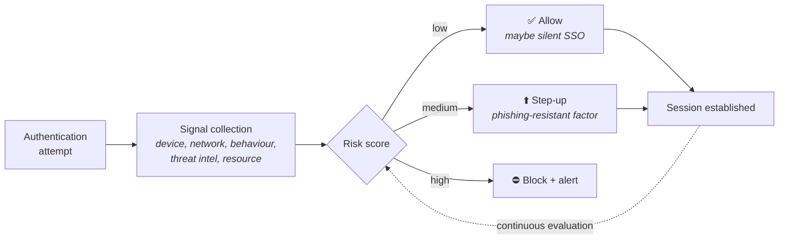

# Authentication Concepts

## What authentication actually claims

Authentication does **not** prove who someone is. It proves that whoever is present **controls a credential** that was previously bound to an identity record.

That gap — between "controls the credential" and "is the person" — is where every credential attack lives. Phishing, credential stuffing, SIM swap, session theft, malware-stolen cookies: all of them exploit the fact that the system can only see the credential, never the human.

{: .concept }
> **Authentication = binding + presentation.** At enrolment, a credential is bound to an identity (this is [identity proofing](20-identity-proofing.md)). At login, the credential is presented and verified. **The strength of your authentication is the weaker of the two, and organisations almost always over-invest in the second and under-invest in the first.** A phishing-resistant passkey issued after a helpdesk agent verified someone's identity by asking for their date of birth is a strong lock on a door with a weak frame.

---

## The factors, and what they're actually worth

| Factor | Examples | Real strength | Fails to |
|:--|:--|:--|:--|
| **Something you know** | Password, PIN, security question | Weak alone | Phishing, reuse, guessing, database breach |
| **Something you have** | Phone, hardware key, smart card, certificate | Medium–strong | Theft, SIM swap, malware on the device |
| **Something you are** | Fingerprint, face, voice | Medium; **usually a local unlock, not a factor sent to the server** | Spoofing, coercion, and it can't be revoked |
| **Somewhere you are** | IP, geolocation, network | A *signal*, not a factor | Trivially spoofed with a VPN |
| **Something you do** | Typing rhythm, behaviour | A risk signal | Not deterministic enough to gate on alone |

{: .warning }
> **Biometrics are usually not what people think.** When you use Face ID to log into a banking app, your face is not sent anywhere. It unlocks a private key held on the device; the *key* authenticates. That's a good design — but it means the security property is "possession of this device, unlocked by its owner", not "this person's face". Say it precisely, because the design consequences differ: you can revoke a key, you cannot revoke a face.

**Multi-factor means factors from different categories.** A password plus a security question is one factor twice. So, arguably, is a password plus an SMS code delivered to a phone that also receives password-reset emails.

---

## Assurance levels

The standard vocabulary comes from **NIST SP 800-63-3**, which usefully splits assurance into three independent dimensions. Architects should use these because they force the right conversation.

| Dimension | What it measures | Levels |
|:--|:--|:--|
| **IAL** — Identity Assurance Level | How well the identity was proofed at enrolment | IAL1 self-asserted · IAL2 remote or in-person evidence · IAL3 in-person with strong evidence |
| **AAL** — Authenticator Assurance Level | How strong the login is | AAL1 single factor · AAL2 MFA · AAL3 hardware-based, **phishing-resistant**, verifier-impersonation-resistant |
| **FAL** — Federation Assurance Level | How strongly the assertion is protected in federation | FAL1 signed · FAL2 encrypted to the RP · FAL3 holder-of-key |

The three are independent, and that independence is the point:

- **High AAL, low IAL** — a passkey on an account created with an unverified email address. Very hard to phish; you have no idea whose account it is. Fine for a forum, wrong for a bank.
- **High IAL, low AAL** — a passport-verified customer who logs in with a password. You know who they are; anyone who phishes them becomes them.

{: .architect }
> Ask "what assurance do we need?" as **three** questions, and expect different answers per user population and per transaction. A retail customer browsing needs IAL1/AAL1; the same customer changing bank details needs a step-up. An administrator needs AAL3 always. Designing one level for everyone either over-protects and drives people away, or under-protects and gets you breached.

The EU's **eIDAS** assurance levels (Low / Substantial / High) are the parallel European vocabulary and appear in regulated contexts.

---

## Passwords: the thing you still have to design for

Passwords aren't going away, so know the current guidance — which reversed most of the 2000s rules:

**Do:**
- Enforce a **minimum length** (8 absolute floor, 12–15 realistic) and allow very long ones (at least 64 characters), including spaces and Unicode.
- **Screen against breached-password lists** on set and on change. This is the single highest-value password control.
- Hash with **Argon2id/scrypt/bcrypt** and a per-user salt ([crypto](../01-it-fundamentals/04-cryptography.md)).
- Rate-limit and use progressive delays; lock accounts thoughtfully (aggressive lockout is a denial-of-service vector).

**Don't:**
- **Force periodic rotation without cause.** NIST explicitly advises against it; it produces `Summer2026!` → `Summer2026!!` and worse. Rotate on evidence of compromise.
- **Impose composition rules** ("one uppercase, one symbol"). They reduce entropy in practice by pushing everyone to the same patterns.
- Truncate, block paste, or restrict character sets. All three actively harm security by breaking password managers.
- Use **security questions** as a reset mechanism. The answers are public information or forgotten.

{: .warning }
> **Account recovery is the real attack surface.** Attackers rarely break your authentication — they use your reset flow. If a phishing-resistant passkey can be bypassed by a helpdesk agent who resets it after a phone call, your effective assurance is "helpdesk agent". Design recovery to the *same* assurance as the primary credential: a second registered authenticator, in-person or video verification for high-value accounts, and a documented, rate-limited, audited helpdesk process. This is one of the most consistently under-designed parts of enterprise IAM.

---

## Where authentication happens

| Model | Description | Consequence |
|:--|:--|:--|
| **Local** | Each app has its own credential store | Password sprawl, no central revocation, no consistent MFA. The problem SSO solves |
| **Centralised (direct)** | Apps query a shared directory (LDAP bind) | One credential, but **each app sees the password** — a huge trust surface |
| **Delegated / federated** | Apps redirect to an IdP; the app never sees the credential | The correct model. See [SAML](03-saml.md), [OIDC](05-oidc.md) |
| **Agent / proxy-based** | A reverse proxy authenticates before traffic reaches the app | Useful for legacy apps that can't federate |
| **Token-based service auth** | Machine identities present tokens or certs | See [workload identity](../03-identity-domains/05-workload-identity.md) |

The move from "each app checks the password" to "each app trusts an assertion" is *the* structural improvement in modern identity. It concentrates credential handling in one hardened place, makes MFA a single decision, and makes revocation possible.

It also concentrates risk: **the IdP becomes the single point of compromise for everything.** That's a trade worth making, but it must be made consciously — the IdP now needs [tier-0 protection](../04-architecture-practice/06-securing-iam.md).

---

## Risk-based and adaptive authentication

Rather than one fixed policy, evaluate signals at authentication time and choose a response.

**Signals:** device recognition and compliance state, network/IP reputation, impossible travel, time of day versus baseline, behavioural biometrics, threat intelligence on the credential, session anomalies, the sensitivity of the resource requested.

**Responses:** allow · step-up (require another factor) · limit (read-only, no downloads) · challenge (CAPTCHA, verification) · block · alert.

{: .architect }
> **Two failure modes, opposite in character.** Tune too tight and you create constant friction; users normalise approving prompts, which is exactly the behaviour that makes MFA-fatigue attacks work. Tune too loose and the control is decorative. The way out is **risk-proportionate**: near-zero friction for low-risk access from known devices, real friction only when signals or the resource justify it. And measure it — step-up rate, false-positive rate and helpdesk call volume are architecture metrics, not just operations metrics.

---

## Authentication anti-patterns

| Anti-pattern | Why it's wrong |
|:--|:--|
| Shared accounts | Destroys attribution; you can never answer "who did this?" |
| Passwords in configuration files | Ungoverned, unrotated, in version control. See [NHI](../03-identity-domains/04-non-human-identities.md) |
| MFA only at the perimeter (VPN) | Everything inside is single-factor. The 2010s architecture that Zero Trust exists to replace |
| MFA exemptions that never expire | The exception list becomes the attack surface. Time-box every exemption |
| SMS as the only second factor | SIM swap, SS7 interception, and it's not phishing-resistant. Better than nothing, worse than everything else |
| Push notifications without number matching | MFA fatigue: spam prompts until someone taps approve |
| Trusting `X-Forwarded-For` from anywhere | IP-based policy defeated by a header |
| Different auth strength for the same data via different channels | Attackers use the weakest door — usually the legacy API or the mobile app |

---

## Architect's checklist

- [ ] For each population and transaction type, what **IAL / AAL / FAL** is required — and is that written down anywhere?
- [ ] Is **account recovery** as strong as the primary credential, for every population?
- [ ] Are passwords **screened against breach lists**, and has forced rotation been removed?
- [ ] Which applications still perform **their own credential verification** rather than federating, and what's the plan?
- [ ] Where is MFA **not** enforced — legacy protocols, service accounts, break-glass, exemptions — and is each one time-boxed and monitored?
- [ ] Is any MFA in use **not phishing-resistant** for high-privilege roles?
- [ ] What signals feed adaptive policy, and what happens when a signal source is unavailable — fail open or fail closed?
- [ ] Can you state the **blast radius of an IdP compromise**, and what compensating controls exist?

---

**Next:** [Kerberos & Legacy SSO](02-kerberos-and-legacy.md) →
