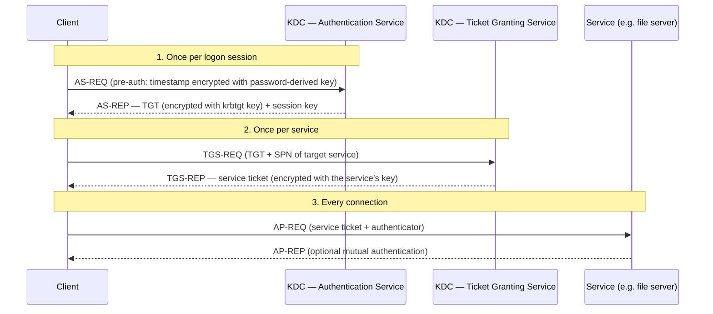

# Kerberos & Legacy SSO

## Why a 1980s protocol still matters

Kerberos authenticates most enterprise employees to most enterprise resources, every morning, invisibly. It is the reason a domain-joined Windows user opens a file share and is simply *in*, with no prompt.

It also matters because it was the **first widely deployed SSO system**, and it solved a problem the web later re-solved with SAML and OIDC. Understanding Kerberos makes modern federation feel like a variation on a theme rather than a novelty.

{: .concept }
> **The problem Kerberos solved:** how do you authenticate to hundreds of services on an untrusted network without sending your password to any of them, and without every service needing to know every user's password? The answer — a trusted third party that issues short-lived, cryptographically-sealed tickets — is *exactly* the structure of modern federation. The KDC is an IdP. A service ticket is an assertion. The differences are transport (raw sockets vs browser redirects) and trust scope (one realm vs the internet).

---

## How it works

Three parties: the **client**, the **service**, and the **KDC** (Key Distribution Center, split into an Authentication Service and a Ticket Granting Service). In Active Directory, every domain controller is a KDC.

The elegant part: **the service can validate the ticket entirely on its own**, because the ticket is encrypted with the service account's key, which the service already has. No call back to the KDC. That's what makes Kerberos fast and why it scales — and it's also why revocation is essentially impossible until the ticket expires.

### Key objects

| Object | What it is |
|:--|:--|
| **TGT** (Ticket Granting Ticket) | Proof you authenticated. Encrypted with the `krbtgt` account's key. Default lifetime 10 hours, renewable to 7 days |
| **Service ticket** | Proof you may talk to one specific service. Encrypted with that service's key |
| **SPN** (Service Principal Name) | The service's name: `HTTP/app.corp.example.com`, `MSSQLSvc/db1:1433`. **A duplicate SPN breaks authentication** for that service, and it's a common misconfiguration |
| **Session key** | Symmetric key shared between client and service for this session |
| **Authenticator** | A timestamp encrypted with the session key, proving freshness (this is why clock skew breaks Kerberos) |
| **PAC** (Privilege Attribute Certificate) | Microsoft's extension carrying the user's SIDs and group memberships inside the ticket |

### The PAC and its consequences

The PAC is why Kerberos in AD is also an **authorisation** mechanism: your group memberships travel inside the ticket. Two consequences architects must know:

1. **Group changes don't take effect until the ticket is refreshed.** Add a user to a group, and their current session still lacks it. Log off and on, or wait for expiry. Your provisioning SLA and the user's experienced SLA differ.
2. **Too many groups breaks authentication.** The PAC has a size limit (`MaxTokenSize`); users in hundreds of groups get tickets too large for the buffer, producing errors that look like anything except "too many groups". This is a real constraint on role model design — see [role modelling](16-role-modelling.md).

---

## Delegation

Kerberos can let a service act on the user's behalf toward a *third* service — the classic web-app-to-database chain. Three generations, in increasing safety:

| Type | Behaviour | Risk |
|:--|:--|:--|
| **Unconstrained delegation** | The service receives the user's TGT and can impersonate them **anywhere** | Catastrophic. A compromised server holding TGTs owns every user who touched it, including administrators. **Eliminate it** |
| **Constrained delegation (S4U2Proxy)** | Service may impersonate users only to a defined list of SPNs | Much better; configured on the front-end service |
| **Resource-based constrained delegation (RBCD)** | The **target** service decides who may delegate to it | Best model — control sits with the resource owner. Also abusable if an attacker can write `msDS-AllowedToActOnBehalfOfOtherIdentity` on a computer object |

Finding and removing unconstrained delegation is standard AD hardening work, and it belongs on an architect's list because it's a design property, not a setting.

---

## Attacks worth designing against

| Attack | Mechanism | Design response |
|:--|:--|:--|
| **Kerberoasting** | Any authenticated user can request a service ticket for any SPN; the ticket is encrypted with the service account's password key and can be cracked offline | **gMSAs** (auto-rotated 240-bit passwords) instead of user service accounts; long random passwords; alert on bulk TGS requests |
| **AS-REP roasting** | Accounts with "do not require pre-authentication" hand out crackable material to anyone who asks | Never set the flag; alert if it appears |
| **Golden Ticket** | Stolen `krbtgt` key lets an attacker forge any TGT, for any user, for years | Protect DCs as tier 0; on compromise, rotate `krbtgt` **twice** with replication between |
| **Silver Ticket** | Stolen service account key forges service tickets for that one service — no KDC involvement, so no KDC logs | gMSAs; monitor at the service |
| **Pass-the-ticket** | Extracted tickets replayed from another machine | Tiered admin model; Credential Guard; short lifetimes |
| **Delegation abuse** | Unconstrained/RBCD misconfiguration → impersonation | Eliminate unconstrained; govern write access to computer objects |

{: .architect }
> The pattern across all of these: **Kerberos's offline-verifiable design means the KDC often can't see the abuse.** Silver tickets generate no KDC event at all. So detection must sit at the service and in the directory (unusual SPN requests, encryption downgrade to RC4, ticket lifetime anomalies, changes to delegation attributes). Design your logging with that in mind — see [ITDR](../08-frontier/02-itdr.md).

Also: insist on **AES encryption types** and disable RC4 where you can. RC4-encrypted tickets are dramatically easier to crack, and attackers deliberately request downgrades.

---

## Kerberos on the web: SPNEGO

Kerberos meets HTTP through **SPNEGO/Negotiate**: the browser gets a `WWW-Authenticate: Negotiate` challenge and responds with a Kerberos token, giving seamless SSO to intranet applications. It works only when the client is domain-joined, on the corporate network (or VPN), with the site in the right browser zone, and DNS resolving the SPN correctly.

Practically, this is the **Integrated Windows Authentication** experience — and it's why many organisations put a federation product (PingFederate, AD FS, Entra with Seamless SSO) in front: the IdP performs Kerberos authentication on the intranet and issues a SAML/OIDC assertion outward, so the same user gets silent SSO to cloud applications. That bridge is one of the most common enterprise identity patterns you'll design.

---

## NTLM: the one to remove

NTLM predates Kerberos in Windows and survives in the gaps — IP-address connections, non-domain-joined systems, hardcoded legacy apps.

Why it must go: it's a **challenge-response over a password hash**, so the hash *is* the credential — hence **pass-the-hash**. It offers no mutual authentication (enabling relay attacks), no delegation model, and weak cryptography. NTLM relay remains one of the most reliable techniques in internal penetration tests.

Removing NTLM is an audit-and-migrate project: enable NTLM auditing, find what's still using it, fix or replace those systems, then restrict via policy. It's slow, unglamorous, and one of the highest-value hardening projects in a Windows estate.

## Other legacy SSO you'll meet

| Technology | Notes |
|:--|:--|
| **WS-Federation / WS-Trust** | SOAP-era federation. AD FS speaks it; some old .NET apps require it. Treat as legacy — migrate to SAML or OIDC |
| **RADIUS** | Network access (VPN, Wi-Fi, network devices). Still ubiquitous; often where MFA is injected for network access |
| **TACACS+** | Network device administration, with command-level authorisation |
| **Header-based SSO** | A reverse proxy authenticates and injects `REMOTE_USER`-style headers. **Only as secure as the network path** — if anything can reach the app directly, it can spoof the header. Common with legacy apps; must be paired with strict network isolation |
| **Agent-based SSO** | An agent in the web server enforces authentication (classic SiteMinder/Access Manager model). Being replaced by standards-based federation |

---

## Architect's checklist

- [ ] Is **unconstrained delegation** present anywhere, and is there a plan to remove it?
- [ ] Are service accounts with SPNs being migrated to **gMSAs**?
- [ ] Is **RC4** still permitted for Kerberos, and is AES enforced?
- [ ] Is **NTLM usage audited**, with a target list for elimination?
- [ ] Is **time synchronisation** healthy across all KDCs and clients?
- [ ] Do any users approach **PAC/token size limits** due to group count?
- [ ] Where is **SPNEGO/IWA** relied upon, and what happens for users off the corporate network?
- [ ] Are there **header-based SSO** integrations, and can the app be reached bypassing the proxy?
- [ ] Is `krbtgt` rotation part of the **incident response runbook**, documented as a double rotation?

---

**Next:** [SAML](03-saml.md) →
