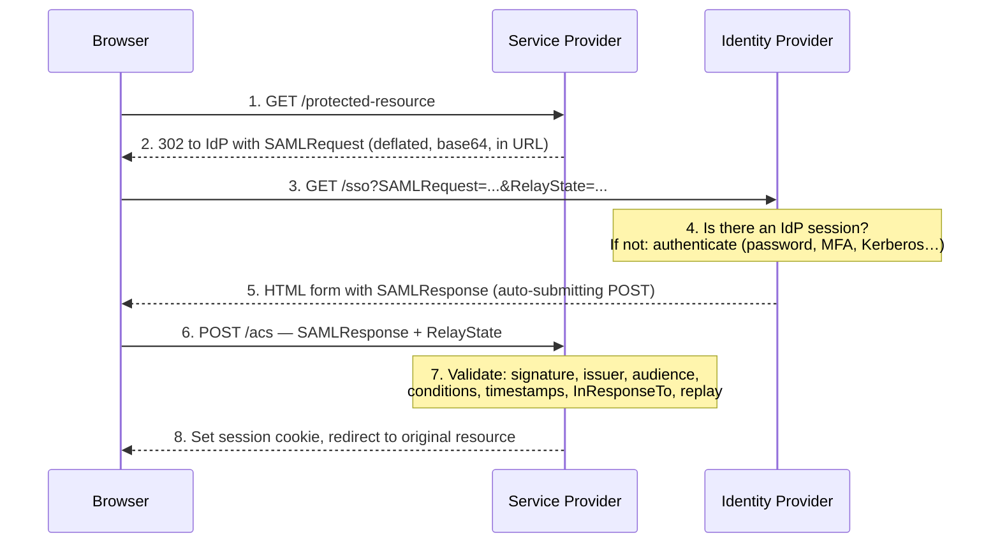

# SAML 2.0

## The problem SAML solved

Kerberos works beautifully **inside** one realm on a trusted network. It does not work between two organisations across the internet, through browsers, with no shared network.

By the early 2000s, businesses needed exactly that: let a supplier's employees use our procurement portal, without creating accounts for them, without them getting our passwords, without a VPN.

{: .concept }
> **SAML's core idea: the identity provider makes a signed statement about a user, and the service provider trusts that statement because it trusts the signature.** No shared network, no shared password store, no back-channel required. Trust is established *out of band* — by exchanging metadata containing public keys — and then travels *through the user's browser* on every login.

SAML 2.0 was standardised by OASIS in 2005 and is still the backbone of enterprise SSO. It is verbose, XML-based, and being displaced by OIDC for new work — but there are tens of thousands of applications that speak only SAML, and you will support it for the rest of your career.

---

## The vocabulary

| Term | Meaning |
|:--|:--|
| **IdP** — Identity Provider | Authenticates the user and issues assertions (Entra ID, PingFederate, Okta, Keycloak, AD FS) |
| **SP** — Service Provider | The application relying on the assertion. Also called the Relying Party |
| **Assertion** | The signed XML statement about the user |
| **Subject / NameID** | Who the assertion is about, and in what format |
| **Attribute statement** | Additional claims: email, groups, department |
| **Authentication statement** | How and when they authenticated (`AuthnContext`) |
| **Conditions** | Validity window (`NotBefore` / `NotOnOrAfter`) and intended audience |
| **Binding** | How the message travels: HTTP-Redirect, HTTP-POST, Artifact, SOAP |
| **Profile** | The combination for a use case — Web Browser SSO is the one that matters |
| **Metadata** | XML describing endpoints, certificates and supported bindings. **The trust-establishment artefact** |
| **EntityID** | The unique identifier of an IdP or SP. Must match exactly, everywhere |

---

## The flow you must be able to draw

### SP-initiated SSO (the common case)



Two details worth internalising:

- **`RelayState`** carries the "where was the user going" context through the whole round trip. Losing it is why users land on the app's home page instead of the page they clicked. It must be opaque and validated — an unvalidated `RelayState` used as a redirect target is an open redirect.
- **`InResponseTo`** ties the response to the request the SP issued. Validating it prevents an attacker replaying a response the SP never asked for.

### IdP-initiated SSO

The user starts at the IdP (a portal tile) and is posted straight to the SP's ACS endpoint with an unsolicited assertion.

{: .warning }
> **IdP-initiated SSO is structurally weaker and should be avoided in new designs.** There's no `InResponseTo` to validate, no `RelayState` the SP generated, and therefore weaker replay and CSRF protection — an attacker who obtains a valid assertion can post it to the SP from anywhere. It also can't carry deep links properly. Support it when a vendor requires it, mark it as an accepted risk, and prefer SP-initiated everywhere else.

---

## What an assertion contains

```xml
<saml:Assertion ID="_a1b2c3" IssueInstant="2026-08-01T09:15:22Z">
  <saml:Issuer>https://idp.example.com/entity</saml:Issuer>
  <ds:Signature>…</ds:Signature>

  <saml:Subject>
    <saml:NameID Format="urn:oasis:names:tc:SAML:2.0:nameid-format:persistent">
      a7f3c9e1-4b2d-…
    </saml:NameID>
    <saml:SubjectConfirmation Method="urn:oasis:names:tc:SAML:2.0:cm:bearer">
      <saml:SubjectConfirmationData
        NotOnOrAfter="2026-08-01T09:20:22Z"
        Recipient="https://app.example.com/acs"
        InResponseTo="_req_9f8e7d"/>
    </saml:SubjectConfirmation>
  </saml:Subject>

  <saml:Conditions NotBefore="2026-08-01T09:15:12Z" NotOnOrAfter="2026-08-01T09:20:22Z">
    <saml:AudienceRestriction>
      <saml:Audience>https://app.example.com/entity</saml:Audience>
    </saml:AudienceRestriction>
  </saml:Conditions>

  <saml:AuthnStatement AuthnInstant="2026-08-01T09:15:20Z" SessionIndex="_sess_123">
    <saml:AuthnContext>
      <saml:AuthnContextClassRef>
        urn:oasis:names:tc:SAML:2.0:ac:classes:MobileTwoFactorContract
      </saml:AuthnContextClassRef>
    </saml:AuthnContext>
  </saml:AuthnStatement>

  <saml:AttributeStatement>
    <saml:Attribute Name="email"><saml:AttributeValue>maria@example.com</saml:AttributeValue></saml:Attribute>
    <saml:Attribute Name="groups">
      <saml:AttributeValue>finance-read</saml:AttributeValue>
      <saml:AttributeValue>expense-approver</saml:AttributeValue>
    </saml:Attribute>
  </saml:AttributeStatement>
</saml:Assertion>
```

### NameID formats — a decision, not a default

| Format | Value | Use when |
|:--|:--|:--|
| `emailAddress` | `maria@example.com` | Convenient, widely supported — but **emails change**, and then the SP account is orphaned |
| `persistent` | Opaque, stable, **pairwise per SP** | Best privacy and stability. The SP can't correlate the user with other SPs |
| `transient` | New value every session | Anonymous/pseudonymous access |
| `unspecified` | Whatever you agreed | Very common in practice, which is itself a warning |

{: .architect }
> **Choose a NameID that is stable and non-reassignable.** The classic incident: an SP keyed accounts on `emailAddress`; an employee married and changed their email; the SP created a brand-new account with none of their history, permissions or data. The worse version: an email address is *reused* for a different person, who inherits the previous holder's access. Use `persistent` with an opaque immutable identifier, and carry email as an *attribute* that can change.

### AuthnContext

`AuthnContextClassRef` tells the SP **how** the user authenticated, and `RequestedAuthnContext` lets the SP demand a minimum. This is how an SP requires MFA for its own login even if the IdP session was established with a password. If your SPs never request context, then "we enforce MFA" is a property of IdP configuration only — and any policy gap silently downgrades every application.

---

## Validation: what the SP must check

This list *is* the security of SAML. A gap in any line is exploitable:

1. **Signature verifies** against the expected key (from metadata, pinned — **never** trust a certificate embedded in the response itself).
2. **The signed element is the element you consume.** Defends against XML Signature Wrapping.
3. **Issuer** matches the expected IdP EntityID.
4. **Audience** matches this SP's EntityID.
5. **`Recipient`** matches this SP's ACS URL.
6. **`NotBefore` / `NotOnOrAfter`** are current, with minimal clock skew allowance.
7. **`InResponseTo`** matches an outstanding request (SP-initiated).
8. **Assertion ID not seen before** — replay cache for the validity window.
9. **Signature algorithm is acceptable** — reject SHA-1 and any `none`-like weakness.
10. **XML parsing is hardened** — DTDs and external entities disabled (XXE), entity expansion limited.

{: .warning }
> **XML Signature Wrapping (XSW)** is SAML's signature attack: the attacker keeps the legitimately signed assertion but adds a forged one, arranging the document so the library validates one element and the application reads another. It has broken real, widely-used implementations repeatedly. The mitigations are architectural: use a mature, maintained library; never hand-roll XML signature validation; and ensure the code that extracts claims reads from the *verified* element reference, not by re-searching the document.

---

## Metadata and trust establishment

Metadata is how two parties bootstrap trust — EntityID, endpoints, certificates, NameID formats, whether signing/encryption is required.

| Practice | Why |
|:--|:--|
| **Exchange metadata by URL, refreshed automatically** | Certificate rotation happens without a change window |
| **Sign your metadata** | Prevents tampering in transit |
| **Support multiple signing certificates simultaneously** | The only way to rotate without an outage — see [PKI](../01-it-fundamentals/05-pki-and-tls.md) |
| **Keep a register of SPs that can't auto-refresh** | These are the ones that break on rotation; you need the list before you rotate, not during |
| **Never accept metadata over plain HTTP** | Trivial trust injection |

---

## Single Logout (SLO)

SAML defines logout, and it works poorly in practice. The IdP must notify every SP the user has a session with, via front-channel (browser redirects/iframes through each SP in turn) or back-channel (SOAP calls). Front-channel breaks on third-party cookie restrictions and on any SP that's slow or down; back-channel requires connectivity to every SP, which usually doesn't exist.

The realistic position: **treat SLO as best-effort, and make short session lifetimes plus token revocation your actual control.** Say this explicitly in designs, because "log out everywhere" is frequently assumed by security stakeholders. See [Sessions & Logout](10-sessions-and-logout.md).

---

## SAML vs OIDC

| | SAML 2.0 | OIDC |
|:--|:--|:--|
| Format | XML | JSON / JWT |
| Transport | Browser redirect/POST | Browser redirect + REST back-channel |
| Best for | Enterprise web apps, legacy | Web, mobile, SPA, APIs |
| Native mobile support | Poor (embedded browser hacks) | Good (AppAuth pattern) |
| API authorisation | Not designed for it | Its native strength (OAuth underneath) |
| Complexity of correct implementation | High (XML signatures) | Moderate (JOSE) |
| Ecosystem in enterprise SaaS | Enormous | Growing fast, now dominant for new apps |

**Don't migrate working SAML integrations for their own sake.** Migrate when you need mobile support, API authorisation or fine-grained scopes — or when an application forces it. New integrations should default to OIDC.

{: .vendor }
> **In the products.** SAML support is universal and the differences are operational. **PingFederate** is often the enterprise choice precisely because of its depth of SAML handling — adapter chaining, per-connection attribute mapping and policy contracts make awkward SP requirements manageable. **Entra ID** covers the mainstream well; unusual `NameID` or attribute transformations sometimes need claims-transformation policies. **Okta** optimises for fast SaaS onboarding through its integration catalogue. **Keycloak** implements SAML fully and is excellent for learning because you can see and change every setting. **SailPoint and One Identity Manager are not SAML IdPs** — they're governance platforms that *consume* SSO for their own consoles and govern the access that SAML then carries.

---

## Architect's checklist

- [ ] Is every SP integration **SP-initiated**, with IdP-initiated only where a vendor forces it and the risk is accepted?
- [ ] What **NameID format** is used, and is it stable across email changes and name changes?
- [ ] Is metadata exchanged **by URL with automatic refresh**? Which SPs can't, and are they on a register?
- [ ] Is there a **multi-certificate rotation plan**, rehearsed?
- [ ] Do SPs validate **audience, recipient, conditions, `InResponseTo`** and replay?
- [ ] Are assertions **encrypted** where they carry sensitive attributes through the browser?
- [ ] Do SPs request an **AuthnContext**, or do they silently accept whatever the IdP did?
- [ ] Are SAML libraries **current**, and is XML parsing hardened against XXE?
- [ ] What is the actual, tested behaviour of **logout** — and does the security policy match reality?
- [ ] Is there an **inventory of every SAML integration** with owner, certificate expiry and attribute contract?

---

**Next:** [OAuth 2.x](04-oauth2.md) →
