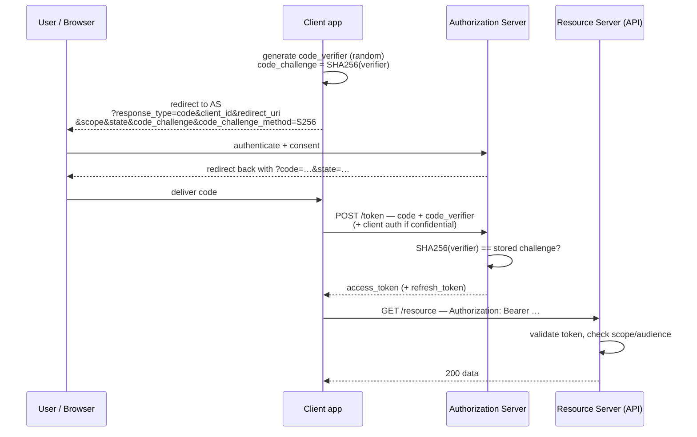

# OAuth 2.x

## The problem OAuth solved

Around 2007, a photo-printing site wanted access to your photos on a photo-hosting site. The only mechanism available was: **give the printing site your username and password.** That pattern — the "password anti-pattern" — meant every third-party service held your credentials, could do anything you could do, forever, and revocation meant changing your password everywhere.

{: .concept }
> **OAuth is a delegated authorisation protocol.** It lets a user grant an application *limited, revocable, scoped* access to a resource they own, on a server they don't control, **without sharing their credentials with that application**. It is not an authentication protocol. It never was. Saying "log in with OAuth" is technically wrong and the source of a decade of security bugs — [OIDC](05-oidc.md) is the authentication layer built on top.

---

## The four roles

| Role | Who | Example |
|:--|:--|:--|
| **Resource Owner** | The user who owns the data | You |
| **Client** | The application wanting access | The printing site, a mobile app, a backend service |
| **Authorization Server (AS)** | Authenticates the owner, gets consent, issues tokens | Entra ID, Ping, Okta, Keycloak, your own AS |
| **Resource Server (RS)** | The API holding the data, validating tokens | The photo API, your microservice |

The separation of **AS** and **RS** is the architectural heart: one component does identity and consent, another does data — and they communicate only through tokens.

---

## Client types, and why it matters

| Type | Can keep a secret? | Examples |
|:--|:--|:--|
| **Confidential** | Yes | Server-side web apps, backend services |
| **Public** | **No** | SPAs, mobile apps, desktop apps, CLI tools |

A public client cannot hold a client secret — anything shipped to a user's device is readable. This single fact drives most of the modern flow guidance: public clients **must** use PKCE and must never use flows that assume secrecy.

---

## The flows

### Authorization Code + PKCE — the default for everything user-facing



**Why the two-step (code then token) exists:** the code travels through the browser, where it can leak into history, logs and `Referer` headers. It's single-use and short-lived (typically 30–60 seconds), and the *token* is fetched over a direct back-channel call the browser never sees.

**Why PKCE ([RFC 7636](https://datatracker.ietf.org/doc/html/rfc7636)) exists:** on mobile, a malicious app could register the same custom URL scheme and intercept the code. PKCE binds the code to the client instance that started the flow — an intercepted code is useless without the `code_verifier`. Originally for public clients, **PKCE is now recommended for all clients**, including confidential ones, and OAuth 2.1 makes it mandatory.

**Why `state` exists:** CSRF protection. The client generates it, and verifies it comes back unchanged. Without it, an attacker can inject their own authorisation code into your session — linking your account to their identity at the provider.

### Client Credentials — machine to machine

No user involved. The client authenticates as itself and gets a token representing *itself*.

```
POST /token
grant_type=client_credentials&scope=invoices.read
Authorization: Basic <client_id:client_secret>   # or private_key_jwt, or mTLS
```

This is the workhorse of service-to-service authorisation. The architectural question is **how the client authenticates**:

| Method | Assurance | Notes |
|:--|:--|:--|
| Client secret | Low | A password by another name. Rotation is a real operational burden |
| **`private_key_jwt`** | High | Client signs a JWT assertion with its private key; nothing shared and reusable is transmitted |
| **mTLS** | High | Certificate-bound; supports certificate-bound access tokens (sender-constrained) |
| **Workload identity federation** | Highest | No stored credential at all — the platform attests the workload. See [workload identity](../03-identity-domains/05-workload-identity.md) |

### Device Authorization Grant

For input-constrained devices (TVs, CLIs, IoT). The device shows a code and URL; the user authorises on their phone; the device polls until approved.

{: .warning }
> **Device code phishing is an active technique.** An attacker initiates a device flow against your tenant and sends the user a legitimate-looking "enter this code" message. The user authenticates for real, and the attacker's device receives the tokens. Mitigations: show the *application name and scopes* prominently in the approval screen, restrict which clients may use the device flow, keep codes short-lived, and monitor for device-flow grants that don't correlate to a known device.

### Deprecated flows — know them so you can remove them

| Flow | Why it's gone |
|:--|:--|
| **Implicit** (`response_type=token`) | Access tokens in the URL fragment: leak into history, logs, referrers; no refresh; no sender constraint. Replaced by code+PKCE, which browsers now support fine |
| **Resource Owner Password Credentials (ROPC)** | The app collects the user's password — reinstating the exact anti-pattern OAuth existed to remove. Also incompatible with MFA and federation. Only ever a migration crutch |

**OAuth 2.1** consolidates current practice: PKCE required, implicit and ROPC removed, exact redirect URI matching, refresh tokens either sender-constrained or one-time-use.

---

## Tokens

| Token | Purpose | Audience | Lifetime |
|:--|:--|:--|:--|
| **Access token** | Authorises API calls | The **resource server** | Short: minutes to an hour |
| **Refresh token** | Obtains new access tokens | The **authorization server** | Long: hours to months |
| **ID token** (OIDC) | Describes the authentication event | The **client** | Short; not for API calls |

{: .warning }
> **The three most common token mistakes.** (1) A client inspecting an **access token** for user information — it's opaque *to the client*, and its format may change without notice; use the ID token or `/userinfo`. (2) A resource server accepting an **ID token** as an API credential — wrong audience, wrong purpose. (3) Anyone treating a token's contents as trustworthy without **validating the signature and audience**. All three appear in production systems constantly.

### Access token formats

- **JWT (self-contained)** — the RS validates locally; fast, no network call, but **revocation is impossible before expiry**. Keep them short-lived.
- **Opaque (reference)** — the RS calls the AS's **introspection** endpoint ([RFC 7662](https://datatracker.ietf.org/doc/html/rfc7662)); revocation is immediate, at the cost of a network dependency and latency on every call.

The trade-off is exactly *performance vs revocability*, and the usual resolution is JWTs with short lifetimes plus refresh-token revocation. A hybrid — JWT with a cached introspection check for high-risk operations — is a legitimate design.

### Refresh token handling

- **Rotation**: each use returns a new refresh token and invalidates the old one.
- **Reuse detection**: if an old refresh token is presented again, that means it was stolen (or replayed) — **revoke the entire token family**. This is the standard, and it's the main defence for public clients.
- **Sender-constraining** via mTLS or **DPoP** ([RFC 9449](https://datatracker.ietf.org/doc/html/rfc9449)) binds the token to a key the client holds, so a stolen bearer token is useless. This is the direction of travel for high-value APIs.

---

## Scopes: what they are and aren't

Scopes are **coarse-grained, consent-oriented labels** on what a client may attempt: `invoices.read`, `mail.send`. They express what the *user agreed the app may do*.

{: .architect }
> **Scopes are not an authorisation model.** `invoices.read` says the client may attempt to read invoices; it does not say *which* invoices. Whether this user may read *invoice 4471* is a decision the resource server must still make, using the user's identity and its own rules. Systems that push fine-grained permissions into scopes end up with thousands of scopes, tokens too large for headers, and a consent screen no human can read. Keep scopes coarse; keep authorisation in the resource server or an external [PDP](13-policy-as-code.md).

Related: **`audience`**. A token minted for API A must not be accepted by API B. Every resource server must validate the `aud` claim. Failing to do so means any client with a token for the least-protected API can call the most-protected one.

---

## Consent

For third-party clients, consent is the user's decision to delegate. For first-party enterprise apps, it's usually pre-authorised by an administrator.

The enterprise risk is **illicit consent grants**: a user is phished into approving a malicious application that requests broad permissions (read all mail, read directory). The result is a persistent, credential-less foothold that survives password resets and often evades MFA-based detection, because the attacker holds a legitimate token.

Architectural responses: restrict user consent to verified publishers and low-impact scopes, require admin consent for anything sensitive, review existing consent grants periodically as an *entitlement* (they are), and alert on new grants of high-privilege application permissions.

---

## The security extensions worth knowing

| Spec | Purpose |
|:--|:--|
| **PKCE** (7636) | Bind the code to the client instance |
| **PAR** — Pushed Authorization Requests (9126) | Client sends parameters to the AS back-channel first; the browser only carries a reference. Stops parameter tampering |
| **JAR** — JWT-Secured Authorization Request (9101) | Signed request objects |
| **DPoP** (9449) | Proof-of-possession tokens without mTLS |
| **mTLS client auth & certificate-bound tokens** (8705) | Sender-constrained tokens |
| **Token Exchange** (8693) | Swap one token for another — delegation and impersonation, essential in service chains |
| **Rich Authorization Requests** (9396) | Structured, fine-grained authorisation detail beyond scopes (payment amounts, account numbers) |
| **FAPI** | The OpenID Foundation's hardened profile for financial-grade APIs; the reference for high-assurance deployments |

---

## Architect's checklist

- [ ] Is **every** user-facing client on authorization code + **PKCE**? Any implicit or ROPC left?
- [ ] Are **redirect URIs** registered with exact matching (no wildcards, no open redirects)?
- [ ] Is **`state`** generated and validated by every client?
- [ ] How do confidential clients authenticate — secret, `private_key_jwt`, mTLS or federation? What's the rotation story for secrets?
- [ ] Are access tokens **short-lived**, and do you know your revocation latency?
- [ ] Is **refresh token rotation with reuse detection** enabled for public clients?
- [ ] Does every resource server validate **signature, issuer, audience, expiry and scope**?
- [ ] Are scopes **coarse**, with fine-grained authorisation handled in the RS or a PDP?
- [ ] Is **user consent restricted**, and are existing consent grants reviewed as entitlements?
- [ ] Which APIs justify **sender-constrained tokens** (DPoP/mTLS), and are they on the roadmap?

---

**Next:** [OpenID Connect](05-oidc.md) →
