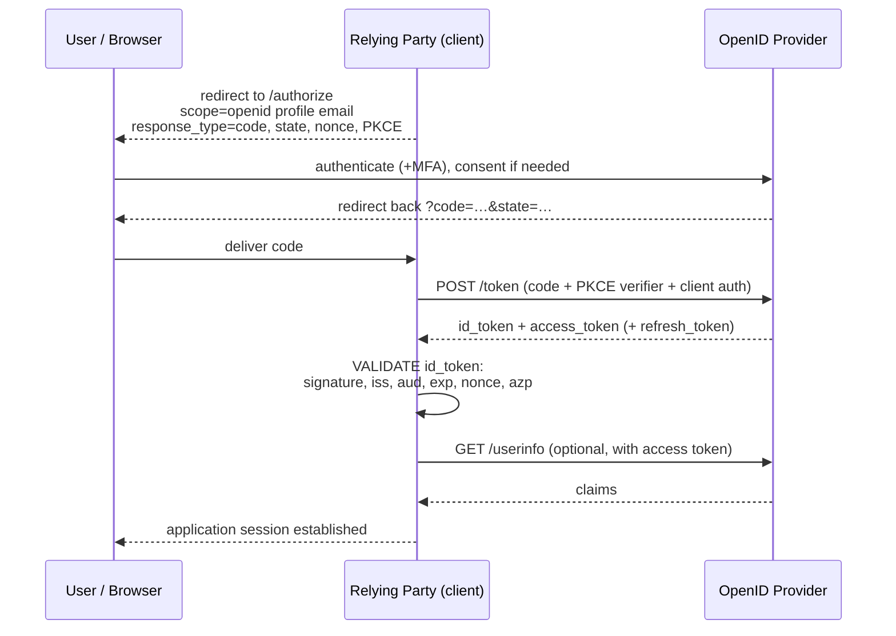

# OpenID Connect (OIDC)

## Why OIDC had to exist

OAuth 2.0 delegates *authorisation*. It says nothing about who the user is or when they authenticated. But once "Log in with Google" appeared, everyone started using OAuth for login anyway — by taking an access token, calling some proprietary user-info API, and treating the result as proof of identity.

That is broken, and the break has a name.

{: .warning }
> **The confused deputy / token substitution problem.** An access token is a bearer credential: it proves *someone* authorised *some* client to access *some* resource. It does **not** say the person is standing in front of *your* app right now. A malicious app can take an access token a user granted *it*, present it to your app's "log in with X" endpoint, and — if your app just calls the user-info API with whatever token it's given — you will happily log the attacker in as that user. This is precisely why OIDC's **ID token has an `aud` claim naming the client**, and why validating it is not optional.

**OIDC (2014) is a thin identity layer on top of OAuth 2.0.** It adds: an ID token (a JWT describing the authentication event), a standard `/userinfo` endpoint, standard claims, discovery, and a session/logout model. Because it *is* OAuth underneath, one protocol handles both "who is this user" and "what may this app call on their behalf" — which is why it displaced SAML for new work.

---

## What OIDC adds

| Addition | Purpose |
|:--|:--|
| **ID token** | A signed JWT asserting *who authenticated, when, how, and for which client* |
| **`openid` scope** | The trigger that turns an OAuth request into an OIDC request |
| **`/userinfo` endpoint** | Standard place to fetch claims with an access token |
| **Standard claims** | `sub`, `name`, `email`, `email_verified`, `picture`, `locale`, `updated_at`… |
| **Discovery** | `/.well-known/openid-configuration` — endpoints, supported algorithms, `jwks_uri` |
| **Dynamic client registration** | Programmatic client onboarding |
| **Session management, front/back-channel logout** | A logout story (still imperfect — see [sessions](10-sessions-and-logout.md)) |

---

## The flow



Note what each token is *for*: the **ID token** is consumed by the RP to establish a login; the **access token** is passed onward to APIs. Mixing them up is the most common OIDC implementation error.

---

## The ID token

```json
{
  "iss": "https://idp.example.com",
  "sub": "a7f3c9e1-4b2d-4f8a-9c1e-2d3b4a5f6e7d",
  "aud": "client-id-of-this-app",
  "exp": 1785312000,
  "iat": 1785308400,
  "auth_time": 1785308390,
  "nonce": "n-0S6_WzA2Mj",
  "acr": "urn:mace:incommon:iap:silver",
  "amr": ["pwd", "hwk"],
  "azp": "client-id-of-this-app",
  "email": "maria@example.com",
  "email_verified": true,
  "name": "Maria Santos"
}
```

| Claim | Why it matters |
|:--|:--|
| **`sub`** | The **stable, immutable** user identifier — *unique within this issuer*. Key your accounts on `iss` + `sub`, never on email |
| **`aud`** | Must equal **your** client ID. This is the defence against token substitution |
| **`nonce`** | Value you generated; must match. Prevents replay of an ID token from another session |
| **`auth_time`** | When authentication actually happened — distinct from token issuance. Use with `max_age` to force re-authentication for sensitive actions |
| **`acr` / `amr`** | Assurance level and methods used. **`amr` is how you know MFA actually happened**; without checking it, "we require MFA" is an assumption |
| **`azp`** | Authorised party, when the token has multiple audiences |

### Validation — the non-negotiable list

1. Signature verifies against a key from the provider's **`jwks_uri`** (cached, refreshed on unknown `kid`).
2. **`iss`** exactly matches the expected issuer string.
3. **`aud`** contains your client ID; if multiple audiences, `azp` is yours.
4. **`exp`** in the future, **`iat`** sane, small clock skew allowance only.
5. **`nonce`** matches the one you sent.
6. **`alg`** is the algorithm you expect — pinned server-side, never taken from the token.
7. If you requested `acr_values` or `max_age`, check `acr` / `auth_time` were honoured.

{: .architect }
> **Use a certified library.** The OpenID Foundation runs a conformance programme, and mature libraries handle the parts that are easy to get subtly wrong: JWKS caching and rotation, algorithm pinning, clock skew, nonce storage. Writing your own OIDC client is a decision that needs justification in an ADR, not a default.

---

## Which flow for which client

| Client | Flow |
|:--|:--|
| **Server-side web app** (confidential) | Authorization code + PKCE, client authenticated |
| **SPA** (public) | Authorization code + PKCE. Tokens in memory; refresh tokens rotated with reuse detection — or better, a **BFF** (backend-for-frontend) holding tokens server-side and giving the browser a normal `HttpOnly` session cookie |
| **Native mobile / desktop** | Authorization code + PKCE via the **system browser** (AppAuth pattern), never an embedded webview |
| **CLI / input-constrained** | Device authorization grant |
| **Service to service** | OAuth client credentials — **no OIDC**, because there's no user |

{: .warning }
> **Never use an embedded webview for OIDC in a mobile app.** The app can read everything typed into it, which destroys the entire "the app never sees your credentials" guarantee, breaks SSO with other apps, and blocks passkeys and enterprise MFA. Use `ASWebAuthenticationSession` (iOS) / Custom Tabs (Android). Some IdPs refuse webview traffic outright.

**On storing tokens in a browser:** `localStorage` is readable by any XSS; in-memory storage dies on refresh; cookies need CSRF protection. The BFF pattern sidesteps the whole debate by keeping tokens out of the browser entirely, and it is the recommended architecture for new SPAs handling anything sensitive.

---

## Claims: where they come from and how big they get

Claims can arrive in the ID token, from `/userinfo`, or in the access token (for the RS). Design decisions:

- **Keep ID tokens small.** They travel in URLs and headers; large group lists blow past header limits. Entra ID, for example, replaces group claims with a Graph reference above a threshold — and applications that didn't expect that break in production for exactly the users with the most groups.
- **Don't put authorisation data in tokens by default.** Tokens are snapshots; permissions change. A token minted before a revocation still asserts the old access until it expires. For anything sensitive, check at the resource server against current state.
- **Mind privacy.** Claims released to an RP should be the minimum it needs. This is a GDPR-relevant design decision, not a convenience setting.
- **Pairwise `sub`** gives each RP a different subject identifier for the same user, preventing cross-RP correlation. Important for CIAM and privacy-sensitive federations.

---

## OIDC vs SAML, decided practically

Choose **OIDC** when: it's a new integration; there's a mobile or single-page app; you need API authorisation as well as login; you want lighter operational overhead.

Choose **SAML** when: the application only supports SAML (still very common in enterprise SaaS); an existing, working integration would gain nothing from migration.

Run **both**, indefinitely. Every real enterprise IdP does. The architecture goal is not "one protocol" — it's *one identity, one policy, one session*, expressed through whichever protocol each application speaks.

{: .vendor }
> **In the products.** All major IdPs — **Ping** (PingFederate, PingOne, PingAM), **Entra ID**, **Okta**, **Keycloak**, **ForgeRock** — are certified OpenID Providers, and the flows are interoperable. The differences that matter in design are: how policy is expressed (Entra's Conditional Access vs Ping's policy contracts and adapters vs Okta's sign-on policies), how claims are mapped and transformed, token lifetime granularity, and whether the product can act as a **broker** to upstream IdPs. Test claim mapping and `acr`/`amr` behaviour early — that's where products differ most and where designs quietly break.

---

## Architect's checklist

- [ ] Do all clients validate the ID token completely — **signature, `iss`, `aud`, `exp`, `nonce`, pinned `alg`**?
- [ ] Are accounts keyed on **`iss` + `sub`**, not email?
- [ ] Do sensitive applications check **`amr` / `acr`**, or merely assume the IdP enforced MFA?
- [ ] Are SPAs using **PKCE**, and is a **BFF** in place where tokens shouldn't reach the browser?
- [ ] Do native apps use the **system browser**, never an embedded webview?
- [ ] Is **JWKS caching and rotation** handled — including behaviour when the endpoint is unreachable?
- [ ] Are ID tokens **small enough** to survive header limits for your largest-group users?
- [ ] Is claim release **minimised per RP**, and is pairwise `sub` used where correlation is a privacy concern?
- [ ] For sensitive operations, is authorisation checked against **current state** rather than token contents?

---

**Next:** [Tokens & JWT](06-tokens-and-jwt.md) →
