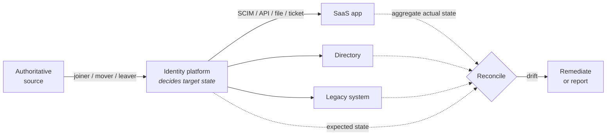

# SCIM & Provisioning

## Federation is not enough

SSO lets a user *log in* to an application. It does not:

- create their account before their first login, with the right profile;
- grant them the entitlements they need inside the application;
- update their department when they transfer;
- **remove them when they leave**;
- reclaim the licence you're paying for.

{: .concept }
> **SSO controls the front door. Provisioning controls whether the room exists at all.** An application with SSO but no provisioning still accumulates stale accounts, still costs licence money for leavers, and still cannot answer "who has access?" without a manual export. Many organisations declare victory after rolling out SSO and are surprised, two audits later, that their access problem is untouched. Federation and provisioning solve different halves of the problem and you need both.

---

## SCIM: the standard

**System for Cross-domain Identity Management** ([RFC 7643](https://datatracker.ietf.org/doc/html/rfc7643) schema, [RFC 7644](https://datatracker.ietf.org/doc/html/rfc7644) protocol) is a REST/JSON API for managing identities across domains. Before it, every SaaS vendor invented their own user API and every IdP wrote a bespoke connector for each one.

### Resources and endpoints

| Endpoint | Purpose |
|:--|:--|
| `/Users` | Create, read, update, delete users |
| `/Groups` | Group management and membership |
| `/Me` | The authenticated subject |
| `/ServiceProviderConfig` | What this implementation supports |
| `/Schemas`, `/ResourceTypes` | Schema discovery |
| `/Bulk` | Batched operations |

Operations: `GET`, `POST`, `PUT` (full replace), **`PATCH`** (partial — the one you want), `DELETE`.

```json
{
  "schemas": ["urn:ietf:params:scim:schemas:core:2.0:User"],
  "id": "2819c223-7f76-453a-919d-413861904646",
  "externalId": "40218",
  "userName": "maria.santos@example.com",
  "name": { "givenName": "Maria", "familyName": "Santos" },
  "emails": [{ "value": "maria.santos@example.com", "type": "work", "primary": true }],
  "active": true,
  "groups": [{ "value": "e9e30dba-…", "display": "Finance-Read" }],
  "meta": { "resourceType": "User", "version": "W/\"a330bc54f0671c9\"" }
}
```

Key fields: **`externalId`** is *your* identifier (the correlation key you control — always set it); **`id`** is the service provider's; **`active`** is the deactivation flag; **`meta.version`** is an ETag for optimistic concurrency.

The **enterprise user extension** (`urn:ietf:params:scim:schemas:extension:enterprise:2.0:User`) adds `employeeNumber`, `department`, `manager`, `costCenter`, `division` — the attributes that actually drive access decisions.

---

## Where SCIM disappoints

SCIM is genuinely useful and genuinely limited. Know the limits before you design around it:

| Limitation | Reality |
|:--|:--|
| **"SCIM-compliant" means very little** | Implementations vary wildly. Some support only `/Users`, some ignore `PATCH`, some accept `PUT` but silently drop unlisted attributes, some have non-standard filter behaviour. **Always test against the actual tenant** |
| **Entitlements are weakly modelled** | SCIM handles users and groups well. Application-internal roles, licence types, permission profiles, approval limits — usually vendor extensions or not supported |
| **`DELETE` semantics vary** | Hard delete, soft delete, or unsupported. Most designs use `active: false` instead, which raises: does the vendor still charge for inactive users? |
| **No standard for the reverse direction** | SCIM is push-oriented. Reading back the application's true state for [reconciliation](19-identity-data-quality.md) often needs a different API |
| **Group membership at scale** | Full-replace group updates on a 50,000-member group are brutal; `PATCH` add/remove is essential and not universally supported |
| **No standard eventing** | The target can't tell you a local admin changed something. Reconciliation remains mandatory |

{: .warning }
> **Test these five things before committing to any SCIM integration**: (1) `PATCH` support for attributes *and* group membership; (2) what `DELETE` and `active: false` actually do, including licensing; (3) pagination behaviour beyond one page; (4) rate limits under a bulk load; (5) whether `externalId` is stored and filterable. Discovering any of these late turns a two-week integration into a two-month one.

---

## The provisioning pattern, generalised



The loop is: **decide → push → read back → compare → correct.** Systems that only do the first two are automation; systems that close the loop are governance.

### Provisioning models

| Model | How | Best for |
|:--|:--|:--|
| **Push (proactive)** | Account created before first login | Systems needing pre-configuration; anything where day-one readiness matters |
| **JIT (just-in-time)** | Account created on first SSO login from assertion attributes | Low-touch SaaS; **but** creates nothing until they log in, and — critically — **JIT has no deprovisioning story**. Pair it with periodic reconciliation or scheduled deactivation |
| **Hybrid** | JIT create, scheduled sweep to deactivate | Common and pragmatic |
| **Ticket-based** | IAM raises a task; a human executes | Systems that cannot be automated. Still fully governed: request, approval and evidence stay in the platform |

---

## Deprovisioning: the part that matters

Granting access is a happy path everyone tests. Removing it is where organisations fail audits.

The design questions, per application:

1. **What does "removed" mean here?** Disable, delete, or transfer ownership? A deleted Salesforce user orphans their records; a deleted mailbox may violate retention obligations.
2. **What happens to the user's data?** Files, mailboxes, delegations, calendar ownership, personal API tokens, in-flight workflows and approvals.
3. **How fast?** A leaver revocation SLA is usually 4–24 hours for standard access and **immediate for privileged**. That drives whether you need event-driven or scheduled provisioning.
4. **What about sessions and tokens already issued?** Disabling an account doesn't invalidate a live session or an unexpired access token. This is where [token lifetimes](06-tokens-and-jwt.md) and session revocation earn their place in the design.
5. **What proves it happened?** Evidence per user, per system, with a timestamp — the artefact an auditor will ask for.

{: .architect }
> **Deprovisioning failure is the most common serious audit finding in IAM, and it's almost never a technology gap.** It's usually: HR didn't record the termination promptly, the application wasn't in scope, the connector failed silently, or nobody owned the exception queue. When you design provisioning, design the **failure path** with the same care as the happy path: what happens when a target rejects the delete, and who is accountable for clearing that queue today?

---

## Non-SCIM integration reality

Most estates connect 20–200 systems, and the distribution is roughly:

- **A minority speak SCIM** — modern SaaS, and it's growing.
- **Many have proprietary REST APIs** — vendor-specific connector, or a generic REST connector you configure.
- **Some accept files** — CSV over SFTP. Fragile but universal. Watch for silent truncation, encoding, and "the file didn't arrive" going unnoticed for a week.
- **A few need database or LDAP writes** — bypasses application logic; check it's vendor-supported before relying on it.
- **Some cannot be automated at all** — mainframes, niche vendor apps, physical access systems. Ticket-based fulfilment, governed end to end.

{: .vendor }
> **In the products.** Connector breadth is a genuine differentiator, and the deepest thing to evaluate. **SailPoint** ships a large connector library plus a generic web-services connector and (in Identity Security Cloud) a virtual appliance model for on-prem reach. **One Identity Manager** uses its Synchronization Editor with typed connectors and a strong bidirectional sync/mapping model, which handles complex legacy systems well but has a real learning curve. **Saviynt** leans cloud-native with a large SaaS catalogue. When evaluating, don't count connectors — **test the three hardest systems in your estate**, because those decide the programme's timeline.

---

## Architect's checklist

- [ ] Which applications have SSO **but no provisioning**, and what's the stale-account exposure?
- [ ] Is **`externalId`** set on every SCIM integration as a stable correlation key?
- [ ] For each target: what does **deprovisioning actually do**, and what happens to the user's data?
- [ ] What is the **leaver revocation SLA**, and does the mechanism (event vs scheduled) actually meet it?
- [ ] Do you **reconcile** every target, or only push to it?
- [ ] Who owns the **provisioning exception queue**, and is it cleared daily?
- [ ] Are **JIT-provisioned** applications covered by a deactivation sweep?
- [ ] Have SCIM **`PATCH`, pagination, rate limits and delete semantics** been tested against the real tenant?
- [ ] Can you produce, per user, **evidence of revocation with timestamps** across all systems?

---

**Next:** [MFA & Passwordless](08-mfa-and-passwordless.md) →
