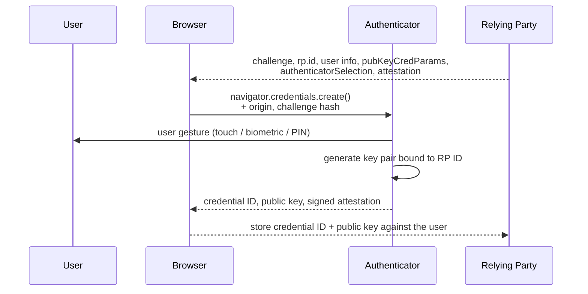

# FIDO2, WebAuthn & Passkeys

## The insight

Every credential that a user can *transmit* — a password, an OTP, an approval tap — can be captured by something pretending to be the real site. The only way out is a credential the user **cannot transmit** and the authenticator **refuses to use** anywhere but the site it was registered to.

{: .concept }
> **FIDO2 makes the browser and authenticator enforce the origin.** At registration, a key pair is created and permanently bound to the relying party's origin (`https://bank.example.com`). At login, the browser tells the authenticator which origin is asking, and the authenticator signs a challenge **including that origin**. On `https://bank-example-secure.com`, the authenticator either has no key at all or produces a signature the real site will reject. The user cannot be tricked into overriding this, because they were never in the loop. **Phishing resistance is a property of the protocol, not of user vigilance.**

---

## The pieces

| Component | Role |
|:--|:--|
| **WebAuthn** | The W3C browser API — how a web app talks to the platform |
| **CTAP2** | Client to Authenticator Protocol — how the platform talks to an external authenticator (USB, NFC, BLE) |
| **FIDO2** | WebAuthn + CTAP2 together |
| **Authenticator** | Where the private key lives. *Platform* (Touch ID, Windows Hello, Android) or *roaming* (YubiKey, Titan) |
| **Relying Party (RP)** | Your application, identified by **RP ID** (a domain) |
| **Attestation** | Optional cryptographic statement about the authenticator's make and model |

### Registration



### Authentication

```mermaid
sequenceDiagram
    participant U as User
    participant B as Browser
    participant A as Authenticator
    participant RP as Relying Party

    RP-->>B: challenge, allowCredentials, userVerification
    B->>A: navigator.credentials.get() + <b>origin</b>
    A->>A: find key for this RP ID — none? refuse
    A->>U: user gesture
    A-->>B: signature over (challenge ‖ origin ‖ flags ‖ counter)
    B-->>RP: assertion
    RP->>RP: verify signature with stored public key;<br/>check challenge, origin, RP ID hash, flags, counter
```

The private key never leaves the authenticator. The server stores only a public key — **so a breach of your credential database yields nothing usable.** That alone is a significant architectural improvement over password hashes.

---

## Passkeys

A **passkey** is a FIDO2 credential, with an emphasis on being *discoverable* (the authenticator can find it without the site naming it first, enabling usernameless login) and, in the consumer case, *synced*.

| | **Device-bound passkey** | **Synced passkey** |
|:--|:--|:--|
| Where the key lives | One authenticator (security key, TPM) | Synced through a platform/password-manager cloud |
| Lost device | Credential lost — needs recovery | Available on the user's other devices |
| Assurance | Higher; provably one piece of hardware | Depends on the sync provider's account security |
| Best for | Workforce, administrators, regulated use | Consumer CIAM, mass adoption |

{: .architect }
> **The sync question is the enterprise decision.** A synced passkey inherits the security of the user's Apple/Google/password-manager account — which your organisation does not control, and which may itself be protected by weaker authentication. For consumer login this trade is excellent: it's the reason passkeys can actually replace passwords at scale, and it's still far stronger than a password. For administrators of your production estate, most regulated organisations require **device-bound** credentials, enforced via attestation. Decide this per population, and write down why.

---

## Design decisions you must make

| Decision | Options | Guidance |
|:--|:--|:--|
| **RP ID** | Domain scope for credentials | Register at the **highest domain you control and intend to keep** (`example.com`, not `login.example.com`). Changing it later invalidates every credential. This is a one-way door |
| **User verification** | `required` / `preferred` / `discouraged` | `required` makes it two-factor in one gesture (possession + PIN/biometric). Use `required` for anything sensitive |
| **Resident/discoverable credentials** | `required` / `preferred` / `discouraged` | Needed for usernameless login; consumes limited slots on hardware keys (often 25–100) |
| **Attestation** | `none` / `indirect` / `direct` / `enterprise` | `none` for consumer (privacy, adoption). `direct`/`enterprise` where you must restrict to approved, certified authenticator models |
| **Algorithms** | ES256, RS256, EdDSA | Accept ES256 at minimum; list several |
| **Multiple credentials per user** | Yes | **Always** allow and encourage ≥2. This is your recovery strategy |
| **Signature counter** | Check or ignore | Detects cloned authenticators, but many (especially synced passkeys) don't increment it. Treat anomalies as a signal, not a hard block |

---

## Where it gets hard

**Recovery.** Users lose devices. If a passkey is the only credential and there's no backup, you're into identity re-proofing. Answers: enrol two authenticators at registration; issue a time-boxed Temporary Access Pass through a verified process; keep a hardware key in a safe for break-glass. **Never** fall back to "email a reset link" for a high-value account — that quietly reduces your phishing-resistant credential to the strength of a mailbox.

**Shared and kiosk devices.** Platform authenticators are tied to a user profile on a device. Shift workers on shared terminals typically need roaming security keys or smart cards.

**Legacy and non-web.** WebAuthn is a browser API. Thick clients, legacy protocols, RDP and non-HTTP services need bridges — the IdP authenticating with FIDO2 and issuing Kerberos/SAML/OIDC downstream, which is exactly the [federation bridge](02-kerberos-and-legacy.md) pattern.

**Account linking and enumeration.** Careless implementations reveal whether an account exists (different responses for known and unknown users). Design the ceremony to be uniform.

**Attestation privacy.** Full attestation identifies the authenticator model and, in some configurations, has raised trackability concerns — which is why consumer deployments generally use `none`.

---

## What it does and doesn't stop

**Stops:** credential phishing (real-time AiTM included), credential stuffing and reuse, password database breaches, most social engineering aimed at credentials, MFA fatigue.

**Does not stop:** malware on the endpoint (an attacker with code execution can act inside an authenticated session), **session/token theft after login**, consent phishing (the user legitimately authorises a malicious app), authorisation flaws, or a weak recovery process.

{: .warning }
> Passkeys move the attack from the credential to the **session** and to **recovery**. Deploy them alongside device-bound or sender-constrained sessions, sensible session lifetimes, and a recovery process worth the credential — otherwise you've hardened the front door and left the same two windows open.

---

## Rollout pattern

1. **Support it** — add WebAuthn as an option alongside existing methods.
2. **Encourage it** — prompt at login, make enrolment a one-click moment during onboarding.
3. **Require it for privileged roles** — administrators first, with attestation restricting to approved models.
4. **Require it for everyone** on new sessions.
5. **Remove the password** — the long tail: legacy protocols, service accounts, shared devices.

Steps 1–3 are weeks. Step 5 is years, and that's normal.

---

## Architect's checklist

- [ ] What **RP ID** will you register, and is it the domain you'll still own in ten years?
- [ ] Is `userVerification: required` set where the credential must be two-factor?
- [ ] Are users required to register **at least two** authenticators?
- [ ] What is the **recovery path**, and is it as strong as a passkey?
- [ ] Is **attestation** required for privileged populations, and is there an approved authenticator list?
- [ ] How are **shared devices and kiosks** handled?
- [ ] For workforce administrators: **device-bound or synced** — and is the reasoning documented?
- [ ] What protects the **session** after a phishing-resistant login?
- [ ] Are legacy authentication paths that bypass FIDO2 **blocked**, with telemetry proving it?
- [ ] Does the registration/login ceremony avoid **account enumeration**?

---

**Next:** [Sessions & Logout](10-sessions-and-logout.md) →
