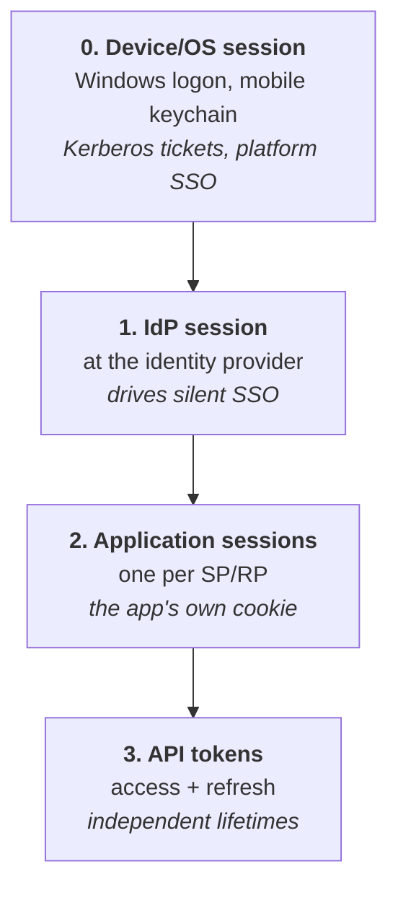

# Sessions & Logout

## Authentication is a moment; a session is a duration

Login happens once. The session that follows might last eight hours, and during that time the system keeps acting on a decision made at a single instant — before the laptop was stolen, before the user was terminated, before the device fell out of compliance.

{: .concept }
> **A session is a standing decision to trust, based on evidence that is getting older every second.** Almost every hard problem in this area — logout, revocation, session lifetime, continuous evaluation — is the same question: *how do you revise a decision you already made and handed to someone else?*

---

## The layers of session state

In a federated architecture there are **at least three** sessions, and confusing them is the root of most logout misunderstandings:

Ending one does not end the others. A user who "logs out" of an application usually just deletes that application's cookie — the IdP session remains, so clicking the app again logs them straight back in, which users reliably report as a bug.

---

## Lifetime parameters

| Parameter | Meaning | Typical |
|:--|:--|:--|
| **Idle timeout** | Ends after inactivity | 15 min (high risk) → 8 h (low risk) |
| **Absolute timeout** | Ends regardless of activity | 8–24 h workforce; longer for consumer |
| **Remember-me / persistent** | Survives browser restart | Days–months; consumer only, never for privileged |
| **Re-authentication interval** | Force fresh credentials for sensitive actions | Per action (`max_age`, `prompt=login`) |
| **Access token lifetime** | API call validity | 5–60 min |
| **Refresh token lifetime** | Ability to obtain new access tokens | Hours–months, rotating |

{: .architect }
> **Set session lifetime from the risk of the resource, not from a single organisation-wide policy.** A wiki and a payments console do not deserve the same eight hours. The pattern that works: a long-lived IdP session that carries *identity*, plus short application sessions and **step-up re-authentication** for sensitive operations. That gives you low friction for routine work and real freshness where it matters — instead of the usual compromise where everything is set to whatever the noisiest stakeholder tolerates.

---

## Why logout is hard

SAML SLO and OIDC logout both exist and both underdeliver.

| Mechanism | How | Fails when |
|:--|:--|:--|
| **Front-channel logout** | IdP loads a logout URL for each RP in hidden iframes | Third-party cookie restrictions block it; one slow/dead RP stalls the chain; no confirmation |
| **Back-channel logout** | IdP calls each RP's logout endpoint server-to-server with a signed logout token | Requires network path and an implemented endpoint on every RP; many don't have one |
| **SAML SLO** | Front- or back-channel with `SessionIndex` | Same problems, plus fragile implementations across vendors |
| **Token revocation** | Refresh tokens revoked at the AS | Access tokens stay valid until expiry |
| **Session revocation events (CAEP/SSF)** | Standardised push of "session revoked" | Only works with participating RPs; emerging |

{: .warning }
> **Do not promise "log out everywhere" unless you have tested it, per application, and have telemetry proving it worked.** Security policies routinely assert global logout that the architecture cannot deliver — and the gap surfaces during an incident, when someone asks why a terminated user's session was still active. State the real behaviour: *"logout ends the IdP session and application sessions for the N applications with back-channel logout; other applications end within their own session lifetime of X minutes."*

The realistic strategy is layered:

1. **Short application sessions** so uncontrolled sessions self-heal quickly.
2. **Back-channel logout** implemented on every application you control.
3. **Refresh token revocation** at the AS, plus short access tokens.
4. **Continuous evaluation** ([CAEP/SSF](../08-frontier/01-zero-trust.md)) where supported.
5. **A documented emergency path**: how do you actually kill every session for one user, right now? That runbook is an incident-response requirement — see [identity incident response](../07-delivery/06-incident-response.md).

---

## Session security mechanics

| Control | Why |
|:--|:--|
| `HttpOnly` | XSS can't read the cookie |
| `Secure` | Never sent over plaintext |
| **Deliberate `SameSite`** | `Lax` breaks some federation POSTs; `None` needs `Secure`. Choose consciously — see [HTTP](../01-it-fundamentals/09-http-and-apis.md) |
| **Regenerate on privilege change** | Prevents **session fixation**: an attacker who plants a known session ID must not have it survive login or elevation |
| **Bind to context** | Device fingerprint, client cert, or a DPoP key. Detects or prevents cookie replay from another machine |
| **≥128 bits of entropy** | Session IDs must be unguessable |
| **Never in URLs** | They leak into history, logs and `Referer` |
| **Server-side revocability** | A purely stateless session (all state in a signed cookie) cannot be revoked. That's a real trade-off, not a detail |
| **Concurrent session limits** | Detects sharing; useful for licensed or high-value access |

**Idle timeout should be enforced server-side.** A JavaScript countdown that logs the user out visually while the server session lives on is theatre.

---

## Step-up authentication

Rather than making every session maximally strong, escalate at the moment of risk: transferring money, changing bank details, accessing a privileged console, exporting personal data, changing MFA settings.

Mechanisms: OIDC `prompt=login` and `max_age`, `acr_values` for a required assurance level, and vendor step-up policies. The application checks `auth_time` and `acr`/`amr` in the token and demands a fresh, stronger authentication if they fall short.

{: .architect }
> **Step-up is what makes long sessions defensible.** Without it you're forced into a bad choice: short sessions that annoy everyone, or long sessions that leave sensitive operations protected by a decision made hours ago. With it, you can keep routine access frictionless and put real authentication exactly where the risk is. Every design involving sensitive transactions should specify **which operations trigger step-up** — that list is an architecture artefact and belongs in the design document.

---

## Sessions across the estate

Real users hold sessions in many places at once: browser, mobile app, desktop client, API integrations, and platform-level SSO (Windows logon, iOS/Android account). A "terminate this user" action must consider all of them, and most identity platforms only reach some.

The practical checklist for a leaver or a compromised account:

- Disable the account at the IdP (stops *new* authentications).
- Revoke refresh tokens and, where supported, active sessions.
- Force sign-out at the IdP.
- Revoke device tokens / retire or wipe managed devices.
- Reset the credential and any registered authenticators.
- Kill sessions in the applications that hold independent state — VPN, remote desktop, mainframe, database.
- Rotate any secrets the user had access to (this step is nearly always forgotten and nearly always matters).

That list is a **runbook**, not a checkbox, and it should be rehearsed. If it takes forty minutes to work out how to end one user's sessions, that's forty minutes of an active attacker.

---

## Architect's checklist

- [ ] What are the **idle and absolute** session lifetimes, and do they vary by resource risk?
- [ ] Are session IDs **regenerated** on login and privilege elevation?
- [ ] Are session cookies `HttpOnly`, `Secure`, with a **deliberate** `SameSite` value?
- [ ] Can sessions be **revoked server-side**, or is the design stateless-and-therefore-unrevocable?
- [ ] Which applications implement **back-channel logout**? What happens for the rest?
- [ ] Does the documented logout behaviour match **tested** reality?
- [ ] Which operations require **step-up**, and is that list written down?
- [ ] What is your actual **revocation latency** for a compromised account, end to end?
- [ ] Is there a rehearsed **"terminate all sessions for this user"** runbook?
- [ ] Are sessions **bound to device or key** anywhere, to blunt cookie theft?

---

**Next:** [Federation Patterns & Trust](11-federation-patterns.md) →
