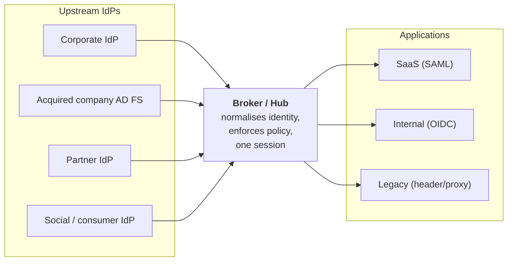

# Federation Patterns & Trust

## Federation is a business relationship with a protocol attached

The protocol is the easy half. The hard half is: **who vouches for whom, on what basis, with what recourse when they're wrong?**

{: .concept }
> **Federation transfers a risk decision across an organisational boundary.** When you accept assertions from a partner's IdP, you accept *their* joiner-mover-leaver process, *their* MFA policy, *their* helpdesk's identity verification, and *their* breach response — for every user they assert. You have outsourced authentication and inherited their operational quality. That's a contractual and risk question dressed as a technical one, and architects who treat it as pure configuration eventually explain to an audit committee why a partner's ex-employee still had access.

---

## Topologies

### 1. Direct (point-to-point)

Each IdP–SP pair configured individually.

**Good:** simple, no extra component, full control per connection.
**Bad:** N×M configurations. Ten IdPs and fifty apps is five hundred relationships, five hundred certificate rotations, five hundred attribute contracts.

Fine below roughly a dozen connections. Beyond that it becomes an operational tax that compounds.

### 2. Hub and spoke (identity broker)

**The dominant enterprise pattern**, and rightly so. Applications trust one thing. Adding an IdP is one change. Policy, MFA, logging and attribute normalisation happen in one place. Protocol translation (SAML in, OIDC out) becomes possible.

The cost: the broker is a **critical single point of failure and a total-compromise target**. Its availability requirement is the union of every application's, and its security requirement is the maximum of every application's. Design it accordingly — see [HA & scale](../04-architecture-practice/05-ha-dr-and-scale.md) and [securing IAM](../04-architecture-practice/06-securing-iam.md).

### 3. Mesh / multilateral federation

Many-to-many with a common trust framework and metadata registry — used in research and education (eduGAIN, InCommon), health networks and government schemes. Members publish signed metadata to an aggregator; everyone trusts the aggregate.

Works only where there is a genuine governing body defining membership rules, attribute semantics and assurance requirements. That governance *is* the federation; the technology is incidental.

### 4. Delegated / chained

A user authenticates at IdP A, which trusts IdP B, which trusts IdP C. Each hop degrades what you actually know and lengthens the chain of trust assumptions. Keep chains short, and record the full chain in tokens (`amr`, `acr`, custom claims) so a downstream RP can decide whether the chain meets its bar.

---

## Trust establishment

| Mechanism | Where used |
|:--|:--|
| **Manual metadata exchange** | Most enterprise B2B. Certificates pinned, updated by hand — hence rotation pain |
| **Metadata URL with auto-refresh** | The correct default; rotation without a change window |
| **Federation registry / aggregator** | Multilateral federations |
| **Dynamic client registration** | OIDC; programmatic onboarding, needs an authorisation policy of its own |
| **Contractual + legal** | Underneath all of the above: what the parties promise about proofing, MFA, breach notification and offboarding |

The **attribute contract** deserves as much attention as the certificate: which attributes flow, in what format, with what semantics, and who is authoritative. "Send us the department" fails the moment the partner's departments are named differently from yours — and it fails silently, as wrong access rather than an error.

---

## Inbound vs outbound federation

Different risks; design them separately.

**Outbound (you are the IdP, they are the SP)** — your users access their application. Concerns: which attributes you release (privacy, GDPR), whether you can revoke access there, what happens to their local accounts when your user leaves, and the fact that you cannot see what they do inside.

**Inbound (they are the IdP, you are the SP)** — their users access your application. Concerns: their assurance level, their offboarding speed, their MFA policy, whether they can assert *any* identity they like (including one that collides with one of your employees), and how you scope what an asserted user may do.

{: .warning }
> **The assertion-scoping failure.** If you accept assertions from partner X, you must restrict *what identifiers X can assert*. Without scoping, a compromised or malicious partner IdP can assert `ceo@yourcompany.com` — and if your correlation is email-based, you have just been impersonated by a business partner. Enforce: a namespace per federation (identifiers must be within the partner's domain), separate identity spaces for external users, and never auto-correlate an externally-asserted identity onto an internal one. This is a genuine, exploited class of failure.

---

## Attribute release and privacy

Every attribute you release crosses a legal boundary as well as a technical one.

- **Minimise.** Release the least the RP needs. "Send everything" is a GDPR problem waiting for a DPO to find it.
- **Pairwise identifiers.** Give each RP a different `sub`/NameID for the same user so RPs cannot correlate users between themselves.
- **Consent.** For consumer and research federations, per-RP attribute consent may be required.
- **Document it.** The attribute contract per federation is a data-processing artefact, and someone will eventually ask for it.

---

## Failure modes

| Failure | Effect | Mitigation |
|:--|:--|:--|
| **IdP outage** | Nobody can log in anywhere | Multi-region IdP; cached sessions ride it out; a documented break-glass path |
| **Certificate expiry** | Total federation failure at a precise moment | Overlapping keys, auto-refreshing metadata, expiry alerting ([PKI](../01-it-fundamentals/05-pki-and-tls.md)) |
| **Clock skew** | Assertions rejected as not-yet-valid or expired | NTP hygiene everywhere |
| **Attribute drift** | Partner changes a value's format; access breaks or, worse, silently widens | Contract + monitoring on attribute shape, not just presence |
| **Partner compromise** | Attacker asserts identities at will | Scoping, monitoring, contractual notification, ability to disable a connection **fast** |
| **Silent removal failure** | Partner offboards a user; you never hear | Periodic access reviews of federated users; require partner attestation |

{: .architect }
> **Every federation needs an off switch and someone who knows where it is.** If a partner reports a breach at 22:00, how quickly can you disable that connection — and does doing so break anything else? Document per-connection kill procedures, and rehearse one. This is a five-minute design decision that becomes a two-hour incident without it.

---

## Multi-IdP and coexistence

Common in mergers, migrations and mixed workforces. Approaches:

- **Home realm discovery** — ask the user, or infer from email domain, IP or a cookie. Getting this UX right matters more than it sounds; a confusing IdP chooser generates enormous helpdesk volume.
- **Broker with upstream IdPs** — the clean answer, and the reason brokers exist.
- **Domain-based routing** — `@acquired.com` → their IdP; `@parent.com` → yours. Simple and effective during M&A.
- **Migration by cohort** — move users in waves, with both IdPs live. See [migration & coexistence](../04-architecture-practice/04-migration-and-coexistence.md).

{: .vendor }
> **In the products.** Brokering is where access-management products differentiate. **PingFederate** is a strong protocol broker — many upstream connections, adapter chaining, per-connection attribute contracts and policy — which is why it appears in complex, multi-party enterprises. **PingOne**, **Entra ID** (External ID, cross-tenant access settings) and **Okta** (Org2Org, routing rules) all broker upstream IdPs with different policy models. **Keycloak** brokers well and is excellent for learning the pattern hands-on. Evaluate on: number and type of upstream IdPs supported, attribute transformation power, per-connection policy granularity, and how session and logout behave across the hop.

---

## Architect's checklist

- [ ] What is your federation **topology**, and is it still the right one at your current connection count?
- [ ] For each inbound federation: what identifiers may the partner **assert**, and is that scoped and enforced?
- [ ] Is there an **attribute contract** per federation, with owners and semantics documented?
- [ ] Is metadata exchanged **by URL with auto-refresh**? Which partners can't, and are they registered?
- [ ] What **assurance** does each partner provide (proofing, MFA), and is it contractual?
- [ ] How fast can a partner **disable a leaver**, and how do you verify it happened?
- [ ] Is there a documented, tested **kill switch** per federation connection?
- [ ] Are **pairwise identifiers** used where cross-RP correlation is a privacy concern?
- [ ] What is the **blast radius** of your broker being unavailable, and what's the break-glass path?
- [ ] Are federated external users included in **access reviews**?

---

**Next:** [Authorisation Models](12-authorization-models.md) →
