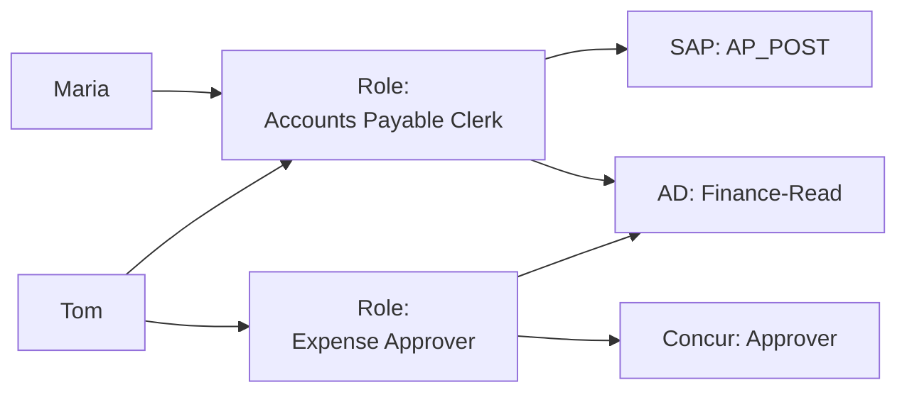
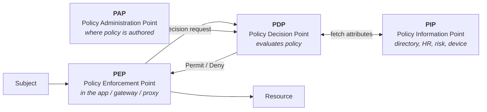

# Authorisation Models

## The question every model answers differently

**"May this subject perform this action on this resource, in this context?"**

Every model — ACL, RBAC, ABAC, ReBAC, PBAC — is a different strategy for storing and evaluating that sentence at scale. Choosing badly doesn't fail immediately; it fails in year three when the model can't express a requirement and someone bolts on an exception mechanism that quietly becomes the real system.

---

## The models

### ACL — Access Control List

Permissions attached directly to the resource: *this file, these users, these rights*.

**Good:** precise, intuitive, no indirection. **Bad:** doesn't scale to people — 10,000 users × 100,000 objects is unmanageable, and answering "what can Maria access?" requires scanning every object. Still the right model for file systems and object stores.

### RBAC — Role-Based Access Control

Users get roles; roles carry permissions. The workhorse of enterprise IAM.



**Good:** understandable by business people, reviewable, auditable, maps to how organisations actually think about jobs. It's what auditors expect and what IGA tools are built around.

**Bad:** **role explosion.** Reality is more granular than job titles, so exceptions arrive — "AP Clerk, but for the German entity, but not for capital expenditure, but with approval up to €5k". Each exception becomes a role. Estates with more roles than users exist, and they're worse than no role model at all.

Mitigations: separate **business roles** (what the job is) from **technical roles/entitlement bundles** (what systems grant); use hierarchy carefully; put genuinely dimensional attributes (region, entity, amount) into policy rather than into role names; and treat roles as a product with owners, lifecycle and a deprecation process. See [role modelling](16-role-modelling.md).

### ABAC — Attribute-Based Access Control

Decisions from attributes of subject, resource, action and environment, evaluated by rules.

```
PERMIT if
   subject.department == resource.owningDepartment
   AND subject.clearance >= resource.classification
   AND action IN ("read", "download")
   AND environment.deviceCompliant == true
   AND environment.time WITHIN subject.workingHours
```

**Good:** expressive, dynamic, no combinatorial explosion of roles, handles context (device, location, risk) naturally. It's how [Zero Trust](../08-frontier/01-zero-trust.md) policy is written.

**Bad:** **you cannot easily answer "who has access to this?"** — the answer is "whoever's attributes currently match", which is a query over a hypothetical population, not a list. That is a serious problem for access certification and audit. It also depends entirely on attribute quality: wrong department, wrong access, invisibly.

{: .warning }
> **ABAC's audit problem is the reason pure ABAC rarely survives contact with a regulated enterprise.** An auditor asking "list everyone who can approve payments over €50,000" needs a list. With ABAC you can only *compute* it — and only if you have complete, current attribute data for every subject and resource. Design for this: either keep the decision-relevant attributes in a queryable store and build the reporting, or use RBAC for the entitlements that get certified and ABAC for contextual constraints on top.

### ReBAC — Relationship-Based Access Control

Access derives from **relationships in a graph**: *you can edit this document because you are an editor of the folder that contains it, and folder editors inherit into documents.*

Popularised by Google's Zanzibar paper; implementations include OpenFGA, SpiceDB, Ory Keto, and it's the model behind sharing in Google Drive/GitHub-style products.

```
document:budget2026#editor@user:maria          # direct
folder:finance#editor@group:finance-team#member # inherited
document:budget2026#parent@folder:finance
```

**Good:** natural for collaboration and consumer products; hierarchies and sharing come free; "who can access X?" *is* answerable by traversing the graph.

**Bad:** new operational discipline (a tuple store as a critical dependency), consistency questions (Zanzibar's "zookies" exist because stale reads cause wrong decisions), and enterprise IGA tooling doesn't understand it natively.

### PBAC / policy-based — the umbrella

"Policy-Based Access Control" usually means externalised, centrally-authored policy evaluated at runtime, often ABAC-flavoured, expressed in a policy language. See [policy as code](13-policy-as-code.md).

---

## Choosing

| Question | Points to |
|:--|:--|
| Does access follow job function, and must it be certified quarterly? | **RBAC** |
| Does access depend on context — device, risk, time, location? | **ABAC** layered on RBAC |
| Is it about sharing, ownership and hierarchy between objects? | **ReBAC** |
| Is it a small number of resources with specific individual grants? | **ACL** |
| Is it a regulated enterprise with auditors? | **RBAC as the certifiable backbone**, whatever else you add |
| Is it a consumer product with millions of objects? | **ReBAC** |

{: .architect }
> **Almost every real system is hybrid, and that's correct, not a compromise.** The pattern that works in enterprises: **RBAC decides what you can *reach*; ABAC decides whether you can reach it *right now*; ReBAC decides what you can do with *this specific object*.** Roles are provisioned and certified (auditors are satisfied); attributes constrain at runtime (Zero Trust is satisfied); relationships handle per-object sharing (users are satisfied). Design the boundaries between the three deliberately — the failure mode is the same rule being enforced in two layers with different logic, so nobody can predict the outcome.

---

## The PDP/PEP model

Vocabulary from XACML, still the right mental model regardless of technology:



- **PEP** — where enforcement happens. There are usually many, and **every one is a place enforcement can be missed**. Enumerate them.
- **PDP** — where the decision is made. Centralising it is the promise of externalised authorisation.
- **PIP** — where attributes come from. Its availability and freshness become part of your authorisation path.
- **PAP** — where policy is written and versioned.

---

## Design principles

**Deny by default.** Absence of a permit is a deny. Anything else fails open.

**Explicit deny should be rare.** Deny rules are powerful and make policy hard to reason about ("why can't she access it?" becomes a search). Prefer not granting over denying, and keep denials for genuine prohibitions like SoD.

**Least privilege, with a mechanism.** Everyone agrees with it; almost nobody implements it, because it requires knowing what's actually needed. That's what usage analytics, access reviews and time-bound access are for.

**Separate authorisation from authentication.** An authenticated user is not an authorised one. Systems that conflate them ("if they got a token, they're allowed") are how broken object-level authorisation happens.

**Check at the right layer — usually the resource server.** A gateway can enforce coarse rules; only the service knows whether *this* user may see *this* record. The most common serious API vulnerability is exactly this: authentication at the edge, no object-level authorisation inside.

**Make decisions loggable and explainable.** "Denied" is not enough; you need to know *which rule* denied it. Unexplainable authorisation is unsupportable — it generates tickets nobody can close.

---

## Anti-patterns

| Anti-pattern | Why it hurts |
|:--|:--|
| **Permissions in code** | Changing access requires a deployment; you cannot answer "who has access" without reading source |
| **Roles named after people** | `Role_Maria_Access` — a very common estate smell, and a guarantee of chaos on her departure |
| **Group-per-object** | `DocX-Readers`, `DocY-Readers`… a directory with a million groups. Use ReBAC or ACLs |
| **Everything in the token** | Tokens grow past header limits; permissions are stale from the moment of issue |
| **Authorisation only at the UI** | The API is the real interface; hiding a button is not a control |
| **One super-role for convenience** | "Support" that can read all customer data. It always leaks |
| **Deny rules everywhere** | Policy nobody can reason about; contradictory outcomes |
| **No standing definition of "privileged"** | Nobody knows which roles need extra controls, so none get them |

---

## Architect's checklist

- [ ] Which model does each system use, and was it **chosen** or inherited?
- [ ] Can you answer **"who can do X?"** for your most sensitive operations — and how long does it take?
- [ ] Can you answer **"what can this person do?"** across the estate?
- [ ] Where are the **PEPs**, and is any path to the resource unprotected (direct API, database, batch job, admin console)?
- [ ] Is the default **deny**, and does the system fail closed when the PDP or PIP is unavailable?
- [ ] Which entitlements are **certifiable** (listable for review), and which are computed and therefore not?
- [ ] Is **object-level authorisation** enforced in the service, not just at the gateway?
- [ ] Are **role counts** trending up or down, and is anyone accountable for the trend?
- [ ] Is there a defined, enforced meaning of **"privileged"** in this estate?
- [ ] Can a denial be **explained** to the user and to support?

---

**Next:** [Policy as Code & Externalised AuthZ](13-policy-as-code.md) →
