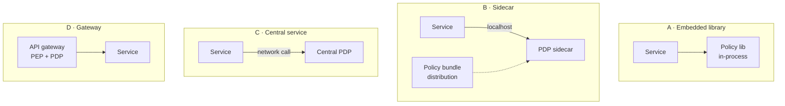

# Policy as Code & Externalised Authorisation

## The problem with authorisation inside applications

Every application invents its own permission model. So the organisation ends up with:

- No way to answer "who can approve payments?" without asking forty teams.
- A policy change requiring forty deployments.
- Forty different implementations of the same rule, three of them wrong.
- Auditors sampling applications one at a time, forever.

{: .concept }
> **Externalised authorisation moves the decision out of the application and into a service that many applications share.** The application keeps the *enforcement* (the PEP) — it must, because only it can act on the answer — but the *decision* (the PDP) and the *policy* live outside. Policy becomes a versioned, reviewed, testable artefact rather than scattered conditionals.

This is not new — XACML proposed it in 2003 — but it only became practical when policy engines got fast, embeddable and developer-friendly.

---

## Policy as code

Policy expressed in a purpose-built language, stored in version control, code-reviewed, tested, and deployed through a pipeline.

**Rego** (Open Policy Agent):

```rego
package expenses

default allow := false

allow if {
    input.action == "approve"
    input.subject.role == "manager"
    input.resource.amount <= input.subject.approval_limit
    input.resource.submitter_manager == input.subject.id
    input.resource.cost_center in input.subject.cost_centers
}

# Segregation of duties: never approve your own claim
deny contains "self-approval" if {
    input.action == "approve"
    input.resource.submitter == input.subject.id
}
```

**Cedar** (AWS, used by Verified Permissions):

```cedar
permit (
    principal in Group::"managers",
    action == Action::"approveExpense",
    resource in CostCenter::"EMEA-FIN"
) when {
    resource.amount <= principal.approvalLimit &&
    resource.submitter != principal
};
```

The properties that make this valuable are the same ones that make code valuable: **diffable, reviewable, testable, versioned, deployable, and auditable by reading rather than by asking.** Cedar additionally targets *analysability* — being able to prove properties of a policy set automatically, which matters when policies get large.

| Language | Origin | Character |
|:--|:--|:--|
| **Rego / OPA** | CNCF | General-purpose, very expressive, powerful beyond authorisation (admission control, config validation). Learning curve is real |
| **Cedar** | AWS | Purpose-built for authorisation, designed for analysability and performance |
| **XACML** | OASIS | XML, enterprise heritage, verbose; still present in older estates |
| **ALFA** | OASIS | A readable syntax that compiles to XACML |
| **Zanzibar-style tuples** | Google | Relationship data rather than rules — OpenFGA, SpiceDB |
| **Vendor DSLs** | Various | Ping Authorize, Axiomatics, PlainID and others |

---

## Deployment topologies



| Topology | Latency | Consistency | Best for |
|:--|:--|:--|:--|
| **Embedded** | Microseconds | Deploy-time | Single language stack, static policy |
| **Sidecar** | <1 ms localhost | Bundle-pull, seconds–minutes | Kubernetes; the common production choice |
| **Central service** | Network hop (ms) | Immediate | Low volume, high-value decisions; easiest to govern |
| **Gateway** | In the request path anyway | Immediate | Coarse-grained, edge-level rules |

{: .warning }
> **A central PDP is a new critical dependency in your request path.** If it's down or slow, every application stops or fails open — both bad. Design for it explicitly: local caching of decisions with a defined TTL, bundle distribution so sidecars keep working when the control plane is unreachable, and a documented, *deliberate* fail mode per application. "We didn't think about it" invariably resolves to fail-open in a library somewhere.

**Data is the harder half.** A PDP needs attributes: the user's department, the resource's owner, the device's compliance state. Options are to push them in the request (fast, but the caller decides what the policy sees — a trust problem), to fetch them at decision time (fresh, slow, another dependency), or to replicate them into the PDP (fast, eventually stale). Most designs replicate slow-moving data and pass fast-moving context in the request. **This decision, not the policy language, is what determines whether an externalised authorisation project succeeds.**

---

## When to externalise — and when not to

**Externalise when:**
- Many applications share the same rules (a common risk/compliance policy).
- Policy changes must be fast and not require deployments.
- You must *prove* consistent enforcement to a regulator.
- Rules are genuinely complex — contextual, multi-attribute, dynamic.
- You need one place to answer "what does policy say about X?"

**Don't externalise when:**
- The application has a handful of simple rules. Adding a distributed system to express `if user.isAdmin` is a net loss.
- Latency budgets are unforgiving and the rules are static.
- The team can't own another production dependency.
- The authorisation logic is genuinely domain-specific business logic — a workflow state machine is not an authorisation policy, and forcing it into one produces unreadable policy.

{: .architect }
> **The failure mode of externalised authorisation projects is scope, not technology.** Teams try to move *all* authorisation out of *all* applications, discover that half of it is entangled business logic, and stall after eighteen months with two applications migrated. What works: start with **one cross-cutting policy family** — the rules that genuinely repeat everywhere and that compliance cares about — and leave application-specific logic where it is. A PDP that owns 20% of the decisions and 100% of the audit-relevant ones is a success; one that aims for everything is usually a write-off.

---

## Operational requirements

Once authorisation is a service, it needs the discipline of a service:

- **Testing.** Policy is code, so it needs unit tests, and both OPA and Cedar support them. A policy change that silently widens access is a security incident authored in a pull request.
- **Decision logging.** Log every decision with input, result and the rule that produced it. This is your audit evidence *and* your debugging tool. Mind the volume and the PII in the inputs.
- **Explainability.** "Denied" is useless to a user and to support. The engine should be able to say which rule denied and why.
- **Change control.** Who may merge a policy change? That approval is now a privileged operation — the policy repository is identity infrastructure and should be governed as such.
- **Performance.** Cache decisions where safe, and know your p99. An authorisation call in a loop over 500 records is a design error that only appears under load.
- **Versioning and rollback.** A bad policy must be revertible in minutes, and you must know which version made a given historical decision.

---

## Relationship to IGA

These two systems answer different questions and must not be confused:

| | **IGA** | **Externalised AuthZ (PDP)** |
|:--|:--|:--|
| Question | *Should this person be granted this access?* | *May this request proceed right now?* |
| Timescale | Days (request, approve, provision) | Milliseconds |
| Artefact | Entitlements, roles, certifications | Decisions, logs |
| Audience | Auditors, business owners | Applications |

They connect at the edges: IGA governs *who holds the attributes and roles* that the PDP evaluates. If IGA assigns "approval limit €50k" as a certifiable entitlement and the PDP enforces it at runtime, you have both an auditable grant and consistent enforcement — which is the combination worth designing toward.

{: .vendor }
> **In the products.** **OPA/Rego** is the de facto open-source engine and appears embedded in many platforms. **AWS Cedar / Verified Permissions**, **Ping Authorize** (from the Symphonic acquisition), **Axiomatics** (long-standing XACML/ABAC vendor), **PlainID** and **Styra** (commercial OPA) occupy the commercial space; **OpenFGA** and **SpiceDB** cover the Zanzibar/ReBAC end. Evaluate on: policy language ergonomics for *your* teams, how attributes get to the PDP, decision-log quality, latency at your volume, and whether the vendor's model matches your authorisation shape (rules vs relationships).

---

## Architect's checklist

- [ ] Which authorisation rules are **genuinely shared** across applications? Those are the externalisation candidates
- [ ] Is policy in **version control**, reviewed and **tested**?
- [ ] What is the **fail mode** if the PDP is unavailable — per application, decided deliberately?
- [ ] Where do **attributes** come from, how fresh are they, and who can influence them?
- [ ] Are **decision logs** captured with enough detail for audit *and* debugging, without leaking PII?
- [ ] Can a denial be **explained** to a user and to support?
- [ ] Who can **merge a policy change**, and is that treated as privileged access?
- [ ] What is the p99 **latency** of an authorisation decision under peak load?
- [ ] How does the PDP model relate to what **IGA certifies**?
- [ ] Is any authorisation still enforced **only in the UI**?

---

**Next:** [Joiner, Mover, Leaver](14-joiner-mover-leaver.md) →
