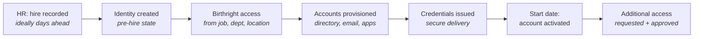
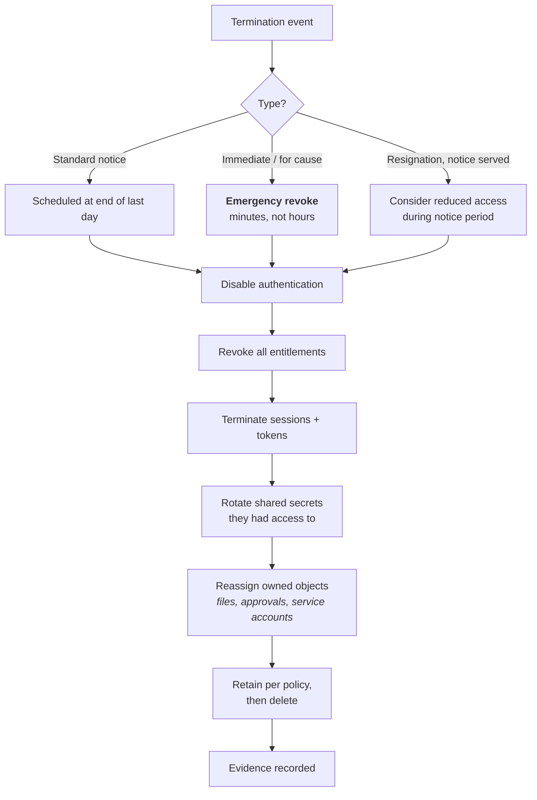

# Joiner, Mover, Leaver

## The spine of enterprise IAM

JML is the process that keeps access aligned with a person's actual relationship to the organisation, from before their first day to after their last.

It sounds trivial. It is the single largest source of IAM effort, audit findings and organisational politics, because it is where **an identity system meets an organisation that changes constantly and documents that change badly**.

{: .concept }
> **The mover is the hard one.** Joiners are easy: nothing exists, create it. Leavers are conceptually easy: remove everything. **Movers are where access accumulates**, because the organisation is enthusiastic about the new access and indifferent to the old. Every "privilege creep" finding in every audit report traces back to a mover process that added and did not subtract. If you fix one thing in a JML design, fix the mover.

---

## Joiner

### The design decisions

**When does the identity get created?** Ideally on *hire*, not on *start date* — pre-hire creation gives time to provision, ship a laptop, and pre-enrol credentials. It also creates a window where an account exists for someone not yet employed, so the account must be in a **pre-hire state**: exists, provisioned, cannot authenticate until the start date.

**What is birthright access?** Access granted automatically from attributes — everyone gets email, intranet, the corporate LMS; everyone in Finance gets the finance drive. Birthright is efficient and is also **the largest source of over-provisioning**: a broad birthright rule multiplied by 5,000 employees is 5,000 grants nobody requested and nobody reviews. Keep birthright to what genuinely *everyone* in that population needs, and put the rest behind request-and-approve.

**How do credentials reach the user securely?** The classic weak point: temporary passwords emailed to a manager, or a predictable pattern. Better: a time-boxed single-use activation link with identity verification, or in-person enrolment on day one, or a Temporary Access Pass that enrols a passkey. This is the moment your entire authentication assurance is established — see [identity proofing](20-identity-proofing.md).

**What about non-employees?** Contractors, consultants, interns, temporary staff, and people who work for a subsidiary with different HR. If there is no authoritative source for them, **you must create one** — usually a sponsor-based registration in the IAM platform itself, with a mandatory end date. This is almost always the messiest part of the programme, and skipping it means your governance covers the population that was already easy.

### Joiner edge cases to design for

- **Rehire** — is it the same identity (history preserved, reactivate) or a new one? Almost always the same, keyed on a stable HR identifier. Handle the case where their old access was never fully removed.
- **Contractor → employee** conversion. Two source systems, one human. Do they keep their identifier, mailbox, history?
- **Employee → contractor**, and dual roles (an employee who is also a board member of a subsidiary).
- **Pre-start cancellation** — the person never arrives. Everything provisioned must roll back.
- **Start date changes**, forwards and backwards.
- **Day-one-critical access** — a trader or a surgeon cannot wait 48 hours. Fast paths need designing, with compensating controls.

---

## Mover

Triggers: department change, manager change, job/role change, location or legal entity change, cost centre change, promotion, going on or returning from long leave, secondment, going part-time.

The three possible policies, and their trade-offs:

| Policy | Behaviour | Trade-off |
|:--|:--|:--|
| **Additive** | Grant new, keep old | Zero disruption, guaranteed privilege creep. Depressingly common |
| **Replace** | Revoke old birthright, grant new | Correct in principle; breaks things when the person still has legitimate residual duties |
| **Additive + review** | Grant new; the *old* access goes to the manager for a targeted review with a deadline | **The practical answer** — no disruption, and a forcing function with an owner |

{: .architect }
> **Design the mover as "grant now, review the remainder within N days, auto-revoke if not confirmed."** Immediate revocation on transfer sounds rigorous and generates a flood of emergency re-requests, which teaches everyone to hoard access "just in case". A targeted micro-certification — *"Maria moved from Finance to Operations. These 12 entitlements are from her old role. Which does she still need?"* — is answerable in two minutes, has a real owner, and produces defensible evidence. It is one of the highest-value controls in an IGA programme and one of the least implemented.

Also design for:

- **Transfer with overlap.** A month of doing both jobs is legitimate. Time-box it and make expiry automatic.
- **Manager change alone.** Approvals and certification routing change even when access doesn't.
- **Reorganisations.** Three thousand movers at once will overwhelm both your connectors ([rate limits](../01-it-fundamentals/08-data-modeling.md)) and your approvers. Bulk events need throttling and a distinct handling path.
- **Long leave** (parental, sabbatical, medical). Suspend rather than delete: disable authentication, keep the identity and — critically — keep the licence question explicit, because Finance will ask.
- **Internal transfer between legal entities or countries**, which can change data residency and lawful basis, not just access.

---

## Leaver

The process auditors examine most closely, because it is where failure is most visible and most consequential.

### The order matters

**Disable authentication first**, before doing anything slow. Removing fifty entitlements takes minutes to hours; disabling the account takes seconds and stops new access immediately. Designs that revoke entitlements first leave a window where a terminated employee can still log in.

Then: kill live sessions and tokens (disabling an account does *not* invalidate an existing session or an unexpired access token — see [sessions](10-sessions-and-logout.md)), revoke entitlements, and handle the residue.

### What everyone forgets

- **Sessions and tokens already issued**, including personal access tokens and OAuth grants they authorised.
- **Shared credentials they knew** — every vaulted account they could check out must be rotated. This is frequently the biggest gap.
- **Objects they own**: files, mailboxes, calendar delegations, workflow approvals in flight, service accounts where they're listed as owner, on-call rotations, application ownership, certificates issued to them.
- **Non-federated systems**: mainframe, physical access badges, building systems, phone system, expense cards, encrypted disk recovery keys.
- **External systems**: partner portals, customer sites, vendor consoles, code repositories under a personal identity, cloud accounts, SaaS signed up with a corporate card.
- **Their own SSH keys and API keys** on servers.

{: .warning }
> **The most common serious audit finding in IAM is leavers with active access — and the cause is almost never the connector.** It is: HR recorded the termination late; the person wasn't an employee so HR never recorded it at all; the application wasn't in the IGA scope; the revocation failed silently into a queue nobody owns. Fix those four and you have fixed most leaver risk. That means your leaver design must include a **data-driven detective control**: reconcile active accounts against HR-active identities weekly, and report the difference to a named owner.

### Leaver variants

| Variant | Special handling |
|:--|:--|
| **Immediate/for cause** | Must be minutes. Needs a pre-built emergency path that HR can trigger without a ticket queue. Rehearse it |
| **Notice period** | Consider reducing access — particularly data export and bulk download — during notice. Insider risk peaks here |
| **Contractor end date** | Automatic and non-negotiable; extensions require re-approval. Never let a contract end date pass without action |
| **Death of an employee** | Handle with care: immediate access removal, but data and mailbox handling need HR/legal, and the process should never generate automated emails to the family |
| **Long-term absence → termination** | Ensure suspended accounts don't linger indefinitely |
| **M&A divestiture** | Bulk leavers, often with data transferring to the acquirer. A programme, not a process |

---

## Making it work

**Speed targets** worth designing to (adjust to your risk appetite, but *have* numbers):

| Event | Target |
|:--|:--|
| Joiner ready before start date | 100% |
| Standard leaver — authentication disabled | Within 4 hours of the HR event, or at end of last day |
| **Privileged** leaver | Within 15 minutes |
| For-cause leaver | Within 15 minutes of the trigger |
| Mover review completed | Within 14 days |

**Measure the whole chain, not the automation.** Time from the *event happening in the real world* to access being correct — not from when your platform received the event. Most of the delay is usually upstream, in HR data entry, and only end-to-end measurement makes that visible to the people who can fix it.

{: .vendor }
> **In the products.** JML is the core use case every IGA platform is built around. **SailPoint** models it as lifecycle states on the Identity Cube with provisioning policies and lifecycle-state transitions. **One Identity Manager** drives it through its `Person` object, employee lifecycle attributes and the rule-based "IT Shop"/assignment engine, with change processes generated by its job service. **Saviynt** and **Omada** offer strongly template-driven joiner/mover/leaver flows. The differences that matter are: how well the tool handles **non-employee populations**, how configurable the **mover** logic is, how failures are surfaced and re-driven, and how easily you can prove the outcome to an auditor.

---

## Architect's checklist

- [ ] What is the **authoritative source** for each population — employees, contractors, interns, partners, subsidiaries?
- [ ] Are identities created **before** the start date, in a pre-hire state?
- [ ] Is **birthright access** minimal and justified, or has it become the main provisioning mechanism?
- [ ] How are **credentials securely delivered** on day one?
- [ ] Does the **mover** process remove or review old access — and can you show evidence?
- [ ] Is there an **emergency leaver path**, and has it been rehearsed end to end?
- [ ] Are **sessions, tokens and shared secrets** handled in the leaver process, not just accounts?
- [ ] Who owns **objects** the leaver leaves behind, and is reassignment automatic?
- [ ] Is there a **weekly reconciliation** of active accounts against HR-active identities, reported to a named owner?
- [ ] Do you measure JML latency **end to end from the real-world event**, and is it reported?
- [ ] Which of the awkward cases (rehire, contractor conversion, dual role, long leave, death, divestiture) are **designed for** rather than handled ad hoc?

---

**Next:** [Identity Governance (IGA)](15-identity-governance.md) →
