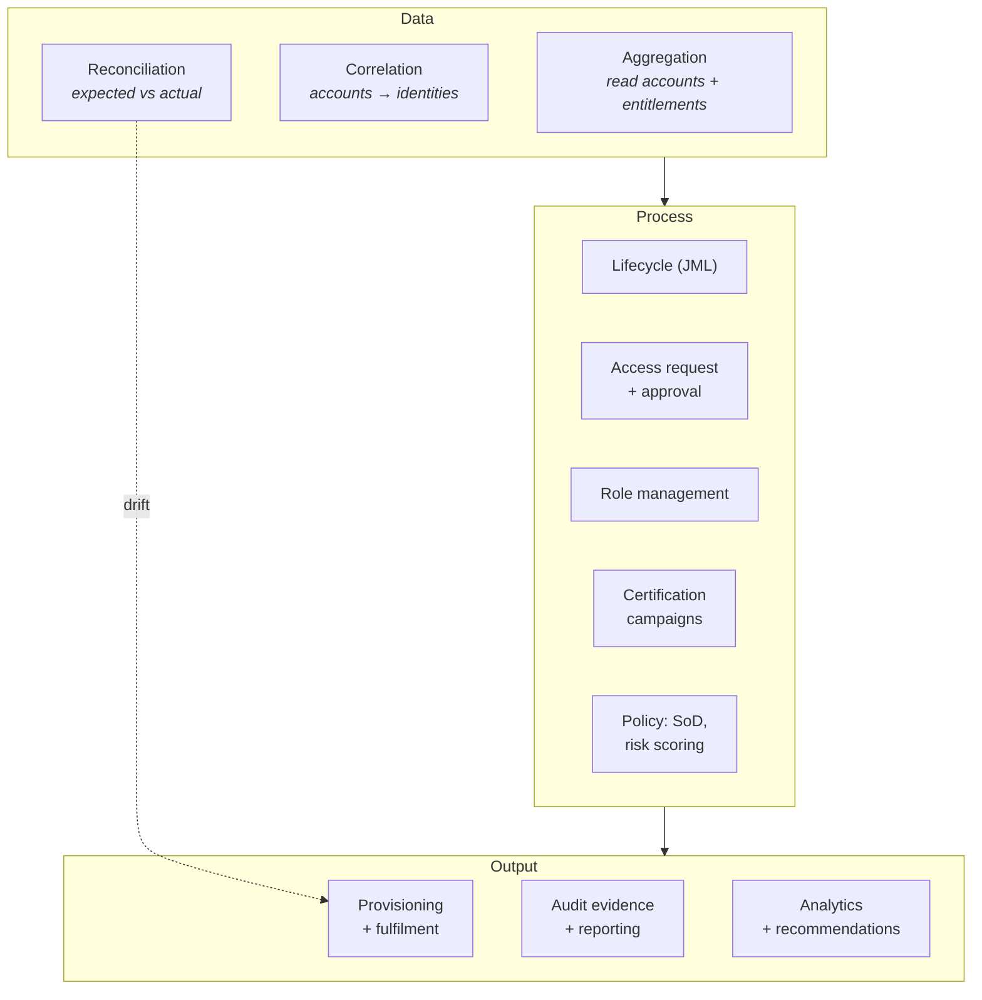
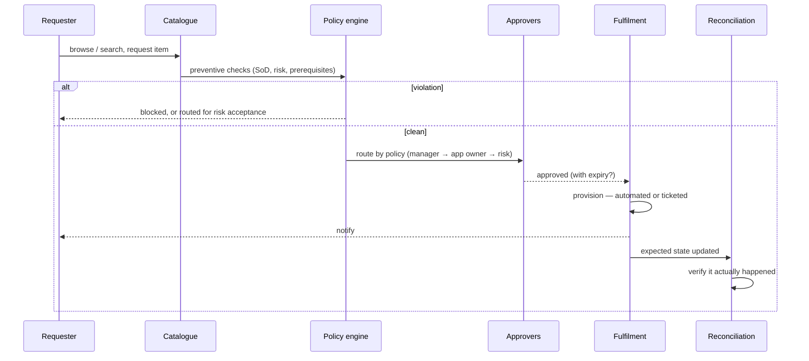

# Identity Governance & Administration

## What IGA is for

IGA answers the questions that authentication and authorisation cannot:

- **Who has access to what**, across every system, right now?
- **Why** do they have it — who decided, on what basis, when?
- **Should they still have it?**
- **How do we prove all of the above to someone who doesn't trust us?**

{: .concept }
> **Access management is a runtime control; governance is an evidentiary discipline.** An access management system can be perfectly configured and you would still fail an audit if you cannot show *who approved this access, when it was last reviewed, and that the leaver's access was removed on the date claimed*. IGA exists to produce that evidence as a by-product of the process — not by asking people to assemble it in spreadsheets each quarter.

---

## The capability map

| Capability | What it does |
|:--|:--|
| **Aggregation** | Read every account and entitlement from every connected system |
| **Correlation** | Match accounts to identities; surface orphans |
| **Reconciliation** | Compare intended state with actual state; detect unmanaged change |
| **Lifecycle** | [Joiner, mover, leaver](14-joiner-mover-leaver.md) automation |
| **Access request** | A catalogue users can request from, with approvals and policy checks |
| **Role management** | Define, assign, mine and maintain [roles](16-role-modelling.md) |
| **Certification** | Periodic [attestation](17-sod-and-certification.md) that access is still appropriate |
| **Policy** | [Segregation of duties](17-sod-and-certification.md), risk scoring, preventive checks |
| **Fulfilment** | Provisioning, or ticketed manual execution |
| **Reporting & analytics** | Evidence, KPIs, outlier detection, recommendations |

---

## The access request lifecycle

Design decisions that determine whether people use it:

**Catalogue quality.** If the item is called `SAP_ZFI_0042_PROD_RW`, nobody will find it and everybody will ask their colleague what to request. Business-meaningful names, descriptions written for the requester, an owner, a risk rating and search that works. **Catalogue quality is the single biggest driver of adoption**, and it is boring, unglamorous, essential work.

**Approval routing.** More approvers is not more control. Three-step approval chains where each approver assumes the next one is the real check produce *less* scrutiny than a single accountable approver. Route by risk: low-risk items auto-approve or manager-only; high-risk items go to a data owner who actually understands the entitlement.

**Preventive policy.** Checking SoD *before* granting is worth far more than detecting it afterwards — it avoids the conversation where you must take something away from someone who's been using it for six months.

**Time-bound access by default for anything risky.** Requests with an expiry date remove the need for a future revocation conversation entirely. Make "until when?" a required field for high-risk items.

{: .architect }
> **The most under-used mechanism in IGA is expiry.** Every high-risk grant should have an end date, after which it lapses unless renewed. This converts an *organisational* problem ("please give up access you no longer need", which nobody ever volunteers for) into a *system* behaviour that requires no goodwill. Time-bound access, plus targeted mover reviews, will do more for privilege creep than any number of quarterly certification campaigns.

---

## Certification (access review)

Periodic confirmation that access is still appropriate. Covered in depth in [SoD & certification](17-sod-and-certification.md); the governance-level points:

- **Rubber-stamping is the default outcome** unless you design against it. A manager shown 400 cryptic entitlements will click "approve all".
- Reduce volume with **risk-based scoping** (certify high-risk quarterly, low-risk annually or never) and **micro-certifications** triggered by events (transfer, role change, anomaly).
- Make the reviewer someone who **knows the answer** — often the application or data owner rather than the line manager.
- **Revocations must actually execute**, and closing the loop is the part that fails: a campaign that produces 300 revoke decisions and 40 completed revocations is worse than useless, because it creates evidence of a control that didn't operate.

---

## Risk scoring

Mature IGA weights identities and entitlements by risk, so effort concentrates where it matters:

**Entitlement risk** — what it grants, data sensitivity, whether it's privileged, SoD relevance, regulatory scope, how many people already have it (a rare entitlement is more interesting than a universal one).

**Identity risk** — accumulation of risky entitlements, outlier status (having access unlike anyone else in the same role), SoD violations, dormancy, privileged status, whether they're a leaver-in-notice.

Uses: prioritising certification, gating approvals, targeting analytics, and giving the security team a defensible list of *who to look at first*.

---

## Analytics and "identity intelligence"

Modern platforms add: peer-group analysis (Maria has 14 entitlements nobody else in her role has — why?), recommendation engines during approval, role-mining suggestions, dormant-access detection, and anomaly flags.

{: .warning }
> **Treat recommendations as evidence, not as decisions.** "94% of peers have this, recommend approve" is genuinely useful for reducing reviewer load. It also mechanises the propagation of whatever over-provisioning already exists — the peer group is only a good benchmark if the peer group is correct. Use recommendations to *rank* what a human should look at, not to replace the human on high-risk items.

---

## What makes IGA programmes fail

In rough order of frequency:

1. **Data quality.** Bad HR data, missing managers, no contractor source. See [identity data quality](19-identity-data-quality.md).
2. **Scope.** Trying to onboard 200 applications at once instead of the 20 that carry the risk.
3. **Role model ambition.** A two-year enterprise role project that delivers nothing until it's finished — and then doesn't fit.
4. **No business ownership.** IT owns the tool; nobody owns the *decisions*. Entitlements with no owner cannot be certified meaningfully.
5. **Treating it as a tool deployment.** IGA is a business process programme that happens to involve software. Configure-and-go always disappoints.
6. **No reconciliation.** Provisioning only, so unmanaged change goes undetected and the data drifts away from truth.
7. **Certification fatigue.** Too much, too often, too cryptic, no consequences — the control becomes theatre.

{: .architect }
> **Sequence that works:** connect the **authoritative source** first, then the **directory**, then **leaver automation** (fastest visible risk reduction and the easiest audit win), then the **top 10–20 risk applications** for aggregation and certification, then access request, then roles. Role modelling last, informed by data you now have. Programmes that start with the role model spend two years in workshops and deliver nothing an auditor can see.

---

## The operating model question

IGA is not a system you launch and leave. Someone must, forever:

- Onboard new applications (a steady, permanent stream).
- Own the **exception queue** — failed provisioning, orphan accounts, uncorrelated identities — and clear it daily.
- Run certification campaigns and chase the non-responders.
- Maintain the role model and the catalogue.
- Answer auditors.
- Manage entitlement and application ownership as owners leave.

If nobody is funded for that, the platform decays into an expensive report generator within eighteen months. Design the [operating model](../06-business-and-risk/05-operating-model.md) as part of the architecture, not as an afterthought at go-live.

{: .vendor }
> **In the products.** **SailPoint** (IdentityIQ on-prem, Identity Security Cloud SaaS) is the market reference for IGA, strongest in certification, analytics and connector breadth. **One Identity Manager** is exceptionally powerful for complex, deeply-customised enterprise environments — its object model and process engine can express almost anything, at the cost of a steeper learning curve and more dependence on skilled configuration. **Saviynt** is cloud-native with strong application-GRC and cloud-entitlement coverage. **Omada** targets Microsoft-centric estates with a strongly templated best-practice process. **Microsoft Entra ID Governance** covers Microsoft-first estates well and is often "good enough" when the estate is genuinely Entra-centric — the trap is assuming that when it isn't. See [Stage 5](../05-platform-landscape/).

---

## Architect's checklist

- [ ] Can you produce, for **any user**, their full access with the source of each grant — and how long does it take?
- [ ] Can you produce, for **any entitlement**, everyone who holds it and why?
- [ ] Is every connected system **reconciled**, not just provisioned to?
- [ ] Does every entitlement in the catalogue have an **owner**, a description a human understands, and a risk rating?
- [ ] Are **preventive** SoD checks applied at request time, not only detected afterwards?
- [ ] Is **time-bound access** available and used for high-risk grants?
- [ ] Are certification campaigns **risk-scoped**, and do revocations actually complete? What's the completion rate?
- [ ] Who owns the **exception queue**, and what is its current depth and age?
- [ ] Is there a funded **operating model** for the run phase?
- [ ] What percentage of the estate's **risk** (not applications) is under governance?

---

**Next:** [Role Modelling & Mining](16-role-modelling.md) →
