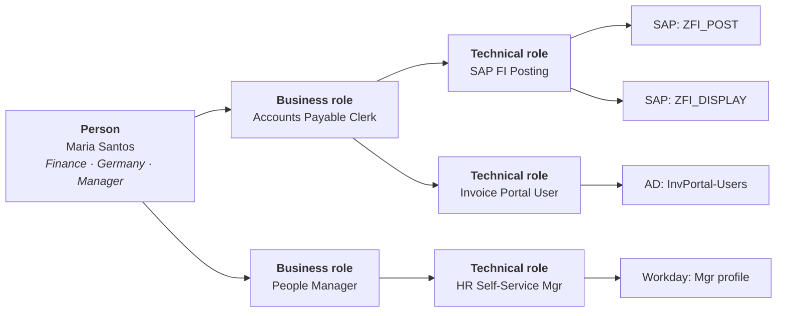

# Role Modelling & Mining

## Why roles exist, and why they disappoint

Roles bundle entitlements so access can be managed in units a business person understands. The promise: assign "Accounts Payable Clerk" and the right twelve entitlements appear across six systems.

The reality, in most organisations: hundreds or thousands of roles, many held by one person, most poorly named, few reviewed, and a parallel universe of direct assignments that bypass them entirely.

{: .concept }
> **A role is a hypothesis about the organisation: "people who do this job need this access."** Like any hypothesis it can be wrong, and it *decays* as the organisation changes. Role models fail not because the initial modelling was bad but because **nobody owns them afterwards**. Design the maintenance before you design the model.

---

## The two-layer model

The mistake that causes most role explosion is a single flat layer of roles that mixes business meaning with technical grants. Separate them:

| Layer | Owned by | Changes when | Named like |
|:--|:--|:--|:--|
| **Business role** | The business (HR, department head) | The organisation changes | "Accounts Payable Clerk" |
| **Technical role / entitlement bundle** | The application owner | The application changes | "SAP FI Posting" |
| **Entitlement** | The application | Never (it's the system's own construct) | `ZFI_POST` |

The value of the split: when SAP is upgraded and the underlying roles change, you update the *technical* layer and no business role definition changes. When a new job function appears, you compose it from existing technical roles. Without the split, every system change ripples into business-facing definitions and every organisational change ripples into system configuration.

---

## Assignment mechanisms

| Mechanism | How | Use for |
|:--|:--|:--|
| **Birthright / automatic** | Rule on attributes: *department = Finance → Finance Basic* | Universal, low-risk access |
| **Requestable** | User asks; approval required | Most access |
| **Rule-based dynamic** | Continuously evaluated; membership changes as attributes change | Powerful and dangerous — a bad HR value silently grants or removes access at scale |
| **Manually assigned** | Direct grant | Exceptions; should be visible, justified and time-boxed |

{: .warning }
> **Dynamic rules are provisioning with a delay fuse.** A rule saying `department == "Finance"` grants access to everyone HR ever puts in Finance — including the new team transferred in during a reorganisation that nobody told you about. Rule-based assignment needs the same review rigour as the entitlements themselves, plus **change simulation**: before activating or editing a rule, show how many identities it will affect and who. Every mature platform supports this; use it every time.

---

## Role mining

Deriving roles from data rather than from workshops.

### Bottom-up (data-driven)

Cluster people by the entitlements they actually hold; propose roles for the common patterns.

**Strengths:** reflects reality, fast, finds patterns nobody articulated.
**Weakness:** **it mines the current state, including everything wrong with it.** If 80% of Finance has access they shouldn't, your mined role encodes that as "normal" and blesses it.

### Top-down (business-driven)

Interview the business: what does this job need? Build roles from job function.

**Strengths:** roles are meaningful and defensible; reflects intent rather than accident.
**Weakness:** slow, expensive, and people describe the job they *should* do rather than what they actually need. Consistently under-specifies, producing roles that don't work on day one.

### Hybrid — the only approach that works

1. Mine bottom-up to see the actual landscape.
2. Bring candidate roles to the business for validation, using the data as the conversation starter.
3. The business confirms, splits, merges and **removes** — the removals are the whole point.
4. Pilot with a small population before rolling out.
5. Measure coverage and refine.

{: .architect }
> **Role mining output is never directly usable, and treating it as if it were is the classic failure.** The algorithm gives you candidates and statistics; the business gives you meaning and legitimacy. A mined role that 90% of a department holds might be a genuine job function — or it might be an entitlement that was over-granted in 2019 and copied ever since. Only a human who understands the work can tell the difference, and getting that human's time is the actual constraint on role projects.

---

## The metrics that matter

| Metric | Healthy | Warning sign |
|:--|:--|:--|
| **Role coverage** — % of assignments delivered through roles vs direct | >70% | <40% means the model isn't being used |
| **Roles per user** | Low single digits | Double digits means roles are too granular |
| **Users per role** | Meaningful populations | Many single-member roles = role explosion |
| **Role count vs user count** | Roles ≪ users | Roles approaching user count means you've modelled individuals |
| **Roles with no owner** | 0 | Anything else is ungoverned |
| **Roles unchanged in 24 months** | Few | Suggests decay, not stability |
| **Direct (non-role) assignments** | Declining | Growing means the model doesn't fit reality |

**Single-member roles** deserve special attention. A few are legitimate (a genuinely unique job). Hundreds mean the model is describing people rather than functions — and at that point the role layer adds overhead without adding comprehension.

---

## Role explosion, and how to avoid it

Roles multiply when every variation becomes a new role: *AP Clerk*, *AP Clerk DE*, *AP Clerk DE Capex*, *AP Clerk DE Capex Approver*…

Mitigations, in order of leverage:

1. **Put dimensional data in attributes, not role names.** Country, entity, cost centre and approval limit are *parameters* — handle them with [ABAC constraints](12-authorization-models.md) or scoped assignment, not by multiplying roles.
2. **Use the two-layer model**, so system granularity doesn't leak into business roles.
3. **Allow composition**: a person can hold several roles. Two roles beat one combined role for every pair.
4. **Set a naming standard and enforce it at creation.**
5. **Require an owner and a business description** before a role can exist.
6. **Review and retire.** Roles with no members for six months should be flagged and removed.
7. **Cap the exception path** — direct assignments are allowed but must be time-boxed and reported.

---

## Roles and SoD

Roles are where [segregation of duties](17-sod-and-certification.md) is most efficiently enforced — a well-designed role never contains a toxic combination internally. But **SoD violations arise from role *combinations***, so:

- Check SoD **within** each role at design time (a role that violates SoD is a defect).
- Check SoD **across** roles at assignment time (preventive).
- Re-check when a role's contents change — this is the one everyone forgets. Adding an entitlement to a role can create violations for hundreds of existing holders, silently. **Every role change must trigger a re-evaluation of all its holders.**

---

## When not to build a role model

Genuinely legitimate reasons to skip or defer:

- **The organisation is too volatile.** Fast-changing startups and matrix organisations where "job function" isn't stable enough to model. Attribute-based assignment plus strong request-and-review works better.
- **The access is inherently individual** — research, project-based work, client-service organisations where every engagement differs.
- **You have no data quality yet.** Modelling on bad data produces bad roles that are then hard to unwind. Fix the data first.
- **There's nobody to own it.** A role model without ongoing ownership becomes a liability within two years.

A defensible position: **model roles for the 60–70% of the population with stable, repeatable job functions, and use request-and-approve with time-bound grants for the rest.** Partial coverage with maintenance beats complete coverage that decays.

{: .vendor }
> **In the products.** All major IGA platforms include role management and mining. **SailPoint** has mature role modelling plus AI-assisted role discovery and recommendations. **One Identity Manager** implements a rich hierarchical model — business roles, organisational structures (departments, cost centres, locations), application roles and the IT Shop — with dynamic and rule-based assignment; it's very powerful for expressing complex enterprise structures and correspondingly demanding to design well. **Saviynt** offers cloud-native mining and peer analytics. The tool is rarely the constraint; **business availability for validation** is.

---

## Architect's checklist

- [ ] Is there a **two-layer** separation between business roles and technical entitlement bundles?
- [ ] Does every role have an **owner**, a business description and a review cadence?
- [ ] What is **role coverage**, and is it trending up?
- [ ] How many **single-member roles** exist, and is that number growing?
- [ ] Are dimensional attributes (country, entity, limit) handled as **parameters** rather than as role name suffixes?
- [ ] Is there **change simulation** before activating or editing a dynamic rule?
- [ ] Does a **role content change** trigger SoD re-evaluation for all existing holders?
- [ ] Are **direct assignments** visible, justified, time-boxed and reported?
- [ ] Is there a **retirement process** for unused roles?
- [ ] If there's no role model: is the alternative (attributes + request + expiry) **deliberate and documented**, or just absence?

---

**Next:** [SoD & Access Certification](17-sod-and-certification.md) →
