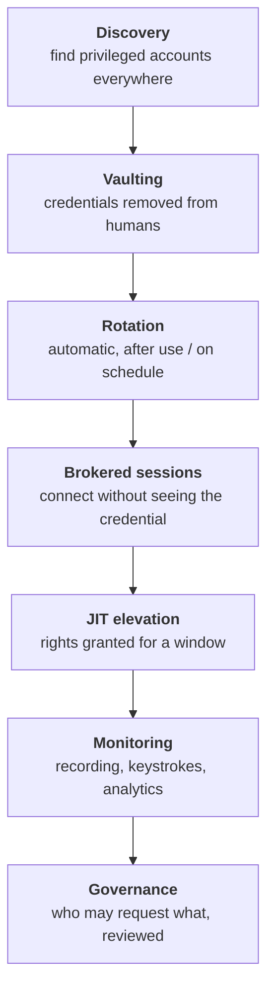
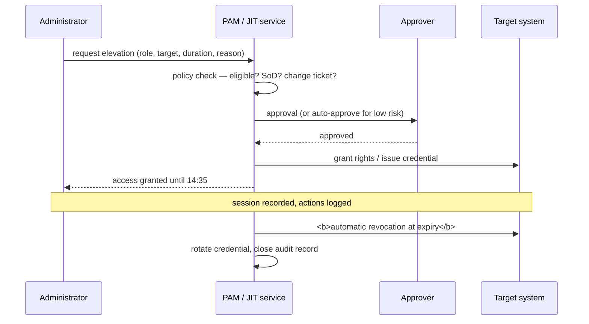

# Privileged Access Management

## What makes access "privileged"

Not a job title — a **capability**. Access is privileged when it can:

- Bypass or disable security controls (including logging).
- Access or exfiltrate data at scale rather than per record.
- Change the system's own configuration or the identity system itself.
- Affect availability of something that matters.
- Act as, or on behalf of, other identities.

That definition catches things people forget: the CI/CD service account that deploys to production, the backup operator who can restore any file anywhere, the SaaS super-admin in a marketing tool holding the entire customer database, the developer with `kubectl` cluster-admin, the person who administers the SIEM.

{: .concept }
> **PAM's core insight: privilege should be *borrowed*, not *held*.** Standing privilege is a permanent liability — it's available to an attacker at all times, whether or not the legitimate holder is working. Time-bound, approved, monitored, session-scoped elevation converts that permanent exposure into a small, auditable window. Everything PAM does is in service of that shift.

---

## The capability stack

| Capability | What it delivers |
|:--|:--|
| **Discovery** | You cannot vault what you haven't found. Continuous, not one-off — new privileged accounts appear weekly |
| **Vaulting** | Credentials stored centrally, checked out under policy. Humans stop knowing passwords |
| **Rotation** | Automatic change after checkout or on schedule. Makes a leaked credential short-lived |
| **Session brokering** | The user connects *through* the PAM system; the credential is injected and never displayed |
| **Session recording** | Video/keystroke record for forensics and deterrence |
| **JIT elevation** | Rights granted for a defined window with approval, then automatically removed |
| **Least-privilege enforcement on endpoints** | Remove standing local admin; elevate specific applications instead |
| **Secrets management for applications** | Removing hardcoded credentials — see [NHI](../03-identity-domains/04-non-human-identities.md) |
| **Analytics** | Detect unusual privileged behaviour: odd hours, unusual targets, mass operations |

---

## Design decisions

**Separate privileged identities from daily-use ones.** An administrator should have `maria` for email and browsing, and `maria-adm` for administrative work — with the admin account unable to read email or browse the web. This is the single most effective PAM design decision, because it prevents the most common compromise path: a phished email lands on a session that also holds domain admin.

**Tiering.** The Microsoft tier model generalises well: Tier 0 = identity infrastructure (domain controllers, IdP, PAM itself, CA), Tier 1 = servers and business applications, Tier 2 = workstations. **Credentials from a higher tier must never appear on a lower-tier machine.** Most real-world escalations are a tier violation, not an exotic exploit. Enforce with separate accounts, authentication silos, logon restrictions and privileged access workstations.

**Privileged Access Workstations (PAWs).** Administration performed only from hardened, dedicated devices with no email or general browsing. Expensive and unpopular; the correct answer for Tier 0.

**Break-glass.** Emergency access that works when everything else doesn't — including when the IdP, the PAM system or the network is down. Design it explicitly:

- Cloud-native or local accounts, excluded from federation and conditional access.
- Credentials split, sealed and physically secured; or in a separate vault with a different failure domain.
- **Excluded from automated MFA policies** (otherwise a policy error locks you out permanently) but with alternative strong controls.
- **Loud alerting on any use** — to multiple people, on channels that don't depend on the systems that might be down.
- Tested on a schedule, and rotated after every use and test.

{: .warning }
> **The most common break-glass failure is that it was never tested, and the second is that using it is silent.** Both are discovered during an incident. Test annually, alert loudly, rotate afterwards, and make sure the alert reaches a human on a path that survives the outage you're breaking glass for.

**Fail-open or fail-closed?** If the PAM system is unavailable at 3am during a production outage, can administrators still work? Fail-closed is more secure and can turn an outage into a catastrophe; fail-open undermines the control. The usual resolution: high availability for the PAM system, plus a tightly-controlled, heavily-alerted break-glass path. Decide it consciously and write it down.

---

## Just-in-time access

The direction every mature programme moves toward:

The essential properties: **eligibility is standing, access is not.** A person is *eligible* to become a database administrator; they *are* one for 90 minutes, with a reason, after approval, with a recording.

Integration with change management is what makes it defensible: requiring a valid change ticket for production elevation ties every privileged action to an approved business reason. Auditors love it, and it's genuinely useful during incident review.

---

## Where PAM programmes struggle

**Politics.** PAM takes power away from the people with the most technical influence in the organisation. Administrators experience it as distrust and as friction added to work they're judged on. Resistance is guaranteed and must be managed as a change programme, not as a deployment.

**Application-to-application credentials.** Hardcoded passwords in scripts, config files and code. Harder than human PAM because it requires code changes across teams who have their own priorities. Usually the largest remaining gap two years into a programme.

**Discovery never finishes.** New cloud accounts, new SaaS admin consoles, new Kubernetes clusters, new CI/CD tokens. If discovery is a project rather than a continuous process, the coverage number is fiction within months.

**Cloud and SaaS privilege.** Traditional PAM was built for servers and network devices. Cloud IAM roles, SaaS super-admins and Kubernetes RBAC need different mechanisms — increasingly native ones ([Entra PIM](../01-it-fundamentals/07-cloud-fundamentals.md), AWS role sessions) integrated with, rather than replaced by, the vault.

**Session recording at scale.** Storage, privacy (works councils and employee-monitoring law in several jurisdictions), and the fact that nobody watches recordings unless there's an incident. Value is forensic and deterrent; size the retention accordingly and get legal sign-off early in Europe.

{: .architect }
> **Sequence PAM by blast radius, not by ease.** Tier 0 first — domain admins, IdP administrators, PAM administrators themselves, cloud root/global admin. Then production infrastructure. Then application administrators. Then endpoints. Then application-to-application secrets. Every step is harder than the last, and every step is also less catastrophic if delayed. Programmes that start with the easy, low-risk population get good coverage numbers and leave the actual risk untouched.

---

## Relationship to IGA

They overlap and must be integrated:

- **IGA governs *who may become* privileged** — eligibility is an entitlement, requested, approved and certified like any other.
- **PAM governs *how privilege is exercised*** — checkout, elevation, session, recording.
- **Both feed the leaver process.** A leaver's PAM eligibility must be removed, *and* every shared credential they could check out must be rotated. The second is regularly missed.
- **Certification of privileged eligibility** should be more frequent and more scrutinised than ordinary access.

{: .vendor }
> **In the products.** **CyberArk** is the market reference — deep vaulting, session management, endpoint privilege manager and secrets management, with a heavier deployment footprint. **Delinea** (Thycotic/Centrify) and **BeyondTrust** compete strongly, often on faster time-to-value. **One Identity Safeguard** covers vaulting and session management and integrates with One Identity Manager, which is a genuine advantage when the same platform governs eligibility and lifecycle. **HashiCorp Vault** dominates *application* secrets rather than human PAM. Cloud-native options (**Entra PIM**, AWS IAM Identity Center session policies, GCP privileged access) increasingly handle cloud-role elevation better than a bolt-on vault does. Most large estates end up with a vault plus native cloud JIT, and the architecture question is where the boundary sits and who governs eligibility across both.

---

## Architect's checklist

- [ ] Is there a written, agreed definition of **"privileged"** in this organisation?
- [ ] Do administrators have **separate accounts** for privileged work?
- [ ] Is a **tier model** defined and actually enforced (logon restrictions, PAWs for Tier 0)?
- [ ] What percentage of privileged accounts are **vaulted and rotated** — and how confident are you in the denominator?
- [ ] Is **discovery continuous**, covering cloud, SaaS and Kubernetes?
- [ ] Is access **just-in-time**, or standing? What's the roadmap to JIT for the highest tiers?
- [ ] Is **break-glass** designed, tested, alerted on, and rotated after use?
- [ ] What happens if the **PAM system is unavailable** — and was that decided or defaulted?
- [ ] Are **application-to-application credentials** in scope, with a plan?
- [ ] Does the **leaver process rotate** every shared credential the leaver could access?
- [ ] Is privileged **eligibility governed by IGA** and certified more often than standard access?

---

**Next:** [Identity Data Quality](19-identity-data-quality.md) →
