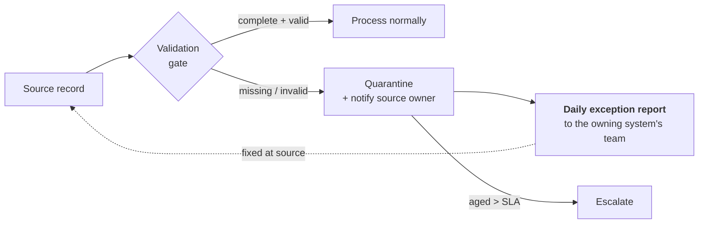

# Identity Data Quality

## The unglamorous determinant of success

Ask experienced IAM architects why programmes fail and you will hear "data" far more often than any technology answer. Not because data problems are hard to understand — because they belong to *other people*, surface late, and cannot be solved by the IAM team alone.

{: .concept }
> **Every automated access decision is a function of identity data.** Birthright access derives from department and job code. Approval routing derives from the manager field. Certification campaigns route to that same manager. SoD depends on job function. Deprovisioning depends on the termination date. **If the data is wrong, the automation confidently does the wrong thing at scale — which is worse than doing nothing manually, because it's fast and nobody's watching.**

---

## What "bad data" looks like

Every discovery finds the same list:

| Problem | Consequence |
|:--|:--|
| Manager field empty, or pointing at a leaver | Requests and certifications can't route; campaigns stall |
| Free-text department: `Finance`, `finance`, `FIN`, `Fin.` | Rules match some people and not others, silently |
| 400 job codes for 30 actual jobs | Role modelling is impossible |
| Contractors with no end date | Access never expires |
| No authoritative source for non-employees | An entire population is ungoverned |
| Duplicate identities (rehire, name change, M&A) | Access fragmented across records; leaver processing misses one |
| Termination recorded days late | Leaver SLA breached before you ever saw the event |
| Cost centre that no longer exists | Approvals route nowhere |
| Non-employees recorded in the employee system with fake data | Poisons every rule based on employment attributes |
| Email as the identifier, changing on marriage or rebrand | Broken correlation, orphaned accounts |

---

## Authority and conflict

**Authority is per attribute, not per system.** HR owns employment attributes. The directory owns technical identifiers. The contractor system owns sponsors and end dates. The application owns its own entitlements.

Design decisions to make explicitly:

1. **Precedence.** When two sources disagree, which wins? Encode it; don't leave it to whichever process ran last.
2. **Direction of flow.** Does IAM write back corrections to the source, or only report them? Writing back creates a second master; reporting keeps authority clean but depends on someone acting.
3. **Conflict handling.** Overwrite, flag for review, or quarantine the record. High-impact attributes (status, manager, termination date) should flag rather than silently overwrite.
4. **Gaps.** What happens when a required attribute is missing? Silently proceeding is how identities end up with no access, or with default access nobody intended.

{: .architect }
> **Never cleanse identity data inside the IAM platform.** Fixing a department value in the IGA tool creates a divergence from the source that will be silently overwritten on the next sync — or worse, won't be, and now two systems disagree permanently. **Report the defect to the owner of the source and block processing until it's fixed.** The IAM platform's job is to make bad data *visible and attributable*, not to paper over it. This is unpopular for about two months and then becomes the thing that makes the programme work.

---

## Data quality gates

Define the **minimum viable identity**: the attributes required before an identity can be processed at all. Typically: unique stable identifier, name, type (employee/contractor/etc.), status, start date, end date (for non-permanent), manager (or an explicit exception), department/cost centre, and location or legal entity.

Then enforce:

The quarantine queue must have: an **owner in the source organisation**, a **daily report**, an **SLA**, and **escalation**. Without those it becomes a growing list nobody reads, which is where most data quality efforts end.

---

## Metrics that drive behaviour

Publish these per source system, with the owning team named:

| Metric | Target |
|:--|:--|
| Identities with all mandatory attributes | >99% |
| Identities with a valid, active manager | >99% |
| Non-employees with a future end date | 100% |
| Duplicate identity candidates | Trending to 0 |
| Orphan accounts (no correlated identity) | Trending to 0, with each one categorised |
| Median lag: real-world event → source record → IAM | Hours, not days |
| Records in quarantine, and their age | Small and young |

{: .architect }
> **Attribution is the mechanism, not the measurement.** "HR has 340 records with no valid manager, which is blocking 340 access certifications and 12 leaver processes" is a sentence that causes work to happen. "Data quality is 94%" is a sentence that causes nothing. Name the system, name the impact, name the owner, repeat weekly. This is the highest-leverage thing an IAM architect does in the first six months of a programme, and it is entirely non-technical.

---

## Correlation and duplicates

Covered mechanically in [data modelling](../01-it-fundamentals/08-data-modeling.md); the governance dimension:

- **Duplicates are a security problem, not a tidiness problem.** A rehired employee with two identities may have their old access silently retained under the record the leaver process didn't touch.
- **Merging is destructive and hard to undo.** Require human confirmation for anything below high confidence, keep an audit trail of merges, and make them reversible where possible.
- **Prevention beats detection**: a stable, mandatory identifier issued at first hire and reused forever (including on rehire) eliminates most of the problem. Getting HR to do that is an organisational negotiation, and it's worth having.

---

## The non-employee problem

Consistently the largest data gap, and consistently underestimated in planning.

Contractors, consultants, agency staff, interns, vendors, auditors, partners, seasonal workers, board members, service providers, and staff of acquired companies not yet migrated. Common characteristics: no HR record, managed in spreadsheets or a procurement system, no reliable end date, no leaver event when the engagement ends, and often *more* privileged than employees (external administrators, auditors with read-everything access, consultants with production access).

The architectural answer:

1. **Create an authoritative source** — either an existing procurement/vendor-management system, or a sponsor-based registration capability in the IAM platform itself.
2. **Mandatory sponsor** — a named employee accountable for this person, who inherits the responsibility to confirm continuation.
3. **Mandatory end date**, maximum duration (90–180 days is common), and **automatic expiry with re-attestation** rather than silent extension.
4. **Distinct identity type** so policy and reporting can treat them differently.
5. **Sponsor's own leaver process triggers review** of everyone they sponsor — otherwise a departing manager leaves a set of orphaned external identities with nobody accountable.

---

## Building the case

Data quality work is unglamorous and competes for attention with visible features. Frame it in consequences:

- *"We cannot automate leaver processing for 1,400 contractors because no system knows when their engagement ends. That's 1,400 accounts with no expiry."*
- *"38% of certification campaigns can't be routed because the manager field is empty or points at a leaver. That's a control failure, and it's on the audit finding."*
- *"Every €X we spend on automation is limited by data we don't own. Here is the specific list, the owning team, and the impact of each."*

Then make it someone's objective. Data quality does not improve because the IAM team wants it to; it improves when the owner of the source system is measured on it.

---

## Architect's checklist

- [ ] Is there an **attribute-level authority map**, agreed with source system owners?
- [ ] Is **precedence and conflict handling** defined for every shared attribute?
- [ ] Is there a **minimum viable identity** definition, enforced by a validation gate?
- [ ] Does the **quarantine queue** have a named owner, a daily report, an SLA and escalation?
- [ ] Are data quality metrics published **per source system with the owning team named**?
- [ ] Is there an **authoritative source for non-employees**, with sponsors and mandatory end dates?
- [ ] Does a **sponsor's departure** trigger review of the identities they sponsor?
- [ ] Is there a **stable identifier** issued at first hire and reused on rehire?
- [ ] Are **duplicate merges** confirmed by a human, audited and reversible?
- [ ] Does the IAM platform **cleanse data** anywhere it shouldn't?

---

**Next:** [Identity Proofing & Verification](20-identity-proofing.md) →
