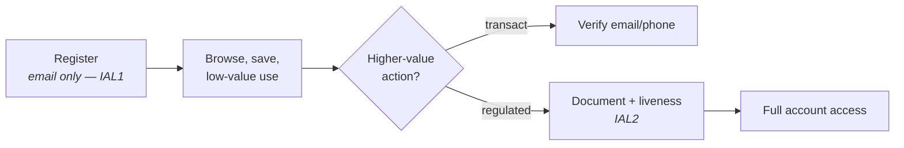

# Identity Proofing & Verification

## The foundation everything else rests on

Authentication proves someone controls a credential. **Proofing is what made that credential mean something in the first place** — the process of establishing, at enrolment, that a claimed real-world identity is genuine and belongs to the person claiming it.

{: .concept }
> **Every authentication is only as strong as the proofing that preceded it.** A passkey enrolled after a helpdesk agent verified someone by asking their date of birth is a phishing-resistant credential bound to an unverified identity. Attackers understand this asymmetry perfectly, which is why enrolment and account recovery are attacked far more often than login. If you invest in authentication and not in proofing, you have moved the attack, not stopped it.

---

## The stages

| Stage | What happens |
|:--|:--|
| **Resolution** | Collect enough attributes to distinguish this person from everyone else |
| **Validation** | Confirm the evidence is genuine, current and not forged |
| **Verification** | Confirm the person presenting it is the person it belongs to |
| **Binding** | Bind an authenticator to the now-verified identity |

The fourth stage is the one architects most often leave undesigned. Perfect proofing followed by "we emailed them a link to set a password" leaks the assurance you just paid for.

---

## Assurance levels

NIST SP 800-63A's **IAL** vocabulary:

| Level | Requirement | Typical use |
|:--|:--|:--|
| **IAL1** | Self-asserted; no proofing | Forums, newsletters, low-value consumer accounts |
| **IAL2** | Remote or in-person, with validated evidence and biometric/liveness comparison | Most regulated consumer services, financial onboarding, workforce |
| **IAL3** | In-person or supervised remote, strong evidence, trained operator | Government credentials, high-security clearance, critical infrastructure |

The European counterpart is **eIDAS** (Low / Substantial / High), with national schemes (BankID, itsme, eIDAS-notified national eIDs) providing reusable high-assurance identity that a relying party can consume instead of proofing themselves.

---

## Methods

| Method | Assurance | Notes |
|:--|:--|:--|
| **Document + selfie with liveness** | Medium–high | The mainstream remote method. Liveness detection is essential and is an arms race against injection attacks and deepfakes |
| **NFC chip read (ePassport, eID)** | High | Cryptographically verifiable; far stronger than photographing a document |
| **Bank/eID verification** | High | Reuses proofing already done by a regulated institution. Excellent where available |
| **Knowledge-based (KBA)** | **Low** | Questions from credit or public data. Widely broken — the data is in breach dumps |
| **Database checks** | Low–medium | Confirms the identity exists, not that this person is it |
| **Mobile network signals** | Medium | Line tenure, SIM-swap recency. A good *signal*, weak alone |
| **In-person with trained operator** | High | Costly; the reference standard |
| **Vouching / sponsorship** | Contextual | Workforce and non-employee onboarding: an accountable existing identity vouches |

{: .warning }
> **Generative AI has changed the threat model for remote proofing.** Synthetic documents, face-swapped video and injected camera streams are cheap and improving. Liveness detection that only checks "is this a live human" is no longer sufficient — you need **injection-attack detection** (is this a real camera, or a virtual one?) plus document authenticity checks that don't rely solely on the visual image. NFC chip reading is materially stronger than any photo-based check for exactly this reason. If your design depends on a selfie-and-document vendor, ask specifically about injection detection and how they handle synthetic media, and expect to reassess the vendor periodically.

---

## Workforce proofing

Enterprises often skip this entirely — HR hired them, so they exist. That's mostly reasonable: the employment process does its own proofing (right-to-work checks, references, background screening). But there are gaps worth closing:

- **Remote onboarding.** The person who receives the laptop and activates the account may not be the person who was hired. Proof at first credential issuance, not just at contract signature.
- **Non-employees.** Contractors are frequently onboarded on a sponsor's word alone. Whether that's acceptable depends on what they'll access.
- **Credential re-issuance.** The helpdesk resetting an authenticator is *re-proofing*, and it's usually the weakest process in the organisation. Several major breaches have started with a convincing phone call to a service desk.
- **Privileged role assignment.** Higher-assurance verification before granting Tier 0 access is a defensible requirement.

{: .architect }
> **Design the helpdesk verification process as an architecture concern, because it is one.** If a phone call can reset MFA for a domain administrator, that phone call is your weakest authentication path — and it's staffed by people trained to be helpful, under time pressure, with metrics based on call handling. The mitigations are structural: verification via an out-of-band channel to a *pre-registered* device, video verification with photo ID for privileged roles, manager confirmation, a mandatory delay for high-risk resets, and full logging with alerting. Do not solve it with training alone.

---

## CIAM proofing

Consumer proofing is a UX/risk/cost optimisation, not a maximisation.

**The trade-off is real and measurable:** every additional step in onboarding loses customers. So proof **progressively**, at the point of value:

Where a regulator sets the bar (KYC/AML for financial services, age verification, healthcare), the level is not yours to choose — but *when* in the journey it happens usually is.

Also design for: **re-verification** (periodic re-KYC), **inclusion** (people without a passport, without a smartphone, with a name the document scanner mangles, with disabilities — a proofing method with no fallback excludes real customers and may breach accessibility obligations), and **data minimisation** (identity documents are sensitive personal data; decide what you retain, for how long, and why — retaining scans of everyone's passport indefinitely is a breach waiting to happen).

---

## Reusable and decentralised identity

The direction of travel: rather than every relying party proofing independently, the user holds verifiable proof from a trusted issuer and presents it wherever needed.

- **Verifiable Credentials / digital wallets** — a government issues a credential to the user's wallet; the user presents a *selective disclosure* proof ("over 18") without revealing everything.
- **eIDAS 2.0 / EU Digital Identity Wallet** — the regulatory driver making this real in Europe within a few years.
- **Bank-based and national identity schemes** — already the norm in the Nordics, Belgium, Estonia, India and elsewhere.
- **mDL (mobile driving licence)** — ISO 18013-5, gaining adoption.

See [decentralised identity](../08-frontier/04-decentralised-identity.md). For now the architect's job is to **design proofing so the method is pluggable** — because the method you use will change, and hardcoding a specific vendor's SDK into your onboarding journey makes that expensive.

---

## Architect's checklist

- [ ] What **IAL** does each population and each transaction require, and is it written down?
- [ ] Is **binding** (credential issuance) as strong as the proofing that preceded it?
- [ ] Is **account recovery / credential re-issuance** at the same assurance as original proofing?
- [ ] What can the **helpdesk** reset, for whom, after what verification — and is that path stronger than a phone call?
- [ ] Does remote proofing include **injection-attack detection**, not just liveness?
- [ ] Are **non-employees** proofed, or only sponsored?
- [ ] Is there **higher-assurance verification before privileged role assignment**?
- [ ] For CIAM: is proofing **progressive**, applied at the point of value?
- [ ] Are there **accessible fallbacks** for people the primary method excludes?
- [ ] What identity **evidence is retained**, for how long, and under what lawful basis?
- [ ] Is the proofing method **pluggable**, so it can be replaced without re-engineering onboarding?

---

**Next:** [Directory Sync & Virtual Directories](21-directory-sync.md) →
