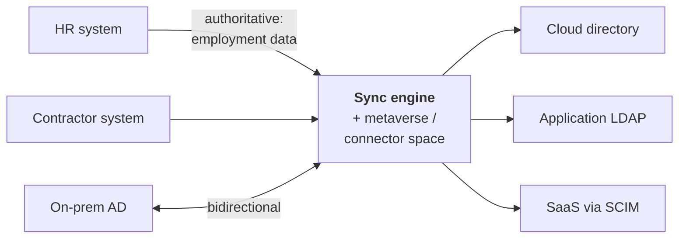

# Directory Synchronisation & Virtual Directories

## Why more than one identity store always exists

Every organisation ends up with several: an on-premises AD from the 1990s, a cloud directory, an HR system, an LDAP directory a specific application demanded, a customer store, and whatever the company they acquired last year runs.

Consolidating to one is the right *ambition* and almost never fully achievable — applications hardcode LDAP, regulators require data residency, acquisitions arrive with their own, and the migration cost exceeds the benefit for the last 20%. So you must design for multiple stores that **agree**.

{: .concept }
> **There are only two strategies: copy the data (synchronisation) or fetch it on demand (virtualisation).** Synchronisation gives you performance and availability at the cost of staleness and conflict. Virtualisation gives you freshness and a single view at the cost of a runtime dependency on every backing store. Most real architectures use both, and the skill is knowing which to apply where.

---

## Synchronisation

Copy identity data from source to target on a schedule or on change.

### The metaverse pattern

Classic sync engines (Microsoft Identity Manager, One Identity Manager, Entra Connect) use a three-layer model worth understanding because the vocabulary appears everywhere:

1. **Connector space** — a staging copy of each connected system's objects, as they exist there.
2. **Metaverse / central store** — the aggregated, joined view: one object per real-world person.
3. **Rules** — *join* (match connector objects to metaverse objects), *projection* (create a new metaverse object), *import flow* (attribute → metaverse), *export flow* (metaverse → target), *provisioning* (create the object in a target), *deprovisioning*.

The value of the layering is that it separates "what does this system say?" from "what do we believe?" from "what should this other system contain?" Conflicts become explicit and rule-driven rather than accidental.

### Design decisions

| Decision | Options | Notes |
|:--|:--|:--|
| **Direction** | One-way, bidirectional | Bidirectional doubles the conflict surface. Prefer one-way per attribute |
| **Attribute-level authority** | Per attribute | The essential discipline: HR owns `department`, AD owns `objectGUID`, phone may be self-service |
| **Change detection** | Full scan, delta/DirSync, changelog, events | Full scans are simple and expensive; delta is standard for AD; events are fastest and least reliable |
| **Frequency** | Minutes → daily | Drives your JML SLA directly |
| **Conflict resolution** | Precedence, last-writer, flag | Decide *before* the first conflict |
| **Deletion** | Propagate, soft-delete, ignore | Deletion propagation is the most dangerous operation in any sync design |
| **Filtering/scoping** | OU, attribute, group | What is in scope, and what happens when an object moves out of scope? |

{: .warning }
> **Deletion propagation and scope changes are how sync systems cause mass outages.** An OU filter edited during a "cleanup"; a source system that returns an empty result set because of an authentication failure and is interpreted as "everyone was deleted"; a scope narrowed by one character. Defences, all of which every mature product supports and many deployments leave disabled: **an export deletion threshold** (refuse to process a run that would delete more than N objects, requiring explicit confirmation), staging/preview runs, soft-delete with a recovery window, and alerting on unusually large change volumes. Turn these on before your first production run, not after your first incident.

### Idempotency, ordering, replay

Same requirements as any integration ([data modelling](../01-it-fundamentals/08-data-modeling.md)): operations must be idempotent, ordering per identity must be preserved, and after an outage you must be able to catch up without duplicating or skipping. Sync engines mostly handle this — but only if configured with a stable **anchor** (immutable join key). Choosing a mutable anchor is a decision you pay for years later, at scale, in duplicate objects.

---

## Virtual directories

Present a single LDAP (or REST) view over multiple backing stores, joining and transforming on the fly. No copy is made.

**Use when:**
- An application demands LDAP but the data lives in several places or in a database.
- You must not copy data (residency, privacy, contractual restrictions).
- Freshness matters more than latency.
- You need a namespace or schema translation layer during a migration — this is the most common modern use.

**Costs:**
- Every query becomes a runtime dependency on the backing stores; their availability becomes yours.
- Latency compounds, and joins across stores can be expensive.
- Complex queries and filters may be impossible to push down efficiently.
- It's another critical component in the request path.

{: .architect }
> **Virtual directories are excellent transition tools and questionable permanent architecture.** They shine when you need to move applications off a directory without touching the applications: point them at the virtual layer, then change what's behind it. That's genuine value. Where they disappoint is as a permanent abstraction over an estate nobody intends to consolidate — you've added a runtime dependency and preserved the underlying mess, and the virtual layer becomes the thing nobody dares change. Use them with an exit plan.

Products: Ping Directory Proxy (formerly PingDirectory Proxy / UnboundID), Oracle Virtual Directory (legacy), Radiant Logic, and Ping/ForgeRock Directory Services deployments used in proxy mode.

---

## Hybrid identity, specifically

The most common sync architecture in the world: on-premises AD ↔ Microsoft Entra ID.

| Option | Mechanism | Consideration |
|:--|:--|:--|
| **Entra Connect Sync** | On-prem agent + SQL, full sync rule engine | Most control; a server to maintain; one active instance plus staging |
| **Entra Cloud Sync** | Lightweight agents, cloud-configured | Multiple disconnected forests, simpler operations, fewer transformation options |
| **Password Hash Sync** | Hash-of-hash to cloud | Cloud authentication survives on-prem outage. Usually the best default |
| **Pass-Through Authentication** | Agent validates against on-prem AD | Password never stored in cloud; **on-prem becomes an availability dependency for cloud login** |
| **Federation (AD FS / third party)** | On-prem IdP issues tokens | Most control over authentication; most infrastructure; the largest availability risk |

Key correlation concept: the **source anchor / immutableID**, derived from `objectGUID`. Get it wrong and you get duplicate cloud objects, or "soft match" collisions where a cloud-created account and a synced one merge unexpectedly — or don't merge when they should.

{: .warning }
> **A sync agent outage is an identity outage with a delay.** Password Hash Sync failing for a week means password changes aren't reaching the cloud — users change their password on-prem and can't sign in to cloud apps, and nobody connects the two events. Monitor sync health as a **tier 0 service** with alerting on staleness (not just on process liveness), and know your maximum tolerable sync gap.

---

## Consolidation strategy

If you're trying to reduce the number of stores:

1. **Inventory.** Every store, every consumer, every write path. This is usually the surprise — stores nobody knew were authoritative for something.
2. **Classify** consumers: can federate now / can use LDAP against a new store / hardcoded and untouchable.
3. **Front the old store** with a virtual directory or proxy so consumers stop caring where data lives.
4. **Migrate consumers** in waves, starting with the ones that can federate.
5. **Freeze writes** to the deprecated store; make it read-only and synced-from.
6. **Decommission**, after a monitored period with the store still running but unused — because something always still uses it.

Expect the last 10% to take as long as the first 90%. Budget for permanent coexistence of at least one legacy store, and design so that's tolerable rather than a running failure.

{: .vendor }
> **In the products.** **One Identity Manager's** Synchronization Editor is a full-featured sync engine (typed connectors, mapping rules, schema classes, bidirectional flows) and is one of the product's genuine strengths in complex legacy estates. **Microsoft Entra Connect / Cloud Sync** dominates the hybrid AD case. **Ping Directory + Directory Proxy** covers high-scale directory and virtualisation, particularly in CIAM. **SailPoint** does aggregation and provisioning rather than general-purpose directory synchronisation — an important distinction when someone proposes using an IGA tool as a sync engine, which usually works badly. **Radiant Logic** specialises in identity virtualisation and unification. Match the tool to the job: IGA for governance, a sync engine for data movement, a proxy for runtime abstraction.

---

## Architect's checklist

- [ ] How many identity stores exist, and which is authoritative **for each attribute**?
- [ ] What is the **anchor / join key** for every sync relationship, and is it immutable?
- [ ] Are **deletion thresholds** and staging/preview runs enabled?
- [ ] What is the **sync latency**, and does it meet your JML SLA?
- [ ] Is sync **health monitored on staleness**, not just process liveness — and is it treated as tier 0?
- [ ] What happens to cloud authentication when the **on-prem agent is unavailable** (PTA/federation vs PHS)?
- [ ] Is there a **conflict resolution policy**, written down?
- [ ] If a virtual directory is used, what is its **exit plan**, and what breaks if it's down?
- [ ] What is the **consolidation roadmap**, and which stores are accepted as permanent?
- [ ] Do you know every **consumer** of each store, including the ones that write?

---

**Next:** [Stage 3 — Identity Domains](../03-identity-domains/) →
