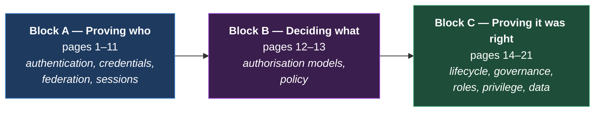

# Stage 2 — Identity Fundamentals

> *"Understand the concepts before jumping to tools."*

## The largest stage, deliberately

This is the core of the discipline. Twenty-one pages, split into three blocks that answer three different questions:

Most people learn Block A, some learn Block B, and **Block C is where enterprise IAM careers actually live**. Governance is less glamorous than protocols and vastly more valuable — it's where the audit findings, the budget and the organisational politics are.

## Block A — Proving who (authentication & federation)

| # | Page | Answers |
|:--|:--|:--|
| 1 | [Authentication Concepts](01-authentication-concepts.md) | What does "proving identity" actually mean, and what are the assurance levels? |
| 2 | [Kerberos & Legacy SSO](02-kerberos-and-legacy.md) | How did SSO work before the web, and why is it still everywhere? |
| 3 | [SAML](03-saml.md) | How do two organisations that share no network federate a login? |
| 4 | [OAuth 2.x](04-oauth2.md) | How do I let an app act on my behalf without giving it my password? |
| 5 | [OpenID Connect](05-oidc.md) | How do I turn delegated authorisation into a login? |
| 6 | [Tokens & JWT](06-tokens-and-jwt.md) | What's in a token, and how is validation broken? |
| 7 | [SCIM & Provisioning](07-scim.md) | How do accounts get created and removed automatically? |
| 8 | [MFA & Passwordless](08-mfa-and-passwordless.md) | Why isn't a password enough, and why isn't all MFA equal? |
| 9 | [FIDO2, WebAuthn & Passkeys](09-fido2-and-passkeys.md) | What makes an authenticator phishing-resistant? |
| 10 | [Sessions & Logout](10-sessions-and-logout.md) | What happens after login, and why is logging out so hard? |
| 11 | [Federation Patterns & Trust](11-federation-patterns.md) | Hub-and-spoke, brokers, multi-IdP: which topology, and why? |

## Block B — Deciding what (authorisation)

| # | Page | Answers |
|:--|:--|:--|
| 12 | [Authorisation Models](12-authorization-models.md) | RBAC, ABAC, ReBAC, PBAC — and when each is the wrong answer |
| 13 | [Policy as Code & Externalised AuthZ](13-policy-as-code.md) | Should authorisation live in the app or outside it? |

## Block C — Proving it was right (governance)

| # | Page | Answers |
|:--|:--|:--|
| 14 | [Joiner, Mover, Leaver](14-joiner-mover-leaver.md) | How does access track a person through their whole relationship with the organisation? |
| 15 | [Identity Governance (IGA)](15-identity-governance.md) | Who should have what, approved by whom, reviewed how? |
| 16 | [Role Modelling & Mining](16-role-modelling.md) | How do you build a role model that doesn't collapse? |
| 17 | [SoD & Access Certification](17-sod-and-certification.md) | How do you prevent toxic combinations and prove reviews happened? |
| 18 | [Privileged Access Management](18-privileged-access-management.md) | How do you control the accounts that can destroy everything? |
| 19 | [Identity Data Quality](19-identity-data-quality.md) | Why do IAM programmes fail on data rather than on technology? |
| 20 | [Identity Proofing & Verification](20-identity-proofing.md) | How do you know a new identity belongs to a real person? |
| 21 | [Directory Sync & Virtual Directories](21-directory-sync.md) | How do you keep many identity stores agreeing with each other? |

---

{: .architect }
> **The organising insight for this whole stage:** authentication, authorisation and governance are three *different systems with different clocks*. Authentication runs in milliseconds and must never be down. Authorisation runs per request and must be fast and correct. Governance runs in days and must be complete and provable. Designs go wrong when an architect treats them as one problem — for example, by putting business rules in the authentication layer, or by expecting an IGA tool to make runtime decisions.

---

**Start:** [Authentication Concepts](01-authentication-concepts.md) →
