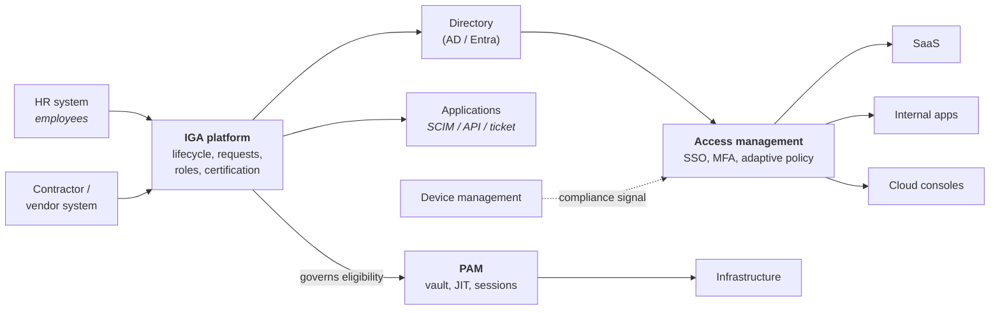

# Workforce Identity

## The domain most IAM tooling was built for

Employees, contractors and anyone else who works *for* the organisation. Bounded population, authoritative HR source, an employment relationship that creates natural lifecycle events, and — crucially — **an audit obligation**.

That last point shapes everything. Workforce IAM is not primarily optimised for user experience or for scale; it's optimised for being able to **prove** that access was appropriate, approved and removed.

---

## What makes it distinctive

| Property | Consequence for design |
|:--|:--|
| **Authoritative source exists** (HR) | Lifecycle can be event-driven and automated end to end |
| **Access follows job function** | [Role modelling](../02-identity-fundamentals/16-role-modelling.md) is viable and expected |
| **Managers exist** | Approval and certification routing has a natural owner |
| **Regulated** | SOX, ISO, PCI, sector rules demand evidence — see [compliance](../06-business-and-risk/03-compliance.md) |
| **Users are captive** | You can mandate MFA and device compliance. You *can't* in CIAM |
| **High-value access** | The blast radius of a workforce compromise is the whole business |
| **Long-lived relationships** | Privilege creep accumulates over years |
| **Devices are managed** | Device signals are usable in [adaptive policy](../02-identity-fundamentals/01-authentication-concepts.md) |

---

## The reference shape

Four systems, four jobs: IGA decides and records, the directory stores, the IdP enforces at runtime, PAM handles the dangerous subset. They must **agree**, which means reconciliation between them is a first-class design concern rather than an afterthought.

---

## The problems that recur everywhere

**Non-employees.** Covered in [data quality](../02-identity-fundamentals/19-identity-data-quality.md) — consistently the largest gap. Contractors, agency staff, interns, auditors, vendor engineers, and staff of acquired companies. No HR record, no end date, often more privileged than employees.

**Shared and functional accounts.** Kiosks, shift work, clinical workstations, control rooms, generic accounts left over from 2011. They destroy attribution. Realistic answers, in preference order: eliminate; replace with fast user switching plus badge/passkey; or vault them and broker access so checkout is attributed to an individual.

**Legacy applications.** No SSO, no API, no provisioning. They will still be there in five years. Approaches: front them with a reverse proxy for authentication; govern them via ticket-based fulfilment with reconciliation; and — the important architectural act — **maintain a register of them**, so their aggregate risk is visible rather than diffuse.

**Mergers and acquisitions.** The event that most disrupts workforce identity. See [migration & coexistence](../04-architecture-practice/04-migration-and-coexistence.md). Day one needs email and collaboration between the organisations; day thirty needs a working access-request process; year one needs consolidation. Each phase has a different right answer, and the mistake is designing only for the last one.

**Reorganisations.** Thousands of movers overnight. Test your provisioning pipeline against a bulk event before the business runs one for real.

{: .architect }
> **The workforce architect's recurring dilemma is speed versus control**, and it plays out weekly. The business wants a new SaaS tool live on Friday. Doing it properly means SSO integration, provisioning, entitlement modelling, an owner, and a place in the certification schedule — two weeks of work. Doing it fast means another ungoverned island. The answer that actually works is a **tiered onboarding standard**: define what "minimum viable governance" is (SSO + a named owner + inclusion in the leaver process), make that path genuinely fast and self-service, and reserve the full treatment for applications above a risk threshold. Architects who insist on the full treatment for everything get bypassed entirely, which is a worse outcome than tiering.

---

## Workforce-specific security concerns

**Insider risk.** Workforce users are already inside, already trusted, already authenticated. The identity controls that help: least privilege, SoD, time-bound elevation, monitoring of bulk data access, and heightened attention during notice periods. Note the tension with privacy law and works councils in several jurisdictions — involve legal early rather than after deployment.

**Identity attack paths.** An attacker who phishes one employee wants to reach domain admin. The path usually runs through nested groups, ACL misconfigurations, service accounts and delegation — see [AD](../01-it-fundamentals/02-active-directory.md) and [ITDR](../08-frontier/02-itdr.md). Attack-path analysis is a workforce-specific discipline because it depends on the directory graph.

**The helpdesk.** Your strongest authentication is only as good as the process that resets it. See [identity proofing](../02-identity-fundamentals/20-identity-proofing.md).

**Third-party administrative access.** Managed service providers, software vendors with support access, outsourced IT. Often the most privileged and least governed identities in the estate. They should be: time-bound, brokered through PAM, recorded, and certified more often than employees.

---

## Metrics that matter

| Metric | Why |
|:--|:--|
| Joiner readiness on day one | Business-visible; buys goodwill for everything else |
| Leaver revocation time (median and p95, **end to end**) | The audit metric |
| % of applications with SSO / with provisioning / with governance | Coverage of the estate |
| % of access delivered by role vs direct | Model health |
| Orphan accounts, and their age | Data integrity |
| Privileged accounts vaulted / JIT | PAM maturity |
| Certification completion and **revocation execution** rate | Whether the control actually operates |
| Access request cycle time | Whether people will use the process or route around it |

---

## Architect's checklist

- [ ] Is there an authoritative source for **every** workforce population, including non-employees?
- [ ] What percentage of applications are covered by SSO, by provisioning, and by governance — and is the gap risk-ranked?
- [ ] Is there a **tiered application onboarding standard**, with a genuinely fast minimum path?
- [ ] Are **shared accounts** inventoried, with an elimination or vaulting plan?
- [ ] Is there a register of **legacy applications** that can't federate, with aggregate risk visible?
- [ ] Has the provisioning pipeline been tested against a **bulk mover event**?
- [ ] Is **third-party administrative access** time-bound, brokered and certified?
- [ ] Are **identity attack paths** in the directory analysed periodically?
- [ ] Do IGA, the directory, the IdP and PAM **reconcile** against each other?
- [ ] Is leaver revocation measured **end to end from the real-world event**?

---

**Next:** [Customer Identity (CIAM)](02-ciam.md) →
