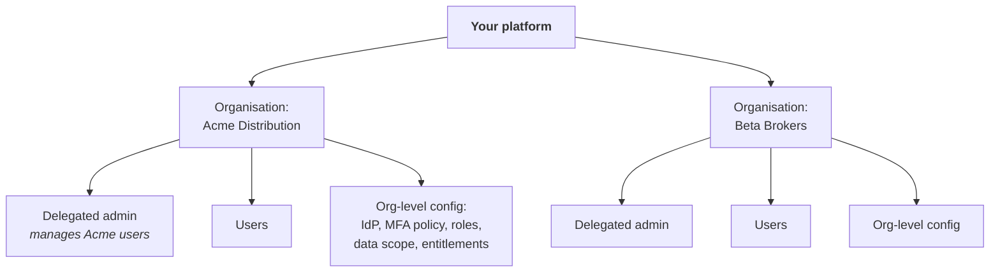

# B2B & Partner Identity

## The domain that fits neither model

Your users belong to *another organisation*. Suppliers, distributors, brokers, franchisees, corporate customers, agencies, joint ventures, outsourced teams.

They are not employees — you don't control their lifecycle, their MFA policy or their offboarding. They are not consumers — they have organisational structure, contractual relationships, delegated administrators and per-tenant configuration.

{: .concept }
> **The defining property of B2B identity is that the authoritative source is outside your control.** Someone at the partner organisation knows when a person joins or leaves; you don't, unless you build a mechanism to learn it. Every B2B design is fundamentally an answer to: *how do we find out, quickly and reliably, that this person no longer works there?*

---

## The models

### 1. Federated (the partner is the IdP)

You trust the partner's IdP to authenticate their people.

**Good:** their lifecycle is authoritative, so a leaver at their end can't log in at yours; no credentials for you to manage; SSO experience for them.

**Bad:** you depend entirely on their security posture and offboarding discipline; it requires them to *have* an IdP and be willing to federate (many smaller partners can't); onboarding each partner is a project.

**Non-negotiable control: scope what they may assert.** Restrict asserted identifiers to their domain namespace, keep external identities in a separate space, and never auto-correlate an externally-asserted identity onto an internal one. See [federation patterns](../02-identity-fundamentals/11-federation-patterns.md).

### 2. Local accounts with delegated administration

You hold the accounts; a designated administrator at the partner manages their own users.

**Good:** works with any partner regardless of maturity; you control the credential and can enforce MFA; you see everything.

**Bad:** you now run the lifecycle for people you can't see; the delegated admin becomes your critical dependency; it degrades the moment that admin leaves — which you also won't hear about.

**Essential mechanism: periodic attestation by the partner.** Quarterly or on contract renewal, the partner's administrator confirms the list of their active users. Non-response leads to suspension. This is the closest you get to a leaver feed from an organisation that doesn't have one.

### 3. Sponsored guest accounts

An internal employee sponsors each external person, with a mandatory end date.

Good for small numbers, short engagements and consultants. Requires: a named sponsor, mandatory expiry, re-attestation to extend, and — the step everyone forgets — **the sponsor's own departure triggers review of everyone they sponsor.**

### 4. Cross-tenant / B2B collaboration features

Platform-native guest models (Entra B2B, Okta Org2Org, Google Cloud Identity). Convenient; understand exactly what they grant, how guest lifecycle works, and whether guests appear in your governance reporting — very often, by default, they don't.

---

## Tenancy and delegated administration

Beyond a handful of partners you need a real **organisation model**:

Design decisions:

| Decision | Options |
|:--|:--|
| **Can a user belong to several organisations?** | Very common in brokerage and agency models; if not designed in, users create multiple accounts |
| **What can a delegated admin do?** | Invite, deactivate, assign roles from an allowed set. **Never** grant them the ability to escalate beyond their organisation's entitlements |
| **Per-organisation policy** | Their own IdP, their own MFA requirement, their own session lifetime — how much variation will you support? |
| **Data scoping** | How is "Acme users see only Acme data" enforced, and where? This is [authorisation](../02-identity-fundamentals/12-authorization-models.md), and getting it wrong is the classic multi-tenant data leak |
| **Onboarding a new organisation** | Self-service, or a project? At scale it must be self-service |

{: .warning }
> **Tenant isolation must be enforced at the data layer, not the UI.** The characteristic B2B vulnerability is an object identifier in an API path that isn't checked against the caller's organisation — change `/orders/1001` to `/orders/1002` and read another company's data. Every data access path needs a tenant check in the service, and it needs to be structurally hard to forget: a shared query layer that always applies the tenant filter, not a check each developer must remember to write.

---

## The offboarding problem

The hardest and most consequential question in B2B. Options, in order of reliability:

1. **Federation** — their leaver process removes their access implicitly. Best, when available.
2. **Contractual notification obligation** — they must tell you within N days. Enforceable in principle, unreliable in practice.
3. **Periodic attestation** — quarterly confirmation by their administrator, with suspension for non-response. **The workhorse control.**
4. **Automatic expiry** — accounts expire after N days unless renewed. Blunt, effective, and it converts an organisational problem into a system behaviour.
5. **Activity-based suspension** — no login for 90 days → suspend. A useful safety net; not a primary control.

Use several. Any single one fails.

{: .architect }
> **Model the contract as an identity object.** A partner relationship has a start date, an end date, a renewal cycle, a commercial owner on your side, an administrative owner on theirs, and a set of entitlements the contract grants. When the contract ends, **every identity under it should end** — automatically, not because someone remembered. Most B2B access sprawl comes from organisations that model users but not the relationship those users derive their access from, so expired partnerships leave live accounts behind indefinitely.

---

## Security considerations

**Partner compromise is your compromise.** Supply-chain attacks routinely enter through a partner's credentials. Design as if any given partner will eventually be breached: scope their access tightly, monitor for anomalous partner behaviour, and have a **per-partner kill switch** you have actually tested.

**Assurance asymmetry.** You may require phishing-resistant MFA internally while a partner uses SMS. Either require a minimum standard contractually and verify it, or apply compensating controls (tighter session limits, more monitoring, narrower entitlements) to partners below your bar.

**Privileged partners.** Managed service providers, software vendors with support access, outsourced administrators. These are frequently the *most* privileged and *least* governed identities in the estate. They should be time-bound, brokered through [PAM](../02-identity-fundamentals/18-privileged-access-management.md), session-recorded and certified more frequently than employees.

**Visibility.** Do partner identities appear in your access reviews, your risk reporting and your leaver reconciliation? In many estates they're invisible to governance because they live in a different system — which means the population with the weakest lifecycle controls is also the least reviewed.

---

## Architect's checklist

- [ ] For each partner, which **model** is in use, and was it chosen or inherited?
- [ ] How do you learn that a partner's employee has **left**? Name the mechanism, not the aspiration
- [ ] Is **periodic attestation** by partner administrators in place, with suspension for non-response?
- [ ] Is the **contract/relationship modelled** as an object with an end date that cascades to its identities?
- [ ] For federated partners: are **asserted identifiers scoped** to their namespace?
- [ ] Can a **delegated admin** escalate beyond their organisation's entitlements?
- [ ] Is **tenant isolation** enforced structurally at the data layer?
- [ ] Can a user legitimately belong to **multiple organisations**, and is that supported?
- [ ] Is there a tested **per-partner kill switch**?
- [ ] Are **privileged partners** (MSPs, vendor support) brokered, recorded and certified?
- [ ] Do partner identities appear in **access reviews and risk reporting**?

---

**Next:** [Non-Human Identities & Secrets](04-non-human-identities.md) →
