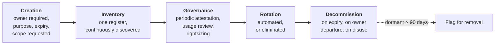

# Non-Human Identities & Secrets

## The population nobody planned for

Service accounts, API keys, OAuth clients, certificates, SSH keys, cloud roles, Kubernetes service accounts, CI/CD tokens, personal access tokens, RPA robots, integration users, database logins, and now AI agents.

In most enterprises these outnumber human identities by **10:1 to 100:1**. They are created by developers rather than HR, at deployment speed rather than at hiring speed. They have no start date, no manager, no leaver event, and frequently more privilege than the humans.

{: .concept }
> **Every governance mechanism in enterprise IAM assumes a human.** Joiner-mover-leaver assumes employment. Certification assumes a manager who knows what the person does. MFA assumes someone present to be challenged. Password policy assumes memory. **None of that applies to non-human identities** — which is why they are simultaneously the largest and least-governed part of most identity estates, and why "NHI" became a named discipline rather than a footnote under service accounts.

---

## The taxonomy

| Type | Where it lives | Typical failure |
|:--|:--|:--|
| **Service account** (directory) | AD/LDAP user object used by a service | Static password, shared, over-privileged, Kerberoastable |
| **Managed service account (gMSA)** | AD, auto-rotated | The good pattern — under-adopted |
| **Cloud IAM role** | AWS/Azure/GCP | Over-broad policies; assumable by more than intended |
| **Cloud access key** | Long-lived static credential | **Committed to git**; never rotated |
| **OAuth client** | AS registration | Secret in config; over-broad scopes; no owner |
| **API key** | Anywhere | No expiry, no scope, no rotation, no inventory |
| **Certificate** | Services, devices, mTLS | Expiry outages; unmanaged private keys |
| **SSH key** | `authorized_keys` | Never expires; survives the owner's departure |
| **Kubernetes service account** | Cluster | Default tokens over-mounted; RBAC too broad |
| **CI/CD token** | Pipeline | Extremely privileged; often long-lived |
| **Personal access token** | A *user's* long-lived credential | Inherits human privilege, outlives the human |
| **RPA / bot identity** | Automation platform | Logs in as a human, breaking attribution entirely |
| **AI agent credentials** | Agent platform | Emerging; delegation semantics unclear — see [agentic identity](../08-frontier/03-ai-agents.md) |

---

## The four hard problems

### 1. Discovery

You cannot govern what you don't know exists. NHIs hide in code repositories, CI/CD variables, container images, config files, Kubernetes secrets, cloud IAM, SaaS integration settings, scheduled tasks, and databases.

Discovery must be **continuous and multi-source**: directory queries for non-interactive accounts, cloud IAM enumeration, secret scanning across repositories and images, network observation of authenticating principals, and reconciliation against every application's account list. A one-off discovery project produces a number that is wrong within a month.

### 2. Ownership

The single most valuable attribute of an NHI, and the most commonly absent. Without an owner, nobody can answer "can we rotate this?", "is this still needed?", "what breaks if we disable it?" — so nothing is ever changed, and the credential lives forever.

**Enforce ownership at creation.** No owner, no credential. For the existing population: attribute by usage (who deploys the service that authenticates?), by naming convention, by the cost centre paying for the resource, or — the honest last resort — by disabling in a controlled window and seeing who complains. That last technique works, and it is how a great deal of legacy NHI ownership actually gets established.

### 3. Rotation

Static credentials that never change accumulate risk indefinitely. Rotation is technically simple and organisationally hard, because nobody knows what will break.

The ladder, from worst to best:

1. Never rotated. (Where most estates start.)
2. Manual rotation on a schedule, coordinated with the owner.
3. Automated rotation with the application reading from a vault at startup.
4. **Automated rotation with the application re-reading dynamically** — no restart needed.
5. **No stored credential at all** — short-lived tokens from [workload identity federation](05-workload-identity.md).

Level 5 is the destination. Every step toward it removes an entire class of incident.

### 4. Least privilege

NHIs are habitually over-privileged, because the fastest way to make an integration work is to grant broadly and move on. Rightsizing needs usage data: all three major clouds expose "permissions actually used" analysis, and using it is the practical path from "Contributor on the subscription" to something defensible.

---

## The governance model

The mechanisms that actually work:

- **An owner and a purpose are mandatory fields at creation**, enforced by the platform that issues the credential — not by policy documents.
- **Expiry by default.** Every NHI gets an end date; extension requires the owner to confirm it's still needed. This one change eliminates most orphaned NHIs over time.
- **Attestation by owners**, ideally as a small, frequent review rather than an annual mega-campaign.
- **Dormancy detection.** No authentication in 90 days → flag, then disable, then delete. Add the "disable first, delete later" step; it makes reversal cheap and therefore makes people willing to do it.
- **Owner departure triggers reassignment** — wire this into the [leaver process](../02-identity-fundamentals/14-joiner-mover-leaver.md). An NHI owned by a leaver is an orphan the moment they go.
- **Secret scanning in CI**, blocking commits that contain credentials, plus scanning of history and images.

{: .warning }
> **A credential committed to a repository is compromised, permanently, even after deletion.** It's in the git history, in every clone, in every fork, in build caches and in whatever scraped the repo before you noticed. The response is not "remove the commit" — it is **rotate the credential immediately**, then clean history. Public repositories are scanned by attackers within minutes of a push; treat exposure as certain, not probable.

---

## Secrets management

The tooling layer beneath NHI governance.

| Capability | Purpose |
|:--|:--|
| **Central storage, encrypted** | One place, access-controlled and audited |
| **Dynamic secrets** | Generate a short-lived credential per request (database, cloud). Best pattern available |
| **Automatic rotation** | With or without application restart |
| **Fine-grained access policy** | Which workload may read which secret |
| **Audit log** | Every retrieval, attributable |
| **Injection at runtime** | Environment, file mount or API — never baked into the image |
| **Leasing / TTL** | Credentials that expire without action |

**The bootstrap problem is the interesting one:** how does an application authenticate to the vault in order to fetch its secrets, without having a secret? The answer is platform attestation — the cloud or orchestrator vouches for the workload's identity (IAM role, Kubernetes service account token, instance identity document), and the vault trusts that attestation. That is [workload identity](05-workload-identity.md), and it's what makes secretless architecture possible.

---

## RPA and bot identities

Robotic process automation deserves specific attention because it commonly does the worst possible thing: **logs in as a human, using a human's credential.**

Consequences: attribution is destroyed (the audit log shows a person who was asleep), the bot inherits all of that person's access rather than what it needs, MFA is either bypassed or the second factor is stored somewhere, and when the person leaves, the automation breaks — or worse, is kept alive by keeping their account active.

The correct pattern: bots get **their own identity**, scoped to exactly what the automation needs, credentials vaulted and rotated, with an owner and an expiry, and — where the automation acts on behalf of a person — an explicit delegation record rather than impersonation.

{: .architect }
> **NHI is where identity architecture meets platform engineering, and the ownership question is organisational.** IAM teams typically have no authority over developers creating cloud roles in Terraform, and platform teams don't think of themselves as identity practitioners. The programmes that succeed do two things: (1) make the governed path the **easiest** path — a self-service way to get a properly-scoped, auto-rotating, owned credential in under a minute, and (2) put the controls in the **pipeline** — secret scanning, policy-as-code on IAM changes, mandatory owner tags — rather than in a review board. You will not win this with a policy document.

---

## Architect's checklist

- [ ] Is there a **single inventory** of non-human identities, continuously discovered rather than one-off?
- [ ] Does **every** NHI have a named owner and a documented purpose?
- [ ] Do NHIs have **expiry dates** by default?
- [ ] Is there **automated rotation**, and what percentage of credentials are covered?
- [ ] How many **long-lived static credentials** exist (cloud keys, API keys, client secrets), and what's the elimination plan?
- [ ] Is **secret scanning** enforced in CI, on history, and on container images?
- [ ] Is **dormancy detection** running, with a disable-then-delete workflow?
- [ ] Does the **leaver process** reassign NHIs owned by departing staff?
- [ ] Are **RPA/bot identities** distinct from human accounts?
- [ ] Are NHI privileges **rightsized using actual usage data**?
- [ ] Is the **governed path the easiest path** for a developer needing a credential?

---

**Next:** [Workload & Cloud Identity](05-workload-identity.md) →
