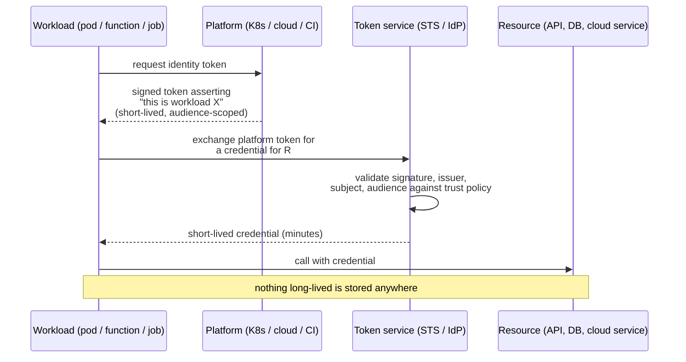

# Workload & Cloud Identity

## Identity without a secret

A workload — a container, a function, a VM, a pipeline job — needs to authenticate to other services. The traditional answer was to give it a credential: a password, a key, a certificate. That credential must then be stored somewhere, which creates every problem in [non-human identity](04-non-human-identities.md).

{: .concept }
> **Workload identity replaces "what secret do you know?" with "what can the platform attest about you?"** The orchestrator already knows, with certainty, that this pod is running this service account in this namespace on this cluster. If a trusted authority is willing to sign that statement, the workload can exchange it for a short-lived credential — and there is **no long-lived secret to leak, rotate or steal**. This is the most significant improvement in machine authentication in a decade, and it is available today in every major platform.

---

## The pattern



The trust policy at the token service is the security boundary: *"I will issue credentials for role `payments-writer` to a token from cluster `prod-eu`, namespace `payments`, service account `api`."* Getting that specificity right is the whole job — a policy that accepts any subject from the cluster grants every workload the same access.

---

## Platform implementations

| Platform | Mechanism |
|:--|:--|
| **AWS** | IAM roles for EC2 (instance profiles), for Lambda, **IRSA / EKS Pod Identity** for Kubernetes, and **OIDC federation** for external providers (GitHub Actions, GitLab, other clouds) |
| **Azure** | **Managed identities** (system- or user-assigned), **workload identity federation** for Kubernetes and external issuers |
| **GCP** | Attached service accounts, **Workload Identity Federation** for external identities including other clouds and CI |
| **Kubernetes** | Projected service account tokens: short-lived, audience-scoped, automatically rotated. The basis for all the above in K8s |
| **SPIFFE / SPIRE** | Platform-neutral workload identity: **SPIFFE ID** (`spiffe://trust-domain/workload`) delivered as an **SVID** (X.509 cert or JWT), issued after node and workload attestation |
| **HashiCorp Vault** | Auth methods that consume platform attestation (Kubernetes, AWS IAM, JWT/OIDC), then issue dynamic secrets |

### SPIFFE, briefly

Worth knowing because it's the vendor-neutral model and the vocabulary appears in service mesh discussions.

- **SPIFFE ID** — a URI naming a workload: `spiffe://prod.example.com/ns/payments/sa/api`
- **SVID** — the credential proving that identity (X.509 certificate or JWT)
- **Attestation** — node attestation (is this a legitimate machine?) plus workload attestation (which process on it is asking?)
- **Trust domain** — the boundary of one issuing authority; federation connects domains

Service meshes (Istio, Linkerd) use this to give every service a rotating certificate and enforce **mTLS between all services automatically** — which is workload identity delivering both authentication and encryption without any application change.

---

## CI/CD: the highest-value change

Continuous integration pipelines are among the most privileged identities in most organisations — they deploy to production — and historically they held long-lived cloud keys in a settings page.

**OIDC federation removes that entirely.** GitHub Actions, GitLab CI, Bitbucket and others issue a signed OIDC token per job describing the repository, branch/ref, workflow and environment. Your cloud trusts that issuer with a conditional policy:

```
Trust: token from https://token.actions.githubusercontent.com
Condition: sub == "repo:acme/payments-service:ref:refs/heads/main"
           AND aud == "sts.amazonaws.com"
```

{: .warning }
> **The condition is the entire control, and it is easy to get catastrophically wrong.** A trust policy matching `repo:acme/*` lets *any* repository in the organisation assume the role. Worse, a policy that matches only the issuer and audience without pinning `sub` lets **any GitHub repository in the world** assume it — this misconfiguration has been found in production repeatedly. Always pin the subject to the specific repository *and* ref or environment, and review those policies as privileged configuration.

The same reasoning applies to who can modify the pipeline definition: **whoever can edit the workflow file can execute as the pipeline identity.** Branch protection and required reviews on CI configuration are identity controls, whether or not the IAM team owns them.

---

## Cloud IAM as an identity domain

Cloud permissions differ from classic entitlements in ways that break traditional governance:

- **Computed, not listed.** Effective permission is the result of evaluating layered policies with conditions ([cloud fundamentals](../01-it-fundamentals/07-cloud-fundamentals.md)). There is no simple list to certify.
- **Deployed as code.** Access changes arrive through Terraform pull requests, not access requests — which is *better* (reviewed, versioned) provided the review is meaningful and repository access is governed.
- **Enormous and granular.** Thousands of actions per cloud. Nobody reviews an IAM policy JSON meaningfully.
- **Chained.** Role A can assume role B can assume role C — an escalation path invisible in any single policy.

This is what **CIEM** (Cloud Infrastructure Entitlement Management) exists to address: discover effective permissions, compare against usage, find escalation paths, recommend rightsizing.

{: .architect }
> **Don't try to certify cloud permissions the way you certify application entitlements.** Asking a business manager to approve `arn:aws:iam::…:policy/DataPlatformContributor` produces a signature and no security. What works: certify the **role assignment** in business terms ("Maria is a data platform engineer"), use CIEM to keep the *role* rightsized against actual usage, make privileged cloud access **just-in-time and requested** rather than standing, and govern the **IaC repository** as privileged infrastructure. That combination is defensible to an auditor and actually reduces risk, which the alternative does not.

---

## Migration path

You will not eliminate stored credentials overnight. A workable sequence:

1. **Inventory** long-lived credentials, ranked by privilege.
2. **CI/CD first** — highest privilege, cleanest fix, immediate risk reduction.
3. **Cloud-native compute** — instance profiles, managed identities, attached service accounts. Usually a config change, not a code change.
4. **Kubernetes workloads** — projected tokens plus cloud federation.
5. **Cross-cloud and hybrid** — workload identity federation between providers.
6. **Legacy applications** — vault with dynamic secrets, since the app can't be changed.
7. **What's left** — accept, document, monitor, and put it on the risk register with an owner.

Track it as a metric: **percentage of workloads authenticating without a stored secret.** It's a number that goes in the right direction and that executives understand.

---

## Architect's checklist

- [ ] What percentage of workloads authenticate **without a stored long-lived credential**?
- [ ] Is **CI/CD** using OIDC federation rather than stored cloud keys?
- [ ] Are federation **trust conditions pinned** to specific repositories, refs and environments?
- [ ] Who can **modify pipeline definitions**, and is that governed as privileged access?
- [ ] Are Kubernetes **service account tokens** projected, short-lived and audience-scoped — and are default tokens un-mounted where unnecessary?
- [ ] Are workload permissions **rightsized against actual usage**?
- [ ] Are **role-chaining escalation paths** analysed?
- [ ] Is privileged cloud access **just-in-time** rather than standing?
- [ ] Is the **IaC repository** treated as identity infrastructure?
- [ ] For multi-cloud: is there one **workload identity approach**, or several accidental ones?

---

**Next:** [OT, IoT & Edge Identity](06-ot-and-iot.md) →
