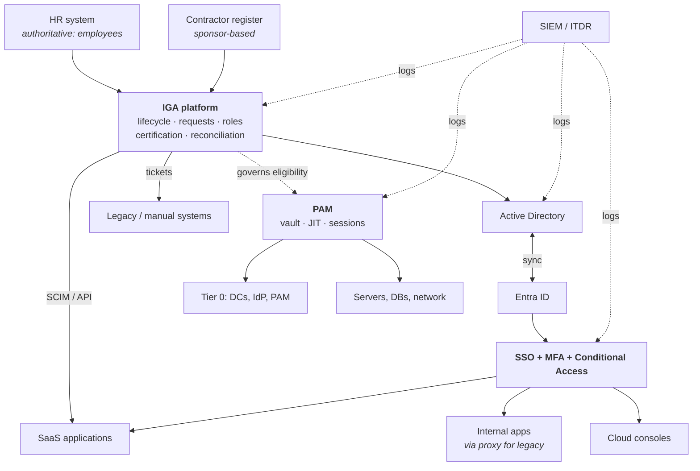
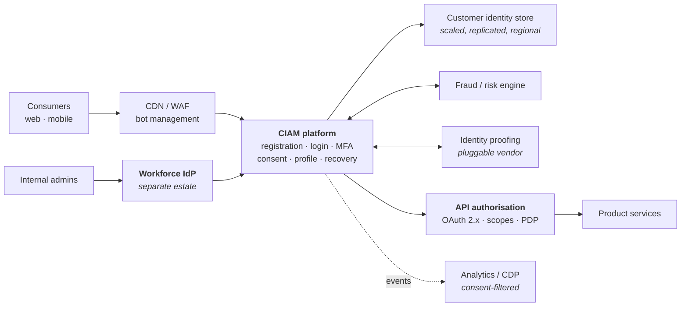

# Reference Architecture Blueprints

Concrete target states for the situations you'll actually meet. Each states the context, the shape, the key decisions and the failure modes. **Adapt, don't copy** — the reasoning transfers, the specifics rarely do.

---

## Blueprint 1 — Mid-size enterprise, hybrid workforce

**Context:** 5,000–20,000 employees, on-prem AD plus growing SaaS, some legacy, an audit finding on access reviews, an IT team of moderate size.

**Key decisions:** one IdP for workforce; AD remains for domain-joined devices but is not the governance master; contractors get an authoritative source built in the IGA platform; legacy handled by ticket-based fulfilment *with reconciliation*; PAM covers Tier 0 first.

**Sequence:** HR + AD connection → leaver automation → top 15 risk apps aggregated and certified → access request → PAM Tier 0 → role model informed by the data you now have.

**Failure modes:** contractor source never built, so a third of the population stays ungoverned; legacy applications quietly excluded from scope; nobody funded to run it after go-live.

---

## Blueprint 2 — Cloud-native / SaaS-first company

**Context:** 200–3,000 people, no AD, everything SaaS, engineering-led culture, IT is small and automation-minded.

**Shape:** cloud IdP (Entra, Okta, Google) as the single source for authentication; SCIM provisioning from the IdP to SaaS; groups in the IdP as the entitlement model; cloud infrastructure access via role federation; secrets and workload identity native to the cloud; a lightweight governance layer (native IdP governance, or a SaaS IGA) rather than a heavyweight platform.

**Key decisions:** **the IdP is the identity master**, not a directory — HR feeds it directly; entitlements are IdP groups plus in-app roles; governance rides on the IdP's own capabilities until scale demands more; access changes go through pull requests where infrastructure is concerned.

**Failure modes:** SaaS sprawl outside IT's knowledge (shadow IT bought on a card); no governance until the first SOC 2 audit forces it retroactively; IdP group sprawl with no owners; over-reliance on one vendor's ecosystem making later migration expensive.

---

## Blueprint 3 — CIAM for a consumer platform

**Context:** millions of consumers, revenue-critical login, regulated (finance, health, telco), mobile and web.

**Key decisions:** CIAM estate is **architecturally separate** from workforce; multi-region with data residency; proofing is pluggable behind an interface; consent is a first-class versioned model; passkeys promoted with a strong fallback; administrative access to the CIAM platform comes from the *workforce* IdP with PAM.

**Failure modes:** consent modelled as a boolean and unreconstructable later; login availability treated as an IT SLA rather than a revenue SLA; recovery flow becomes the account-takeover path; proofing vendor hardcoded into the journey.

---

## Blueprint 4 — Regulated enterprise with heavy IGA

**Context:** 20,000+ staff, SOX/PCI/sector regulation, SAP or equivalent core, multiple legal entities, existing audit findings.

**Shape:** IGA as the centre of gravity, connected to HR, AD/Entra, SAP (with GRC for intra-SAP SoD), mainframe, and 100+ applications in risk tiers. Access management is a separate, highly available layer. PAM covers a large privileged population. Cross-application SoD owned by IGA; intra-SAP SoD by GRC, with a defined boundary and no duplicated rulesets.

**Key decisions:** risk-tier the application estate and govern accordingly — full lifecycle plus quarterly certification for tier 1, SSO plus annual review for tier 3; separate legal entities may need separate data scopes; evidence generation is a first-class requirement evaluated during product selection, not after.

**Failure modes:** a two-year enterprise role project that delivers nothing visible; certification fatigue producing rubber-stamping; the GRC/IGA boundary left undefined so SoD is enforced twice, differently.

---

## Blueprint 5 — Post-merger coexistence

**Context:** two organisations, two IdPs, two directories, overlapping people, a 12–24 month integration.

**Shape:** an identity broker in front of both IdPs; domain-based home realm discovery; a shared collaboration layer (email, chat, files) from day one; a single access-request front door routing to both back ends; consolidation by cohort over time.

**Key decisions:** decide early whether the target is *absorb* (one survives) or *merge* (a new estate); establish a single authoritative identifier across both populations immediately, even if nothing else merges; treat the broker as **temporary infrastructure with an explicit end date**, because temporary identity infrastructure otherwise becomes permanent.

**Failure modes:** the "temporary" broker still there six years later; duplicate identities for people who work in both organisations; nobody owns the combined leaver process during the transition, so leavers stay live in one estate.

See [migration & coexistence](04-migration-and-coexistence.md).

---

## Blueprint 6 — Zero Trust workforce access

**Context:** an organisation removing implicit network trust, typically alongside VPN replacement.

**Shape:** identity-aware proxy or ZTNA in front of applications; every request evaluated with signals (user, device compliance, location, risk, resource sensitivity); continuous evaluation with session revocation; device management as a hard prerequisite; micro-segmentation behind the proxy.

**Key decisions:** **device management is the gating dependency** — without reliable device signals, Zero Trust degenerates into "MFA everywhere"; legacy applications need a proxy path; the policy engine's availability becomes critical; the phasing must not strand users mid-migration.

**Failure modes:** buying the technology without the device management foundation; policies so tight that exception lists become the real architecture; no plan for unmanaged devices, contractors or BYOD.

See [Zero Trust](../08-frontier/01-zero-trust.md).

---

## What all six have in common

1. **One authoritative source per population**, named explicitly.
2. **A separation between the runtime path (AM) and the governance path (IGA)**, with different availability requirements.
3. **A reconciliation loop**, not just provisioning.
4. **A named plan for the systems that don't fit the pattern.**
5. **An operating model** — someone funded to run it.
6. **A sequence where each step delivers value alone.**

{: .architect }
> **When presenting a blueprint, present the sequence more prominently than the target.** Executives approve funding for the next two quarters, not for a three-year end state. A target-state diagram answers "where are we going"; the increment plan answers "what do I get for this year's budget" — and only the second question determines whether you get to build any of it.

---

**Next:** [Integration Patterns](03-integration-patterns.md) →
