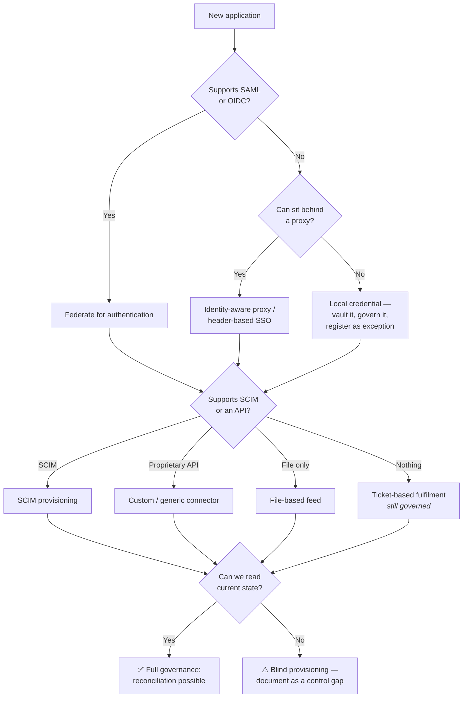

# Integration Patterns

## The work that consumes the programme

An IAM platform's value is proportional to how much of the estate it reaches. Reaching that estate is integration work, and integration work is where timelines are lost.

{: .concept }
> **Every integration answers four questions:** *how do we authenticate to it, how do we read its current state, how do we change its state, and how do we know when something changed?* Products differ enormously in the fourth. A system you can read and write but that never tells you when a local administrator made a change is a system you must poll — and polling frequency then becomes a security parameter.

---

## The integration decision tree

The bottom-left branch is the one that matters. **An application you can write to but not read from cannot be reconciled**, which means unmanaged changes are invisible. That is a control gap, and it should be recorded as one rather than quietly accepted.

---

## Patterns by direction

### Inbound: reading identity data

| Pattern | When | Watch for |
|:--|:--|:--|
| **Scheduled full aggregation** | Small–medium systems | Cost at scale; timing windows |
| **Delta / incremental** | Large directories (AD DirSync, changelogs) | Cookie/watermark management; what happens after a long outage |
| **Event subscription** | Modern SaaS with webhooks | Ordering, duplicates, delivery guarantees, replay |
| **File drop** | Legacy HR, mainframe | **Silent failure** — a file that didn't arrive looks like a file with no changes. Always alert on absence |
| **Database read** | No API exists | Often unsupported by the vendor; breaks on their upgrade |

{: .warning }
> **Alert on the absence of data, not just on errors.** A nightly HR feed that stops arriving produces no error — it produces silence, and silence looks like "no changes today". Organisations have discovered weeks later that no joiner or leaver had been processed. Every scheduled inbound integration needs a **heartbeat check**: did we receive a file/run a sync in the last N hours, and did the record count fall outside expected bounds?

### Outbound: changing state

The properties to specify for every target ([data modelling](../01-it-fundamentals/08-data-modeling.md) covers the mechanics):

- **Idempotency** — retry must not duplicate.
- **Ordering per identity** — create before entitle.
- **Partial failure semantics** — three of five systems succeeded; what is the user's state, and what retries?
- **Rate limiting and backpressure** — a reorganisation must not take down a target or get you blocked.
- **Poison-message isolation** — one bad record must not block the queue.
- **Compensation** — if step 4 of 5 fails, do you roll back or leave it and alert? (Usually leave and alert; automated rollback of partial provisioning is often more dangerous than the inconsistency.)

---

## The awkward systems

**Mainframe (RACF, ACF2, Top Secret).** Often the highest-value data in the organisation. Integration via specialised connectors, command interfaces or file exchange. Slow, batch-oriented, and requiring specialist knowledge that is retiring. Treat mainframe integration as its own workstream with its own expert, not as one row in a connector matrix.

**SAP.** A world of its own: users, roles, profiles, authorisation objects, multiple systems and clients, plus GRC for SoD. Decide the boundary between IGA and SAP GRC explicitly.

**Homegrown applications.** Frequently no API and no authentication abstraction. Options: add OIDC (best, if a team owns the code), reverse proxy (fastest), or govern via ticket. The organisational question — *is there a team who can change this?* — determines the technical answer.

**Physical access systems.** Badge systems hold identity data and grant real-world access; they're rarely integrated. Joiner/leaver for physical access is a genuine gap in most organisations, and correlating physical and logical access is a strong detective control ("badged in at Frankfurt, authenticating from Singapore").

**Shadow IT.** Applications bought on a card. You can't integrate what you don't know about. Discovery via CASB, expense analysis, DNS/proxy logs and SSO-adjacent traffic. **The architectural response is a fast, attractive sanctioned path** — teams buy outside the process when the process is slow.

---

## The connector lifecycle

Connectors are code, and they decay:

- **Versioning.** The target's API changes; your connector must be versioned and tested against upgrades.
- **Credential rotation.** The connector's own service account is an NHI needing an owner and rotation.
- **Monitoring.** Success rate, latency, queue depth, error classes — per connector, with alerting.
- **Ownership.** Who fixes it when the vendor's API changes? Usually not the vendor.
- **Testing.** Every connector needs a non-production target. Applications without a test environment are a real, common blocker — surface that during scoping, not during build.

{: .architect }
> **Estimate integrations in three buckets, and expect the distribution to hurt.** Standard (SCIM/well-supported connector): days. Non-standard (custom API, transformation, unusual entitlement model): weeks. Hard (mainframe, no API, no test environment, no owner): months, or never. In a typical enterprise the split is roughly 60/30/10 by count — but the 10% almost always contains the highest-risk systems, which is why "we've integrated 90% of applications" can coexist with "we've governed half the risk". Report coverage weighted by risk, not by count.

---

## Orchestration and error handling

For any multi-system flow, decide:

- **Orchestration vs choreography.** A central workflow that knows the whole process (visible, debuggable, a single point of failure) versus services reacting to events (resilient, decoupled, much harder to answer "where is this joiner right now?"). For IAM lifecycle, **orchestration is usually correct** — you need to answer that question constantly.
- **Retry policy.** Exponential backoff with jitter, a maximum attempt count, then a dead-letter queue with an owner.
- **Human-in-the-loop.** Some failures need a person. That queue needs an owner, an SLA and escalation, or it becomes an unread list.
- **Visibility.** A single view of "what is the state of this identity's provisioning right now" — for support, not just for engineers.

---

## Architect's checklist

- [ ] For each system: can you **read state**, or is provisioning blind?
- [ ] Do scheduled inbound feeds have **absence alerting** and record-count bounds?
- [ ] Are all outbound operations **idempotent**, with ordering guaranteed per identity?
- [ ] What is the **partial failure** behaviour, and what does the user see?
- [ ] Are **rate limits** known for every target, with backoff implemented?
- [ ] Is there a **dead-letter queue with a named owner** and an SLA?
- [ ] Do connectors have **owners**, monitoring and non-production test targets?
- [ ] Are connector service accounts governed as **NHIs** with rotation?
- [ ] Is integration coverage reported **weighted by risk**, not by application count?
- [ ] Is there a **fast sanctioned path** so teams don't route around IT?

---

**Next:** [Migration & Coexistence](04-migration-and-coexistence.md) →
