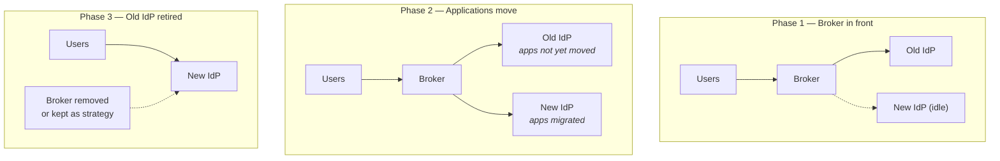

# Migration & Coexistence

## Why this is architecture, not project management

Almost no IAM work is greenfield. You are replacing an IdP, consolidating directories, absorbing an acquisition, moving from on-prem to cloud, or retiring a product whose vendor was acquired.

{: .concept }
> **The coexistence period is the architecture.** Any competent architect can draw the target state. The value you add is designing the eighteen months in which **both systems are live, users are split across them, and everything must keep working** — including the parts that fail in ways neither system was designed for. Target states are cheap; safe transitions are not.

---

## The strategies

| Strategy | How | When |
|:--|:--|:--|
| **Big bang** | Everything moves in one window | Small estates only; rollback must be genuinely possible |
| **Cohort migration** | Move users in waves | Most workforce migrations |
| **Application-by-application** | Move applications, users follow | Most IdP migrations |
| **Strangler fig** | New system takes traffic incrementally behind a facade | When a broker/proxy can front both |
| **Parallel run** | Both systems live; compare outputs | High-risk governance changes; expensive but safest |
| **Absorb** | New joiners on the new system; old population ages out | Very slow; occasionally right for small legacy populations |

Most real programmes combine several: strangler fig for authentication (a broker fronts both IdPs), application-by-application for federation, cohort for the user-facing cutover.

---

## Migrating an identity provider

The most common and most visible migration.

**Why a broker first:** it decouples "which IdP authenticates" from "which IdP each application trusts". Without it, every application must be reconfigured on the same day as the user cutover — which is a big bang wearing a cardigan.

**The credential problem.** Passwords cannot usually be migrated (they're hashed with a different algorithm, or the old system won't export them). Options: federate to the old system during transition so it still validates credentials; capture-and-migrate on next login (the new system proxies the credential once, then stores it in its own format — a real pattern, and one that must be very carefully secured); or force a reset for everyone, which is honest, universally disliked, and an excellent moment to **enrol passkeys instead**.

**MFA enrolments are the harder migration.** TOTP secrets and FIDO2 credentials are usually not portable at all. Plan for mass re-enrolment: sequence it, make it self-service, and expect a helpdesk spike. Re-enrolment is also an opportunity — it's the cheapest moment you will ever have to upgrade the entire population to phishing-resistant authentication.

---

## Migrating an IGA platform

Harder than an IdP migration, because IGA carries *state and history*:

- **Entitlement and role definitions** — often re-modelled rather than migrated; the old model's compromises rarely deserve preservation.
- **In-flight requests and approvals** — drain them in the old system rather than migrating them mid-flight.
- **Certification history** — you may be required to retain years of evidence. Options: migrate, archive with a documented retrieval method, or run the old system read-only. Agree this with **audit**, in advance and in writing.
- **Connectors** — the real work. Every integration rebuilt, retested, re-certified.
- **Reconciliation baseline** — the new system must aggregate everything before it can safely act, or its first act may be to "correct" thousands of legitimate grants.

{: .warning }
> **Never let a new IGA platform run remediation on its first pass.** Its model of expected state is incomplete, so its idea of "drift" includes everything it hasn't learned about yet. The standard failure: a new system's first reconciliation revokes thousands of legitimate entitlements because they weren't in its (empty) expected state. Run in **report-only mode** for at least a full business cycle, review the deltas with the business, and only then enable enforcement.

---

## Directory consolidation

1. **Inventory consumers.** Every application, script, service and report reading from the directory — including the ones nobody remembers.
2. **Classify:** can federate / can repoint to the new directory / hardcoded and untouchable.
3. **Front with a proxy or virtual directory**, so consumers stop caring where the data is.
4. **Migrate consumers in waves.**
5. **Freeze writes** to the old directory; make it read-only, fed from the new one.
6. **Monitor for residual use** — logging on the old directory tells you who still depends on it. Something always does.
7. **Decommission** after a quiet period.

Budget for the last 10% taking as long as the first 90%, and for at least one legacy store surviving permanently. Design so that's tolerable.

---

## Mergers and acquisitions

Three horizons with different right answers — the classic mistake is designing only for the third:

| Horizon | Goal | Typical approach |
|:--|:--|:--|
| **Day 1** | The two organisations can email, chat and share files | Cross-tenant collaboration / guest access; **no consolidation** |
| **Day 30–90** | Working joint processes; access requests function; leavers handled on both sides | Broker in front of both IdPs; a single access-request front door; a combined leaver process with explicit ownership |
| **Year 1–2** | One estate | Cohort migration; directory consolidation; retirement |

Specific traps: **people who exist in both organisations** (a genuine duplicate-identity problem, and it usually includes senior people); **colliding namespaces** (two `jsmith`s, two `example.com` UPN suffixes); differing MFA and assurance standards during the interim; and — most commonly missed — **nobody owning the combined leaver process during transition**, so leavers stay live in the other estate for months.

Divestitures are the mirror image and are usually harder: identities and data must *leave*, often with a transition services agreement giving the divested entity temporary access to systems you still own. Scope, time-box and monitor that access precisely; it is the single riskiest access arrangement most organisations ever create.

---

## Rules that hold across all migrations

**1. Reversibility at every step.** Each increment must be rollback-able for at least a defined window. If it isn't, it's a big bang no matter how you phase it.

**2. A pilot with real users who will complain.** Migrating the IAM team first proves nothing — you know the workarounds. Pick a real business unit, ideally a vocal one.

**3. Run both, compare, then switch.** Where possible, have the new system produce decisions in shadow mode and diff against the old one. Differences are either bugs or improvements, and you want to know which before cutover.

**4. Communicate what changes for the user.** A new login screen is a support call from thousands of people unless they were told. Screenshots, in advance, through the channels people actually read.

**5. Time-box coexistence, with an owner and a date.** Every "temporary" identity component becomes permanent unless someone owns its removal. Put the decommission date in the plan and review it.

**6. Watch for the silent failure.** Migrations fail loudly for the users who moved and silently for the ones who didn't — the orphaned cohort, the application nobody reconfigured, the integration still pointing at the old endpoint. Instrument the *old* system: what's still using it, and who?

{: .architect }
> **The end of a migration is a project in its own right, and it is the phase that gets cut.** Decommissioning is unglamorous, invisible to users, and easy to defer once the new system works. But an un-retired old IdP is a live authentication path with declining patching, ageing certificates and no owner — an attacker's preferred door. **Fund and schedule decommissioning as an explicit deliverable**, with a named owner and a date, or it will not happen.

---

## Architect's checklist

- [ ] Is there a **coexistence design**, or only a target state?
- [ ] Is each increment **reversible**, and for how long?
- [ ] How are **credentials and MFA enrolments** handled — migrate, re-enrol, or federate during transition?
- [ ] Will the new IGA platform run **report-only** until its baseline is complete?
- [ ] Has **audit agreed** how historical evidence will be retained?
- [ ] Is there a **pilot with real, vocal users**?
- [ ] Can you run **shadow mode and diff** the two systems' decisions?
- [ ] Who owns the **combined leaver process** during coexistence?
- [ ] Is the **old system instrumented** to reveal residual usage?
- [ ] Is **decommissioning funded, scheduled and owned**, with a date?

---

**Next:** [HA, DR & Scale](05-ha-dr-and-scale.md) →
