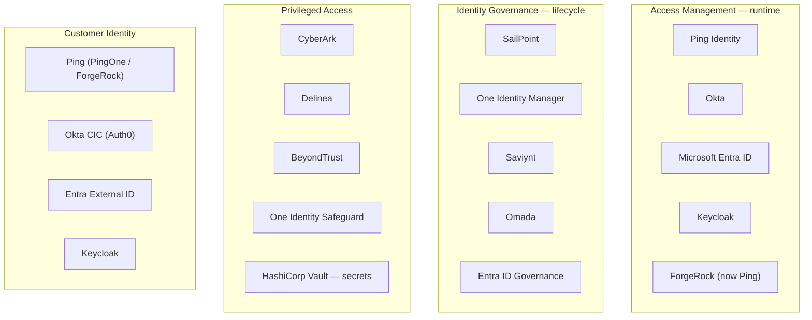

# The Vendor-Neutral Map

## The Rosetta stone

Every IAM platform implements the same handful of concepts under different names. Learn this table and every product's documentation becomes readable.

### The correlated identity record

| Vendor | Term |
|:--|:--|
| **SailPoint** | Identity Cube (IdentityIQ) / Identity (Identity Security Cloud) |
| **One Identity Manager** | Person object (`Person` table) |
| **Ping** | Identity / user profile (PingDirectory entry, PingOne user) |
| **Okta** | Okta User (Universal Directory profile) |
| **Microsoft Entra ID** | User object |
| **Saviynt** | User |
| **Keycloak** | User |
| **Concept** | The single record representing one subject across all systems |

### The representation in one connected system

| Vendor | Term |
|:--|:--|
| **SailPoint** | Link / Account |
| **One Identity Manager** | Target-system account (`ADSAccount`, `SAPUser`, `UNSAccountB`…) |
| **Ping** | Account in a data store |
| **Okta** | App User / App Account |
| **Entra ID** | Service principal assignment / app role assignment |
| **Concept** | **Account** — one per system, correlated to the identity |

### The grantable permission inside a system

| Vendor | Term |
|:--|:--|
| **SailPoint** | Entitlement / ManagedAttribute |
| **One Identity Manager** | System entitlement (`ADSGroup`, `SAPRole`, `UNSGroupB`…) |
| **Saviynt** | Entitlement |
| **Okta / Entra** | Group, app role, licence |
| **Concept** | **Entitlement** — defined by the application, never by IAM |

### The business-meaningful bundle

| Vendor | Term |
|:--|:--|
| **SailPoint** | Role (Business / IT / Organisational) |
| **One Identity Manager** | Business role, application role, organisational structure (department, cost centre, location) |
| **Saviynt** | Role / Enterprise Role |
| **Entra ID** | Access package (Entitlement Management) |
| **Concept** | **Role** — a bundle assigned to identities |

### The rest

| Concept | SailPoint | One Identity Manager | Ping | Okta / Entra |
|:--|:--|:--|:--|:--|
| **Read state from a target** | Aggregation | Synchronisation (Sync Editor) | Data store read | Import |
| **Detect drift** | Reconciliation / detected-native-change | Reconciliation / target-system compare | — | — |
| **Write to a target** | Provisioning | Process / job chain | — | Provisioning |
| **Match account→identity** | Correlation rule | Join / mapping rule | — | Matching rules |
| **Request access** | Access Request / catalogue | IT Shop | — | Access packages / requests |
| **Review access** | Certification campaign | Attestation | — | Access reviews |
| **Toxic combination** | SoD policy | Rule (compliance rule) / SoD | — | Not native (partner) |
| **Rule engine** | Rules (BeanShell) / workflows | Processes, scripts, custom objects | Policies, adapters | Workflows / Conditional Access |
| **Runtime AuthN policy** | n/a (not an IdP) | n/a | Authentication policy / adapter chain | Sign-on policy / Conditional Access |

{: .architect }
> **Use this table in interviews and in vendor meetings.** When a vendor demonstrates something, silently translate: *"that's aggregation", "that's a correlation rule", "that's preventive SoD"*. It keeps you in control of the conversation, exposes the gaps their demo skipped, and — in interviews — demonstrates conceptual command rather than product familiarity, which is exactly the difference between engineer and architect.

---

## Who plays where

No product does everything, and claims to the contrary should be tested against the [checklist](07-choosing-a-platform.md).

**Overlaps to be sceptical about:** an access-management vendor's "governance" module is rarely equivalent to a dedicated IGA platform; an IGA vendor's "access management" is rarely an enterprise IdP; and everyone claims CIAM. Test against *your* hardest requirement, not against the feature list.

---

## The market shape, honestly

**Workforce IGA** — SailPoint is the reference; One Identity Manager is the deep-customisation choice; Saviynt is the cloud-native challenger; Omada targets Microsoft estates; Entra ID Governance is increasingly "good enough" *if* the estate is genuinely Microsoft-centric.

**Access management** — Entra ID by sheer installed base; Okta strong in SaaS-first and mid-market; Ping strong in complex, regulated, multi-party enterprises; Keycloak wherever there's engineering capacity and a preference for open source.

**CIAM** — Ping and Okta (Auth0) lead the enterprise end; Entra External ID covers Microsoft estates; custom builds on Keycloak or cloud primitives remain common at high scale.

**PAM** — CyberArk is the reference; Delinea and BeyondTrust compete on time-to-value; cloud-native JIT (Entra PIM, cloud IAM) is absorbing the cloud-role portion.

**Emerging categories** — CIEM (cloud entitlements), ITDR (identity threat detection), NHI management, and authorisation-as-a-service. These are where the newer vendors are, and where the incumbents are acquiring.

---

## Deployment models

| Model | Implication |
|:--|:--|
| **On-premises** | Full control, your patching, your HA, your upgrade projects. Declining, but common in regulated estates |
| **SaaS / cloud-hosted** | Vendor operates it; faster releases; **less control over upgrade timing**; connectivity to on-prem targets needs a gateway/agent |
| **Hybrid** | SaaS control plane, on-prem agents. Now the dominant IGA pattern |
| **Self-hosted open source** | No licence cost, full control, **you are the vendor** — including for security patches at 2am |

{: .warning }
> **SaaS changes your change control, not just your hosting.** The vendor upgrades when they choose; a release can alter behaviour your customisations depend on. This is usually still the right trade, but the implications belong in the design: what's your regression testing approach, how much notice do you get, and what happens if a release breaks a critical connector? Ask about the upgrade cadence and rollback policy during selection, not after.

---

## Cost models

Understand these before selection, because they drive architecture:

- **Per identity** — the norm for IGA. Does it count *all* identities, or only governed ones? Do contractors count? **Do non-human identities count?** That last question can double a bill, and it's exactly the population you most want to bring under governance.
- **Per user, per month** — the norm for access management. Watch for tiering: MFA, conditional access, governance and ITDR are frequently separate SKUs.
- **Per connector / per application** — sometimes separate, and it distorts scoping decisions in bad ways.
- **Per authentication or per MAU** — CIAM. Model peak and growth carefully; a viral month can produce a memorable invoice.
- **Professional services** — for complex IGA, frequently 1–3× the licence cost in year one. Budget it explicitly or it will surprise you.
- **Internal cost** — the operating team. Usually the largest line over five years and the one most often omitted from the business case.

---

## Architect's checklist

- [ ] Can you translate any vendor's vocabulary into the **concept table** above?
- [ ] For each product in your estate, do you know what it's genuinely for — and what it's being used for anyway?
- [ ] Are there **overlapping products** doing the same job, and does anyone own rationalising them?
- [ ] Do you understand the **cost model**, including whether NHIs are chargeable?
- [ ] For SaaS: what is the **upgrade cadence**, notice period and rollback policy?
- [ ] Is there a **product exit plan** — could you migrate away in a year if you had to?

---

**Next:** [SailPoint](01-sailpoint.md) →
