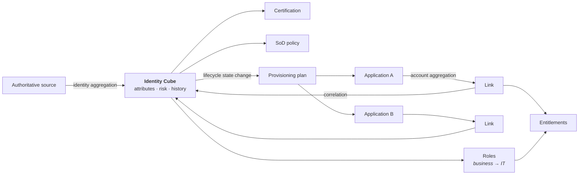

# SailPoint

*Verify current product details against SailPoint's documentation — capabilities and packaging change.*

## What it is

The market reference for **Identity Governance and Administration**. Two lineages:

- **IdentityIQ (IIQ)** — the long-established on-premises (or hosted) platform. Java, deeply customisable, XML object model, BeanShell rules. Enormous installed base in large regulated enterprises.
- **Identity Security Cloud (ISC)** — the SaaS platform (previously IdentityNow), with a virtual-appliance model for reaching on-premises targets, plus AI-driven modules for recommendations, role discovery and access insights.

SailPoint is **not an identity provider**. It doesn't do SSO or MFA. It governs the access that an IdP then authenticates people into. Confusing the two is a common and costly scoping error — several organisations have bought SailPoint expecting SSO.

---

## The object model

Learn these five and IdentityIQ's documentation opens up:

| Object | What it is |
|:--|:--|
| **Identity Cube** | The correlated identity: attributes from authoritative sources, links to accounts, entitlements, roles, risk score, history. *The* central object |
| **Application** | A connected system, with its connector configuration, schemas and provisioning policies |
| **Link** | An account in an application, correlated to a Cube |
| **Entitlement / ManagedAttribute** | A permission in an application (a group, a profile, a role in that system) |
| **Role** | A bundle. Business roles (job function) can require/permit **IT roles** (entitlement bundles) — the [two-layer model](../02-identity-fundamentals/16-role-modelling.md) implemented natively |

Supporting concepts: **Aggregation** (read accounts), **Correlation** (match to a Cube), **Provisioning Plan** (the intended change), **Workflow** (the process executing it), **Certification** (a review campaign), **Policy** (SoD and others), **Lifecycle State** (active, leave, terminated — driving birthright and revocation), **Identity Profile / Rule** (mapping source attributes onto the Cube).

---

## What it does genuinely well

**Certification.** The most mature campaign engine in the market: campaign types, phases (active/challenge/revocation), delegation, reassignment, exclusions, reminders and — crucially — **evidence that satisfies auditors without manual assembly**. For organisations whose driver is an audit finding, this is the reason they buy it.

**Breadth of connectivity.** A large connector catalogue plus a generic web-services connector, and the on-prem reach via virtual appliances in ISC.

**Analytics and recommendations.** Peer-group comparison, outlier detection, access recommendations at approval time, and AI-assisted role discovery. These meaningfully reduce reviewer load — treat them as ranking aids rather than decision-makers ([IGA](../02-identity-fundamentals/15-identity-governance.md)).

**Risk model.** Composite identity and entitlement risk scoring that drives prioritisation rather than sitting in a dashboard.

**Ecosystem.** Large partner and consultant community, well-documented patterns, and a deep pool of people who have implemented it — which materially reduces delivery risk.

---

## Where it's hard

**Customisation debt.** IdentityIQ's flexibility is real: rules, workflows, custom objects, UI extensions. It's also how implementations become upgrade-hostile. The classic failure is a heavily customised IIQ deployment where every upgrade is a project because business logic lives in BeanShell rules nobody has documented. **The discipline is to configure first and customise only with an [ADR](../04-architecture-practice/08-documentation-and-adrs.md) recording why configuration wasn't enough.**

**Implementation cost and duration.** Real IGA is a business process programme; SailPoint deployments are typically measured in quarters and involve significant professional services. That's not a product criticism — it's the nature of the problem — but budgets set on licence cost alone are always wrong.

**IIQ → ISC migration.** For existing IdentityIQ customers, moving to Identity Security Cloud is a genuine migration, not an upgrade: different architecture, different extensibility model, connectors and customisations to be rebuilt. Plan it as a [migration](../04-architecture-practice/04-migration-and-coexistence.md) with report-only running and a full reconciliation baseline.

**Not an IdP.** You still need Entra/Ping/Okta/Keycloak for authentication.

---

## Where it fits

**Strong fit:** large regulated enterprises (financial services, healthcare, pharma, energy); audit-driven programmes; heterogeneous estates with mainframe, SAP and hundreds of applications; organisations that need certification evidence above all.

**Weaker fit:** small organisations (cost and complexity exceed the need); pure Microsoft estates where Entra ID Governance may suffice; CIAM (wrong category entirely); organisations without capacity to run it after go-live.

{: .architect }
> **The most common SailPoint failure isn't the product — it's scope and sequence.** Programmes that attempt 150 applications and an enterprise role model simultaneously stall; programmes that connect HR and AD, automate leavers, then govern the top 20 risk applications, deliver visible risk reduction within two quarters and build the credibility to continue. When you inherit a struggling SailPoint programme, look at the sequence before you look at the configuration — it's almost always the sequence.

---

## What an architect should be able to say about it

- Identity Cube = the correlated identity; Link = an account; entitlement = a permission in a target.
- Aggregation reads; provisioning writes; **reconciliation is what makes it a control**.
- Business roles and IT roles implement the two-layer model natively — use it.
- Lifecycle states drive birthright and revocation; get them modelled correctly early.
- Certification is the strongest capability and the reason most customers buy.
- Customisation is the main long-term risk; every rule is future upgrade cost.
- It governs access; it does not authenticate users.

---

**Next:** [One Identity](02-one-identity.md) →
