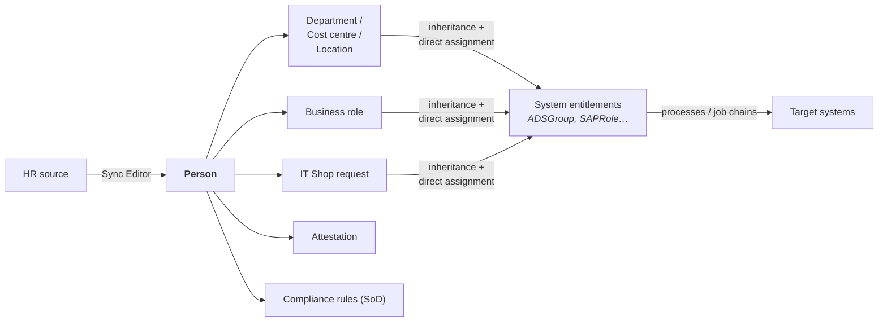

# One Identity

*Verify current product details against One Identity's documentation — capabilities and packaging change.*

## What it is

A portfolio rather than a single product, and one of the few vendors covering **IGA, PAM and AD management** under one roof:

| Product | Domain |
|:--|:--|
| **One Identity Manager** (OIM / "1IM") | Enterprise IGA — lifecycle, roles, attestation, provisioning |
| **Active Roles** | Delegated, policy-enforced AD/Entra administration |
| **Safeguard** | PAM — vaulting, session management, privileged analytics |
| **OneLogin** | Access management / SSO (acquired) |
| **Identity Manager – Data Governance** | Unstructured data (file shares, SharePoint) access governance |
| **syslog-ng, Starling** | Adjacent logging and cloud services |

The portfolio breadth is the strategic argument: eligibility governed in Identity Manager, exercised through Safeguard, with AD changes enforced by Active Roles — one vendor, integrated.

---

## One Identity Manager, in depth

The product an architect most needs to understand, because it is architecturally distinctive.

### The object model

OIM is built on a **relational database with a rich, typed object model** — the entire identity world is expressed as tables and relationships, and the product's power comes from that.

| Object | Table (illustrative) | Concept |
|:--|:--|:--|
| **Person** | `Person` | The correlated identity |
| **Target-system account** | `ADSAccount`, `SAPUser`, `UNSAccountB` | Account in a connected system |
| **System entitlement** | `ADSGroup`, `SAPRole`, `UNSGroupB` | Entitlement |
| **Business role** | `Org` / role classes | Business-meaningful bundle |
| **Organisational structure** | `Department`, `ProfitCenter`, `Locality` | Hierarchies that carry access |
| **Application role** | `AERole` | Permissions *within* One Identity Manager itself |
| **IT Shop** | `ITShopOrg`, shelves, products | The access request catalogue |
| **Assignment tables** | `PersonInOrg`, `ADSAccountInADSGroup` | The grants themselves |

{: .concept }
> **One Identity Manager's distinguishing idea is that access is a *calculated* consequence of structure.** A Person belongs to a Department; the Department carries entitlements; therefore the Person receives them — automatically, through inheritance, with the reason traceable through the assignment chain. Direct assignments, dynamic roles, IT Shop requests and inheritance all coexist, and the system records *which mechanism* produced each grant (the `XOrigin` concept). That traceability — "you have this because of *this*" — is genuinely strong, and it's what makes complex enterprise structures expressible.

### Key mechanisms

- **Synchronisation Editor** — the sync engine: typed connectors, schema classes, mapping rules, bidirectional flows, filters, and a real projection/join model. One of the strongest sync engines in any IGA product, and the reason OIM handles messy legacy estates well.
- **Processes and job chains** — the workflow engine. Changes to objects generate processes handled by the Job Service, with retry and error handling. This is asynchronous by design.
- **IT Shop** — the request catalogue: shelves, products, approval workflows and policies. Highly configurable, including multi-step and role-based approval.
- **Attestation** — the certification engine: attestation policies, procedures, schedules and approval workflows, targeting almost any object type in the model.
- **Compliance rules** — SoD and other rule violations, evaluated across the model, with mitigating controls and exception approval.
- **Dynamic roles** — membership calculated from a condition, re-evaluated continuously. Powerful, and the same [caution applies](../02-identity-fundamentals/16-role-modelling.md): always simulate before activating.
- **Designer / Manager / Web Portal** — configuration, administration and end-user interfaces respectively.

---

## What it does genuinely well

**Expressive modelling of complex organisations.** Multiple hierarchies (department, cost centre, location, business role) that each carry access, with inheritance and clear provenance. Multinationals with legal entities, matrix structures and country-specific rules can express reality rather than flatten it.

**Synchronisation depth.** The Sync Editor handles awkward legacy systems, bidirectional flows and complex mappings better than most competitors.

**Portfolio integration.** Identity Manager governing *eligibility*, Safeguard controlling *exercise*, Active Roles enforcing *AD changes* is a coherent story that single-domain vendors can't match without integration work.

**Active Roles specifically.** For organisations with heavy AD administration, it provides delegated administration with policy enforcement, automation and a virtual layer over AD — solving a real problem (uncontrolled AD admin) that IGA alone doesn't.

**Extensibility.** Scripts, custom tables, custom processes — you can model almost anything.

---

## Where it's hard

**The learning curve is real and steep.** The object model, Designer, process chains and the customisation model take genuine investment. The pool of deeply experienced OIM architects is smaller than SailPoint's, which affects hiring and delivery risk.

**Powerful means dangerous.** Because you *can* model anything, implementations can become extremely bespoke — the same customisation-debt trap as IdentityIQ, with more surface area. Discipline about configuring-versus-customising matters even more here.

**Database-centric operations.** Understanding what's happening frequently means understanding the schema and the process queue. That's a strength for those who invest and a barrier for those who don't.

**Asynchronous processing.** Changes flow through job chains; "why hasn't this provisioned yet?" requires reading the process queue. Operationally this needs a team comfortable with the model.

---

## Where it fits

**Strong fit:** large, complex, multi-entity enterprises (notably strong presence in German-speaking Europe and across European manufacturing and finance); estates with heavy AD/SAP; organisations wanting IGA + PAM + AD management from one vendor; situations where organisational structure genuinely drives access and must be modelled faithfully.

**Weaker fit:** organisations wanting fast, template-driven deployment; small teams without capacity to build OIM expertise; cloud-native estates with little legacy; CIAM (wrong category).

{: .architect }
> **The One Identity Manager question to ask early is "how much of our access can be expressed as inheritance from structure?"** If the answer is "most of it" — a manufacturer where department and location genuinely determine access — OIM's model fits beautifully and delivers a highly maintainable result. If the answer is "very little; access is individual and project-based", you'll fight the model and end up with thousands of direct assignments, at which point a simpler request-and-certify platform would have served better. **Match the product's core abstraction to the shape of your organisation** — that principle generalises well beyond this vendor.

---

## What an architect should be able to say about it

- `Person` = the identity; target-system accounts are separate typed objects; entitlements are system-specific objects.
- Access is largely **inherited from structure** (departments, cost centres, business roles), with provenance recorded.
- Synchronisation Editor is the sync engine — strong on complex and legacy targets.
- IT Shop is the request catalogue; attestation is certification; compliance rules are SoD.
- Processes/job chains make provisioning asynchronous — operations must understand the queue.
- Active Roles solves delegated AD administration; Safeguard is the PAM half.
- Deep expressiveness, steep learning curve, real customisation risk.

---

**Next:** [Ping Identity](03-ping-identity.md) →
