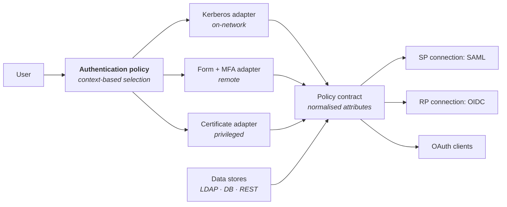

# Ping Identity

*Verify current product details against Ping's documentation — the portfolio has been consolidating since the ForgeRock acquisition.*

## What it is

An **access management** vendor: authentication, federation, authorisation and directory — for both workforce and customer identity. Following the ForgeRock acquisition, Ping owns two formerly-competing product lines and is converging them.

| Product | Role |
|:--|:--|
| **PingFederate** | The federation server: SAML, OIDC, WS-Fed, OAuth AS, adapter and policy framework. The flagship on-premises/self-managed component |
| **PingOne** (cloud platform) | SaaS identity services: SSO, MFA, risk, DaVinci orchestration, PingOne for Customers |
| **PingAM / PingIDM / PingDS / PingIG** | The ForgeRock line: Access Management, Identity Management, Directory Services, Identity Gateway |
| **PingDirectory** | High-scale directory (from UnboundID) — CIAM-grade, strong data governance |
| **PingAccess / PingGateway** | Reverse proxy / identity-aware gateway for applications that can't federate |
| **PingID** | MFA |
| **DaVinci** | No-code/low-code orchestration of identity journeys |
| **PingAuthorize** | Externalised, fine-grained authorisation (from Symphonic) |

---

## Why Ping shows up in complex enterprises

The recurring reason: **PingFederate handles awkward federation requirements that simpler products can't.**

Concretely — many upstream identity providers, per-connection attribute contracts, adapter chaining (Kerberos → certificate → password → MFA, with fallbacks), protocol translation (SAML in, OIDC out), token exchange, per-partner policy, and detailed control over exactly what is asserted to whom.

Where an organisation has fifty federation partners, a mainframe, three acquisitions and a regulator, that flexibility is the product's justification.

### The concepts to know

| Concept | What it does |
|:--|:--|
| **Adapter** | How authentication actually happens (HTML form, Kerberos, X.509, integrated MFA). Chainable |
| **Adapter/policy contract** | The normalised set of attributes an adapter produces |
| **Connection** | A configured relationship with an SP or IdP, with its own attribute contract and policy |
| **Authentication policy** | The decision tree selecting adapters based on context |
| **Token processor / generator** | Token exchange between formats — enabling protocol bridging |
| **Data store** | Where attributes are looked up (LDAP, database, REST) |
| **DaVinci flow** | Orchestrated journey, composed visually — registration, step-up, recovery, progressive profiling |

---

## CIAM strengths

Ping is one of the two enterprise CIAM leaders, and the reasons are architectural:

- **PingDirectory** scales to very large user populations with strong data governance features (fine-grained access control on attributes, data privacy controls, encryption).
- **DaVinci orchestration** lets product teams change registration and login journeys without engineering releases — a genuine advantage when the identity journey is part of the product and marketing wants to A/B test it.
- **PingOne Protect / risk services** for fraud and adaptive decisions.
- **Deployment flexibility** — SaaS, self-managed, or hybrid, which matters for data residency and for regulated customers who cannot use multi-tenant SaaS.

---

## Where it's hard

**Portfolio complexity.** Two overlapping product lines mid-convergence means genuine ambiguity about which component to use for a given requirement, and roadmap questions you must ask directly. Get the vendor to state, in writing, the strategic direction for the specific components you're buying.

**Operational weight.** Self-managed PingFederate/PingAM deployments are real infrastructure: clustering, certificate management, upgrades, capacity planning. Powerful, and it needs a team.

**Cost and complexity at the low end.** For an organisation with twenty SaaS applications and one directory, Ping is more capability than the problem requires; Entra or Okta will be simpler and cheaper.

**Not an IGA platform.** PingIDM does provisioning and some lifecycle, but for certification campaigns, SoD and audit evidence at enterprise scale, organisations pair Ping with SailPoint, One Identity or Saviynt. **This pairing — Ping for AM, a dedicated IGA for governance — is one of the most common enterprise architectures in existence**, and recognising it saves a lot of confused scoping.

---

## Where it fits

**Strong fit:** large enterprises with complex federation needs; heavily regulated industries; CIAM at scale, especially where data residency or self-hosting is required; organisations with many partner federations; estates needing protocol bridging between legacy and modern.

**Weaker fit:** small/mid-size SaaS-first organisations; teams without infrastructure capacity for self-managed components; anyone expecting IGA capabilities.

{: .architect }
> **The question that tells you whether Ping is right: how much *variation* do your authentication and federation requirements contain?** If the answer is "one IdP, one MFA policy, SAML or OIDC to everything", a simpler platform will serve you better and cost less. If it's "different authentication per population, per network location and per application risk tier; fifty partner federations each with their own attribute contract; protocol bridging for legacy; and a customer journey product wants to change monthly" — that variation is precisely what Ping's adapter/policy/contract model exists to express, and simpler products will require you to fight them.

---

## What an architect should be able to say about it

- Ping is **access management**, not governance — expect it paired with an IGA platform.
- PingFederate's model: adapters authenticate, contracts normalise, connections define per-relationship behaviour, policies choose.
- Adapter chaining and protocol bridging are the differentiators in complex estates.
- PingDirectory is a high-scale directory in its own right, frequently the CIAM store.
- DaVinci decouples journey changes from engineering releases.
- The ForgeRock line (PingAM/IDM/DS/IG) is converging with the Ping line — ask about roadmap for anything you buy.
- PingAuthorize covers externalised fine-grained authorisation ([policy as code](../02-identity-fundamentals/13-policy-as-code.md)).

---

**Next:** [Okta & Microsoft Entra ID](04-okta-and-entra.md) →
