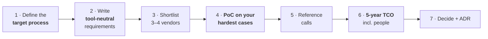

# Choosing a Platform

## The sequence that prevents regret

The order matters. The most common expensive mistake is starting at step 3 — because an audit finding demanded action, and a purchase order is a demonstrable action.

{: .warning }
> **Buying before defining the process means the tool's opinion becomes your process.** Every IGA platform has assumptions baked in about approval flows, role structure and lifecycle. Those assumptions are fine if they match yours and expensive if they don't — and you will discover the mismatch during implementation, when your options are "customise heavily" (creating permanent upgrade debt) or "change the business process" (which you have no mandate to do at that point). Define the target process first, even roughly.

---

## Writing tool-neutral requirements

Bad requirement: *"Must support Identity Cubes with correlation rules."* That's SailPoint's vocabulary; you've pre-selected the vendor and told the others you have.

Good requirement: *"Must correlate accounts from 40+ systems to a single identity record using configurable matching rules, and must place unmatched accounts in a reviewable exception queue."*

Structure them as: **capability + scale + evidence**.

- *Capability:* what must it do?
- *Scale:* how many, how fast, how often?
- *Evidence:* how will we verify it in the PoC?

Requirements worth stating explicitly because they're the ones that separate platforms:

| Area | The requirement that discriminates |
|:--|:--|
| **Connectivity** | *Our three hardest systems*, named — mainframe, that bespoke app, that SaaS with a strange API |
| **Reconciliation** | Detect and report unmanaged changes in every connected system |
| **Evidence** | Produce complete certification and revocation evidence **without manual assembly** |
| **Non-employee lifecycle** | Sponsor-based identities with mandatory expiry and re-attestation |
| **Cross-application SoD** | Rules spanning two different systems, preventively enforced |
| **Bulk events** | 3,000 movers in one night without breaching target rate limits |
| **Extensibility model** | What can be configured vs what requires code, and what happens to that code on upgrade |
| **Failure handling** | Where do failed provisioning operations go, who sees them, how are they re-driven |
| **Exit** | Can we export our full identity, entitlement and history data in a usable form? |

That last row is worth insisting on. **Ask every vendor how you would leave them.** The answer tells you about their confidence and your future negotiating position.

---

## The proof of concept

The single highest-value step, and the one most often reduced to a vendor-run demo.

**Rules for a PoC that tells you something:**

1. **Your data, your systems.** A vendor demonstrating on their sample tenant proves only that their sample tenant works.
2. **Your three hardest integrations**, not the easy ones. If it can't do the mainframe, that's the finding.
3. **Your team drives.** If only the vendor's engineer can make it work, you've learned that you'll need their engineer forever.
4. **Time-boxed and scripted.** The same scenarios for every vendor, scored against pre-agreed criteria written *before* the demos.
5. **Include a failure scenario.** Break a connector deliberately. How is the failure surfaced, and how do you recover?
6. **Include the operations view.** Not just "can it do X" but "how would we run this every day?"

Score against your written criteria, not against impressions. Impressions are shaped by demo quality and the presenter's charisma, both of which are uncorrelated with how the product behaves in month eighteen.

---

## Total cost of ownership

Five years, and include everything:

| Cost | Frequently underestimated because |
|:--|:--|
| **Licences** | Growth, and whether NHIs/contractors count toward the identity total |
| **Infrastructure** | Non-production environments are routinely forgotten |
| **Implementation services** | For complex IGA, often 1–3× year-one licence |
| **Internal delivery effort** | Your people's time is a real cost |
| **Run team** | **Usually the largest five-year line, and the most often omitted entirely** |
| **Upgrades** | Especially where the deployment has been customised |
| **Integration maintenance** | Connectors break when targets change |
| **Training and certification** | Per person, and again when people leave |
| **Exit cost** | What it would take to migrate away |

{: .architect }
> **The number that changes decisions is cost per governed application over five years, not licence cost.** A cheaper platform that needs three FTEs to run and takes twice as long per integration is not cheaper. Build the model with the run team in it, show it to the sponsor, and be prepared for the conclusion to contradict the procurement instinct — which is exactly why you build it before the decision rather than after.

---

## Reference calls that are worth having

Vendors will offer references who love them. Ask for something more useful:

- A customer of **similar size, sector and estate complexity**.
- Ideally one **two or more years post-go-live** — the honeymoon is over and the run costs are visible.
- Preferably one who went through an **upgrade**.

Questions that produce real answers:

- What took longer than you expected, and why?
- What would you do differently?
- How many people run it? What do they spend their time on?
- What did you have to customise, and how did that affect upgrades?
- How responsive is support when something is genuinely broken?
- What can't it do that you assumed it could?

That last question is the most valuable one in the entire selection process.

---

## How selections go wrong

| Failure | Symptom |
|:--|:--|
| **Requirements written from a vendor's datasheet** | Competitors can't answer, and you've paid for a foregone conclusion |
| **Demo-driven** | Bought on a polished journey that used sample data |
| **Feature-count scoring** | 400 requirements weighted equally; the five that matter are diluted to noise |
| **No PoC on hard cases** | The mainframe integration is discovered to be impossible in month nine |
| **Licence-only TCO** | The run team appears in year two as an unbudgeted surprise |
| **Analyst-report-driven** | A quadrant leader that doesn't fit your estate |
| **No exit consideration** | Ten years later, migration is unaffordable and the vendor knows it |
| **Ignoring the operating team** | Nobody asked the four people who will run it whether they can |

---

## When the answer is "don't buy"

Legitimate outcomes of a selection:

- **The native capability is enough.** Entra ID Governance for a genuinely Microsoft-centric mid-size estate; native cloud JIT instead of a vault for cloud roles.
- **The process problem comes first.** If there's no authoritative source for contractors and no application owners, a platform will automate chaos faster. Fix the data and ownership first — it's cheaper and it's a prerequisite anyway.
- **The scope doesn't justify it.** Twenty applications and 300 employees rarely need enterprise IGA.
- **There's no run capacity.** Buying a platform nobody can operate produces an expensive report generator within eighteen months.

Recommending "not yet, and here's what to do first" is a strong architectural position, and it is one of the clearest signals that someone is thinking as an architect rather than as a buyer.

---

## Architect's checklist

- [ ] Is the **target process defined** before vendors were contacted?
- [ ] Are requirements **tool-neutral**, with scale and evidence criteria?
- [ ] Does the PoC use **your data and your three hardest integrations**?
- [ ] Are scoring criteria written **before** the demos?
- [ ] Does the PoC include a **failure and recovery scenario**?
- [ ] Is TCO modelled over **five years including the run team**?
- [ ] Have you asked every vendor **how you would leave them**?
- [ ] Have you spoken to a reference **two years post-go-live**?
- [ ] Have you asked "**what can't it do that you assumed it could?**"
- [ ] Is the decision recorded as an **ADR** with rejected alternatives?
- [ ] Is "don't buy yet" on the table as a legitimate outcome?

---

**Next:** [Stage 6 — Business & Risk](../06-business-and-risk/) →
