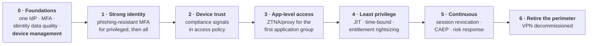

# Zero Trust as a Business Programme

*For the technical model, see [Zero Trust & Continuous Access](../08-frontier/01-zero-trust.md). This page is about selling, scoping and sequencing it.*

## The problem with the term

"Zero Trust" is simultaneously a genuine architectural shift and the most over-marketed phrase in security. Every vendor sells it; it means something different in each pitch; and executives have heard it enough to be either enthusiastic or cynical, with little in between.

{: .concept }
> **Zero Trust is not a product and not a project — it is a principle applied progressively: no implicit trust from network location; verify explicitly on every request; grant least privilege; assume breach.** Its practical consequence is that **identity and device become the control plane** where the network perimeter used to be. That means most of a Zero Trust programme *is* identity work, whether or not the identity team is leading it. If they aren't, that's a problem worth fixing early — usually by volunteering.

---

## Translating it for executives

Avoid the architecture diagram. Use the shift:

> *"We used to protect a building — get through the front door and you could walk around inside. Now our people, our applications and our data are all outside the building, so we protect each room individually and check identity at every door, every time. That's Zero Trust."*

Then the business consequences, which are what actually get funded:

| Business outcome | The identity mechanism behind it |
|:--|:--|
| Employees work productively from anywhere | Application-level access instead of VPN |
| Contractors and partners get scoped access in hours, not weeks | Identity-based access, no network onboarding |
| A compromised laptop doesn't become a company-wide incident | Per-request verification, least privilege, segmentation |
| Acquisitions integrate faster | Federation instead of network merging — often the strongest argument in acquisitive companies |
| Audit evidence improves | Every access decision is logged with its reason |
| VPN concentrators and MPLS costs decline | ZTNA replaces network-centric remote access |

That last row matters: **Zero Trust programmes are frequently funded on VPN replacement economics** rather than on security. Know the current cost of remote access infrastructure — it's often the number that unlocks the budget.

---

## Where programmes go wrong

**Buying technology before the foundations exist.** Zero Trust needs reliable identity data, a single IdP, MFA, and — critically — **device management**. Without device signals, "verify explicitly" degenerates into "prompt for MFA more often", which users experience as pure friction with no benefit. Device management is usually the gating dependency, and it belongs to a different team, which is why it must be sequenced first and negotiated early.

**Treating it as a network project.** ZTNA products are network products, so network teams often lead. Then identity requirements arrive late and the policy model turns out to be IP-based with an identity veneer.

**Big-bang policy.** Enabling strict policy across the estate on one date produces a support catastrophe and a rollback, after which the programme is politically dead for a year.

**Exception sprawl.** Every application that can't comply gets an exemption, and within eighteen months the exemption list *is* the architecture ([anti-patterns](../04-architecture-practice/07-anti-patterns.md)).

**No definition of done.** "Are we Zero Trust yet?" has no answer unless you defined measurable stages up front.

---

## A sequence that works

Each stage delivers something on its own, which is what keeps it funded across budget cycles:

- **Stage 1** measurably reduces credential attacks — reportable within a quarter.
- **Stage 3** gives contractors and remote workers a better experience than VPN, generating user demand for the rest.
- **Stage 6** removes real infrastructure cost, which is the finance payoff.

{: .architect }
> **Start with a population that has an existing pain, not with your most critical application.** Contractors and third parties are usually ideal: they're a genuine risk, they currently get clumsy VPN access, they're outside the core user base so a stumble is contained, and the improvement is immediately visible. A successful contractor rollout generates internal demand — employees ask why *they* still use the VPN. Demand pull beats mandate push in every organisational change, and Zero Trust is an organisational change wearing a technical costume.

---

## Measuring it

Avoid maturity-model theatre. Measure the properties that actually change:

| Metric | Direction |
|:--|:--|
| % of applications accessible without network-level trust (no VPN required) | ↑ |
| % of access decisions incorporating a **device compliance** signal | ↑ |
| % of users on phishing-resistant authentication | ↑ |
| Standing privileged access | ↓ |
| Mean time to revoke a session across the estate | ↓ |
| Number and age of policy **exceptions** | ↓ |
| VPN concurrent sessions / remote access infrastructure cost | ↓ |
| Lateral movement opportunity (from attack path analysis) | ↓ |

Report these quarterly with trends. A programme showing six lines moving in the right direction stays funded far more reliably than one reporting maturity level advancement.

---

## Answering the sceptics

**"We already have MFA and a VPN. Isn't that Zero Trust?"** No — a VPN grants network access, so anyone who gets in is inside. Zero Trust grants access to *one application*, per request, with checks on identity, device and context each time.

**"This will slow everyone down."** Done well, it's faster: no VPN client, no waiting for a network connection, passkeys instead of passwords. Where done badly, it's slower — which is why we sequence and measure friction as a first-class metric.

**"We can't do this with our legacy applications."** Correct, in part. Legacy applications go behind an identity-aware proxy, which is a well-understood pattern. A small residue will stay on network-level controls and belongs on the risk register with an owner — and saying so honestly is more credible than claiming full coverage.

**"How long?"** Two to four years for a large enterprise, with meaningful benefits from year one. Anyone promising less is selling.

---

## Architect's checklist

- [ ] Is there a **shared definition** of what Zero Trust means in your organisation, written down?
- [ ] Are the **foundations** in place — one IdP, MFA, identity data quality, **device management**?
- [ ] Is identity **leading or following** the programme? If following, how are identity requirements getting in?
- [ ] Is the sequence **incremental**, with value at each stage?
- [ ] Did you start with a population that has **existing pain**?
- [ ] Are you measuring **outcome metrics**, not maturity levels?
- [ ] Is there an **exception process with expiry**, and is the exception count reported?
- [ ] Is the **VPN decommissioning** economic case quantified?
- [ ] Is there an honest position on the applications that **won't** be covered?

---

**Next:** [Operating Model & Org Design](05-operating-model.md) →
