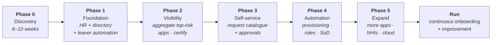

# IAM Programme Delivery

## Why IAM programmes fail

They fail more often than most enterprise programmes, and the reasons are consistent enough to be predictable:

| Cause | What it looks like |
|:--|:--|
| **Treated as a tool deployment** | Configure-and-go. IAM is a business process change that happens to involve software |
| **Data quality discovered late** | Month six: nobody can be certified because 38% of manager fields are wrong |
| **No business ownership** | IT owns the tool; nobody owns the decisions. Entitlements with no owner can't be governed |
| **Scope too broad** | 200 applications, an enterprise role model and CIAM, simultaneously |
| **Value too late** | Nothing visible for 18 months; sponsor changes; funding lost |
| **Underestimating integration** | The hard 10% is 60% of the effort and contains most of the risk |
| **No operating model** | Go-live succeeds; decay begins |
| **Change management ignored** | Technically perfect, universally resented, routed around |

Notice how few are technical. The two that are — data and integration — are both *discovery* failures: they were knowable earlier.

---

## Phasing that works

**Why this order:**

- **Leaver automation first** is the fastest visible risk reduction, the easiest audit win, and it needs only two integrations (HR and the directory). It buys the credibility that funds everything else.
- **Visibility before control.** Aggregating and certifying before you automate provisioning means you understand what you have before you start changing it — and it produces the data your role model will eventually need.
- **Self-service before roles.** Access requests generate the data that makes role mining meaningful, and they deliver user-visible value early.
- **Roles late**, informed by real data rather than by workshops.

{: .architect }
> **Resist the pressure to start with the role model.** It's intellectually appealing, business stakeholders find it intuitive, and it's the single most common way IAM programmes lose two years. You cannot model roles well without knowing who currently has what — which requires aggregation you haven't done yet — and the organisation will reorganise at least once while you're modelling. Deliver leaver automation and certification first; the role model will be better *and* cheaper for having waited.

---

## Programme governance

**A steering committee** with the CISO, CIO, HR, audit and business representation — meeting monthly, taking decisions rather than receiving updates. If it becomes a status meeting, it has failed; bring it a decision every time.

**A single accountable sponsor**, senior enough to unblock HR and application owners. IAM programmes fail on cross-functional dependencies, and only a sponsor can resolve those.

**A product owner** managing the backlog and the constant stream of "can you just also…". Without one, the team is pulled in every direction.

**An architecture authority** — you — with decision rights over design, and an [ADR trail](../04-architecture-practice/08-documentation-and-adrs.md).

**A working group of application owners**, convened early, because they'll do the actual governance work and they need to know it.

---

## Estimating

The honest ranges, which will be uncomfortable to present:

| Activity | Typical |
|:--|:--|
| Discovery | 6–10 weeks |
| Platform stand-up (SaaS vs on-prem) | 2–8 weeks |
| HR integration | 2–6 weeks — **plus data remediation, which is the long pole** |
| Directory integration | 2–4 weeks |
| Standard application (SCIM/supported connector) | 3–10 days |
| Non-standard application | 2–6 weeks |
| **Hard application** (mainframe, no API, no test environment) | 2–6 months, or never |
| Role model (initial, one domain) | 3–6 months |
| Certification campaign design and first run | 6–10 weeks |
| Change management and training | Continuous, ~15% of effort |

**Multiply application estimates by a "no test environment" factor.** Applications without a non-production instance cannot be integrated safely, and discovering this mid-build is a common schedule shock. Ask about it during discovery, for every application.

---

## Agile, waterfall, or reality

IAM programmes sit awkwardly:

- **Genuinely iterative:** application onboarding, catalogue improvement, role refinement, connector work.
- **Genuinely sequential:** you cannot certify before you aggregate; you cannot aggregate before you correlate; you cannot correlate without an authoritative source.
- **Genuinely dependent on others' calendars:** HR data cleanup, application owner availability, audit cycles, works council consultation, business freeze periods (month-end, year-end, peak trading).

What works in practice: **a phased plan with iterative delivery inside each phase.** Fixed sequencing for the dependency chain, sprints for the stream of onboarding work. And plan around the business calendar deliberately — a certification campaign launched during year-end close will not complete, and launching it anyway damages the programme's reputation more than the delay would have.

---

## Change management

The most under-resourced workstream, and the one that determines adoption.

**Who is affected, and what changes for them:**

| Group | The change | What they need |
|:--|:--|:--|
| Managers | New approval and certification duties | Why it matters, how long it takes, what happens if they ignore it |
| Application owners | Formal ownership, entitlement descriptions, decisions | Recognition that this is real work, and time allocated |
| End users | New request process, possibly new login | Clear communication, ideally a *better* experience |
| Administrators | Loss of direct control; changes now flow through IAM | Involvement in design; a fast path for genuine emergencies |
| Service desk | New processes, new tools, an initial spike | Training before go-live, not during |

Practical measures: communicate before go-live through the channels people actually read; train the service desk first; run a genuine pilot with a vocal business unit; give administrators a fast emergency path so they don't need a shadow process; and **make the new way faster than the old way** wherever you possibly can. Adoption follows convenience far more reliably than it follows mandate.

---

## Managing systems integrators

Most large IAM programmes involve one. What determines the outcome:

- **Own the architecture yourself.** The SI implements; you decide. An SI that owns the architecture optimises for their delivery model and their next engagement.
- **Insist on knowledge transfer as a deliverable**, with acceptance criteria — not as a final-week workshop.
- **Demand documentation of customisations**, with the reason for each. Undocumented BeanShell rules are the classic legacy of a departed SI.
- **Keep configuration under your version control.**
- **Pay for outcomes**, not for hours, where you can define outcomes cleanly.
- **Staff your own team from day one.** A programme where the client has no capability at go-live has bought a dependency, not a platform.

---

## Architect's checklist

- [ ] Does **phase one deliver visible value** within a quarter?
- [ ] Is **leaver automation** early in the sequence?
- [ ] Is the **role model deliberately late**, informed by real data?
- [ ] Is there a **single accountable sponsor** senior enough to unblock HR and application owners?
- [ ] Has every application been checked for a **non-production environment**?
- [ ] Has one **hard integration** been attempted early to calibrate?
- [ ] Is the plan aligned to the **business calendar** (close periods, peak trading, holidays)?
- [ ] Is **change management resourced** (~15%), with the service desk trained first?
- [ ] Do you own the **architecture and the ADRs**, not the SI?
- [ ] Is **knowledge transfer** a deliverable with acceptance criteria?
- [ ] Is the **run team hired and embedded** before go-live?

---

**Next:** [Discovery & Assessment](02-discovery.md) →
