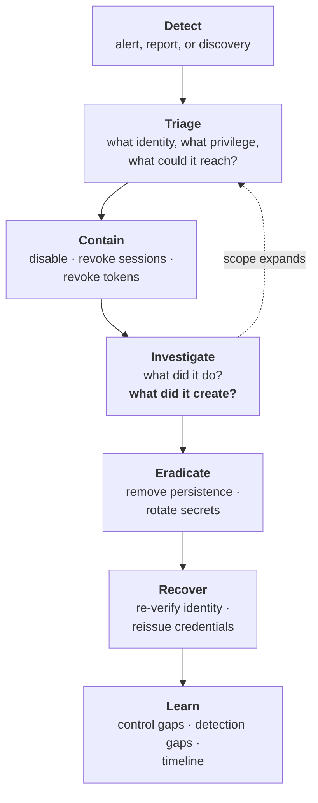

# Identity Incident Response

## Why identity incidents are different

In most incidents you contain a system. In an identity incident you contain a **credential and everything it can reach** — which may be everything, and which may already have been used to create additional access you haven't found.

{: .concept }
> **Disabling the compromised account is the beginning, not the end.** An attacker with a session does not need the credential again. An attacker who created a second credential, registered an MFA method, added an OAuth application, granted themselves a role, added a signing key or established a federation trust does not need the original account at all. **Identity incident response is a hunt for what was created, not just a removal of what was used** — and that difference is why generic IR playbooks handle identity badly.

---

## The response sequence

That feedback loop from Investigate back to Triage is the part that matters. Identity incidents expand: one compromised account leads to a service principal, which leads to a second tenant, which leads to a partner federation.

---

## Containment, in order

**1. Disable authentication.** Fastest action, biggest effect. Seconds, not minutes.

**2. Revoke sessions and tokens.** *Disabling an account does not end an existing session or invalidate an unexpired access token.* This step is the one most often missed and the one attackers most rely on. Know the mechanism in each of your platforms **before** you need it.

**3. Revoke refresh tokens and OAuth grants** the identity authorised.

**4. Reset the credential and remove registered authenticators** — an attacker may have registered their own MFA method, which would otherwise survive a password reset.

**5. Contain the device**, if endpoint compromise is suspected.

**6. For privileged accounts, widen immediately.** If a domain admin or Global Administrator is implicated, assume the directory is compromised until proven otherwise, and move to the tier-0 playbook: `krbtgt` rotation (twice, with replication between), review of all privileged group membership, and a full configuration comparison against the baseline.

{: .warning }
> **The "how fast can we kill every session for one user?" question should have a rehearsed answer measured in minutes.** In most organisations, the first time anyone asks it is during an incident, and the answer involves forty minutes of documentation searching across three consoles while an attacker is active. Build the runbook, script what you can, and **rehearse it** — including for federated applications that hold their own sessions ([sessions](../02-identity-fundamentals/10-sessions-and-logout.md)).

---

## The persistence hunt

The step that distinguishes competent identity IR. After containment, look for what was **created**:

| Persistence mechanism | Where to look |
|:--|:--|
| **New signing key / certificate on the IdP** | Federation configuration. **Enables forging assertions for anyone, indefinitely** |
| **New federated trust / added IdP** | Trust relationships — an attacker-controlled IdP asserting any identity |
| **New OAuth app / service principal with credentials** | Application registrations; look for added client secrets or certificates |
| **Consent grants** with high-privilege application permissions | Mail.ReadWrite.All, Directory.ReadWrite.All and similar |
| **New privileged role assignments**, including eligible-but-not-active | Directory roles, cloud roles, PIM eligibility |
| **Conditional access exclusions added** | Policy configuration — a quiet MFA bypass |
| **New accounts**, especially matching naming conventions | Recently created principals |
| **MFA methods registered** on other accounts | Authentication method changes |
| **Delegation configured** (mailbox, Kerberos, RBCD) | Delegation settings |
| **API keys, PATs, SSH keys, service account credentials** | Secret stores, repositories, `authorized_keys` |
| **Directory ACL changes** creating shadow admin paths | Directory permissions diff |
| **Modified sync or provisioning rules** | Sync engine configuration |

**This is why a configuration baseline matters.** Without a known-good snapshot, "is this federation trust legitimate?" cannot be answered in an incident — and asking around at 2am produces the answer "I think that's been there a while", which is worth nothing.

---

## Scoping questions

- What did this identity have access to — directly, and via role or group?
- What did it actually access during the exposure window?
- Was any data exported, and at what volume?
- Were credentials or secrets accessible to it? **All must be rotated.**
- Did it access a PAM vault? Everything it could check out is compromised.
- Did it have permission to change identity configuration?
- Are there other accounts belonging to the same person, or sharing the same device?
- Did it authenticate to partner systems, or from a partner's network?

---

## Recovery

**Re-verify the human.** If credential theft or social engineering is suspected, the person must be identity-proofed again before new credentials are issued — ideally through a stronger channel than normal. See [proofing](../02-identity-fundamentals/20-identity-proofing.md).

**Reissue with better credentials.** An incident is a legitimate and well-received moment to move that person — or that whole population — to phishing-resistant authentication.

**Rotate everything reachable.** Shared credentials, service accounts, API keys, certificates the identity could access. This step is routinely truncated because it's tedious and disruptive, and truncating it is how attackers return.

**Restore configuration** from the baseline where tampering is found, rather than fixing item by item — item-by-item remediation of a configuration you don't fully understand leaves things behind.

---

## Preparation

Everything above depends on work done in advance:

| Preparation | Why |
|:--|:--|
| **Configuration baseline**, versioned | Otherwise you cannot tell legitimate from malicious |
| **Immutable log export** outside the identity platform | An attacker with admin can alter logs in place |
| **Log retention** matching realistic dwell time | Discovering a 6-month-old compromise with 90 days of logs is a dead end |
| **Rehearsed runbooks** for session revocation, emergency leaver, `krbtgt` rotation, key rotation | Speed |
| **Break-glass access** in a separate failure domain | You may need to act while locked out |
| **Named decision-maker** for disruptive actions | "Do we disable the CFO's account at 03:00?" needs a pre-agreed owner |
| **Contact paths that survive the outage** | If email and chat are federated to the compromised IdP, you need another channel |
| **Detections for the persistence mechanisms** above | Otherwise you find them only if you go looking |
| **Tabletop exercises** | The cheapest way to discover your gaps |

{: .architect }
> **Run one tabletop: "an attacker had Global Administrator for six days last month and has now left."** Walk it through with the identity, security and infrastructure teams. It reliably exposes the same gaps — no configuration baseline, logs that don't go back far enough, no way to enumerate what changed, no agreed decision-maker, and no communication channel that doesn't depend on the compromised platform. **Every gap it exposes is a fundable piece of work with an obvious justification**, which makes the exercise valuable even if the incident never happens.

---

## Communication

- **Pre-agree who decides** on disruptive containment. Disabling an executive's account or forcing an estate-wide session revocation has business consequences and needs an owner.
- **Have an out-of-band channel.** If your chat and email authenticate through the compromised IdP, you cannot coordinate on them.
- **Legal and regulatory clocks start early.** GDPR, NIS2 and DORA notification windows are tight; involve legal and compliance at triage, not at conclusion.
- **Be careful with early attribution and early scope statements.** Identity incidents almost always expand, and a premature "contained" statement is difficult to walk back.

---

## Architect's checklist

- [ ] Is there a rehearsed runbook to **kill every session for one user**, and how long does it take?
- [ ] Does your team know that **disabling an account doesn't end sessions or tokens**?
- [ ] Is there a **configuration baseline** you could diff against?
- [ ] Are identity logs exported to a store **admins of that platform cannot alter**, with adequate retention?
- [ ] Do you have detections for the **persistence mechanisms** — new signing keys, new trusts, consent grants, CA exclusions?
- [ ] Is there a **tier-0 playbook** including `krbtgt` and signing key rotation?
- [ ] Is there an **out-of-band communication channel** independent of the IdP?
- [ ] Is there a **named decision-maker** for disruptive containment?
- [ ] Does the leaver/compromise process include **rotating everything the identity could reach**?
- [ ] Have you run an **identity tabletop** in the last year?

---

**Next:** [Stage 8 — The Frontier](../08-frontier/) →
