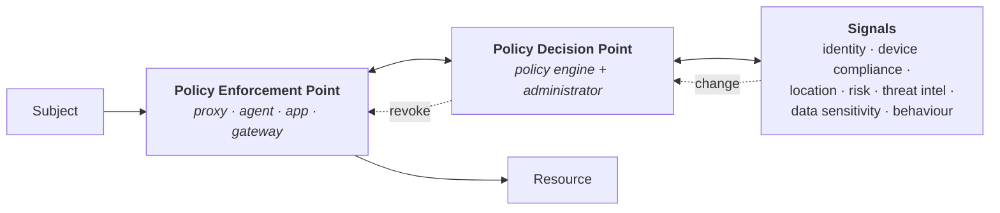
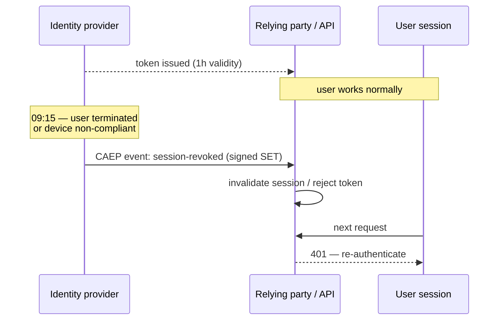

# Zero Trust & Continuous Access

*For the programme and funding view, see [Zero Trust as a Business Programme](../06-business-and-risk/04-zero-trust-business.md).*

## The principle, stated precisely

**No implicit trust is granted based on network location, device ownership or prior authentication. Every access request is verified explicitly, granted at least privilege, and re-evaluated as conditions change.**

NIST SP 800-207 is the reference architecture. Its core abstraction is familiar:

It is the [PDP/PEP model](../02-identity-fundamentals/12-authorization-models.md) applied to every access, with more signals — and with a feedback loop that revises decisions after they're made.

---

## What actually has to be true

Zero Trust is frequently bought as a product. These are the prerequisites without which it doesn't work:

| Prerequisite | Why |
|:--|:--|
| **One identity source of truth** | You cannot verify explicitly if you don't know who is who |
| **Strong authentication** | Preferably phishing-resistant; otherwise you verify a phishable claim |
| **Device management and compliance signals** | **The gating dependency.** Without device state, "verify explicitly" collapses into "MFA more often" |
| **Application inventory and classification** | You cannot apply proportionate policy to unknown resources |
| **A policy engine with real signals** | Conditional Access, ZTNA policy, or equivalent |
| **Telemetry** | You cannot re-evaluate what you cannot observe |
| **Least privilege in the entitlements themselves** | Verifying access to over-broad permissions verifies the wrong thing |

That last one is underrated: **Zero Trust verifies *whether* you may use an entitlement; it does nothing about the entitlement being too broad.** An organisation with excellent Conditional Access and a role model granting everyone far more than they need has secured the door to a room where everything is already accessible. Governance and Zero Trust are complements, not alternatives — a point vendors on both sides tend to leave out.

---

## Continuous access evaluation

The genuinely new idea, and the one worth designing for now.

**The problem:** a token is issued at 09:00 with an hour's validity. At 09:15 the user is terminated, the device falls out of compliance, or the session is detected as anomalous. With standard OAuth the resource server keeps accepting that token until 10:00 ([tokens](../02-identity-fundamentals/06-tokens-and-jwt.md)).

**The answer:** a standardised way for the identity provider to *push* events to relying parties, and for relying parties to re-evaluate.

| Standard | What it does |
|:--|:--|
| **SET** — Security Event Token ([RFC 8417](https://datatracker.ietf.org/doc/html/rfc8417)) | A signed JWT describing a security event |
| **SSF** — Shared Signals Framework | The delivery framework (push or poll) between providers |
| **CAEP** — Continuous Access Evaluation Profile | The event vocabulary: session revoked, credential changed, device compliance changed, assurance level changed |
| **RISC** | Account-level events for consumer contexts: account disabled, credentials compromised |

{: .architect }
> **Design the seams for this now, even if you can't adopt it yet.** Concretely: keep access token lifetimes short so your fallback revocation latency is tolerable; prefer platforms that already support CAEP/SSF; ensure your applications can *act* on a revocation signal (many can't — they have no way to invalidate a session on external instruction); and make token lifetime a configurable parameter rather than a hardcoded constant. **When you next choose an IdP or write an integration standard, "supports Shared Signals" belongs in the requirements** — support is uneven and asking for it is how it improves.

---

## Applying it proportionately

Zero Trust done badly is friction everywhere. Done well, it is friction *where risk is*:

| Context | Response |
|:--|:--|
| Known user, compliant managed device, normal location, low-sensitivity resource | Silent SSO, no prompt |
| Same, but sensitive resource | Step-up authentication |
| Unmanaged device | Read-only, no download, session limits |
| Anomalous signals | Step-up, or block with an alert |
| Privileged operation | Phishing-resistant re-authentication, always |

Getting this right requires knowing your resources' sensitivity, which requires classification, which most organisations do badly. **Start with the top tier**: identify the twenty most sensitive applications and apply differentiated policy there, rather than attempting uniform classification of everything first.

---

## Common failure modes

**Device management not in place.** The most common, and it stops the programme cold. Address it first.

**Uniform policy.** Same requirement for the wiki and the payment console — either over-restrictive or under-protective, and usually both for different users.

**Exception sprawl.** Every non-compliant application gets an exemption; the exemptions become the architecture ([anti-patterns](../04-architecture-practice/07-anti-patterns.md)).

**Network thinking in identity clothing.** ZTNA deployed as "VPN with a nicer client", policy still fundamentally IP-based.

**Ignoring the session.** Strong authentication at login, then a session valid for twelve hours with no re-evaluation — which is exactly the gap [session theft](../02-identity-fundamentals/08-mfa-and-passwordless.md) exploits, and the gap CAEP exists to close.

**No plan for the residue.** Some systems will never support this. Say so, put them on the risk register with compensating controls, and stop implying full coverage.

---

## What's genuinely new versus rebranded

**Genuinely new:** continuous evaluation and standardised revocation signals (CAEP/SSF); device compliance as a first-class authentication signal; per-application access replacing network access at scale; identity-centric micro-segmentation.

**Rebranded:** least privilege (decades old), MFA, network segmentation, defence in depth. All good, none new.

Knowing which is which keeps you credible with engineers who have been doing least privilege since before the term existed — and it stops you paying twice for something you already have.

---

## Architect's checklist

- [ ] Are the **prerequisites** in place, especially **device management**?
- [ ] Is policy **proportionate** to resource sensitivity, or uniform?
- [ ] Have your top-20 sensitive applications been **identified and differentiated**?
- [ ] Are entitlements themselves **least-privilege**, or is Zero Trust guarding over-broad access?
- [ ] What is your **actual revocation latency** for a compromised session, end to end?
- [ ] Do your platforms support **CAEP / Shared Signals**, and is it in your requirements?
- [ ] Can your applications **act on an external revocation signal**?
- [ ] Are **exceptions** time-boxed, owned and counted?
- [ ] Is there an honest position on systems that **won't** be covered?
- [ ] Can you distinguish what's genuinely new here from what you already do?

---

**Next:** [Identity Threat Detection & Response](02-itdr.md) →
