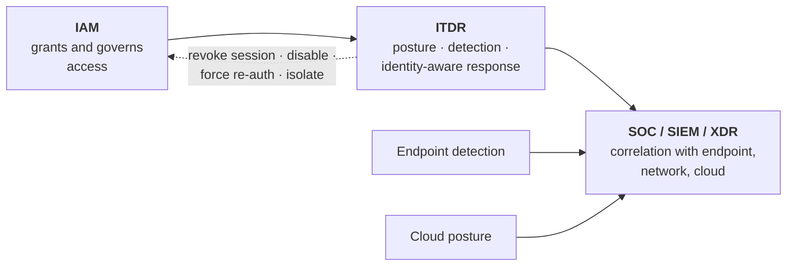

# Identity Threat Detection & Response (ITDR)

## The assumption that broke

Identity security was a *preventive* discipline: authenticate strongly, authorise correctly, govern access. Detection was the SIEM's job.

That stopped working for two reasons. First, **attackers use legitimate credentials** — there is no malware to detect when someone logs in with a valid password and a valid MFA approval. Second, **generic monitoring doesn't understand identity**: a SIEM sees a successful login, not that this account has never before authenticated from this country, to this application, at this hour, with this token type.

{: .concept }
> **ITDR asks a question no other tool asks: "is this legitimate identity behaving legitimately, and does the identity *infrastructure* still look the way it should?"** It combines posture (what attack paths exist in my directory?) with detection (is someone walking one right now?) with response (revoke, isolate, force re-authentication). It sits between IAM, which grants access, and the SOC, which watches for attacks — and that gap is precisely where most identity-based intrusions have succeeded.

---

## The two halves

### 1. Identity posture — what could an attacker do?

Static analysis of the identity estate for exploitable structure:

- **Attack paths** — chains from a low-privilege account to domain admin or Global Administrator, through nested groups, ACLs, delegation, or role-assumption chains in cloud.
- **Shadow admins** — principals with effective administrative capability through non-obvious rights (`WriteDACL`, `GenericAll`, password-reset rights on a privileged account).
- **Misconfigurations** — unconstrained delegation, AD CS template weaknesses, accounts with pre-authentication disabled, unmanaged service accounts with SPNs.
- **Stale and orphan objects**, dormant privileged accounts, unused but assumable roles.
- **Weak or absent MFA** on privileged principals; exempted accounts.
- **Cloud entitlement paths** — role chains and permission escalation routes (overlapping with CIEM).

**The distinctive value here is path thinking.** Each individual finding may be low severity; the *chain* is critical. A helpdesk group with password-reset rights over a service account that is a member of a group with local admin on a server where a domain admin logs in is a path to domain compromise — and no component-level review would flag any single step as serious.

### 2. Identity detection — what is happening now?

| Detection | Signal |
|:--|:--|
| **Anomalous authentication** | Impossible travel, new country, unusual hour, new device, unusual application |
| **Credential attacks** | Password spray (many accounts, few attempts), stuffing, brute force |
| **MFA anomalies** | Fatigue patterns (repeated denials then an approval), method registration on a dormant account, downgrade to a weaker method |
| **Session anomalies** | Token used from a different IP/device than issued to, concurrent geographically impossible sessions, session token replay |
| **Kerberos anomalies** | Bulk TGS requests (Kerberoasting), RC4 downgrades, anomalous ticket lifetimes, AS-REP requests without pre-auth |
| **Directory changes** | New privileged group members, ACL modifications, delegation changes, `krbtgt` activity, DCSync-pattern replication requests |
| **IdP configuration changes** | **New federation trust, new signing key, CA policy exclusion added, logging disabled** — the persistence set |
| **OAuth abuse** | New consent grants with high-privilege application permissions, new credentials added to an existing service principal |
| **Privilege escalation** | Self-granted roles, unusual PIM activations, break-glass use |
| **Data access anomalies** | Bulk export, first-time access to sensitive stores, access outside normal peer behaviour |

{: .warning }
> **The highest-value detections are the configuration ones, and they are the least commonly implemented.** A new signing certificate on the IdP or a newly added federation trust are rare, deliberate operations — and they are exactly what an attacker with administrative access creates for durable, quiet persistence that survives password resets and MFA changes. If you build only three identity detections, build: **new signing key**, **new federation trust**, **new high-privilege application permission grant**. See [securing IAM](../04-architecture-practice/06-securing-iam.md).

---

## Where ITDR fits

It is not a replacement for a SIEM — it is the identity expertise the SIEM lacks, feeding it enriched, identity-aware signals and able to take identity-specific response actions the SIEM cannot.

**Response actions that matter:** revoke sessions and tokens, disable the account, force re-authentication or step-up, require password/credential reset, remove a role assignment, quarantine the device, and (in some platforms) automatically revert a suspicious directory change.

---

## Building it without buying a product

Much of ITDR's value is achievable with what you have, and doing so is a good way to justify tooling later:

1. **Get identity logs into the SIEM** — IdP sign-ins and audit, directory events, PAM, cloud IAM. Complete, not sampled.
2. **Ensure audit policy actually generates the events** you assume exist (SACLs on Windows, directory audit settings, cloud trail configuration).
3. **Write the configuration-change detections** listed above. They're low volume and high value.
4. **Build a configuration baseline** and diff it periodically.
5. **Run open-source attack path analysis** against your directory. The results are usually sobering and immediately actionable.
6. **Add behavioural detections** where your IdP provides risk signals natively.
7. **Then** evaluate whether a dedicated product adds enough to justify the cost — armed with knowledge of your own gaps.

---

## Prerequisites people miss

- **Log completeness.** Sampled or partially-retained identity logs make detection unreliable and forensics impossible.
- **Retention matching realistic dwell time.** Detecting a six-month-old compromise with ninety days of logs leaves you unable to scope it.
- **Immutability.** Logs an identity administrator can alter cannot be trusted in an incident involving an identity administrator.
- **A baseline of normal.** Anomaly detection needs a period of learning, and organisations with genuinely chaotic access patterns generate too many false positives to be useful — which is itself a finding.
- **An owner for the alerts.** ITDR that pages nobody is expensive telemetry.

{: .architect }
> **ITDR should change your architecture, not just your monitoring.** When path analysis reveals that a helpdesk group can escalate to domain admin in three hops, the correct response is not to *alert* on that path being used — it is to **remove the path**. Detection is the safety net for what you couldn't prevent; posture findings are design defects. Treat the posture half as an architecture input feeding your backlog, and the detection half as an operations capability. Organisations that treat all of ITDR as a SOC tool get alerts about problems they could have eliminated.

---

## Architect's checklist

- [ ] Are **all** identity logs — IdP, directory, PAM, cloud — in the SIEM, complete and adequately retained?
- [ ] Are logs **immutable** to identity administrators?
- [ ] Do you have detections for **new signing keys, new federation trusts and high-privilege consent grants**?
- [ ] Is there a **configuration baseline**, diffed periodically?
- [ ] Has **attack path analysis** been run against the directory, and are findings in the architecture backlog?
- [ ] Are posture findings treated as **design defects to remove**, not just alerts to watch?
- [ ] Can you **respond** with identity actions — revoke sessions, force re-auth, remove a role — from the detection workflow?
- [ ] Do identity alerts have a **named owner** and a runbook?
- [ ] Does the SOC understand identity attacks well enough to triage them, or do they need enrichment?

---

**Next:** [AI Agents & Agentic Identity](03-ai-agents.md) →
