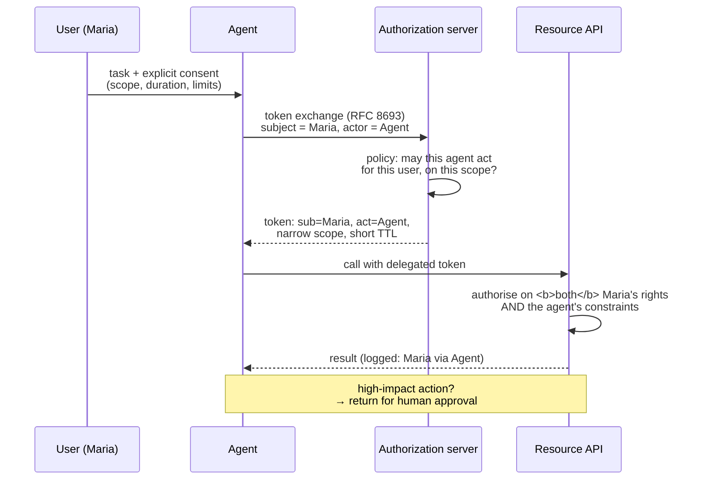

# AI Agents & Agentic Identity

## The assumption that broke

Identity systems have always assumed the actor is either **a human** (with a lifecycle, a manager and a moment of consent) or **a static service** (with a fixed purpose, a known caller and a predictable set of operations).

An AI agent is neither. It acts **on a human's behalf**, but autonomously and asynchronously, over an open-ended set of actions, possibly for hours, possibly invoking other agents, and possibly doing something nobody explicitly anticipated — because that is what it was built for.

{: .concept }
> **The core question is delegation with limits.** When Maria asks an agent to "sort out the Q3 supplier issues", she has not consented to a specific set of API calls; she has delegated a *goal*. The identity system must answer: **who is acting (the agent), on whose behalf (Maria), with what subset of her authority, for how long, and how is that recorded so someone can be held accountable?** Bearer tokens carrying Maria's full authority answer none of that — and that is what most current implementations use.

---

## Why the naive approaches fail

| Approach | Why it fails |
|:--|:--|
| **Give the agent the user's credentials** | The password anti-pattern OAuth was invented to kill, reborn. No scoping, no revocation, no attribution |
| **Give the agent the user's access token** | Full authority, no distinction between user and agent in any log, no way to constrain scope |
| **Give the agent its own service account** | The user's identity is lost — no per-user authorisation, no meaningful audit trail, and the account accumulates the union of everyone's access |
| **Give the agent broad API keys** | An ungoverned [NHI](../03-identity-domains/04-non-human-identities.md) with standing privilege and no expiry |

The last one is the most common in practice today, and it is how agent deployments become the most over-privileged identities in an estate within months.

---

## What a defensible model looks like



The components that make it work:

**1. The agent has its own identity.** Registered, owned, with a purpose, an expiry and its own credentials — ideally [workload identity](../03-identity-domains/05-workload-identity.md) rather than a stored secret.

**2. Delegation is explicit and recorded.** [Token exchange (RFC 8693)](../02-identity-fundamentals/06-tokens-and-jwt.md) preserves `sub` (the user) and records `act` (the acting agent). Every downstream log shows both.

**3. Authority is the *intersection*, never the union.** The agent may do only what the user can do **and** what the agent is permitted to do **and** what the task's scope covers. Most failures come from taking a union somewhere in that chain.

**4. Tokens are short-lived and narrowly scoped.** Minutes, for this task, for these resources. An agent token with an hour's validity and broad scope is a standing credential.

**5. High-impact actions return to a human.** Define the threshold — spending money, sending external communications, deleting data, changing access, anything irreversible — and require explicit approval. This is a **design decision that belongs in the architecture**, not a runtime afterthought.

**6. Everything is attributable.** The audit record must answer "who did this?" with *both* the human and the agent, plus the task that authorised it.

**7. There is a kill switch.** Revoking an agent's authority — for one user or entirely — must be immediate and rehearsed.

---

## The chained-agent problem

Agents invoke other agents and tools. Authority must **attenuate**, never expand:

```
Maria (full authority)
  └─ Planning agent (read + orchestrate, 30 min)
       └─ Research agent (read-only, external, 5 min)
       └─ Finance agent (read finance data, no writes, 10 min)
            └─ Report tool (no data access, formatting only)
```

Each hop should narrow. If a downstream agent can do something an upstream one could not, the delegation model is broken.

{: .warning }
> **The confused deputy problem returns with force in agentic systems.** An agent processing untrusted content — a document, a web page, an email — can be *instructed by that content* to take actions using the user's authority. This is prompt injection as a privilege-escalation vector, and the classic mitigations for confused deputies apply: **never let the agent's authority exceed the task's need; treat all ingested content as untrusted input, never as instructions; and require human confirmation for any consequential action.** Architecturally, assume the agent *will* at some point be induced to attempt something it shouldn't, and ensure the authorisation layer refuses — because you cannot fix this reliably at the prompt layer.

---

## Governance questions with no settled answer

The field is genuinely unsettled. Positions you should be able to reason about:

- **Does an agent appear in access certification?** Arguably yes — it holds delegated access. In practice, most IGA tools have no model for it. Interim answer: certify the *agent's* standing permissions and the *user's* authorisation to delegate to it.
- **What happens when the delegating user leaves?** Their agents must lose authority immediately. Wire agent delegation into the [leaver process](../02-identity-fundamentals/14-joiner-mover-leaver.md) — this is a concrete, buildable control most estates lack today.
- **Who owns an agent?** A named human, always. An agent with no owner is an ungoverned NHI.
- **Can an agent approve something?** Almost certainly not, for anything with an SoD or compliance dimension — approval implies accountability, and accountability requires a person.
- **How do you handle non-determinism?** The same input may produce different actions. Traditional testing and change control assume determinism; agent behaviour must be constrained by *authorisation* rather than validated by *testing*.
- **What is the retention obligation for agent decision traces?** Probably longer than you think, if anyone will ever need to explain what happened.

---

## What to do now

**Deployable today:**

- Give every agent its own registered identity with an owner and an expiry.
- Use token exchange to preserve user identity in the delegation chain.
- Scope agent tokens narrowly and keep lifetimes in minutes.
- Define and enforce a human-approval threshold for consequential actions.
- Log both the human and the agent on every action.
- Include agents in the leaver process and in your NHI inventory.
- Build the kill switch, and test it.

**Design for, adopt as it matures:**

- Standardised agent identity and delegation semantics (active work in the OAuth and OpenID communities; expect standards to firm up).
- Agent-aware governance in IGA platforms.
- Fine-grained, task-scoped authorisation via a [PDP](../02-identity-fundamentals/13-policy-as-code.md) rather than via token scopes alone.

{: .architect }
> **This is the clearest opportunity in a decade to get ahead as an identity architect.** Agent deployments are happening now, in most organisations, usually driven by teams who have not thought about delegation semantics and are using a broad API key because it worked. An architect who arrives early with a **defensible delegation model** — own identity, explicit consent, intersected authority, short tokens, human-in-the-loop thresholds, full attribution — is solving a problem the organisation has before it becomes an incident. That is exactly the position architects are supposed to occupy, and here it is unusually available.

---

## Architect's checklist

- [ ] Do agents in your estate have **their own identities**, with owners and expiry?
- [ ] Is delegation **explicit and recorded**, preserving both user and agent in tokens and logs?
- [ ] Is authority the **intersection** of user rights, agent permissions and task scope?
- [ ] Are agent tokens **short-lived and narrowly scoped**?
- [ ] Is there a defined **human-approval threshold** for consequential actions?
- [ ] Can you answer "**who did this?**" with both the human and the agent?
- [ ] Does agent authority end when the **delegating user leaves**?
- [ ] Is there a tested **kill switch** per agent and per user?
- [ ] Is untrusted ingested content prevented from **escalating the agent's authority**?
- [ ] Are agents in your **NHI inventory** and, where possible, your governance reporting?

---

**Next:** [Decentralised Identity & Verifiable Credentials](04-decentralised-identity.md) →
