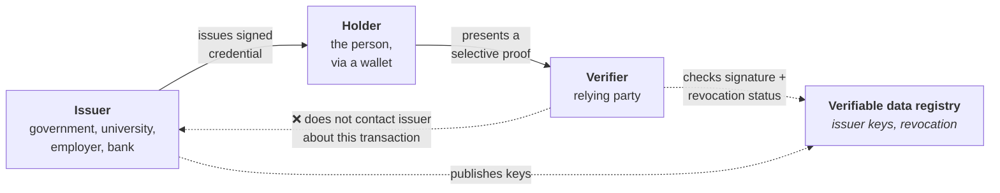

# Decentralised Identity & Verifiable Credentials

## The assumption that broke

Today, every relying party proofs identity independently. To open a bank account you prove who you are to the bank. To rent a car you prove it again. To start a job you prove it again. Each organisation collects, verifies and then **stores** copies of your identity documents — creating a proliferation of honeypots and an experience nobody enjoys.

{: .concept }
> **The verifiable-credentials model inverts the flow: a trusted issuer gives the credential to *you*, you hold it, and you present cryptographic proof to whoever needs it — without the verifier contacting the issuer, and without revealing more than necessary.** The relying party trusts the issuer's signature, not the holder's honesty. This is the same trust structure as [federation](../02-identity-fundamentals/11-federation-patterns.md), with one significant change: **the assertion is held by the subject rather than fetched from the issuer at use time**, which removes the issuer's visibility into where you use it.

---

## The model

That last dotted line is the privacy property. In OIDC federation, the identity provider learns every site you log into. Here, the issuer does not learn where you present the credential.

| Term | Meaning |
|:--|:--|
| **VC** — Verifiable Credential | A tamper-evident, cryptographically signed claim set (W3C standard) |
| **VP** — Verifiable Presentation | What the holder actually shows, often derived from one or more VCs |
| **DID** — Decentralised Identifier | An identifier the subject controls, resolvable to public keys without a central registrar |
| **Wallet** | The holder's application storing credentials and generating presentations |
| **Verifiable data registry** | Where issuer keys and revocation status live (a ledger, a DNS-based system, a registry) |
| **Selective disclosure** | Revealing only some attributes from a credential |
| **Zero-knowledge proof** | Proving a predicate ("over 18") without revealing the underlying value |

---

## Why it matters now

The driver is **regulation, not technology enthusiasm**:

- **eIDAS 2.0 / the EU Digital Identity Wallet** — EU member states are required to make a wallet available, and certain relying parties will be required to accept it. This turns a research topic into a compliance and product requirement on a timeline.
- **mDL (ISO 18013-5)** — mobile driving licences, with growing adoption, particularly in the US and Australia.
- **Existing national schemes** — the Nordics, Belgium, Estonia, India and others already provide reusable high-assurance identity, and their populations expect it.
- **Age verification regulation** in several jurisdictions creates immediate demand for "prove a predicate without revealing the data".

{: .architect }
> **The realistic near-term use is *reusable proofing*, not replacing your IdP.** Nobody is about to run enterprise SSO on DIDs. What is genuinely near is: a customer presents a government-issued credential during onboarding instead of photographing a passport; an employee presents a verified qualification; a contractor presents a background-check attestation from their employer. **Design your [proofing layer to be pluggable](../02-identity-fundamentals/20-identity-proofing.md)** and you can adopt this without re-engineering anything — which is the concrete architectural action available today.

---

## Enterprise use cases with real substance

| Use case | Value |
|:--|:--|
| **Customer onboarding / KYC** | Reduced friction, less document handling, less sensitive data retained |
| **Age and eligibility verification** | Prove a predicate without collecting a date of birth — a genuine data-minimisation win |
| **Employee credentials** | Qualifications, certifications, clearances, training — verifiable without contacting the issuer |
| **Contractor onboarding** | Background checks and insurance attested by the employer, presented once |
| **Supply chain** | Organisational credentials: certifications, audit status, compliance attestations |
| **Cross-organisation access** | Present a credential rather than establishing a bilateral federation — potentially far cheaper for long-tail partners |

That last one is the strategically interesting one: today, onboarding a small partner requires a federation project. A credential-based model could reduce that to "present a valid credential from a trusted issuer", which changes the economics of long-tail B2B access.

---

## The hard problems

**Revocation without correlation.** If a verifier checks a revocation list per credential, the issuer or registry learns something about usage — reintroducing the tracking the model exists to avoid. Status lists, accumulators and short-lived credentials are the competing answers; none is universally settled.

**Key recovery.** If identity keys live in a wallet on a phone and the phone is lost, what happens? Consumer-grade key management remains the hardest unsolved problem, and it is the one that determines mainstream viability.

**Trust frameworks.** Cryptography proves the issuer signed it. It says nothing about whether the issuer should be trusted for that claim. **Someone must publish who is authoritative for what** — and that governance layer, not the technology, is what has slowed adoption for a decade. This is the same lesson as multilateral [federation](../02-identity-fundamentals/11-federation-patterns.md): the technology was never the constraint.

**Interoperability.** Multiple credential formats (JSON-LD VCs, SD-JWT VC, ISO mDoc), multiple protocols (OpenID for Verifiable Credential Issuance and Presentation are converging as the mainstream), multiple wallet ecosystems.

**Inclusion.** A model requiring a smartphone and a wallet app excludes people. Fallbacks are mandatory, not optional.

---

## What to do now

**Do:**
- Make your [identity proofing pluggable](../02-identity-fundamentals/20-identity-proofing.md) so a wallet-based method can be added without re-engineering onboarding.
- Track **eIDAS 2.0** if you operate in the EU; the acceptance obligations have dates attached.
- Watch **OpenID for Verifiable Credentials (OID4VCI / OID4VP)** — it is where the enterprise-relevant standardisation is happening, and it reuses OAuth patterns you already know.
- Note where you **retain identity documents** unnecessarily; that's a liability this model would remove.

**Don't:**
- Build a blockchain-based identity system because it's decentralised. Most enterprise use cases need a trust registry, not a ledger, and the blockchain framing has done the field more harm than good.
- Expect to replace your IdP.
- Underestimate the trust-framework problem. It's the whole thing.

---

## Architect's checklist

- [ ] Is your **proofing layer pluggable**, or is a specific vendor's SDK embedded in your onboarding journey?
- [ ] Do you know whether **eIDAS 2.0** acceptance obligations will apply to you, and by when?
- [ ] Where do you **retain identity documents**, and could a credential-based flow remove that liability?
- [ ] Are there **age or eligibility checks** where you collect more data than the decision requires?
- [ ] For long-tail B2B partners, what does a **federation project cost** you today — and would credential presentation be cheaper?
- [ ] If you adopt this, **which issuers will you trust, for which claims**, and who maintains that list?
- [ ] What is the **fallback** for people without a wallet or a smartphone?

---

**Next:** [Post-Quantum & Crypto Agility](05-post-quantum.md) →
