# How to Become an IAM Architect

**The professionals who succeed won't be the ones who know the most tools. They'll be the ones who understand identity as the foundation of business security.**
{: .fs-5 .fw-300 }

Most "become an IAM architect" advice is a product recommendation in disguise: *learn SailPoint*, *get certified in Okta*, *do the Entra ID exam*. That advice produces excellent **operators** and very few **architects**.

An architect is the person who can walk into a room where nobody agrees, and answer questions like:

- *Should this application federate, or should we provision accounts into it?*
- *Who is allowed to say that this person should have this access — and how do we prove it in an audit twelve months from now?*
- *We are acquiring a company with 4,000 employees and its own directory. What happens on day one, day thirty, and day four hundred?*
- *The developers want to issue a token to an AI agent that acts on a user's behalf. What is the blast radius when that token leaks?*

None of those are product questions. They are questions about **trust, data, lifecycle, risk and organisational reality**. Products are how you implement the answer — they are never the answer.

This repository is the curriculum for that skill set. It is **vendor-neutral by design and vendor-aware by necessity**: every concept is taught on its own terms first, and then mapped onto how SailPoint, One Identity, Ping Identity, Okta, Microsoft Entra ID, Saviynt, ForgeRock, CyberArk and Keycloak express that concept, because you will have to speak those dialects in real projects.

---

## The path, in one picture

```mermaid
flowchart TD
    A["<b>Stage 1 — IT Fundamentals</b><br/>directories, DNS, crypto, PKI,<br/>OS admin, cloud, APIs, data"] --> B["<b>Stage 2 — Identity Fundamentals</b><br/>AuthN, AuthZ, federation, SAML,<br/>OAuth, OIDC, SCIM, JML, IGA, PAM"]
    B --> C["<b>Stage 3 — Identity Domains</b><br/>workforce, CIAM, B2B,<br/>non-human, workload, OT/IoT"]
    C --> D["<b>Stage 4 — Architecture Practice</b><br/>blueprints, integration patterns,<br/>migration, scale, resilience, ADRs"]
    D --> E["<b>Stage 5 — Platform Landscape</b><br/>the Rosetta stone: same concepts,<br/>different product vocabulary"]
    E --> F["<b>Stage 6 — Business & Risk</b><br/>alignment, compliance, operating<br/>model, metrics, business case"]
    F --> G["<b>Stage 7 — Delivery</b><br/>discovery, requirements, testing,<br/>run, identity incident response"]
    G --> H["<b>Stage 8 — The Frontier</b><br/>Zero Trust, ITDR, agentic AI,<br/>verifiable credentials, PQC"]
    H --> I["<b>Stage 9 — Practice</b><br/>case studies, whiteboard design,<br/>interviews, no-budget labs"]

    style A fill:#1e3a5f,stroke:#4a90d9,color:#fff
    style B fill:#1e4d3a,stroke:#4caf7d,color:#fff
    style C fill:#4d3a1e,stroke:#d9a04a,color:#fff
    style D fill:#3a1e4d,stroke:#a04ad9,color:#fff
    style E fill:#4d1e3a,stroke:#d94a90,color:#fff
    style F fill:#1e4d4d,stroke:#4ad9d9,color:#fff
    style G fill:#4d4d1e,stroke:#d9d94a,color:#fff
    style H fill:#4d1e1e,stroke:#d94a4a,color:#fff
    style I fill:#2a2a3a,stroke:#8888aa,color:#fff
```

The stages are **cumulative, not sequential-only**. You will loop back constantly. But you cannot skip Stage 1 and 2 — every architect who tries ends up building systems that work in the demo and collapse in production.

---

## What this repo contains

| Stage | Folder | What it teaches | Pages |
|:--|:--|:--|:--|
| — | [Start Here](00-start-here/) | The role, the mindset, a skills matrix, a 12-month plan | 5 |
| 1 | [IT Fundamentals](01-it-fundamentals/) | Directories, LDAP, AD, DNS/network, cryptography, PKI/TLS, OS admin, cloud, data & APIs | 9 |
| 2 | [Identity Fundamentals](02-identity-fundamentals/) | AuthN, Kerberos, SAML, OAuth 2.x, OIDC, tokens, SCIM, MFA, FIDO2, sessions, federation, RBAC/ABAC/ReBAC, policy-as-code, JML, IGA, role mining, SoD, PAM, data quality, proofing, sync | 21 |
| 3 | [Identity Domains](03-identity-domains/) | Workforce, CIAM, B2B/partner, non-human identities, workload identity, OT/IoT | 6 |
| 4 | [Architecture Practice](04-architecture-practice/) | How to actually architect: blueprints, integration, migration, HA/scale, securing IAM itself, anti-patterns, documentation | 8 |
| 5 | [Platform Landscape](05-platform-landscape/) | Vendor-neutral concept map, then SailPoint, One Identity, Ping, Okta/Entra, others, PAM vendors, selection | 8 |
| 6 | [Business & Risk](06-business-and-risk/) | Business alignment, risk, compliance, operating model, KPIs, business case, stakeholders | 7 |
| 7 | [Delivery & Operations](07-delivery/) | Programme delivery, discovery, requirements, testing, run/ops, identity incident response | 6 |
| 8 | [The Frontier](08-frontier/) | Zero Trust & continuous access, ITDR, AI agent identity, decentralised identity, post-quantum | 5 |
| 9 | [Practice](09-practice/) | Worked case studies, design exercises, whiteboard scenarios, interview prep, free labs | 5 |
| 10 | [Reference](10-reference/) | Glossary (250+ terms), protocol cheat sheets, standards index, certifications, templates, reading list | 6 |

---

## The five steps, reframed

The popular infographic version of this journey has five steps. They are correct — they're just compressed. Here is what each one actually contains once you unpack it.

### Step 1 — Build strong IT fundamentals

> *AD & LDAP · networking · Windows/Linux · DNS & auth protocols · cloud basics*

Identity is a **distributed systems problem wearing a security costume**. Every hard IAM incident I can describe to you — stale group membership, a federation outage, a provisioning storm, a token that wouldn't validate — resolves to a fundamentals problem: clock skew, DNS, a certificate, a replication delay, a schema mismatch, a connection pool.

You cannot architect on top of a layer you don't understand. → [Stage 1](01-it-fundamentals/)

### Step 2 — Learn identity fundamentals

> *SSO, SAML, OAuth 2.0, OIDC · MFA & passwordless · RBAC, ABAC · JML · governance*

This is the largest stage in the repo for a reason. The protocols are finite and learnable; the **models** (who is authoritative, what is a role, when does access end) are where architects are made. Learn the concept before the console. → [Stage 2](02-identity-fundamentals/)

### Step 3 — Get hands-on with IAM platforms

> *Ping Identity · ForgeRock · Okta · SailPoint · Saviynt · Microsoft Entra ID · Keycloak*

Hands-on matters — but the point of hands-on is **not** memorising a UI. It's building the mental map: *this vendor calls it an "identity profile", that one calls it an "identity cube", that one calls it a "person object" — and all three mean the same correlated record.* That map is the [Rosetta stone](05-platform-landscape/00-vendor-neutral-map.md). → [Stage 5](05-platform-landscape/)

### Step 4 — Learn business thinking

> *Align IAM with business objectives · balance security and UX · reduce risk while enabling productivity*

The step that separates senior engineers from architects. An architect who cannot explain a design in the language of **risk, cost, audit findings and time-to-productivity** will lose every funding argument to someone who can. → [Stage 6](06-business-and-risk/)

### Step 5 — Keep learning & stay ahead

> *AI agents · non-human identities · cloud workloads · machine-to-machine · ITDR*

Identity is the fastest-moving security domain right now because AI agents and workload identities have exploded the population of things that need credentials. Human identity growth is linear; non-human identity growth is not. → [Stage 8](08-frontier/)

---

## How to use this repo

**If you have 10 minutes** — read [The IAM Architect Role](00-start-here/02-the-iam-architect-role.md) and skim the [Glossary](10-reference/01-glossary.md).

**If you are starting from zero** — follow the [12-month learning plan](00-start-here/05-learning-plan.md) in order. Do not shop for a product until month 5.

**If you're already an IAM engineer** — take the [self-assessment](00-start-here/04-self-assessment.md), then jump to [Stage 4: Architecture Practice](04-architecture-practice/) and [Stage 6: Business & Risk](06-business-and-risk/). Those are almost always the gaps.

**If you have an interview next week** — [Interview prep](09-practice/04-interview-prep.md) and [whiteboard scenarios](09-practice/03-whiteboard-scenarios.md), then backfill whatever they expose.

**If you're evaluating a platform** — [Choosing a platform](05-platform-landscape/07-choosing-a-platform.md) and the [vendor-neutral map](05-platform-landscape/00-vendor-neutral-map.md).

{: .architect }
> Every page in Stages 1–8 ends with an **"Architect's checklist"** — the questions you should be able to answer before you sign off a design in that area. If you can answer them all without opening a product console, you are thinking like an architect.

---

## The principle behind the whole thing

Products get acquired, renamed, re-platformed and end-of-lifed. ForgeRock became part of Ping. Azure AD became Entra ID. Products you'll deploy in 2030 don't have names yet.

What survives:

- **Authentication proves who; authorisation decides what; governance proves it was right.** Three different problems, three different lifecycles, three different owners.
- **Identity data has an authoritative source, or it has chaos.** Nothing else in IAM matters if you can't answer "where did this attribute come from?"
- **Access must have an expiry.** Grants are easy; revocation is the architecture.
- **Every credential is a liability with a benefit attached.** Count them, own them, rotate them, kill them.
- **The user experience is a security control.** A control people route around protects nothing.

> The tools will change. The principles won't.

---

## Contributing & licence

Content is licensed [CC BY 4.0](LICENSE) — use it, teach from it, adapt it. Corrections and additions are welcome via issue or PR; see [CONTRIBUTING](CONTRIBUTING.md).

This is an independent educational project. Product names and trademarks belong to their respective owners; nothing here is endorsed by or affiliated with any vendor, and product-specific details should always be verified against current vendor documentation before you rely on them in a design.
